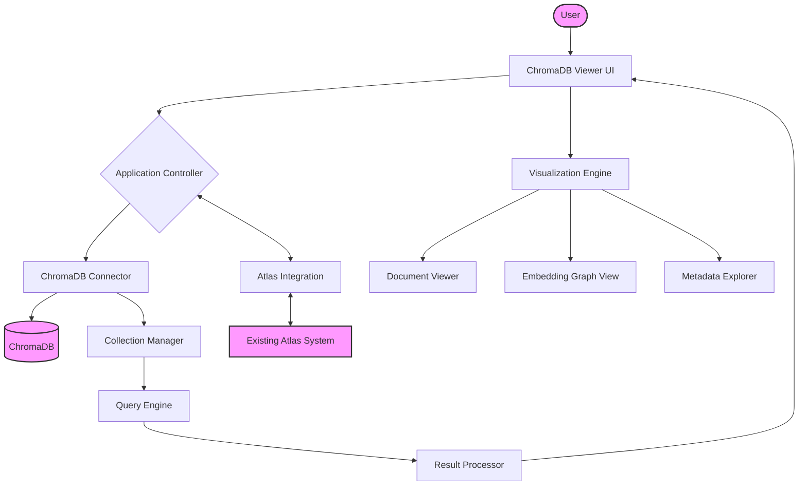
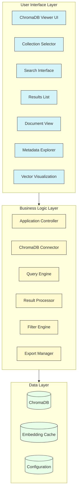
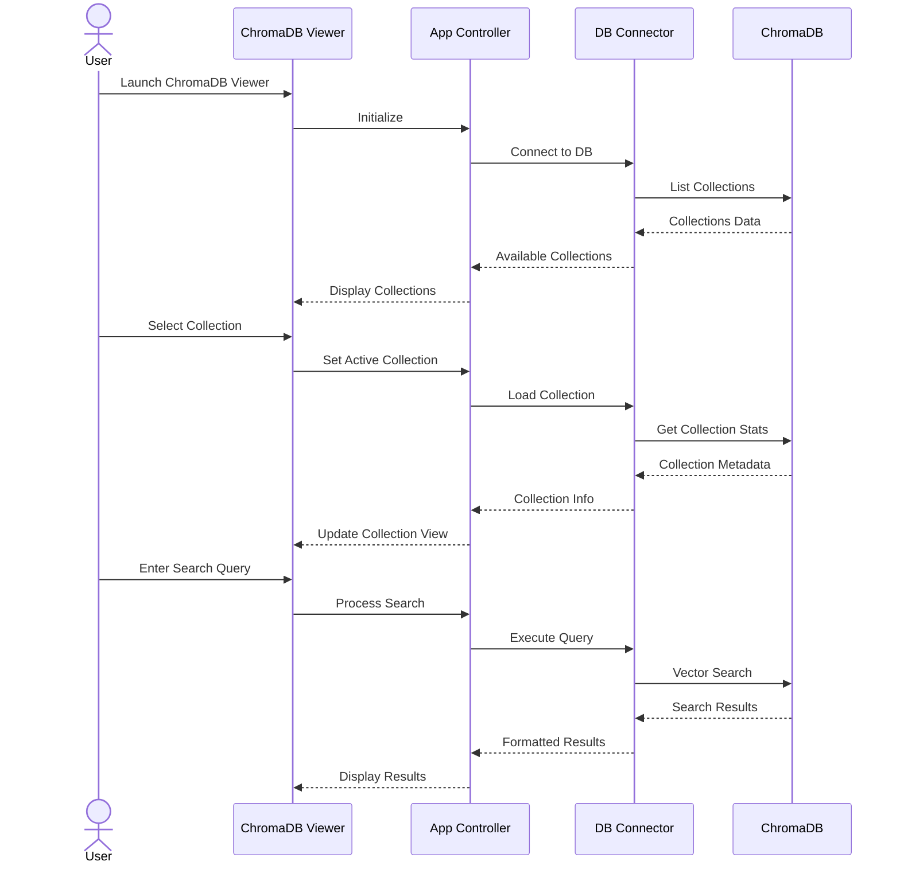
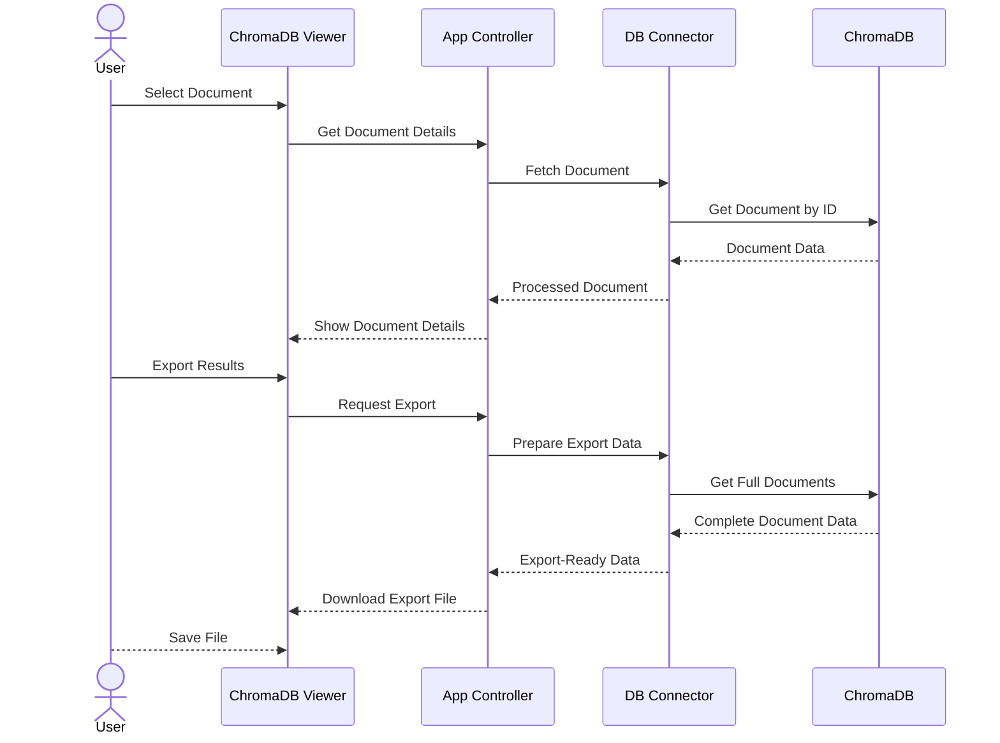
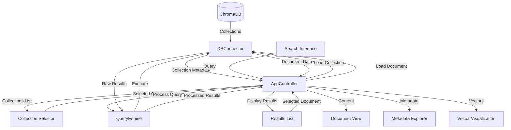

# ChromaDB Viewer for Atlas

This document outlines the design for a standalone ChromaDB viewer application for Atlas, enabling users to explore and interact with the vector database directly.

## Architecture Overview



## Component Layers



## User Interaction Flow



## Document Exploration Flow



## Data Flow



## Component Descriptions

### User Interface Layer

1. **ChromaDB Viewer UI**: Main application interface that hosts all UI components
2. **Collection Selector**: Interface for selecting different ChromaDB collections
3. **Search Interface**: Search bar with options for similarity search, filter query, etc.
4. **Results List View**: Paginated list showing search results with key metadata
5. **Document Detail View**: Detailed view of a selected document's content
6. **Vector Visualization**: 2D/3D visualization of document embeddings
7. **Metadata Explorer**: Interface for exploring and filtering by document metadata

### Business Logic Layer

1. **Application Controller**: Central controller managing application state and workflow
2. **ChromaDB Connector**: Connection manager for ChromaDB, handles queries and results
3. **Query Engine**: Processes search queries, converts to vector searches, etc.
4. **Embedding Processor**: Handles embedding vector operations and visualization
5. **Search Processor**: Processes full-text search and hybrid searches
6. **Filter Engine**: Manages metadata filtering and result refinement
7. **Export Manager**: Handles exporting data in various formats (JSON, CSV, etc.)

### Data Layer

1. **ChromaDB**: The underlying vector database storing all embeddings and documents
2. **Embedding Cache**: Cache for frequently accessed embeddings to improve performance
3. **Configuration Store**: Persistent storage for application settings

### Atlas Integration

1. **Atlas Configuration**: Shares configuration with the main Atlas application
2. **Knowledge Manager**: Connects to Atlas knowledge management system

## Implementation Approach

### Phase 1: Basic Viewer

1. Implement basic ChromaDB connection with collection browsing
2. Create simple search interface with results display
3. Build document detail view for exploring content and metadata

### Phase 2: Advanced Features

1. Add vector visualization capabilities
2. Implement advanced filtering and metadata exploration
3. Create export functionality for search results

### Phase 3: Integration and Polish

1. Integrate with Atlas configuration and knowledge management
2. Add user preferences and view customization
3. Polish UI and optimize performance

## Technology Options

### Backend Options:

1. **FastAPI**: Lightweight API framework for the backend services
2. **Flask**: Simple framework for serving the viewer application
3. **Direct Python Module**: Implement as importable Python module with CLI

### Frontend Options:

1. **Streamlit**: Fastest implementation path with interactive Python-based UI
2. **Gradio**: Simple UI with good support for visualization components
3. **Vue/React**: More complex but highly interactive web application

## Implementation Example (Streamlit)

```python
import streamlit as st
import chromadb
import numpy as np
import pandas as pd
import plotly.express as px
from pathlib import Path

# Function to connect to ChromaDB
def connect_to_chromadb(db_path):
    try:
        client = chromadb.PersistentClient(path=db_path)
        return client
    except Exception as e:
        st.error(f"Error connecting to ChromaDB: {e}")
        return None

# Function to get all collections
def get_collections(client):
    if client:
        return client.list_collections()
    return []

# Function to search collection
def search_collection(collection, query, n_results=10):
    results = collection.query(
        query_texts=[query],
        n_results=n_results
    )
    return results

# Main app
def main():
    st.title("Atlas ChromaDB Viewer")

    # Sidebar for configuration
    st.sidebar.header("Configuration")
    db_path = st.sidebar.text_input("ChromaDB Path", value=str(Path.home() / "atlas_chroma_db"))
    
    # Connect to ChromaDB
    client = connect_to_chromadb(db_path)
    
    if client:
        # Get collections
        collections = get_collections(client)
        collection_names = [c.name for c in collections]
        
        if collection_names:
            selected_collection = st.sidebar.selectbox("Select Collection", collection_names)
            collection = client.get_collection(selected_collection)
            
            # Display collection info
            count = collection.count()
            st.header(f"Collection: {selected_collection} ({count} documents)")
            
            # Search interface
            st.subheader("Search")
            query = st.text_input("Enter search query")
            n_results = st.slider("Number of results", 1, 50, 10)
            
            if query:
                results = search_collection(collection, query, n_results)
                
                # Display results
                if results["documents"][0]:
                    st.subheader(f"Results ({len(results['documents'][0])} documents)")
                    
                    # Create a dataframe for better display
                    results_df = pd.DataFrame({
                        "ID": results["ids"][0],
                        "Document": [doc[:300] + "..." if len(doc) > 300 else doc for doc in results["documents"][0]],
                        "Distance": results["distances"][0] if "distances" in results else [0] * len(results["ids"][0]),
                    })
                    
                    st.dataframe(results_df)
                    
                    # Document viewer
                    st.subheader("Document Viewer")
                    selected_id = st.selectbox("Select document to view", results["ids"][0])
                    
                    idx = results["ids"][0].index(selected_id)
                    document = results["documents"][0][idx]
                    metadata = results["metadatas"][0][idx] if results["metadatas"][0] else {}
                    
                    # Display document content
                    st.text_area("Content", document, height=300)
                    
                    # Display metadata
                    st.subheader("Metadata")
                    st.json(metadata)
                    
                    # If embeddings are available, visualize
                    if "embeddings" in results and results["embeddings"][0]:
                        st.subheader("Vector Visualization")
                        # Use PCA to reduce dimensions for visualization
                        from sklearn.decomposition import PCA
                        
                        embeddings = np.array(results["embeddings"][0])
                        pca = PCA(n_components=3)
                        components = pca.fit_transform(embeddings)
                        
                        df = pd.DataFrame(components, columns=["x", "y", "z"])
                        df["id"] = results["ids"][0]
                        
                        fig = px.scatter_3d(df, x="x", y="y", z="z", hover_name="id")
                        st.plotly_chart(fig)
                
                else:
                    st.info("No results found.")
            
        else:
            st.warning("No collections found in the database.")
    else:
        st.error("Failed to connect to ChromaDB.")

if __name__ == "__main__":
    main()
```

## Next Steps

1. Create a prototype using Streamlit for rapid development
2. Test with existing Atlas ChromaDB collections
3. Refine the design based on user feedback
4. Implement a more robust solution if needed