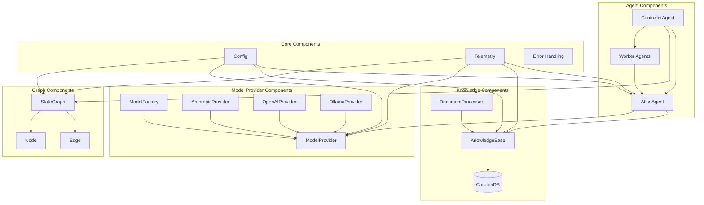
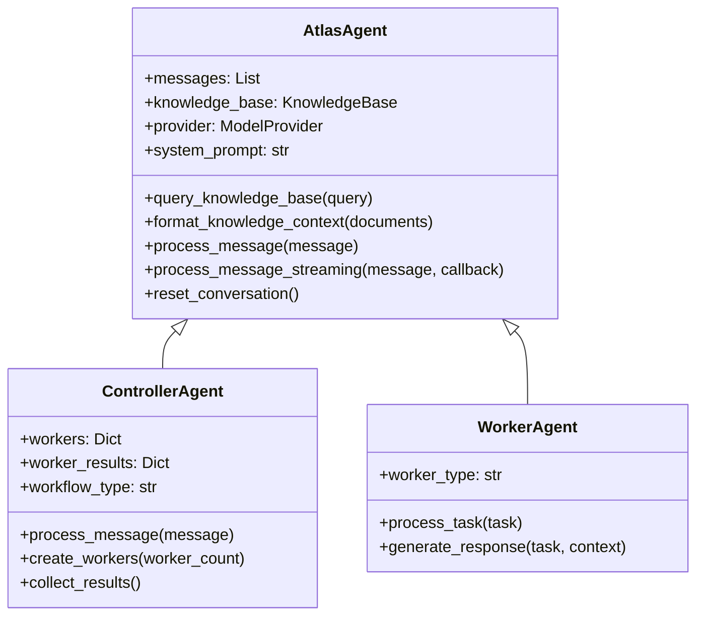
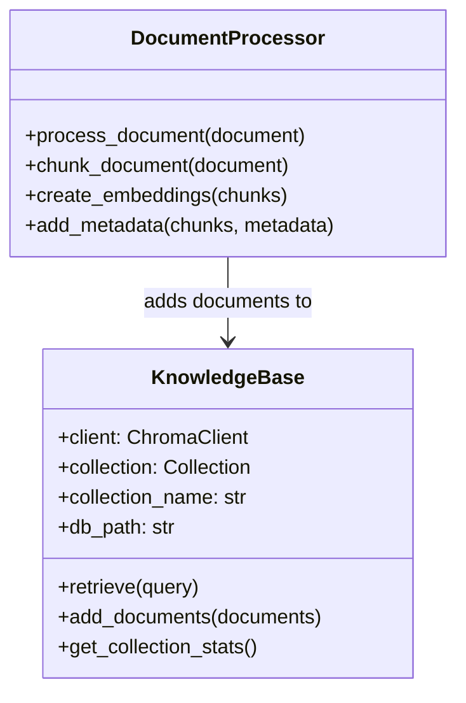
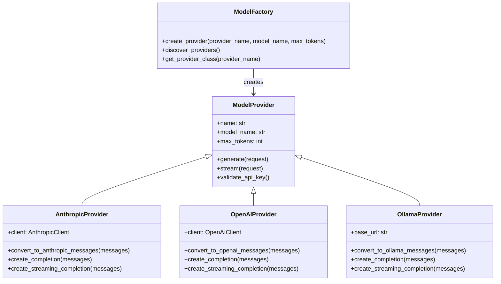
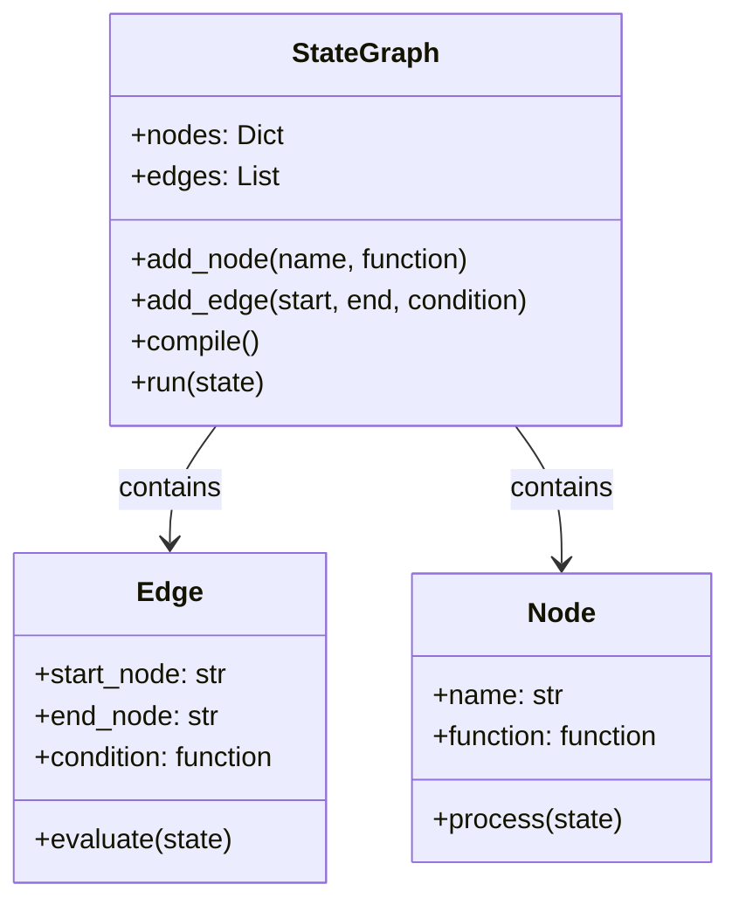
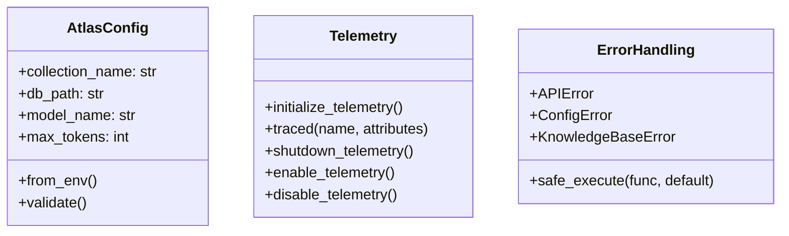

# Atlas Components

Atlas is built using a modular component architecture that enables flexible configuration and extension. This document provides an overview of the major components and their relationships.

## Component Diagram

The following diagram shows the main components of Atlas and how they interact:

## Component Relationships

### Agent Components

The agent components form the primary interface with users and orchestrate the entire system:

- **AtlasAgent**: Base agent class that provides core functionality
  - Manages conversation history
  - Interacts with language model providers
  - Retrieves knowledge from the database
  - Formats prompts and processes responses

- **ControllerAgent**: Extends AtlasAgent for multi-agent orchestration
  - Manages worker agents
  - Coordinates parallel tasks
  - Aggregates results from workers
  - Implements complex workflows

- **WorkerAgent**: Specialized agents for specific tasks
  - **AnalysisWorker**: Analyzes queries and identifies information needs
  - **RetrievalWorker**: Focuses on efficient document retrieval
  - **DraftWorker**: Specializes in generating draft responses

### Knowledge Components

The knowledge components manage document storage and retrieval:

- **KnowledgeBase**: Main interface for knowledge retrieval
  - Manages ChromaDB connection
  - Provides document search functionality
  - Handles relevance scoring

- **DocumentProcessor**: Handles document ingestion
  - Splits documents into appropriate chunks
  - Manages metadata and source tracking
  - Creates embeddings for documents

### Model Provider Components

The model provider components abstract interactions with language model APIs:

- **ModelProvider**: Base interface for all providers
  - **AnthropicProvider**: Implementation for Anthropic Claude models
  - **OpenAIProvider**: Implementation for OpenAI GPT models
  - **OllamaProvider**: Implementation for local Ollama models

- **ModelFactory**: Creates appropriate provider instances
  - Handles provider detection and selection
  - Manages provider registration
  - Implements fallback logic

### Graph Components

The graph components enable complex workflow definition:

- **StateGraph**: LangGraph integration for state management
  - Defines workflow steps and transitions
  - Manages state during workflow execution

- **Edge**: Defines transitions between graph nodes
  - Implements conditional routing
  - Provides workflow branching logic

- **Node**: Defines individual operations in the workflow
  - Implements state transformations
  - Encapsulates agent and system functions

### Core Components

The core components provide foundational capabilities:

- **Config**: Configuration management
  - Environment variable integration
  - Default value handling
  - Configuration validation

- **Telemetry**: Performance monitoring
  - Operation tracing
  - Error tracking
  - Performance metrics

- **Error**: Standardized error handling
  - Custom error types
  - Error recovery mechanisms
  - Graceful degradation

## Component Dependencies

The following table shows the key dependencies between components:

| Component       | Dependencies                         |
| --------------- | ------------------------------------ |
| AtlasAgent      | ModelProvider, KnowledgeBase, Config |
| ControllerAgent | AtlasAgent, WorkerAgent, StateGraph  |
| WorkerAgent     | AtlasAgent, KnowledgeBase            |
| KnowledgeBase   | ChromaDB, Config                     |
| ModelProvider   | Config, Telemetry                    |
| StateGraph      | Node, Edge, Config                   |

## Next Steps

- See [Agents](../components/agents/controller.md) for detailed agent documentation
- See [Knowledge](../components/knowledge/) for knowledge system details
- See [Models](../components/models/) for model provider information
- See [Graph](../components/graph/) for workflow documentation
