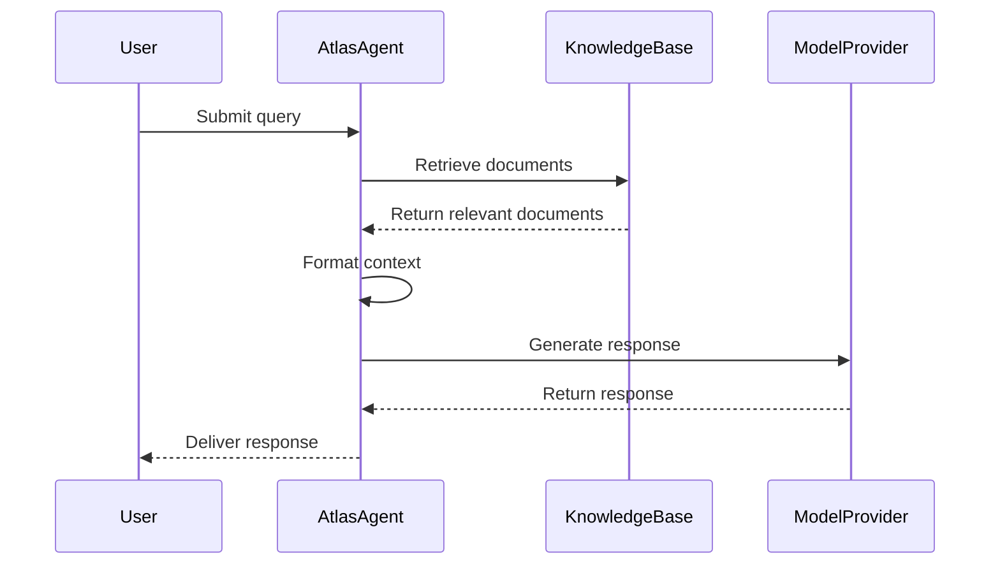
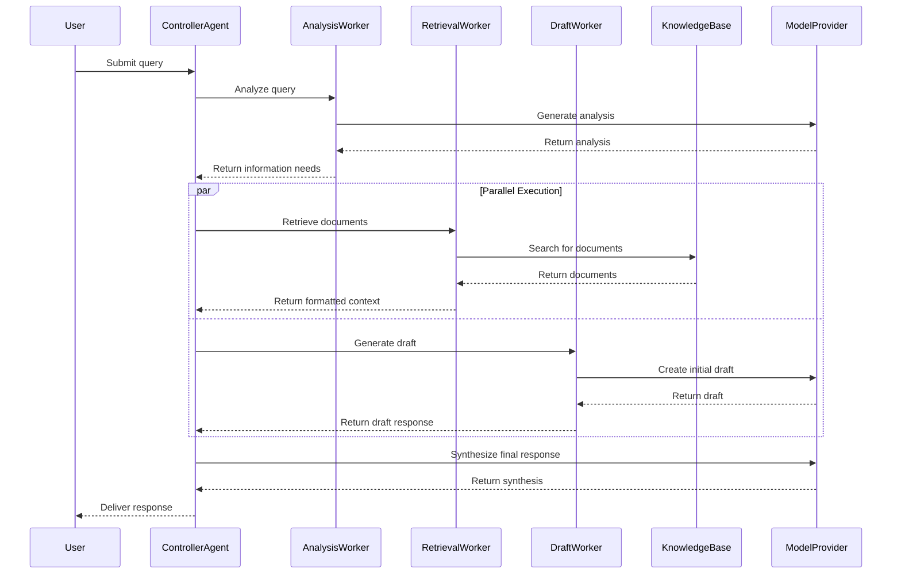
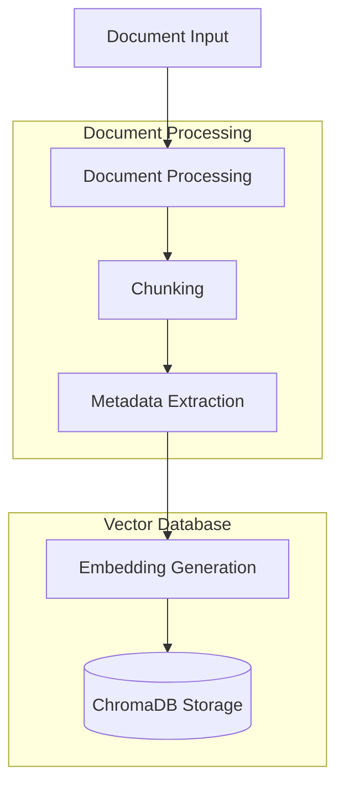
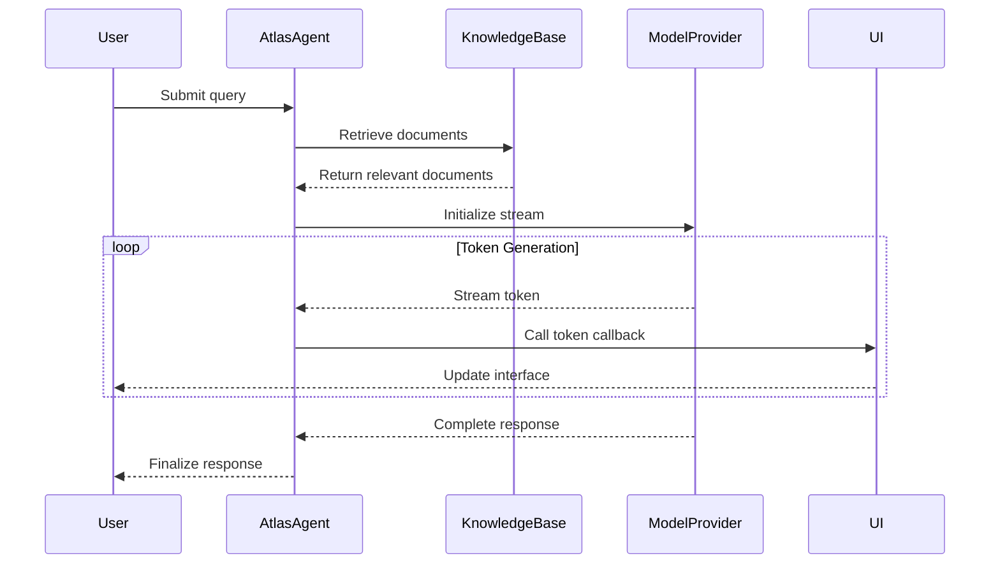
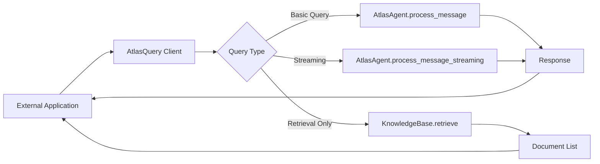
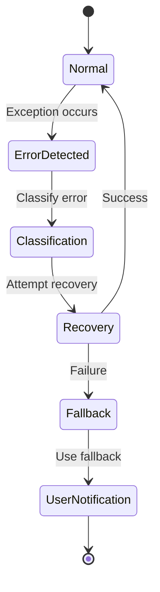

# Data Flow in Atlas

This document describes how data flows through the Atlas system in different usage scenarios.

## Basic Query Flow

The simplest interaction with Atlas involves a text query and response:

1. **User Query**: The user submits a text query
2. **Agent Processing**: The AtlasAgent processes the query
3. **Knowledge Retrieval**: Relevant documents are retrieved from the knowledge base
4. **Context Formation**: Documents are formatted as context for the model
5. **Prompt Creation**: The query, context, and system prompt are combined
6. **Model Generation**: The model provider generates a response
7. **Response Delivery**: The response is returned to the user

## Multi-Agent Flow

In multi-agent mode, the flow becomes more complex:

1. **User Query**: The user submits a text query
2. **Controller Processing**: The ControllerAgent analyzes the query
3. **Task Distribution**: The controller divides work among specialized workers
   - **Analysis Worker**: Analyzes the query to identify information needs
   - **Retrieval Worker**: Retrieves relevant documents based on analysis
   - **Draft Worker**: Generates initial response drafts
4. **Parallel Execution**: Workers process their tasks concurrently
5. **Result Collection**: The controller collects results from all workers
6. **Response Synthesis**: The controller synthesizes a final response
7. **Response Delivery**: The response is returned to the user

## Document Ingestion Flow

When adding documents to the knowledge base:

1. **Document Input**: Documents are provided (files, text, URLs)
2. **Document Processing**: Documents are parsed and processed
3. **Chunking**: Documents are split into smaller pieces
4. **Metadata Extraction**: Information about source, date, etc. is captured
5. **Embedding Generation**: Chunks are converted to vector embeddings
6. **Storage**: Chunks and embeddings are stored in ChromaDB

## Streaming Response Flow

When using streaming responses:

1. **User Query**: The user submits a text query
2. **Knowledge Retrieval**: Similar to basic query flow
3. **Stream Initialization**: The model provider starts a streaming response
4. **Token Delivery**: Tokens are delivered as they're generated
5. **Callback Execution**: A callback function is called for each token
6. **UI Update**: The user interface is updated in real-time

## Query-Only Client Flow

When using Atlas as a lightweight query client:

1. **External Request**: Another application calls Atlas functions
2. **Client Processing**: The AtlasQuery client handles the request
3. **Core Function Use**: The client uses Atlas core functions but with minimal overhead
4. **Response Return**: Results are returned to the external application

## Error Handling Flow

When errors occur during processing:

1. **Error Detection**: An error is detected during processing
2. **Error Classification**: The error is classified by type and severity
3. **Recovery Attempt**: The system attempts to recover if possible
4. **Fallback Execution**: If recovery fails, fallback mechanisms are used
5. **User Notification**: The user is informed of the error and outcome

## Next Steps

- See [Workflows](../workflows/query.md) for detailed workflow documentation
- See [Getting Started Guide](../guides/getting_started.md) for usage instructions
- See [Examples](https://github.com/inherent-design/atlas/tree/main/examples) for code examples of different flows
