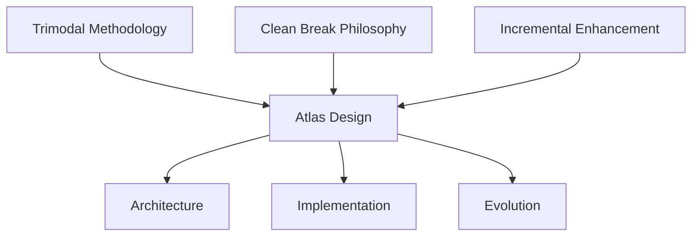
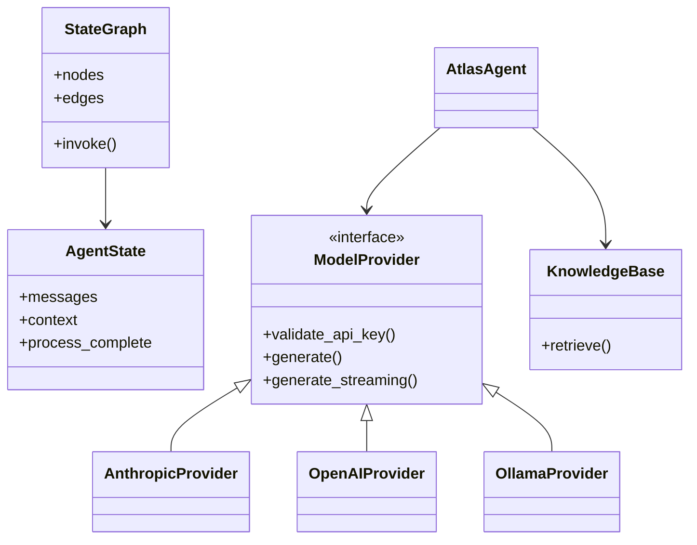

# Design Principles

This document outlines the core design principles that guide the Atlas framework's architecture and implementation.

## Core Design Philosophy

Atlas is built on the foundation of three interconnected design philosophies:

1. **Trimodal Methodology**: Balancing top-down design, bottom-up implementation, and holistic integration
2. **Clean Break Philosophy**: Prioritizing robust, consistent APIs over backward compatibility
3. **Incremental Enhancement**: Building features iteratively with high quality from the start

## Trimodal Methodology

The Trimodal Methodology is a core organizing principle for Atlas, ensuring balanced development across three complementary modes:

### Bottom-Up Implementation

This mode focuses on concrete implementation details and practical functionality:

- Start with fundamental modules and pieces
- Focus on concrete details and implementation specifics
- Test core functionality first
- Build from specific instances to general patterns

### Top-Down API Design

This mode addresses overall architecture and interface design:

- Create robust, extensible interfaces
- Establish clear contracts between components
- Develop coherent system architecture
- Maintain consistent design principles

### Holistic System Integration

This mode ensures that all components work together effectively:

- Maintain system-wide view of how components interact
- Ensure coherent connections across boundaries
- Balance competing concerns and requirements
- Consider cross-cutting aspects like performance and security

## Clean Break Philosophy

Atlas follows a "clean break" philosophy that prioritizes quality and consistency:

### Key Principles

1. **API Quality Over Compatibility**: Prioritize creating the best possible API over maintaining backward compatibility
2. **Refactor Without Hesitation**: Replace incorrect or suboptimal implementations without hesitation
3. **Document Breaking Changes**: Always document breaking changes thoroughly
4. **Test Without Compromise**: Never simplify production code for testing; create separate test environments

### Implementation Guidelines

- Break backward compatibility when necessary to improve the API
- Design interfaces to be extensible and future-proof
- Maintain comprehensive documentation of API changes
- Create proper testing abstractions that don't compromise core code

## Incremental Enhancement

Atlas follows an incremental development approach:

### Key Principles

1. **Start with Quality**: Build new features with high-quality implementations from the beginning
2. **Iterative Improvement**: Enhance features incrementally rather than waiting for "perfect" implementations
3. **Continuous Refinement**: Continuously improve existing components based on feedback and insights
4. **Feature Completeness**: Ensure each increment is a complete, usable feature

### Implementation Guidelines

- Begin with minimal but complete implementations
- Focus on specific feature pathways (Core Intelligence, Knowledge Management, Multi-Agent Orchestration)
- Release early and enhance based on feedback
- Maintain consistent API design across increments

## Architecture Principles

These principles guide the overall system architecture:

### Component Design

1. **Separation of Concerns**: Each component has a clear, specific responsibility
2. **Interface Stability**: Public interfaces remain stable while implementations can evolve
3. **Composition Over Inheritance**: Prefer composition patterns to deep inheritance hierarchies
4. **Dependency Inversion**: Higher-level modules don't depend on lower-level modules directly

### System Structure

1. **Modular Organization**: System is organized into cohesive modules with clear boundaries
2. **Minimal Coupling**: Modules interact through well-defined interfaces with minimal dependencies
3. **Extensibility**: Architecture allows for extension without modification
4. **Scalability**: Design accommodates growth in both functionality and performance demands

## Coding Principles

These principles guide the implementation of individual components:

### Code Quality

1. **Type Safety**: Use comprehensive type hints for all function parameters and return values
2. **Documentation**: Document all classes and functions with detailed docstrings
3. **Error Handling**: Implement robust error handling around all external calls
4. **Testing**: Write tests alongside feature development

### Style Guidelines

1. **Consistency**: Follow consistent naming conventions across the codebase
2. **Readability**: Prioritize readability over cleverness
3. **Simplicity**: Keep implementations as simple as possible, but no simpler
4. **Performance**: Consider performance implications, especially for critical paths

## Feature Pathway Approach

Atlas development follows three parallel feature pathways:

### Core Intelligence Pathway

Enhances the fundamental reasoning and processing capabilities:

- Advanced prompt engineering
- Enhanced context window utilization
- Improved reasoning frameworks
- Query analysis and intent detection
- Model selection optimization

### Knowledge Management Pathway

Enhances the ability to manage information:

- Document processing and chunking
- Vector embedding techniques
- Metadata enhancement and filtering
- Multi-modal content support
- Knowledge graph integration

### Multi-Agent Orchestration Pathway

Develops capabilities for coordinating multiple agents:

- Controller-worker architecture
- Agent specialization frameworks
- Inter-agent communication
- Task decomposition and allocation
- Parallel processing optimization

## Prioritization Framework

Atlas uses a structured prioritization framework:

### Evaluation Criteria

1. **Core Value Alignment (1-5)**: How directly does this feature support the fundamental value proposition?
2. **Technical Foundation (1-5)**: Is this feature a prerequisite for other important capabilities?
3. **User Impact (1-5)**: How significantly will this feature improve the user experience?
4. **Implementation Complexity (1-5, inverted)**: How complex is the implementation?
5. **Maintenance Burden (1-5, inverted)**: What ongoing maintenance will this feature require?

### Priority Levels

- **Must-Have Features (Score 20-25)**: Implement in Phase 1 or early Phase 2
- **Important Features (Score 15-19)**: Implement in Phase 2 or early Phase 3
- **Nice-to-Have Features (Score 10-14)**: Consider for Phase 3 or Phase 4
- **Future Considerations (Score <10)**: Defer to post-MVP development

## Implementation Strategy

The implementation strategy for Atlas focuses on building a minimal viable pipeline with incremental enhancements:

### Minimal Viable Pipeline

The core implementation strategy follows a minimal viable pipeline approach:

1. **Input Processing**: Basic text input handling and configuration
2. **Agent Core**: Single-agent implementation with core reasoning
3. **Knowledge Integration**: Simple document ingestion and retrieval
4. **Execution Pipeline**: Straightforward request-response flow

### Strategic Principles

1. **Vertical Slicing**: Implement thin slices of functionality across all layers
2. **Interface-First Design**: Define clean interfaces before implementing full functionality
3. **Testability Focus**: Ensure each component is individually testable
4. **Documentation-Driven Development**: Document behavior and interfaces before implementation
5. **Incremental Complexity**: Start with simplistic implementations that can be enhanced

## Risk Management

Atlas development includes proactive risk management:

### Risk Categories

1. **Technical Risks**: Dependencies on external APIs, performance bottlenecks, scalability challenges
2. **Resource Risks**: Developer availability, API costs, computing resources
3. **Timeline Risks**: Scope creep, complexity underestimation, blockers from dependencies
4. **Quality Risks**: Test coverage gaps, technical debt, documentation gaps

### Mitigation Strategies

1. **Version locking** for critical dependencies
2. **Early performance testing** to catch issues
3. **Regular architectural reviews** focused on scalability
4. **Cross-training** to reduce single-person dependencies
5. **API usage monitoring** to manage costs
6. **Regular scope reviews** to prevent feature creep
7. **Test coverage requirements** for all components

## Success Metrics

The success of Atlas is measured across multiple dimensions:

### Functional Success

- Successful completion of test scenarios
- Ability to handle diverse user queries
- Reliable knowledge retrieval with relevant results
- Stable operation in extended sessions

### Technical Success

- Clean architecture with clear component boundaries
- Consistent API design across modules
- Reasonable performance characteristics
- Maintainable codebase with good documentation

### User Success

- Positive feedback on core functionality
- Feature request patterns indicating engagement
- User-developed extensions or modifications
- Reported value in target use cases

## Related Documentation

- [Architecture Overview](./) - Overview of Atlas system architecture
- [Component Diagram](./components.md) - Detailed component relationships
- [Data Flow](./data_flow.md) - Information flow through the system
- [System Requirements](./system_requirements.md) - Technical requirements and dependencies
