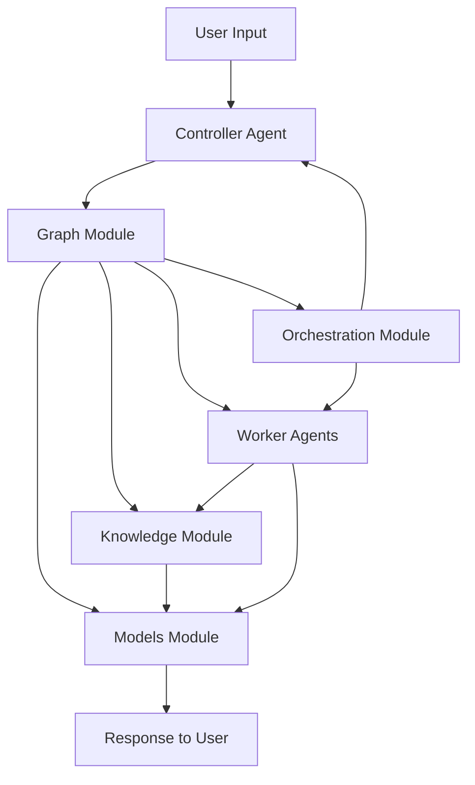

# Atlas Module Interaction Guide

This document explains how the core modules in Atlas interact, with a focus on the graph and orchestration modules.

## Core Modules Overview

Atlas consists of several core modules that work together:

- **agents**: Defines agent implementations and behaviors
- **models**: Handles integration with various LLM providers
- **knowledge**: Manages document storage, retrieval, and processing
- **graph**: Structures agent workflows and decision-making processes
- **orchestration**: Coordinates multi-agent interactions and parallel processing

## Module Interactions

### High-Level Data Flow



### Graph Module: The Workflow Engine

The graph module is the central workflow engine of Atlas, based on LangGraph. It defines how different components interact and how data flows between them.

#### Key Components

1. **StateGraph**: The core LangGraph structure that defines the workflow
2. **Nodes**: Functions that process state and return updated state
3. **Edges**: Connections between nodes that determine the flow of execution
4. **State Management**: Handling of state between nodes and throughout the workflow

#### How the Graph Module Works

The graph module allows you to:

1. **Define Complex Workflows**: Create directed graphs where each node is a function that processes and transforms state
2. **Make Dynamic Decisions**: Use conditional edges to route execution based on state or other criteria
3. **Manage Execution State**: Maintain consistent state throughout the workflow execution
4. **Handle Parallel Processing**: Execute multiple nodes in parallel when appropriate

#### Example: Query Workflow

```python
from langgraph.graph import StateGraph, END
from atlas.graph.state import AgentState
from atlas.graph.nodes import retrieve_context, generate_response

# Create a simple query workflow
query_graph = StateGraph(AgentState)

# Add nodes to the graph
query_graph.add_node("retrieve_context", retrieve_context)
query_graph.add_node("generate_response", generate_response)

# Connect nodes with edges
query_graph.add_edge("retrieve_context", "generate_response")
query_graph.add_edge("generate_response", END)

# Compile the graph
query_workflow = query_graph.compile()
```

This creates a simple workflow where:
1. Context is retrieved from the knowledge base
2. A response is generated based on that context
3. The workflow ends

### Orchestration Module: Coordinating Agents

The orchestration module manages the coordination and communication between agents, particularly in multi-agent scenarios.

#### Key Components

1. **Coordinator**: Manages the distribution of tasks among agents
2. **Parallel**: Handles parallel execution of agent tasks
3. **Scheduler**: Determines the order and priority of task execution

#### How the Orchestration Module Works

The orchestration module allows you to:

1. **Distribute Tasks**: Assign tasks to appropriate agents based on capabilities
2. **Manage Communication**: Handle message passing between agents
3. **Coordinate Multi-Agent Workflows**: Ensure agents work together effectively
4. **Optimize Resources**: Balance workload across available agents

#### Example: Multi-Agent Coordination

```python
from atlas.orchestration.coordinator import AgentCoordinator
from atlas.agents.controller import ControllerAgent
from atlas.agents.worker import WorkerAgent

# Create a controller and workers
controller = ControllerAgent()
workers = [WorkerAgent(role="researcher"), WorkerAgent(role="writer")]

# Set up the coordinator
coordinator = AgentCoordinator(
    controller=controller,
    workers=workers
)

# Process a task using the multi-agent system
result = coordinator.process_task("Research and write about quantum computing")
```

In this example:
1. The coordinator receives a task
2. The controller breaks it down into subtasks
3. The coordinator assigns subtasks to appropriate workers
4. Workers execute their tasks and return results
5. The coordinator aggregates results and delivers the final output

## Detailed Interaction Examples

### 1. Query Processing Flow

When a user submits a query:

1. **Entry Point**: The query is received by a controller agent or directly by the graph module
2. **Knowledge Retrieval**: The graph module executes a node that calls the knowledge module to find relevant documents
3. **Context Integration**: The retrieved context is added to the state
4. **Model Invocation**: A node in the graph calls the models module to generate a response
5. **Response Delivery**: The final state with the response is returned to the user

### 2. Multi-Agent Collaboration

In a more complex scenario:

1. **Task Reception**: The orchestration module receives a complex task
2. **Task Decomposition**: The controller agent breaks it into subtasks
3. **Graph Creation**: A workflow graph is created for each subtask
4. **Worker Assignment**: The orchestration module assigns subtasks to worker agents
5. **Parallel Execution**: Workers process their tasks, potentially using the knowledge module
6. **Result Aggregation**: The orchestration module collects results from all workers
7. **Final Synthesis**: The controller agent integrates all results into a coherent response

## Implementation Details

### Graph Module Implementation

The graph module leverages LangGraph to create StateGraph instances that manage workflow execution:

```python
# State definition
class AgentState(BaseModel):
    query: str
    context: Optional[List[Document]] = None
    response: Optional[str] = None

# Node function definition
def retrieve_context(state: AgentState) -> AgentState:
    knowledge_base = KnowledgeBase()
    documents = knowledge_base.retrieve(state.query)
    return AgentState(
        query=state.query,
        context=documents,
        response=state.response
    )

# Edge condition definition
def should_retrieve(state: AgentState) -> str:
    if state.context is None and state.query:
        return "retrieve_context"
    else:
        return "generate_response"
```

Edges can be conditional, allowing for dynamic workflow behavior:

```python
# Add conditional edge
query_graph.add_conditional_edges(
    "start",
    should_retrieve,
    {
        "retrieve_context": "retrieve_context",
        "generate_response": "generate_response"
    }
)
```

### Orchestration Module Implementation

The orchestration module handles agent coordination and task distribution:

```python
class AgentCoordinator:
    def __init__(self, controller, workers):
        self.controller = controller
        self.workers = {worker.role: worker for worker in workers}
        
    def process_task(self, task):
        # Controller breaks down the task
        subtasks = self.controller.decompose_task(task)
        
        # Assign subtasks to workers
        results = {}
        for subtask in subtasks:
            worker_role = subtask.get("role")
            worker = self.workers.get(worker_role)
            if worker:
                results[subtask["id"]] = worker.process(subtask["content"])
        
        # Controller synthesizes the results
        final_result = self.controller.synthesize_results(results)
        return final_result
```

## How to Use These Modules in Your Implementation

### Creating a Custom Workflow

To create a custom workflow using the graph module:

1. Define your state model:
```python
class CustomState(BaseModel):
    input: str
    intermediate_results: List[Any] = []
    output: Optional[str] = None
```

2. Create node functions:
```python
def process_input(state: CustomState) -> CustomState:
    # Process the input...
    return state.model_copy(update={"intermediate_results": [processed_data]})
```

3. Build and compile your graph:
```python
custom_graph = StateGraph(CustomState)
custom_graph.add_node("process_input", process_input)
# Add more nodes and edges...
custom_workflow = custom_graph.compile()
```

4. Execute the workflow:
```python
result = custom_workflow.invoke({"input": "Example input"})
```

### Coordinating Multiple Agents

To coordinate multiple agents using the orchestration module:

1. Create your agents:
```python
controller = ControllerAgent()
worker1 = WorkerAgent(role="researcher")
worker2 = WorkerAgent(role="writer")
```

2. Set up the coordinator:
```python
coordinator = AgentCoordinator(
    controller=controller,
    workers=[worker1, worker2]
)
```

3. Process tasks through the coordinator:
```python
result = coordinator.process_task("Complex task requiring multiple agents")
```

## Summary

- The **graph module** structures workflows and manages the execution flow between components
- The **orchestration module** coordinates multiple agents, handling task distribution and result aggregation
- Together, these modules enable complex agent behaviors and multi-agent collaboration
- The knowledge module provides information retrieval capabilities to both workflows and agents
- The models module serves as the core intelligence, generating responses and processing information

By understanding how these modules interact, you can leverage the full power of Atlas to create sophisticated agent systems that effectively combine knowledge retrieval, workflow management, and multi-agent coordination.