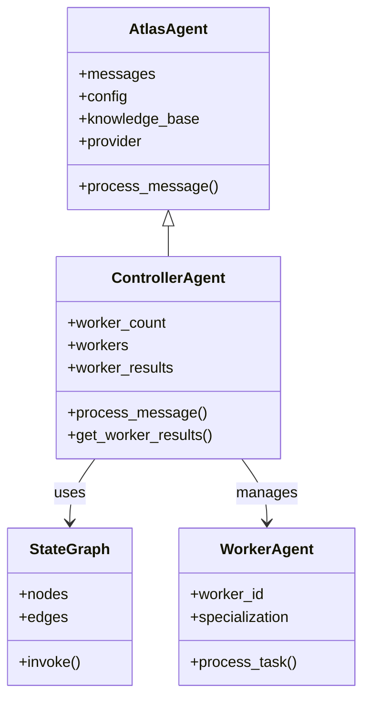

# Controller

This document describes the Controller Agent in Atlas, which orchestrates multiple specialized worker agents to process complex queries.

## Overview

The Controller Agent serves as the central coordinator for Atlas's multi-agent architecture. It manages the workflow of distributing tasks to specialized worker agents, collecting their results, and synthesizing a coherent final response.



## Key Capabilities

The Controller Agent provides the following capabilities:

1. **Task Management**: Creates and assigns tasks to specialized worker agents
2. **Worker Coordination**: Tracks worker status and collects results from all workers
3. **Parallel Processing**: Supports parallel execution of worker agents
4. **State Management**: Maintains the state of the entire workflow
5. **Response Synthesis**: Generates coherent responses that integrate results from all workers

## Implementation Details

The Controller Agent is implemented in the `atlas.agents.controller` module, extending the base `AtlasAgent` class.

### Class Definition

```python
class ControllerAgent(AtlasAgent):
    """Controller agent that orchestrates multiple worker agents."""

    def __init__(
        self,
        system_prompt_file: Optional[str] = None,
        collection_name: str = "atlas_knowledge_base",
        config: Optional[AtlasConfig] = None,
        worker_count: int = 3,
    ):
        """Initialize the controller agent."""
        # Initialize base agent
        super().__init__(system_prompt_file, collection_name, config)

        # Update config with worker count
        if not config:
            self.config.worker_count = worker_count

        # LangGraph workflow type
        self.workflow_type = "controller"

        # Worker management
        self.worker_count = worker_count
        self.workers: Dict[str, Any] = {}
        self.worker_results: Dict[str, Any] = {}
```

### Key Methods

#### process_message

The `process_message` method processes a user query using the controller-worker architecture:

```python
def process_message(self, message: str) -> str:
    """Process a user message using the controller-worker architecture."""
    try:
        # Add user message to history
        self.messages.append({"role": "user", "content": message})

        # Run the controller workflow
        final_state = run_controller_workflow(
            query=message,
            system_prompt_file=None,  # Use default in workflow
            config=self.config,
        )

        # Extract the response (last assistant message)
        assistant_message = ""
        for msg in reversed(final_state.messages):
            if msg["role"] == "assistant":
                assistant_message = msg["content"]
                break

        if not assistant_message:
            assistant_message = "I'm sorry, I couldn't generate a response."

        # Add assistant response to history
        self.messages.append({"role": "assistant", "content": assistant_message})

        # Store worker results for later inspection if needed
        self.worker_results = final_state.results

        return assistant_message

    except Exception as e:
        # Error handling
        print(f"Error in controller processing: {str(e)}")
        error_msg = "I'm sorry, I encountered an error processing your request."
        self.messages.append({"role": "assistant", "content": error_msg})
        return error_msg
```

#### get_worker_results

The `get_worker_results` method retrieves the results from all worker agents:

```python
def get_worker_results(self) -> Dict[str, Any]:
    """Get the results from all worker agents."""
    return self.worker_results
```

## Workflow Integration

The Controller Agent integrates with LangGraph to define and execute the multi-agent workflow.

### LangGraph Workflow

The controller uses the `run_controller_workflow` function from `atlas.graph.workflows`:

```python
from atlas.graph.workflows import run_controller_workflow

final_state = run_controller_workflow(
    query=message,
    system_prompt_file=None,  # Use default in workflow
    config=self.config,
)
```

This function creates and executes a `StateGraph` that defines the controller-worker workflow:

```python
def create_controller_worker_graph(
    system_prompt_file: Optional[str] = None, config: Optional[AtlasConfig] = None
) -> StateGraph:
    """Create a controller-worker workflow graph."""
    # Create StateGraph with ControllerState
    builder = StateGraph(ControllerState)

    # Add nodes
    builder.add_node("retrieve_knowledge", retrieve_knowledge)
    builder.add_node("create_worker_tasks", create_worker_tasks)
    builder.add_node("process_worker_results", process_worker_results)
    builder.add_node("generate_final_response", final_response)
    builder.add_node("route_workers", route_to_workers)

    # Add conditional edges for routing
    builder.add_conditional_edges(
        "route_workers",
        lambda x: x,
        {
            "generate_final_response": lambda state: state.all_tasks_completed,
            "create_worker_tasks": lambda state: not state.all_tasks_assigned,
            "process_worker_results": lambda state: (
                state.all_tasks_assigned
                and len(state.completed_workers) >= len(state.active_workers)
            ),
        },
    )

    # Define edges
    builder.add_edge("retrieve_knowledge", "route_workers")
    builder.add_edge("create_worker_tasks", "route_workers")
    builder.add_edge("process_worker_results", "route_workers")
    builder.add_edge("generate_final_response", END)

    # Set the entry point
    builder.set_entry_point("retrieve_knowledge")

    # Compile the graph
    return builder.compile()
```

## State Management

The Controller Agent uses the `ControllerState` model from `atlas.graph.state` to manage the state of the workflow:

```python
class ControllerState(BaseModel):
    """State for a controller agent managing multiple workers."""

    # Main state
    messages: List[Message] = Field(
        default_factory=list, description="Main conversation history"
    )
    context: Optional[Context] = Field(
        default=None, description="Retrieved context information"
    )

    # Worker management
    workers: Dict[str, AgentState] = Field(
        default_factory=dict, description="States for all workers"
    )
    active_workers: List[str] = Field(
        default_factory=list, description="Currently active worker IDs"
    )
    completed_workers: List[str] = Field(
        default_factory=list, description="IDs of workers that have completed"
    )

    # Task tracking
    tasks: List[Dict[str, Any]] = Field(
        default_factory=list, description="Tasks to be processed"
    )
    results: List[Dict[str, Any]] = Field(
        default_factory=list, description="Results from completed tasks"
    )
```

## Usage Examples

### Basic Usage

```python
from atlas.agents.controller import ControllerAgent

# Create a controller with default settings
controller = ControllerAgent()

# Process a user query
response = controller.process_message("What is the trimodal methodology in Atlas?")
print(response)

# Get the results from worker agents
worker_results = controller.get_worker_results()
print(f"Retrieved results from {len(worker_results)} workers")
```

### Custom Configuration

```python
from atlas.core.config import AtlasConfig
from atlas.agents.controller import ControllerAgent

# Create a custom configuration
config = AtlasConfig(
    collection_name="custom_collection",
    db_path="/path/to/custom/db",
    model_name="claude-3-opus-20240229",
    max_tokens=4000
)

# Create a controller with custom configuration
controller = ControllerAgent(
    system_prompt_file="path/to/custom_prompt.md",
    collection_name="custom_collection",
    config=config,
    worker_count=5
)

# Process a user query
response = controller.process_message("Explain the concept of knowledge graphs in Atlas")
```

### CLI Usage

The Controller Agent can also be accessed through the command line:

```bash
# Run in controller mode with default 3 workers
python main.py -m controller

# Run with custom worker count
python main.py -m controller --workers 5

# Run with parallel processing
python main.py -m controller --parallel

# Run with a specific workflow type
python main.py -m controller --workflow advanced
```

## Extending the Controller

You can extend the Controller Agent to add custom functionality:

```python
from atlas.agents.controller import ControllerAgent

class EnhancedController(ControllerAgent):
    """Controller with enhanced capabilities."""

    def __init__(self, *args, **kwargs):
        super().__init__(*args, **kwargs)
        self.task_history = []

    def process_message(self, message: str) -> str:
        """Process a message with history tracking."""
        # Record the task
        self.task_history.append(message)

        # Process the message normally
        response = super().process_message(message)

        # Record the result
        self.task_history.append(f"Response: {response[:50]}...")

        return response

    def get_task_history(self):
        """Get the history of all tasks processed."""
        return self.task_history
```

## Advanced Features

### Parallel Processing

The Controller Agent supports parallel processing of worker tasks, which can significantly improve performance for complex queries:

```python
# Enable parallel processing by setting the parallel flag in the config
config = AtlasConfig(parallel=True)
controller = ControllerAgent(config=config)
```

### Dynamic Worker Allocation

While the default implementation uses a fixed worker count, you can implement dynamic worker allocation based on query complexity:

```python
def allocate_workers(query: str) -> int:
    """Determine how many workers to allocate based on query complexity."""
    # Simple complexity analysis based on query length and structure
    complexity = len(query.split())
    if complexity < 10:
        return 2  # Simple query
    elif complexity < 30:
        return 3  # Moderate query
    else:
        return 5  # Complex query
```

## Related Documentation

- [Multi-Agent Workflow](../../workflows/multi_agent.md) - Detailed information about the multi-agent workflow
- [Worker Agents](./workers.md) - Documentation on specialized worker agents
- [Graph Framework](../graph/) - Information on the LangGraph implementation
