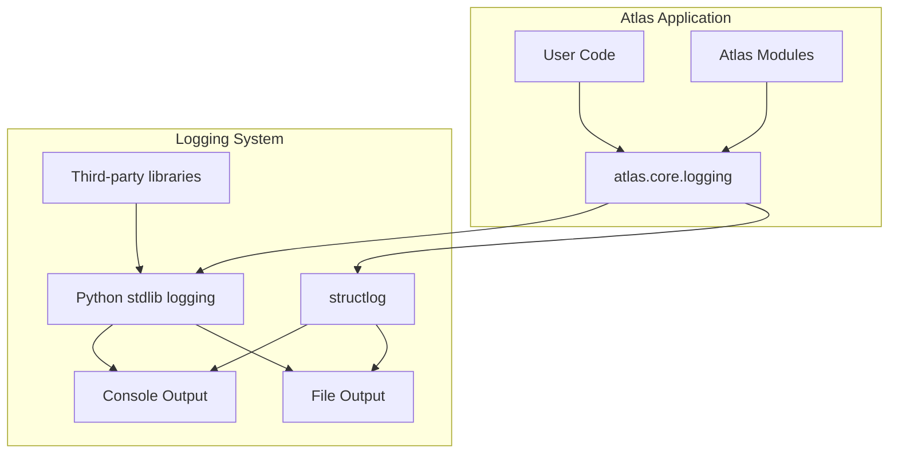

# Logging System

This document describes the centralized logging system in Atlas, introduced to provide consistent log handling, verbosity controls, and integration with various output formats.

## Overview

The Atlas logging system is designed to provide:

1. **Centralized Configuration**: Single point of control for all logging behavior
2. **Structured Logging**: Rich context and consistent formatting
3. **Verbosity Controls**: Different detail levels for different users and scenarios
4. **Third-Party Log Management**: Control noisy dependencies
5. **Console and File Output**: Flexible output destinations
6. **Integration with Telemetry**: Coordination with OpenTelemetry

## Architecture

The logging system is built around a central configuration module that initializes and configures both the standard Python logging system and the structured logging capabilities provided by `structlog`.



## Configuration

### Environment Variables

Logging can be configured using these environment variables:

| Variable | Description | Default |
|----------|-------------|---------|
| `ATLAS_LOG_LEVEL` | General logging level (DEBUG, INFO, WARNING, ERROR) | `INFO` |
| `ATLAS_TELEMETRY_LOG_LEVEL` | Log level specifically for telemetry | `INFO` |

### Third-Party Library Control

The logging system automatically configures quieter logging for these third-party libraries:

- **ChromaDB**: Limited to ERROR level by default
- **uvicorn**: Limited to ERROR level by default
- **httpx**: Limited to ERROR level by default
- **opentelemetry**: Limited to ERROR level by default

This prevents overwhelming the console with messages that aren't directly relevant to Atlas operations.

## Usage

### Basic Usage

```python
from atlas.core import logging

# Get a logger for your module
logger = logging.get_logger(__name__)

# Log at different levels
logger.debug("Detailed debug information")
logger.info("General information about operation progress")
logger.warning("Warning about potential issues")
logger.error("Error that prevented an operation")
```

### Structured Logging

When structlog is available, the logging system provides structured logging capabilities:

```python
from atlas.core import logging

# Get a structlog logger for your module
logger = logging.get_structlog_logger(__name__)

# Log with structured context
logger.info("Processing document", document_id="doc123", size_kb=256)
logger.warning("Retrieval slower than expected", 
               retrieval_time_ms=350, 
               expected_time_ms=100,
               document_count=5)
```

### Configure Logging

```python
from atlas.core import logging

# Configure logging with custom settings
logging.configure_logging(
    level="DEBUG",               # Overall logging level
    enable_rich=True,            # Use rich for prettier console output
    quiet_loggers=["chromadb", "httpx"]  # Libraries to silence
)
```

## Integration with CLI

The logging system integrates with the CLI framework to provide consistent verbosity controls:

| CLI Flag | Effect |
|----------|--------|
| `-v`, `--verbose` | Increase verbosity (can be used multiple times) |
| `-q`, `--quiet` | Suppress non-essential output |
| `--log-level DEBUG` | Set specific log level |

## Integration with Telemetry

The logging system coordinates with the telemetry module to ensure consistent behavior:

1. When telemetry is disabled, all related logging is also suppressed
2. Telemetry console export is disabled by default to prevent log clutter
3. Log levels for telemetry can be configured separately

## Best Practices

1. **Use the logging module**: Always use `atlas.core.logging` instead of direct `logging` or `print`
2. **Appropriate Log Levels**: Use the correct level for each message
   - `DEBUG`: Detailed troubleshooting
   - `INFO`: General operational information
   - `WARNING`: Potential issues or unexpected scenarios
   - `ERROR`: Failures that prevented an operation
3. **Structured Context**: Include relevant contextual data with log messages
4. **Avoid Print Statements**: Use logging for all output that isn't direct user interaction
5. **Selective Verbosity**: Keep default output minimal and use verbosity levels for details

## Related Documentation

- [Telemetry System](./telemetry.md)
- [Configuration Guide](../../guides/configuration.md)
- [CLI Reference](../../reference/cli.md)