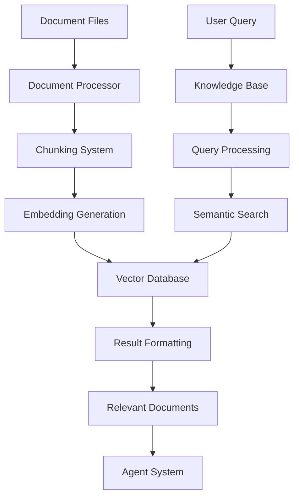

# Knowledge System Overview

This document provides a comprehensive overview of the knowledge management system in Atlas, which enables semantic storage and retrieval of information for agent interactions.

## Introduction

The knowledge system in Atlas is a foundational component that provides agents with access to contextually relevant information. It consists of two main subsystems:

1. **Document Ingestion**: Processing and storing documents in a vector database
2. **Knowledge Retrieval**: Semantic search capabilities for finding relevant information

This system enables Atlas to maintain a comprehensive, versioned, and searchable knowledge base that serves as the foundation for intelligent agent interactions.

## Architecture

The knowledge system is built around these key components:




1. **Vector Database**: ChromaDB for persistent storage of document embeddings
2. **Document Processor**: Handles document splitting, processing, and embedding
3. **Knowledge Base**: Interface for retrieving relevant information
4. **Integration Layer**: Connects the knowledge system to agents and workflows

The system is designed to be:

- **Scalable**: Handle large volumes of documents
- **Persistent**: Store embeddings efficiently for reuse
- **Flexible**: Support various document types and querying patterns
- **Integrated**: Work seamlessly with the agent infrastructure

## Core Components

### ChromaDB Integration

Atlas uses ChromaDB as its vector database, providing:

- **Persistent Storage**: Document embeddings are stored on disk
- **Semantic Search**: Embedding-based similarity search
- **Metadata Filtering**: Search refinement using document metadata
- **Collection Management**: Organizing embeddings in named collections

The integration handles connection management, persistence configuration, and error recovery:

```python
# Initialize the database
self.chroma_client = chromadb.PersistentClient(path=self.db_path)
self.collection = self.chroma_client.get_or_create_collection(
    name=self.collection_name
)
```

### Document Processing System

The `DocumentProcessor` class manages the ingestion pipeline:

1. **Document Discovery**: Finding relevant files in a directory structure
2. **Content Extraction**: Reading document content from files
3. **Chunking**: Splitting documents into manageable sections
4. **Metadata Annotation**: Adding source information and other metadata
5. **Embedding Generation**: Converting text to vector embeddings
6. **Vector Storage**: Storing embeddings in ChromaDB

The processor uses heading-based document splitting to maintain content coherence:

```python
# Split document by headings
heading_pattern = re.compile(r"^(#{1,6})\s+(.+)$", re.MULTILINE)
headings = list(heading_pattern.finditer(content))

# Process each section
for i, match in enumerate(headings):
    title = match.group(2).strip()
    # Determine section text
    section_text = content[start_pos:end_pos].strip()
    sections.append({"title": title, "text": section_text})
```

### Retrieval System

The `KnowledgeBase` class provides the semantic search interface:

1. **Query Processing**: Converting user queries to vector searches
2. **Relevance Ranking**: Sorting results by similarity score
3. **Result Formatting**: Converting raw results to usable document formats
4. **Filtering**: Narrowing results by metadata (e.g., document version)

The retrieval system supports several search patterns:

```python
# Basic retrieval
documents = kb.retrieve(query, n_results=5)

# Version-filtered retrieval
documents = kb.retrieve(query, n_results=5, version_filter="v2")

# Topic-based search
documents = kb.search_by_topic("Knowledge Graph", n_results=5)
```

### Integration with LangGraph

The knowledge system integrates with LangGraph through the `retrieve_knowledge` function:

```python
def retrieve_knowledge(
    state: Dict[str, Any],
    query: Optional[str] = None,
    collection_name: Optional[str] = None,
    db_path: Optional[str] = None,
) -> Dict[str, Any]:
    """Retrieve knowledge from the Atlas knowledge base."""
    # Initialize knowledge base
    kb = KnowledgeBase(collection_name=collection_name, db_path=db_path)

    # Get query from state or parameter
    query = query or get_query_from_state(state)

    # Retrieve documents
    documents = kb.retrieve(query)

    # Update state with results
    state["context"] = {"documents": documents, "query": query}

    return state
```

This function serves as a standard node in LangGraph workflows and:
- Extracts query information from graph state
- Performs knowledge retrieval
- Updates the graph state with retrieved documents

## Document Representation

Each document in the knowledge system is represented with a rich structure:

```json
{
  "content": "## Knowledge Graph Structure\n\nThe Atlas knowledge graph...",
  "metadata": {
    "path": "src-markdown/prev/v2/core/KNOWLEDGE_FRAMEWORK.md",
    "source": "src-markdown/prev/v2/core/KNOWLEDGE_FRAMEWORK.md",
    "file_name": "KNOWLEDGE_FRAMEWORK.md",
    "section_title": "Knowledge Graph Structure",
    "version": "2",
    "chunk_size": 1250
  },
  "relevance_score": 0.92
}
```

Key attributes include:

- **Content**: The actual text of the document chunk
- **Metadata**:
  - **path/source**: Location of the original document
  - **file_name**: Name of the source file
  - **section_title**: Title of the document section
  - **version**: Version of the Atlas system the document belongs to
  - **chunk_size**: Size of the text chunk
- **Relevance Score**: Similarity score relative to the query (0-1)

## Configuration Options

The knowledge system is highly configurable via a combination of:

### Environment Variables

- `ATLAS_COLLECTION_NAME`: The name of the ChromaDB collection (default: "atlas_knowledge_base")
- `ATLAS_DB_PATH`: Path to store ChromaDB files (default: "~/atlas_chroma_db")

### Runtime Parameters

Both `DocumentProcessor` and `KnowledgeBase` accept:

- `collection_name`: Override for the collection name
- `db_path`: Override for the database path
- `anthropic_api_key`: API key for embedding generation (DocumentProcessor only)

### Command Line Options

When using the CLI, several knowledge-related options are available:

```
python main.py -m ingest -d <directory> -c <collection_name> --db-path <db_path>
```

- `-c/--collection`: Specify the collection name
- `--db-path`: Override the database path
- `-d/--directory`: Directory to ingest documents from
- `-r/--recursive`: Recursively process subdirectories

## Versioning Support

The knowledge system includes special support for versioned documentation:

1. **Version Detection**: Automatically extracts version information from file paths
   ```python
   version_match = re.search(r"/v(\d+(?:\.\d+)?)/", file_path)
   version = version_match.group(1) if version_match else "current"
   ```

2. **Version Filtering**: Allows retrieving documents from specific Atlas versions
   ```python
   # Only get documents from v3
   documents = kb.retrieve(query, version_filter="3")
   ```

3. **Version Enumeration**: Lists all available versions in the knowledge base
   ```python
   versions = kb.get_versions()
   print(f"Available Atlas versions: {versions}")
   ```

This enables agents to access documentation from different evolutionary stages of the Atlas framework.

## Usage Patterns

### Ingesting Documentation

```python
from atlas.knowledge.ingest import DocumentProcessor

# Initialize the processor
processor = DocumentProcessor(collection_name="my_knowledge_base")

# Process a directory of markdown files
processor.process_directory("./documents", recursive=True)

print(f"Processed {processor.collection.count()} document chunks")
```

### Basic Retrieval

```python
from atlas.knowledge.retrieval import KnowledgeBase

# Initialize the knowledge base
kb = KnowledgeBase(collection_name="my_knowledge_base")

# Retrieve relevant documents
documents = kb.retrieve("How does Atlas handle knowledge graphs?", n_results=5)

for i, doc in enumerate(documents):
    print(f"Result {i+1}: {doc['metadata']['source']} - Score: {doc['relevance_score']:.4f}")
    print(f"Content snippet: {doc['content'][:100]}...")
```

### Enhancing Agent Responses

```python
from atlas.knowledge.retrieval import KnowledgeBase
from atlas.agents.base import AtlasAgent

# Initialize components
kb = KnowledgeBase()
agent = AtlasAgent()

# Process a user query
query = "Explain the trimodal methodology in Atlas"

# Retrieve relevant knowledge
documents = kb.retrieve(query)

# Format context from documents
context = ""
for i, doc in enumerate(documents[:3]):
    source = doc["metadata"]["source"]
    content = doc["content"]
    context += f"Document {i+1} ({source}):\n{content}\n\n"

# Generate enhanced response
response = agent.process_message_with_context(query, context)
print(response)
```

### Integration with LangGraph Workflows

```python
from langgraph.graph import StateGraph
from atlas.knowledge.retrieval import retrieve_knowledge

# Define the workflow
workflow = StateGraph()

# Add knowledge retrieval node
workflow.add_node("retrieve_knowledge", retrieve_knowledge)

# Connect the node
workflow.add_edge("user_input", "retrieve_knowledge")
workflow.add_edge("retrieve_knowledge", "generate_response")
```

## Performance Considerations

### Chunking Strategy

The default chunking strategy balances two competing priorities:

1. **Semantic Coherence**: Keeping logically related content together
2. **Embedding Effectiveness**: Avoiding chunks that are too large

The heading-based chunking strategy:
- Uses markdown headings as natural document boundaries
- Falls back to size-based chunking for large heading sections
- Preserves document structure and hierarchy

### Database Optimization

For optimal performance:

1. **Collection Size**: Keep collections under 100,000 documents for best performance
2. **Query Complexity**: Simple, focused queries yield better results than complex ones
3. **Result Count**: Retrieve 3-5 results for most agent interactions
4. **Persistence Location**: Store the database on a fast SSD for better retrieval times

### Error Handling

The knowledge system includes robust error handling:

1. **Connectivity Issues**: Falls back to in-memory database if disk access fails
2. **Empty Collections**: Warns about missing documents during retrieval
3. **File Access Problems**: Skips problematic files during ingestion
4. **Invalid Content**: Handles malformed documents gracefully

## Future Enhancements

Planned improvements to the knowledge system include:

1. **Advanced Chunking Strategies**: More sophisticated document splitting algorithms
2. **Hybrid Search**: Combining embedding similarity with keyword search
3. **Result Reranking**: Post-retrieval scoring to improve relevance
4. **Cross-Reference Analysis**: Identifying relationships between documents
5. **Incremental Updates**: Better handling of document changes and updates

## Related Documentation

- [Document Ingestion](ingestion.md) - Detailed documentation on document processing
- [Retrieval System](retrieval.md) - Information about knowledge retrieval functionality
- [ChromaDB Integration](../core/env.md) - Details on vector database configuration
- [LangGraph Integration](../graph/nodes.md) - Documentation on using knowledge with LangGraph
