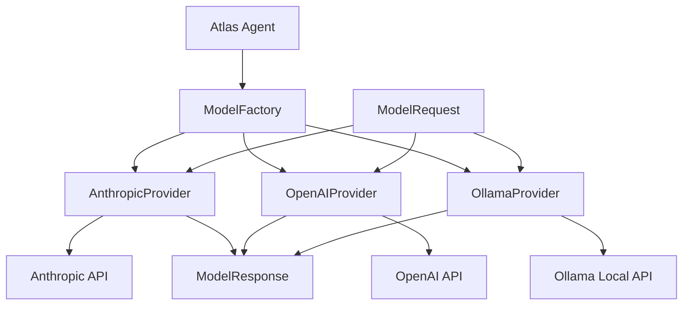

# Model Provider System

The Model Provider System is a crucial component of Atlas that abstracts interactions with different language model APIs. It provides a unified interface for working with various model providers, enabling seamless switching between providers and models.

## System Overview



The Model Provider System consists of several key components:

1. **ModelProvider Interface**: Defines the common interface for all providers
2. **Provider Implementations**: Specific implementations for each supported provider
3. **ModelFactory**: Factory module for creating provider instances
4. **ModelRequest**: Standardized request format across providers
5. **ModelResponse**: Unified response format for consistency
6. **ModelMessage**: Message structure for provider-agnostic communication

## Provider Interface

All model providers implement a common interface defined in `models/base.py`:

```python
class ModelProvider:
    """Base class for model providers."""

    @property
    def name(self) -> str:
        """Get the provider name."""
        return self._name

    @property
    def model_name(self) -> str:
        """Get the model name."""
        return self._model_name

    def generate(self, request: ModelRequest) -> ModelResponse:
        """Generate a response for the given request."""
        raise NotImplementedError()

    def stream(self, request: ModelRequest) -> Tuple[ModelResponse, StreamHandler]:
        """Stream a response for the given request."""
        raise NotImplementedError()

    def validate_api_key(self) -> bool:
        """Validate the API key for this provider."""
        raise NotImplementedError()
```

## Supported Providers

Atlas currently supports the following model providers:

### Anthropic Provider

- **Models**: Claude 3 Opus, Claude 3 Sonnet, Claude 3.5 Sonnet
- **Features**: Streaming, cost tracking, API key validation
- **Configuration**: `ANTHROPIC_API_KEY` environment variable
- **Documentation**: [Anthropic Provider](./anthropic.md)

### OpenAI Provider

- **Models**: GPT-4o, GPT-4, GPT-3.5 Turbo
- **Features**: Streaming, function calling, cost tracking
- **Configuration**: `OPENAI_API_KEY` environment variable
- **Documentation**: [OpenAI Provider](./openai.md)

### Ollama Provider

- **Models**: Llama 3, Mistral, custom models
- **Features**: Local deployment, customization, streaming
- **Configuration**: `OLLAMA_BASE_URL` environment variable
- **Documentation**: [Ollama Provider](./ollama.md)

## Request and Response Formats

To ensure consistent interaction across providers, Atlas defines standardized request and response objects:

### ModelRequest

```python
class ModelRequest:
    """Standardized request format for all model providers."""

    messages: List[ModelMessage]
    max_tokens: int = 2000
    temperature: float = 0.7
    system_prompt: Optional[str] = None

    def to_provider_request(self, provider_name: str) -> Any:
        """Convert to the provider-specific request format."""
```

### ModelResponse

```python
class ModelResponse:
    """Standardized response format from all model providers."""

    content: str
    usage: Optional[TokenUsage] = None
    cost: float = 0.0
    finish_reason: Optional[str] = None
    raw_response: Any = None
```

### ModelMessage

```python
class ModelMessage:
    """Provider-agnostic message format."""

    role: str  # user, assistant, system
    content: str

    @classmethod
    def system(cls, content: str) -> "ModelMessage":
        """Create a system message."""
        return cls(role="system", content=content)

    @classmethod
    def user(cls, content: str) -> "ModelMessage":
        """Create a user message."""
        return cls(role="user", content=content)

    @classmethod
    def assistant(cls, content: str) -> "ModelMessage":
        """Create an assistant message."""
        return cls(role="assistant", content=content)
```

## Provider Selection

Atlas uses a factory pattern for provider selection and instantiation:

```python
def create_provider(
    provider_name: str = "anthropic",
    model_name: Optional[str] = None,
    max_tokens: int = 2000,
    **kwargs
) -> ModelProvider:
    """Create a model provider instance.

    Args:
        provider_name: Name of the provider to use (anthropic, openai, ollama)
        model_name: Optional model name to use
        max_tokens: Maximum tokens to generate
        **kwargs: Additional provider-specific parameters

    Returns:
        An initialized ModelProvider instance
    """
```

Atlas also supports automatic provider discovery:

```python
def discover_providers() -> Dict[str, List[str]]:
    """Discover available model providers and their models.

    Returns:
        Dictionary of provider names to lists of available models
    """
```

## Using the Model Provider System

Here's how to use the Model Provider System directly:

```python
from atlas.providers.factory import create_provider
from atlas.providers.base import ModelRequest, ModelMessage

# Create a provider instance
provider = create_provider(
    provider_name="anthropic",
    model_name="claude-3-7-sonnet-20250219",
    max_tokens=2000
)

# Create a request
request = ModelRequest(
    messages=[
        ModelMessage.system("You are a helpful assistant."),
        ModelMessage.user("Hello, how are you?")
    ],
    max_tokens=100,
    temperature=0.7
)

# Generate a response
response = provider.generate(request)
print(response.content)

# Stream a response
initial_response, stream_handler = provider.stream(request)

def process_chunk(delta: str, response: ModelResponse):
    print(delta, end="", flush=True)

final_response = stream_handler.process_stream(process_chunk)
```

## Configuration Options

The Model Provider System can be configured through environment variables:

| Environment Variable   | Description                | Default                    |
| ---------------------- | -------------------------- | -------------------------- |
| ATLAS_DEFAULT_PROVIDER | Default provider to use    | anthropic                  |
| ATLAS_DEFAULT_MODEL    | Default model to use       | claude-3-7-sonnet-20250219 |
| ATLAS_MAX_TOKENS       | Maximum tokens to generate | 2000                       |
| ANTHROPIC_API_KEY      | Anthropic API key          | -                          |
| OPENAI_API_KEY         | OpenAI API key             | -                          |
| OLLAMA_BASE_URL        | Ollama API base URL        | #                          |

## Error Handling

The Model Provider System includes robust error handling:

- **API Errors**: Errors from provider APIs are caught and converted to standardized errors
- **Retry Logic**: Transient failures can be automatically retried
- **Fallbacks**: Optional fallback to alternative providers when primary provider fails
- **Graceful Degradation**: System can continue to function with reduced capabilities

## Next Steps

- See [Anthropic Provider](./anthropic.md) for details on using Anthropic models
- See [OpenAI Provider](./openai.md) for details on using OpenAI models
- See [Ollama Provider](./ollama.md) for details on using Ollama models
- See [Query Workflow](../../workflows/query.md) for how providers are used in queries
