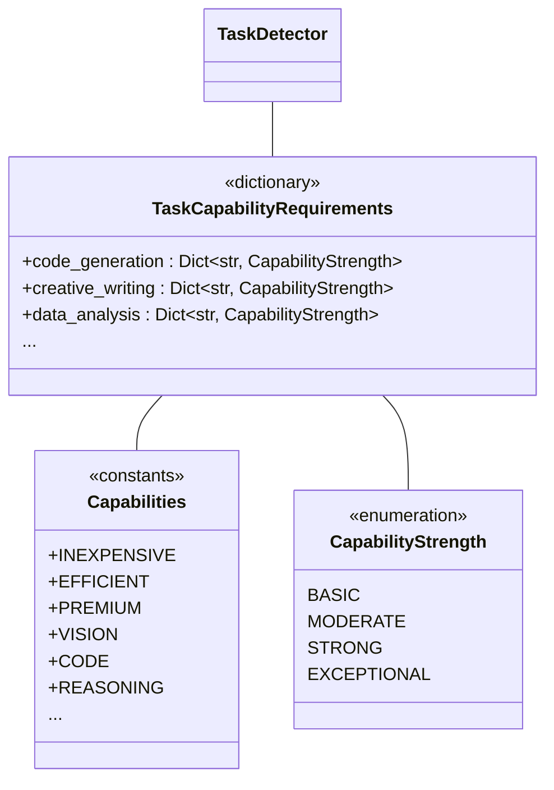

# Capability System

The Capability System is a core component of the Atlas provider architecture that enables intelligent, task-aware model selection. It defines a structured approach to categorizing model abilities and mapping task requirements to specific capabilities.

## Capability Architecture

The Capability System consists of:

1. **Capability Definitions**: Constants defining different model capabilities
2. **Capability Strength Levels**: Enumeration of capability strengths
3. **Task Type Mappings**: Mappings from task types to capability requirements
4. **Helper Functions**: Utilities for working with capabilities and tasks



## Capability Strength System

The system defines four levels of capability strength:

```python
class CapabilityStrength(IntEnum):
    """Enumeration of capability strength levels."""
    BASIC = 1       # Has the capability but limited
    MODERATE = 2    # Average capability
    STRONG = 3      # Excellent at this capability
    EXCEPTIONAL = 4 # Best-in-class for this capability
```

These strength levels allow for nuanced comparison and ranking of models based on their capabilities.

## Capability Categories

The system defines three categories of capabilities:

### Operational Capabilities

Capabilities related to operational characteristics of the model:

```python
# Operational capabilities
CAPABILITY_INEXPENSIVE = "inexpensive"  # Lower cost models
CAPABILITY_EFFICIENT = "efficient"      # Fast response time
CAPABILITY_PREMIUM = "premium"          # Highest quality models
CAPABILITY_VISION = "vision"            # Image understanding
```

### Task Capabilities

Capabilities related to specific types of tasks:

```python
# Task capabilities
CAPABILITY_CODE = "code"                # Code generation and understanding
CAPABILITY_REASONING = "reasoning"      # Logical reasoning and problem-solving
CAPABILITY_CREATIVE = "creative"        # Creative writing and ideation
CAPABILITY_EXTRACTION = "extraction"    # Data extraction from documents
CAPABILITY_MATH = "math"                # Mathematical reasoning and calculation
CAPABILITY_MULTIMEDIA = "multimedia"    # Handling multiple media types
CAPABILITY_STRUCTURED = "structured"    # Structured output generation (JSON, etc.)
CAPABILITY_CHAT = "chat"                # Conversational abilities
```

### Domain Capabilities

Capabilities related to specialized knowledge domains:

```python
# Domain capabilities
CAPABILITY_DOMAIN_SCIENCE = "science"   # Scientific domain knowledge
CAPABILITY_DOMAIN_FINANCE = "finance"   # Financial domain knowledge
CAPABILITY_DOMAIN_LEGAL = "legal"       # Legal domain knowledge
CAPABILITY_DOMAIN_MEDICAL = "medical"   # Medical domain knowledge
```

## Task Capability Mappings

The system includes a mapping from common task types to capability requirements:

```python
# Task requirements mapping
TASK_CAPABILITY_REQUIREMENTS = {
    "code_generation": {
        CAPABILITY_CODE: CapabilityStrength.STRONG,
        CAPABILITY_REASONING: CapabilityStrength.MODERATE
    },
    "creative_writing": {
        CAPABILITY_CREATIVE: CapabilityStrength.STRONG,
        CAPABILITY_CHAT: CapabilityStrength.MODERATE
    },
    "data_analysis": {
        CAPABILITY_STRUCTURED: CapabilityStrength.MODERATE,
        CAPABILITY_REASONING: CapabilityStrength.STRONG,
        CAPABILITY_MATH: CapabilityStrength.MODERATE
    },
    "document_extraction": {
        CAPABILITY_EXTRACTION: CapabilityStrength.STRONG,
        CAPABILITY_STRUCTURED: CapabilityStrength.MODERATE
    },
    "mathematical_problem_solving": {
        CAPABILITY_MATH: CapabilityStrength.STRONG,
        CAPABILITY_REASONING: CapabilityStrength.STRONG
    },
    "conversational": {
        CAPABILITY_CHAT: CapabilityStrength.STRONG
    },
    "visual_analysis": {
        CAPABILITY_VISION: CapabilityStrength.STRONG,
        CAPABILITY_REASONING: CapabilityStrength.MODERATE
    }
}
```

This mapping enables the system to automatically determine what capabilities are needed for a specific task type.

## Helper Functions

### Getting Capabilities for a Task

```python
def get_capabilities_for_task(task_type: str) -> Dict[str, CapabilityStrength]:
    """Get the capability requirements for a specific task type."""
    return TASK_CAPABILITY_REQUIREMENTS.get(task_type, {})
```

### Task Type Detection

```python
def detect_task_type_from_prompt(prompt: str) -> str:
    """Attempt to detect the task type from a prompt.
    
    This is a simple heuristic-based approach. In production, this could
    be replaced with a more sophisticated ML-based classifier.
    """
    prompt_lower = prompt.lower()
    
    # Simple keyword-based heuristics
    if any(kw in prompt_lower for kw in ["code", "function", "program", "algorithm", "implement"]):
        return "code_generation"
    elif any(kw in prompt_lower for kw in ["creative", "write", "story", "poem", "essay"]):
        return "creative_writing"
    elif any(kw in prompt_lower for kw in ["analyze", "data", "statistics", "trends", "numbers"]):
        return "data_analysis"
    elif any(kw in prompt_lower for kw in ["extract", "document", "find information", "get data from"]):
        return "document_extraction"
    elif any(kw in prompt_lower for kw in ["math", "calculate", "solve", "equation"]):
        return "mathematical_problem_solving"
    elif any(kw in prompt_lower for kw in ["image", "picture", "photo", "visual", "look at"]):
        return "visual_analysis"
    else:
        return "conversational"  # Default task type
```

## Usage Examples

### Registering Model Capabilities

```python
from atlas.providers.registry import registry
from atlas.providers.capabilities import CapabilityStrength
from atlas.providers.capabilities import CAPABILITY_CODE, CAPABILITY_REASONING

# Register model capabilities
registry.register_model_capability("claude-3-opus-20240229", CAPABILITY_CODE, CapabilityStrength.STRONG)
registry.register_model_capability("claude-3-opus-20240229", CAPABILITY_REASONING, CapabilityStrength.EXCEPTIONAL)
```

### Task-Aware Provider Selection

```python
from atlas.providers.capabilities import get_capabilities_for_task, detect_task_type_from_prompt

# Detect task type from a prompt
prompt = "Write a Python function to calculate the Fibonacci sequence"
task_type = detect_task_type_from_prompt(prompt)  # "code_generation"

# Get capability requirements for the task
capabilities = get_capabilities_for_task(task_type)
# Result: {"code": CapabilityStrength.STRONG, "reasoning": CapabilityStrength.MODERATE}

# Find models with these capabilities
matching_models = registry.find_models_with_capabilities(capabilities)
```

### Using Task-Aware Selection Strategy

```python
from atlas.providers.group import ProviderGroup, TaskAwareSelectionStrategy

# Create a provider group with task-aware selection
provider_group = ProviderGroup(
    providers=[anthropic_provider, openai_provider, ollama_provider],
    selection_strategy=TaskAwareSelectionStrategy.select
)

# Generate with task context
response = provider_group.generate({
    "prompt": "Write a function to calculate factorial",
    "task_type": "code_generation"
})
```

## CLI Integration

The capability system can be used from the command line:

```bash
# Specify task type for intelligent model selection
uv run python main.py query --task-type code_generation -q "Write a function to calculate the factorial"

# Specify exact capability requirements
uv run python main.py query --capabilities code:strong reasoning:moderate -q "Write a function to calculate the factorial"
```

## Benefits of the Capability System

1. **Intelligent Selection**: Automatically selects the best model for specific tasks
2. **Abstraction**: Hides provider-specific details behind capability abstractions
3. **Flexibility**: Easy to update capabilities as models improve or new models emerge
4. **Extensibility**: Simple to add new capabilities and task types
5. **Transparency**: Clear mapping between task requirements and model capabilities

## Integration with Other Components

The Capability System integrates with several other components:

- **Provider Registry**: Stores capability information for models
- **Provider Group**: Uses capability information for task-aware selection
- **Agent System**: Integrates task detection for automatic provider selection
- **CLI**: Enables specification of task types and capability requirements

## Future Enhancements

Planned enhancements to the Capability System include:

1. **Machine Learning-Based Task Detection**: Replace heuristics with ML model
2. **Automatic Capability Discovery**: Benchmark models to discover capabilities
3. **Capability Versioning**: Track capability changes over time
4. **Task Hierarchies**: Support for task hierarchies and inheritance
5. **Multi-Task Capabilities**: Handle tasks that require multiple capability sets