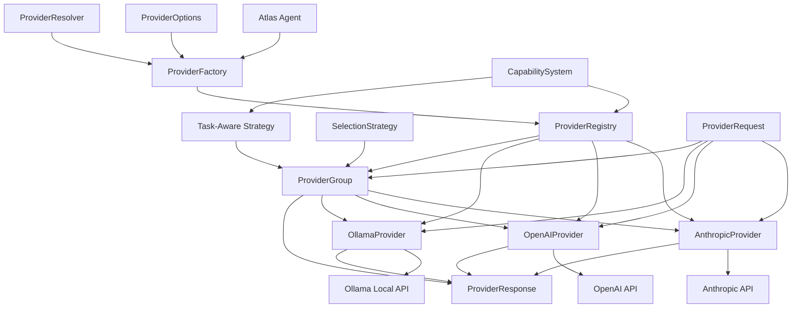

# Provider System Overview

The Provider System is a crucial component of Atlas that abstracts interactions with different language model APIs. It provides a unified interface for working with various model providers, enabling seamless switching between providers and models.

## System Overview



The Enhanced Provider System consists of several key components:

1. **Provider Interface**: Defines the common interface for all providers
2. **Provider Implementations**: Specific implementations for each supported provider
3. **Provider Registry**: Central registry for provider, model, and capability relationships
4. **Provider Group**: Provider implementation that wraps multiple providers with fallback capabilities
5. **Selection Strategies**: Strategies for selecting providers in a group (failover, round-robin, etc.)
6. **Capability System**: Defines model capabilities and task requirements for intelligent selection
7. **Provider Factory**: Factory module for creating provider instances
8. **Provider Options**: Centralized options for provider selection and configuration
9. **ProviderRequest**: Standardized request format across providers
10. **ProviderResponse**: Unified response format for consistency
11. **ProviderMessage**: Message structure for provider-agnostic communication

## Provider Interface

All model providers implement a common interface defined in `providers/base.py`:

```python
class Provider:
    """Base class for providers."""

    @property
    def name(self) -> str:
        """Get the provider name."""
        return self._name

    @property
    def model_name(self) -> str:
        """Get the model name."""
        return self._model_name

    def generate(self, request: ProviderRequest) -> ProviderResponse:
        """Generate a response for the given request."""
        raise NotImplementedError()

    def stream(self, request: ProviderRequest) -> Tuple[ProviderResponse, StreamHandler]:
        """Stream a response for the given request."""
        raise NotImplementedError()

    def validate_api_key(self) -> bool:
        """Validate the API key for this provider."""
        raise NotImplementedError()
```

## Supported Providers

Atlas currently supports the following model providers:

### Anthropic Provider

- **Models**: Claude 3 Opus, Claude 3 Sonnet, Claude 3.5 Sonnet
- **Features**: Streaming, cost tracking, API key validation
- **Configuration**: `ANTHROPIC_API_KEY` environment variable
- **Documentation**: [Anthropic Provider](./anthropic.md)

### OpenAI Provider

- **Models**: GPT-4o, GPT-4, GPT-3.5 Turbo
- **Features**: Streaming, function calling, cost tracking
- **Configuration**: `OPENAI_API_KEY` environment variable
- **Documentation**: [OpenAI Provider](./openai.md)

### Ollama Provider

- **Models**: Llama 3, Mistral, custom models
- **Features**: Local deployment, customization, streaming
- **Configuration**: `OLLAMA_BASE_URL` environment variable
- **Documentation**: [Ollama Provider](./ollama.md)

## Provider Options

The `ProviderOptions` class centralizes all parameters used for provider selection, creation, and configuration:

```python
@dataclass
class ProviderOptions:
    """Options for creating and configuring model providers."""

    # Core provider and model selection
    provider_name: Optional[str] = None
    model_name: Optional[str] = None
    capability: Optional[str] = None

    # Performance and resource limits
    max_tokens: Optional[int] = None

    # Connection parameters
    base_url: Optional[str] = None

    # Additional provider-specific parameters
    extra_params: Dict[str, Any] = field(default_factory=dict)
```

## Request and Response Formats

To ensure consistent interaction across providers, Atlas defines standardized request and response objects:

### ProviderRequest

```python
class ProviderRequest:
    """Standardized request format for all providers."""

    messages: List[ProviderMessage]
    max_tokens: int = 2000
    temperature: float = 0.7
    system_prompt: Optional[str] = None

    def to_provider_request(self, provider_name: str) -> Any:
        """Convert to the provider-specific request format."""
```

### ProviderResponse

```python
class ProviderResponse:
    """Standardized response format from all providers."""

    content: str
    usage: Optional[TokenUsage] = None
    cost: float = 0.0
    finish_reason: Optional[str] = None
    raw_response: Any = None
```

### ProviderMessage

```python
class ProviderMessage:
    """Provider-agnostic message format."""

    role: str  # user, assistant, system
    content: str

    @classmethod
    def system(cls, content: str) -> "ProviderMessage":
        """Create a system message."""
        return cls(role="system", content=content)

    @classmethod
    def user(cls, content: str) -> "ProviderMessage":
        """Create a user message."""
        return cls(role="user", content=content)

    @classmethod
    def assistant(cls, content: str) -> "ProviderMessage":
        """Create an assistant message."""
        return cls(role="assistant", content=content)
```

## Provider Selection

Atlas uses a sophisticated provider selection architecture:

```python
from atlas.providers import ProviderOptions, create_provider_from_options

# Create options with auto-detection and resolution
options = ProviderOptions(
    provider_name="anthropic",
    capability="inexpensive"
)

# Create provider from options
provider = create_provider_from_options(options)
```

Atlas also supports automatic provider detection from model names:

```python
from atlas.providers import ProviderOptions, resolve_provider_options

# Create options with only model name
options = ProviderOptions(model_name="gpt-4o")

# Resolve options with auto-detection
resolved = resolve_provider_options(options)
print(resolved.provider_name)  # Will be "openai" based on model name detection
```

## Using the Provider System

Here's how to use the Provider System directly:

```python
from atlas.providers import ProviderOptions, create_provider_from_options
from atlas.providers.base import ProviderRequest, ProviderMessage

# Create provider with options
options = ProviderOptions(
    provider_name="anthropic",
    model_name="claude-3-7-sonnet-20250219",
    max_tokens=2000
)
provider = create_provider_from_options(options)

# Create a request
request = ProviderRequest(
    messages=[
        ProviderMessage.system("You are a helpful assistant."),
        ProviderMessage.user("Hello, how are you?")
    ],
    max_tokens=100,
    temperature=0.7
)

# Generate a response
response = provider.generate(request)
print(response.content)

# Stream a response
initial_response, stream_handler = provider.stream(request)

def process_chunk(delta: str, response: ProviderResponse):
    print(delta, end="", flush=True)

final_response = stream_handler.process_stream(process_chunk)
```

## Configuration Options

The Provider System can be configured through environment variables:

| Environment Variable   | Description                | Default                                                              |
| ---------------------- | -------------------------- | -------------------------------------------------------------------- |
| ATLAS_DEFAULT_PROVIDER | Default provider to use    | anthropic                                                            |
| ATLAS_DEFAULT_MODEL    | Default model to use       | claude-3-7-sonnet-20250219                                           |
| ATLAS_MAX_TOKENS       | Maximum tokens to generate | 2000                                                                 |
| ANTHROPIC_API_KEY      | Anthropic API key          | -                                                                    |
| OPENAI_API_KEY         | OpenAI API key             | -                                                                    |
| OLLAMA_BASE_URL        | Ollama API base URL        | <a href="http://localhost:11434" target="_blank">localhost:11434</a> |

## Error Handling

The Provider System includes robust error handling:

- **API Errors**: Errors from provider APIs are caught and converted to standardized errors
- **Retry Logic**: Transient failures can be automatically retried
- **Fallbacks**: Optional fallback to alternative providers when primary provider fails
- **Graceful Degradation**: System can continue to function with reduced capabilities

## Enhanced Capability System

The Provider System includes an advanced capability system that enables task-aware model selection. Each model is annotated with capabilities and strength levels, which are used to select the most appropriate model for a given task.

### Capability Categories

- **Operational Capabilities**: inexpensive, efficient, premium, vision
- **Task Capabilities**: code, reasoning, creative, extraction, math, multimedia, structured, chat
- **Domain Capabilities**: science, finance, legal, medical

### Capability Strengths

Each capability is assigned a strength level:

- **BASIC (1)**: Has the capability but limited
- **MODERATE (2)**: Average capability
- **STRONG (3)**: Excellent at this capability
- **EXCEPTIONAL (4)**: Best-in-class for this capability

### Task-Aware Selection

The system maps common task types to capability requirements:

```python
# Example mapping
TASK_CAPABILITY_REQUIREMENTS = {
    "code_generation": {
        "code": STRENGTH_STRONG,
        "reasoning": STRENGTH_MODERATE
    },
    "creative_writing": {
        "creative": STRENGTH_STRONG,
        "chat": STRENGTH_MODERATE
    },
    "data_analysis": {
        "structured": STRENGTH_MODERATE,
        "reasoning": STRENGTH_STRONG,
        "math": STRENGTH_MODERATE
    }
}
```

## Provider Group & Selection Strategies

The ProviderGroup is a provider implementation that wraps multiple provider instances to enable aggregation and fallback.

### Selection Strategies

- **Failover**: Try providers in sequence until one works (for reliability)
- **Round-Robin**: Rotate through available providers (for load balancing)
- **Cost-Optimized**: Select providers based on estimated cost (for efficiency)
- **Task-Aware**: Select providers based on task requirements and capabilities (for quality)

### Provider Group Flow

```
Provider Instances → Selection Strategy → Provider Ordering → Sequential Execution
```

## Implementation Status

| Feature                    | Status        | Notes                                  |
| -------------------------- | ------------- | -------------------------------------- |
| Basic provider interface   | ✅ Implemented | Core provider interface is stable      |
| Anthropic provider         | ✅ Implemented | Full support for Claude models         |
| OpenAI provider            | ✅ Implemented | Support for GPT models                 |
| Ollama provider            | ✅ Implemented | Support for local models               |
| Provider options           | ✅ Implemented | Core options framework is available    |
| Provider auto-detection    | ✅ Implemented | Model name pattern detection           |
| Capability-based selection | 🚧 In Progress | Basic capability selection implemented |
| Provider Registry          | 🔲 Planned     | Implementation in development          |
| Enhanced Capability System | 🔲 Planned     | Implementation in development          |
| Provider Group             | 🔲 Planned     | Implementation in development          |
| Task-Aware Selection       | 🔲 Planned     | Implementation in development          |

## Data Flow Patterns

### Provider Selection Flow

```
Task Type → Capability Requirements → Model Selection → Provider Creation
```

### Query Execution Flow

```
User Query → Agent Preparation → Provider Generation → Response Handling
```

### Provider Group Flow

```
Provider Instances → Selection Strategy → Provider Ordering → Sequential Execution
```

## Next Steps

- See [Anthropic Provider](./anthropic.md) for details on using Anthropic models
- See [OpenAI Provider](./openai.md) for details on using OpenAI models
- See [Ollama Provider](./ollama.md) for details on using Ollama models
- See [Provider Selection](./provider_selection.md) for details on the provider selection architecture
- See [Query Workflow](../../workflows/query.md) for how providers are used in queries
