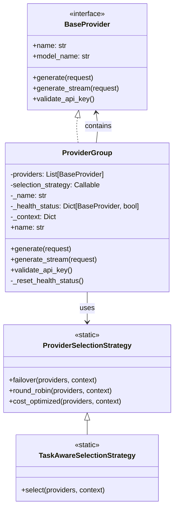

# Provider Group

The ProviderGroup is a component of the Atlas provider system that enables aggregation and fallback between multiple providers. It implements the standard BaseProvider interface while wrapping multiple provider instances, allowing for advanced selection strategies and improving system resilience.

## Architecture Overview

The ProviderGroup implements the same interface as individual providers (BaseProvider), allowing it to be used anywhere a regular provider is used. It contains multiple provider instances and uses a strategy pattern to determine which provider to use for each request.



## Core Components

### ProviderGroup Class

The ProviderGroup class implements the BaseProvider interface while managing multiple provider instances:

```python
class ProviderGroup(BaseProvider):
    """A provider that encapsulates multiple providers with fallback capabilities."""

    def __init__(
        self,
        providers: List[BaseProvider],
        selection_strategy: Callable = ProviderSelectionStrategy.failover,
        name: str = "provider_group",
    ):
        """Initialize a provider group with a list of providers.

        Args:
            providers: A list of provider instances to use
            selection_strategy: A function that determines the order to try providers
            name: A name for this provider group
        """
        if not providers:
            raise ValueError("ProviderGroup requires at least one provider")

        self.providers = providers
        self.selection_strategy = selection_strategy
        self._name = name
        self._health_status = {provider: True for provider in providers}
        self._context = {}  # Context for selection strategy
```

### Selection Strategies

The ProviderGroup uses a strategy pattern to determine the order in which to try providers:

#### Basic Selection Strategies

```python
class ProviderSelectionStrategy:
    """Strategy for selecting providers from a group."""

    @staticmethod
    def failover(providers: List[BaseProvider], context: Dict[str, Any] = None) -> List[BaseProvider]:
        """Returns providers in order, for failover purposes."""
        # Simple implementation - just return providers in the original order
        # This is ideal for reliability as it tries the most reliable provider first
        return providers

    @staticmethod
    def round_robin(providers: List[BaseProvider], context: Dict[str, Any] = None) -> List[BaseProvider]:
        """Rotates through providers in sequence."""
        # Use context to track the last provider used and rotate
        if not context or "last_index" not in context:
            last_index = 0
        else:
            last_index = context.get("last_index", 0)

        # Rotate and update for next call
        rotated = providers[last_index:] + providers[:last_index]

        # Update context for next call (if mutable)
        if context is not None:
            next_index = (last_index + 1) % len(providers)
            context["last_index"] = next_index

        return rotated

    @staticmethod
    def cost_optimized(providers: List[BaseProvider], context: Dict[str, Any] = None) -> List[BaseProvider]:
        """Sorts providers by estimated cost."""
        # For a simple implementation, use a hard-coded cost hierarchy
        # In a real implementation, this would use a cost model based on actual prices
        def get_cost_rank(provider: BaseProvider) -> int:
            cost_ranks = {
                "mock": 0,      # Lowest cost (free)
                "ollama": 1,    # Low cost (local)
                "openai": 2,    # Medium cost
                "anthropic": 3, # Higher cost
            }
            return cost_ranks.get(provider.name.lower(), 99)

        # Sort by cost rank (lowest first)
        return sorted(providers, key=get_cost_rank)
```

#### Task-Aware Selection Strategy

```python
class TaskAwareSelectionStrategy:
    """Selects models based on task requirements and capability strengths."""

    @staticmethod
    def select(providers, context=None):
        """Select providers optimized for specific task types.

        Args:
            providers: List of provider instances
            context: Dictionary containing at least 'task_type' or 'prompt'

        Returns:
            Ordered list of providers
        """
        if not providers:
            return []

        if not context:
            # Fallback to default ordering if no context
            return providers

        # Get task type from context
        task_type = context.get("task_type")
        if not task_type and "prompt" in context:
            # Try to detect task type from prompt
            task_type = detect_task_type_from_prompt(context["prompt"])

        if not task_type:
            # No task type available, use default ordering
            return providers

        # Get required capabilities for this task
        required_capabilities = get_capabilities_for_task(task_type)

        if not required_capabilities:
            # No specific requirements, use default ordering
            return providers

        # Score each provider based on capability match
        scored_providers = []
        for provider in providers:
            # Calculate average capability match score
            total_score = 0
            matches = 0

            for capability, min_strength in required_capabilities.items():
                provider_strength = provider.get_capability_strength(capability)
                if provider_strength >= min_strength:
                    # Provider meets minimum requirement
                    total_score += provider_strength / min_strength  # Relative score
                    matches += 1

            # Only include providers with some capability match
            if matches > 0:
                avg_score = total_score / len(required_capabilities)
                scored_providers.append((provider, avg_score))

        # Sort by score (highest first)
        return [p for p, s in sorted(scored_providers, key=lambda x: x[1], reverse=True)] or providers
```

## Provider Operations

### Generate Method

The generate method tries providers in the order determined by the selection strategy until one succeeds:

```python
def generate(self, request):
    """Generate a response using providers according to the selection strategy."""
    ordered_providers = self.selection_strategy(
        [p for p in self.providers if self._health_status[p]],
        context=self._context
    )

    if not ordered_providers:
        raise Exception("No healthy providers available")

    last_error = None
    for provider in ordered_providers:
        try:
            return provider.generate(request)
        except Exception as e:
            # Log the error
            logger.warning(f"Provider {provider.name} failed to generate: {str(e)}")
            last_error = e
            # Mark provider as unhealthy
            self._health_status[provider] = False
            # Continue to next provider
            continue

    # If we get here, all providers failed
    raise Exception(f"All providers failed to generate. Last error: {last_error}")
```

### Streaming Support

The generate_stream method provides streaming support with the same fallback behavior:

```python
def generate_stream(self, request):
    """Stream a response using providers according to the selection strategy."""
    ordered_providers = self.selection_strategy(
        [p for p in self.providers if self._health_status[p]],
        context=self._context
    )

    if not ordered_providers:
        raise Exception("No healthy providers available")

    last_error = None
    for provider in ordered_providers:
        try:
            return provider.generate_stream(request)
        except Exception as e:
            # Log the error
            logger.warning(f"Provider {provider.name} failed to stream: {str(e)}")
            last_error = e
            # Mark provider as unhealthy
            self._health_status[provider] = False
            # Continue to next provider
            continue

    # If we get here, all providers failed
    raise Exception(f"All providers failed to stream. Last error: {last_error}")
```

### Health Management

The ProviderGroup tracks the health status of each provider and can reset it to try previously failed providers:

```python
def _reset_health_status(self):
    """Reset health status for all providers.

    This is useful to periodically try providers that previously failed.
    """
    self._health_status = {provider: True for provider in self.providers}
```

## Factory Integration

The ProviderGroup is created using the factory method:

```python
def create_provider_group(
    providers: List[str] = None,
    models: List[str] = None,
    strategy: str = "failover",
    options: Optional[ProviderOptions] = None,
) -> ProviderGroup:
    """Create a provider group with multiple providers.

    Args:
        providers: List of provider names to include
        models: List of specific models to include (providers will be auto-detected)
        strategy: Selection strategy ('failover', 'round_robin', 'cost_optimized')
        options: Common provider options to apply

    Returns:
        A ProviderGroup instance
    """
    provider_instances = []

    # Add providers by name
    if providers:
        for provider_name in providers:
            provider_instances.append(create_provider(provider_name, options=options))

    # Add providers by model
    if models:
        for model in models:
            provider_name = detect_provider_from_model(model)
            if provider_name:
                model_options = options.copy() if options else ProviderOptions()
                model_options.model_name = model
                provider_instances.append(create_provider(provider_name, options=model_options))

    # Select strategy
    strategy_func = {
        "failover": ProviderSelectionStrategy.failover,
        "round_robin": ProviderSelectionStrategy.round_robin,
        "cost_optimized": ProviderSelectionStrategy.cost_optimized,
        "task_aware": TaskAwareSelectionStrategy.select,
    }.get(strategy, ProviderSelectionStrategy.failover)

    # Create and return provider group
    return ProviderGroup(provider_instances, selection_strategy=strategy_func)
```

## Usage Examples

### Basic Usage with Failover

```python
from atlas.providers.factory import create_provider_group
from atlas.providers.options import ProviderOptions

# Create a provider group with multiple providers and failover strategy
provider_group = create_provider_group(
    providers=["ollama", "openai", "anthropic"],
    strategy="failover",
    options=ProviderOptions(max_tokens=200)
)

# Generate a response (will try each provider until one succeeds)
response = provider_group.generate({"prompt": "What is the capital of France?"})
print(response.text)
```

### Round-Robin for Load Balancing

```python
# Create a provider group with round-robin strategy for load balancing
provider_group = create_provider_group(
    providers=["openai", "anthropic"],
    strategy="round_robin"
)

# First request goes to the first provider
response1 = provider_group.generate({"prompt": "Question 1"})

# Second request goes to the second provider
response2 = provider_group.generate({"prompt": "Question 2"})

# Third request goes back to the first provider
response3 = provider_group.generate({"prompt": "Question 3"})
```

### Cost Optimization

```python
# Create a provider group with cost optimization strategy
provider_group = create_provider_group(
    providers=["mock", "ollama", "openai", "anthropic"],
    strategy="cost_optimized"
)

# Will try the cheapest provider first
response = provider_group.generate({"prompt": "What is the capital of France?"})
```

### Task-Aware Selection

```python
# Create a provider group with task-aware selection
provider_group = create_provider_group(
    providers=["ollama", "openai", "anthropic"],
    strategy="task_aware"
)

# Will select the best provider for code generation
response = provider_group.generate({
    "prompt": "Write a function to calculate the factorial of a number",
    "task_type": "code_generation"
})
```

## CLI Integration

The ProviderGroup can be used from the command line:

```bash
# Use multiple providers with failover strategy
uv run python main.py query --providers ollama openai anthropic --provider-strategy failover -q "What is the capital of France?"

# Use cost-optimized strategy
uv run python main.py query --providers mock ollama openai anthropic --provider-strategy cost_optimized -q "What is the capital of France?"

# Use round-robin strategy for load balancing
uv run python main.py query --providers openai anthropic --provider-strategy round_robin -q "What is the capital of France?"

# Use task-aware selection with automatic task detection
uv run python main.py query --providers ollama openai anthropic --provider-strategy task_aware -q "Write a function to calculate factorial"
```

## Benefits of ProviderGroup

1. **Increased Resilience**: Automatic fallback if a provider fails
2. **Load Balancing**: Distribute requests across multiple providers
3. **Cost Optimization**: Use cheaper providers when appropriate
4. **Task Optimization**: Select the best provider for each task
5. **Transparent Interface**: Same interface as individual providers

## Integration with Other Components

The ProviderGroup integrates with several other components:

- **Provider Registry**: Uses registry for provider creation
- **Capability System**: Works with task-aware selection strategy
- **Factory**: Created and configured through factory methods
- **CLI**: Configurable through command-line arguments
- **Agent**: Used by agents for resilient provider interactions

## Future Enhancements

Planned enhancements to the ProviderGroup include:

1. **Advanced Health Monitoring**: More sophisticated health checks
2. **Automatic Recovery**: Periodic health recovery for failed providers
3. **Performance Tracking**: Track success rates and response times
4. **Dynamic Strategy Selection**: Switch strategies based on context
5. **Quota Management**: Handle API rate limits and quotas
