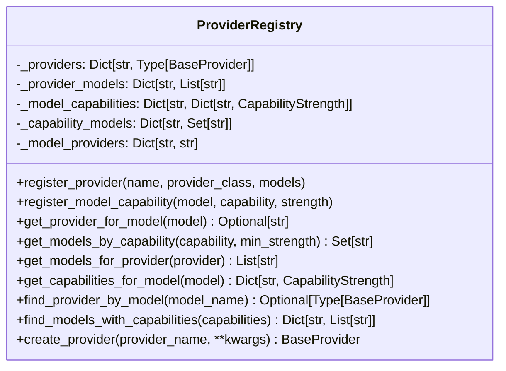

# Provider Registry

The Provider Registry is a central component of the Atlas provider system that manages relationships between providers, models, and capabilities. It enables intelligent model selection based on task requirements and capability matching.

## Architecture Overview

The Provider Registry serves as a database of all provider-model-capability relationships in the system. It implements a data-centric approach to provider and model management, explicitly modeling the relationships between these entities rather than using implicit patterns or detection rules.



## Core Data Structures

The Provider Registry contains several core data structures to model relationships:

1. **Providers Map**: Maps provider names to provider class types
   ```python
   self._providers: Dict[str, Type[BaseProvider]] = {}
   ```

2. **Provider Models Map**: Maps provider names to lists of supported models
   ```python
   self._provider_models: Dict[str, List[str]] = {}
   ```

3. **Model Capabilities Map**: Maps model names to their capabilities and strengths
   ```python
   self._model_capabilities: Dict[str, Dict[str, CapabilityStrength]] = {}
   ```

4. **Capability Models Map**: Maps capability names to the set of models with that capability
   ```python
   self._capability_models: Dict[str, Set[str]] = {}
   ```

5. **Model Providers Map**: Maps model names back to their provider
   ```python
   self._model_providers: Dict[str, str] = {}
   ```

## Registration Methods

### Provider Registration

```python
def register_provider(self, name: str, provider_class: Type[BaseProvider], models: List[str] = None):
    """Register a provider and its supported models."""
    self._providers[name] = provider_class
    if models:
        self._provider_models[name] = models
        for model in models:
            self._model_providers[model] = name
    return self  # Enable chaining
```

### Capability Registration

```python
def register_model_capability(self, model: str, capability: str, 
                             strength: CapabilityStrength = CapabilityStrength.MODERATE):
    """Register a capability for a model with optional strength."""
    if model not in self._model_capabilities:
        self._model_capabilities[model] = {}
    self._model_capabilities[model][capability] = strength
    
    if capability not in self._capability_models:
        self._capability_models[capability] = set()
    self._capability_models[capability].add(model)
    
    return self  # Enable chaining
```

## Query Methods

### Basic Queries

```python
def get_provider_for_model(self, model: str) -> Optional[str]:
    """Get provider that supports the given model."""
    return self._model_providers.get(model)

def get_models_for_provider(self, provider: str) -> List[str]:
    """Get all models supported by the provider."""
    return self._provider_models.get(provider, [])

def get_capabilities_for_model(self, model: str) -> Dict[str, CapabilityStrength]:
    """Get all capabilities of a model with their strengths."""
    return self._model_capabilities.get(model, {})
```

### Advanced Queries

```python
def get_models_by_capability(self, capability: str, 
                            min_strength: CapabilityStrength = CapabilityStrength.BASIC) -> Set[str]:
    """Get all models with the specified capability at minimum strength."""
    if capability not in self._capability_models:
        return set()
        
    models = set()
    for model in self._capability_models[capability]:
        if self._model_capabilities[model][capability] >= min_strength:
            models.add(model)
            
    return models

def find_models_with_capabilities(self, 
                                capabilities: Dict[str, CapabilityStrength]) -> Dict[str, List[str]]:
    """Find models that have all the specified capabilities at minimum strengths."""
    if not capabilities:
        return {}
    
    # Start with all models
    result_models = set(self._model_providers.keys())
    
    # Filter by capabilities and strengths
    for capability, min_strength in capabilities.items():
        qualified_models = set()
        for model in result_models:
            model_caps = self._model_capabilities.get(model, {})
            if capability in model_caps and model_caps[capability] >= min_strength:
                qualified_models.add(model)
        
        result_models = qualified_models
        if not result_models:
            return {}  # No models match all criteria
    
    # Group by provider
    result = {}
    for model in result_models:
        provider = self._model_providers.get(model)
        if provider not in result:
            result[provider] = []
        result[provider].append(model)
    
    return result
```

## Factory Methods

```python
def create_provider(self, provider_name: str, **kwargs) -> BaseProvider:
    """Create a provider instance."""
    provider_class = self._providers.get(provider_name)
    if not provider_class:
        raise ValueError(f"Unknown provider: {provider_name}")
    return provider_class(**kwargs)
```

## Helper Methods

```python
def get_all_providers(self) -> List[str]:
    """Get all registered provider names."""
    return list(self._providers.keys())
    
def get_all_models(self) -> List[str]:
    """Get all registered model names."""
    return list(self._model_providers.keys())
    
def get_all_capabilities(self) -> List[str]:
    """Get all registered capabilities."""
    return list(self._capability_models.keys())
```

## Usage Examples

### Basic Registration

```python
from atlas.providers.registry import registry
from atlas.providers.capabilities import CapabilityStrength

# Register providers with models
registry.register_provider("anthropic", AnthropicProvider, 
                          ["claude-3-opus-20240229", "claude-3-sonnet-20240229"])

registry.register_provider("openai", OpenAIProvider, 
                          ["gpt-4", "gpt-3.5-turbo"])

# Register capabilities with strengths
registry.register_model_capability("claude-3-opus-20240229", "reasoning", 
                                  CapabilityStrength.EXCEPTIONAL)
registry.register_model_capability("gpt-4", "code", 
                                  CapabilityStrength.EXCEPTIONAL)
```

### Chained Registration

```python
# Use fluent API for chained registration
registry.register_provider("anthropic", AnthropicProvider, ["claude-3-opus-20240229"]) \
        .register_model_capability("claude-3-opus-20240229", "reasoning", CapabilityStrength.EXCEPTIONAL) \
        .register_model_capability("claude-3-opus-20240229", "code", CapabilityStrength.STRONG) \
        .register_model_capability("claude-3-opus-20240229", "creative", CapabilityStrength.STRONG)
```

### Finding Models by Capability

```python
# Find all models with strong coding capability
coding_models = registry.get_models_by_capability("code", CapabilityStrength.STRONG)
print(f"Models with strong coding capability: {coding_models}")

# Find models matching multiple capability requirements
requirements = {
    "code": CapabilityStrength.STRONG,
    "reasoning": CapabilityStrength.MODERATE
}
matching_models = registry.find_models_with_capabilities(requirements)
print(f"Models matching all requirements: {matching_models}")
```

### Creating Providers

```python
# Get provider class for a model
provider_name = registry.get_provider_for_model("gpt-4")
provider = registry.create_provider(provider_name, model_name="gpt-4")

# Create provider directly
anthropic_provider = registry.create_provider("anthropic", 
                                            model_name="claude-3-opus-20240229")
```

## Benefits Over Previous Approach

The Provider Registry offers several advantages over the previous more scattered approach:

1. **Centralized Management**: All provider-model-capability relationships in one place
2. **Explicit Data Model**: Clear, explicit relationships rather than implicit patterns
3. **Runtime Extensibility**: New providers, models, and capabilities can be registered dynamically
4. **Sophisticated Queries**: Advanced filtering capabilities for finding optimal models
5. **Improved Testability**: Registry can be easily mocked for testing
6. **Type Safety**: Strong typing for all relationships

## Integration with Other Components

The Provider Registry integrates with several other components in the Atlas system:

- **Factory**: Uses registry to create provider instances
- **Capability System**: Works with registry to map task types to capability requirements
- **Task-Aware Selection**: Uses registry to find optimal models for specific tasks
- **CLI/Configuration**: Registry is populated based on configuration settings

## Future Enhancements

Planned enhancements to the Provider Registry include:

1. **Persistence**: Save and load registry state between runs
2. **Dynamic Updates**: Fetch model information from provider APIs
3. **Capability Discovery**: Automatically determine model capabilities through testing
4. **Performance Metrics**: Track model performance for different tasks
5. **Cost Optimization**: Add cost information for better provider selection