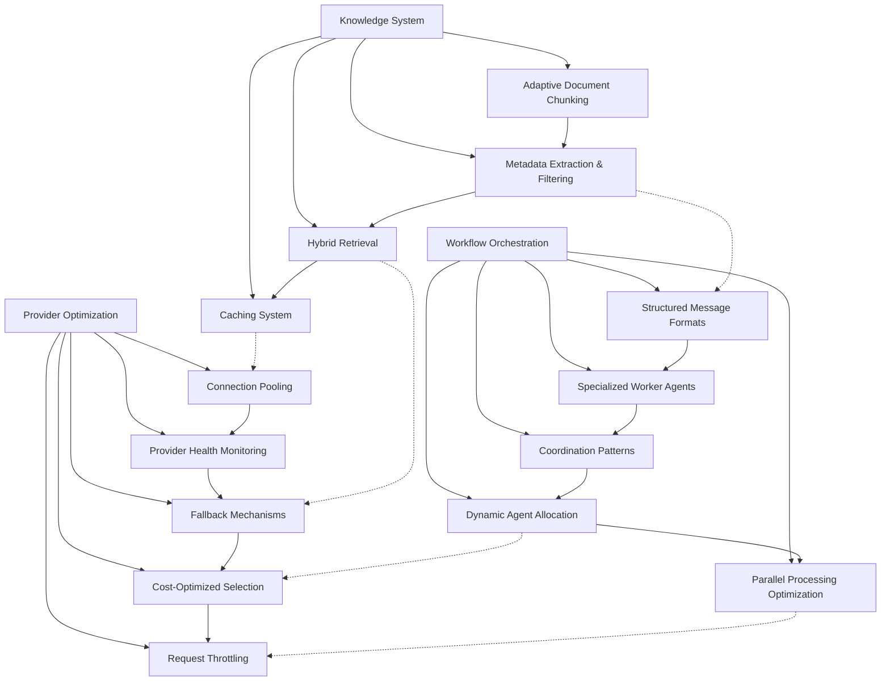

# MVP Completion Strategy - May 10, 2025

This document outlines the strategic approach for completing the Atlas MVP, focusing on the three key areas identified in the roadmap: Knowledge System Enhancements, Workflow & Multi-Agent Orchestration, and Provider Optimization.

## 1. Knowledge System Enhancements

The knowledge system is a critical component that requires significant enhancements to deliver the full value of Atlas. These enhancements focus on improving document processing, retrieval quality, and filtering capabilities.

### Adaptive Document Chunking

**Current Challenges:**
- Fixed-size chunking creates arbitrary boundaries that may split semantic units
- Inconsistent context windows across chunks reduce retrieval quality
- Different document types require different chunking strategies

**Proposed Strategy:**
1. **Semantic Boundary Detection**
   - Implement detection of section breaks, paragraphs, and other semantic units
   - Use NLP techniques to identify topical boundaries
   - Create a hierarchical chunking system that preserves semantic structure

2. **Configurable Overlap Mechanism**
   - Implement sliding window chunking with configurable overlap
   - Create metadata linking between adjacent chunks
   - Add "chain" references to connect related chunks

3. **Document Type-Specific Strategies**
   - Create specialized chunkers for different document types (markdown, code, etc.)
   - Implement plugin architecture for custom chunking strategies
   - Provide configuration options to tune chunking parameters per document type

**Implementation Plan:**
1. Create base `ChunkingStrategy` interface
2. Implement `SemanticChunker` with boundary detection
3. Add `OverlapManager` for handling chunk connections
4. Implement document-specific chunkers as plugins
5. Create factory system for selecting appropriate chunkers

**Technical Challenges:**
- Efficiently identifying semantic boundaries in various document types
- Maintaining references between chunks without excessive overhead
- Balancing chunk size for optimal retrieval performance

### Metadata Extraction and Filtering

**Current Challenges:**
- Limited metadata extraction from documents
- No standardized filtering mechanism during retrieval
- Inability to query based on document attributes

**Proposed Strategy:**
1. **Enhanced Metadata Extraction**
   - Extract structural metadata (headings, sections, etc.)
   - Identify entity information (people, organizations, etc.)
   - Create temporal markers (dates, time references)
   - Extract document classifiers (topics, categories, etc.)

2. **Standardized Metadata Schema**
   - Create a core metadata schema for all documents
   - Implement extensible metadata properties
   - Support custom metadata fields for specialized usage

3. **Query-Time Filtering**
   - Create filter expressions for metadata conditions
   - Implement boolean operators for complex filters
   - Support range queries for numeric and date metadata

**Implementation Plan:**
1. Create `MetadataExtractor` interface with pluggable extractors
2. Implement core extractors for common metadata types
3. Create `MetadataSchema` with validation
4. Implement `FilterExpression` system for retrieval queries
5. Add filtering capabilities to retrieval interface

**Technical Challenges:**
- Balancing metadata extraction depth with performance
- Creating an expressive but simple filtering language
- Efficient metadata indexing for fast filtering

### Hybrid Retrieval Mechanism

**Current Challenges:**
- Pure semantic search may miss exact keyword matches
- Lack of relevance tuning for different query types
- No re-ranking of results based on multiple factors

**Proposed Strategy:**
1. **Multi-Approach Retrieval**
   - Combine semantic embedding search with keyword/BM25 search
   - Implement configurable weights between approaches
   - Support specialized retrieval strategies for different content types

2. **Re-Ranking Pipeline**
   - Create modular re-ranking system for retrieved results
   - Implement relevance scoring algorithms
   - Support custom scoring functions for domain-specific relevance

3. **Feedback Mechanisms**
   - Add implicit relevance feedback based on user interactions
   - Implement result highlighting to explain relevance
   - Create mechanisms to refine searches based on results

**Implementation Plan:**
1. Enhance `RetrievalQuery` to support multiple search strategies
2. Create `HybridRetriever` that combines results from different methods
3. Implement `ReRankingPipeline` with pluggable rankers
4. Create `RelevanceScorer` with multiple scoring algorithms
5. Add feedback collector in query client

**Technical Challenges:**
- Efficiently combining results from different retrieval methods
- Creating meaningful ranking algorithms that generalize well
- Balancing search latency with quality improvements

### Caching System

**Current Challenges:**
- Repeated identical queries cause unnecessary computation
- No persistence of frequently retrieved results
- Inability to prioritize cache contents based on usage patterns

**Proposed Strategy:**
1. **Multi-Level Caching**
   - Implement in-memory LRU cache for hot results
   - Create disk-based cache for larger result sets
   - Support distributed caching for multi-instance deployments

2. **Intelligent Invalidation**
   - Implement document-based cache invalidation
   - Create time-based expiration for volatile content
   - Support manual cache clearing for updates

3. **Performance Optimization**
   - Implement partial query caching
   - Add cache warming for predictable queries
   - Create cache statistics for monitoring

**Implementation Plan:**
1. Create `CacheManager` interface with pluggable implementations
2. Implement `InMemoryCache` for fast access
3. Add `DiskCache` for persistence
4. Create `InvalidationStrategy` system
5. Integrate caching into retrieval pipeline

**Technical Challenges:**
- Determining appropriate cache invalidation strategies
- Managing cache size and eviction policies
- Ensuring thread safety in multi-user environments

## 2. Workflow & Multi-Agent Orchestration

Enhancing the multi-agent capabilities of Atlas is critical for solving complex problems and supporting sophisticated workflows.

### Structured Message Formats

**Current Challenges:**
- Basic message passing without rich metadata
- Lack of standardized formats for different message types
- No message validation or transformation capabilities

**Proposed Strategy:**
1. **Message Schema System**
   - Create typed message schemas for different interaction types
   - Implement message validation against schemas
   - Support format conversion between different schema versions

2. **Rich Message Content**
   - Add support for structured data in messages
   - Implement attachment capabilities for files and results
   - Create metadata envelope for message context

3. **Message Routing Enhancement**
   - Create content-based routing capabilities
   - Implement message transformation during routing
   - Add message filtering options

**Implementation Plan:**
1. Create `MessageSchema` system with validation
2. Implement core message types for different interactions
3. Add `MessageTransformer` for format conversion
4. Enhance `Edge` class with content-based routing
5. Implement message filtering system

**Technical Challenges:**
- Balancing schema flexibility with validation requirements
- Maintaining backward compatibility in message formats
- Handling large attachments efficiently

### Specialized Worker Agents

**Current Challenges:**
- Generic worker agents without specialized capabilities
- Lack of agent skill registration mechanism
- Inefficient task allocation without considering agent strengths

**Proposed Strategy:**
1. **Agent Specialization Framework**
   - Create capability registration system for agents
   - Implement skill-based agent interfaces
   - Support agent training for specialized tasks

2. **Task-Specific Agents**
   - Implement agents specialized for different domains
   - Create tool-using agents with specific capabilities
   - Support knowledge-specific agents for domain expertise

3. **Agent Selection Mechanism**
   - Create matching system between tasks and agent capabilities
   - Implement agent qualification testing
   - Support agent benchmarking for performance

**Implementation Plan:**
1. Enhance `AgentRegistry` with capability tracking
2. Create `CapabilityInterface` for agent skill definition
3. Implement specialized agent classes for common tasks
4. Create `AgentSelector` system for matching tasks to agents
5. Add benchmarking and qualification system

**Technical Challenges:**
- Creating meaningful capability definitions
- Efficiently matching tasks to appropriate agents
- Preventing overly specific agents that limit flexibility

### Coordination Patterns

**Current Challenges:**
- Limited coordination between agents
- No standards for common workflow patterns
- Lack of error recovery in multi-agent workflows

**Proposed Strategy:**
1. **Pattern Library**
   - Implement common workflow patterns (pipelines, fan-out, etc.)
   - Create coordination templates for specific tasks
   - Support pattern composition for complex workflows

2. **Coordination Middleware**
   - Create middleware for agent communication
   - Implement synchronization primitives
   - Add transaction support for multi-agent actions

3. **Error Recovery System**
   - Create retry mechanisms for failed agent actions
   - Implement compensating actions for rollbacks
   - Add monitoring points for workflow progress

**Implementation Plan:**
1. Create `WorkflowPattern` library with common patterns
2. Implement `CoordinationMiddleware` for agent communication
3. Add `SynchronizationManager` for coordinated actions
4. Create `ErrorRecovery` system with retry logic
5. Implement workflow monitoring system

**Technical Challenges:**
- Ensuring deadlock-free coordination patterns
- Creating flexible but safe error recovery mechanisms
- Maintaining monitoring without excessive overhead

### Dynamic Agent Allocation

**Current Challenges:**
- Static agent assignment to tasks
- Inefficient resource utilization across agents
- Inability to scale agent resources based on demand

**Proposed Strategy:**
1. **Task Analysis System**
   - Create task complexity estimator
   - Implement resource requirement predictor
   - Add task priority assignment

2. **Resource Management**
   - Create agent pool with dynamic scaling
   - Implement resource reservation system
   - Add load balancing across agent instances

3. **Allocation Decision Engine**
   - Create rule-based allocation engine
   - Implement machine learning-based optimization
   - Support custom allocation strategies

**Implementation Plan:**
1. Create `TaskAnalyzer` for requirement estimation
2. Implement `AgentPool` with scaling capabilities
3. Add `ResourceManager` for allocation optimization
4. Create `AllocationStrategy` interface with implementations
5. Integrate with orchestration layer

**Technical Challenges:**
- Accurately estimating task requirements
- Balancing allocation efficiency with response time
- Handling resource contention in high-load scenarios

### Parallel Processing Optimization

**Current Challenges:**
- Limited parallel execution capabilities
- No optimization for data-parallel tasks
- Inefficient resource utilization in parallel workflows

**Proposed Strategy:**
1. **Parallel Execution Patterns**
   - Implement map-reduce pattern for data parallelism
   - Create fork-join system for task parallelism
   - Support speculative execution for latency-sensitive tasks

2. **Resource Optimization**
   - Create work-stealing task scheduler
   - Implement priority-based execution queue
   - Add adaptive parallelism based on system load

3. **Result Aggregation**
   - Create customizable result merging strategies
   - Implement progressive result reporting
   - Support cancellation of unnecessary parallel tasks

**Implementation Plan:**
1. Enhance `ParallelProcessor` with execution patterns
2. Create `TaskScheduler` with work-stealing capabilities
3. Implement `ResultAggregator` with custom strategies
4. Add adaptive parallelism controller
5. Create monitoring system for parallel execution

**Technical Challenges:**
- Balancing parallelism with resource constraints
- Creating effective work distribution strategies
- Handling partial failures in parallel execution

## 3. Provider Optimization

Optimizing the provider layer is essential for performance, reliability, and cost efficiency of the Atlas framework.

### Connection Pooling

**Current Challenges:**
- New connections created for each request
- High latency for connection establishment
- Inefficient resource utilization

**Proposed Strategy:**
1. **Pool Management System**
   - Create configurable connection pool per provider
   - Implement connection lifecycle management
   - Add health checking for pooled connections

2. **Request Handling Optimization**
   - Create connection acquisition with timeout
   - Implement request queuing for pool saturation
   - Add priority-based connection allocation

3. **Resource Efficiency**
   - Implement idle connection management
   - Create pool scaling based on load
   - Add connection reuse optimization

**Implementation Plan:**
1. Create `ConnectionPool` interface with provider-specific implementations
2. Implement `PoolManager` for lifecycle control
3. Add `ConnectionHealthChecker` for validation
4. Create request queue with prioritization
5. Implement metrics collection for pool usage

**Technical Challenges:**
- Balancing pool size with resource constraints
- Ensuring thread safety for concurrent access
- Handling stale connections and reconnection

### Provider Health Monitoring

**Current Challenges:**
- Limited visibility into provider status
- No proactive health checking
- Reactive error handling only after failures

**Proposed Strategy:**
1. **Health Checking System**
   - Implement periodic health probes for providers
   - Create status dashboard for visibility
   - Add alerting for deteriorating health

2. **Performance Monitoring**
   - Track response times and success rates
   - Implement latency histograms for analysis
   - Add throughput monitoring for capacity planning

3. **Diagnostic Tools**
   - Create interactive testing tools
   - Implement detailed error analysis
   - Add provider comparison capabilities

**Implementation Plan:**
1. Create `HealthMonitor` for periodic checks
2. Implement `PerformanceTracker` for metrics collection
3. Add `AlertManager` for status notifications
4. Create dashboard visualization system
5. Implement diagnostic tooling

**Technical Challenges:**
- Balancing health check frequency with API costs
- Creating meaningful health metrics
- Avoiding false positives in health assessment

### Fallback Mechanisms

**Current Challenges:**
- Single provider for each request
- No automatic retry on failures
- Manual fallback only

**Proposed Strategy:**
1. **Retry System**
   - Create configurable retry policies
   - Implement exponential backoff with jitter
   - Add retry budgeting to prevent cascading failures

2. **Provider Fallback Chain**
   - Implement prioritized provider lists
   - Create automatic failover between providers
   - Add result verification for fallback quality

3. **Recovery Actions**
   - Create connection reset capabilities
   - Implement request transformation for alternate providers
   - Add partial result handling for degraded operation

**Implementation Plan:**
1. Create `RetryPolicy` interface with implementations
2. Implement `FallbackChain` for provider selection
3. Add `FailoverManager` for automatic switching
4. Create result verification system
5. Implement recovery action framework

**Technical Challenges:**
- Determining appropriate retry strategies
- Handling different capabilities across providers
- Maintaining consistency in fallback scenarios

### Cost-Optimized Selection

**Current Challenges:**
- No consideration of cost in provider selection
- Inefficient model choice for simple tasks
- Lack of budget control mechanisms

**Proposed Strategy:**
1. **Cost Modeling System**
   - Create comprehensive cost models per provider
   - Implement usage forecasting
   - Add budget allocation and tracking

2. **Intelligent Selection**
   - Create task complexity analyzer
   - Implement minimum-viable model selection
   - Add cost-performance optimization

3. **Budget Controls**
   - Implement budget limits and alerts
   - Create cost allocation to different tasks
   - Add usage reporting and analysis

**Implementation Plan:**
1. Enhance cost estimation with detailed models
2. Create `TaskComplexityAnalyzer` for requirements
3. Implement `ModelSelector` with cost optimization
4. Add `BudgetController` for limits and tracking
5. Create usage reporting system

**Technical Challenges:**
- Accurately estimating task complexity
- Balancing cost optimization with quality
- Creating reliable usage forecasts

### Request Throttling

**Current Challenges:**
- No rate limiting for provider APIs
- Risk of exceeding provider quotas
- Inefficient handling of backpressure

**Proposed Strategy:**
1. **Rate Limiting System**
   - Create token bucket implementation for rate control
   - Implement provider-specific rate limits
   - Add adaptive rate adjustment based on responses

2. **Queue Management**
   - Create priority queues for important requests
   - Implement fair queuing for multiple clients
   - Add request expiration for stale items

3. **Backpressure Handling**
   - Implement client-side throttling indicators
   - Create flow control mechanisms
   - Add graceful degradation under load

**Implementation Plan:**
1. Create `RateLimiter` with provider-specific configs
2. Implement `RequestQueue` with priorities
3. Add `ThrottleController` for adaptive adjustment
4. Create backpressure signaling system
5. Implement degradation strategies

**Technical Challenges:**
- Balancing throughput with API limits
- Creating fair allocation across multiple clients
- Implementing effective backpressure mechanisms

## Implementation Priorities and Dependencies

The following diagram illustrates the dependencies between components and suggested implementation order:

### Priority Implementation Sequence

Based on value delivery and dependencies, the suggested implementation sequence is:

1. **First Wave (Highest Value, Lowest Dependencies)**
   - Adaptive Document Chunking
   - Connection Pooling
   - Structured Message Formats
   - Provider Health Monitoring

2. **Second Wave (Core Enhancements)**
   - Metadata Extraction & Filtering
   - Specialized Worker Agents
   - Fallback Mechanisms
   - Caching System

3. **Third Wave (Advanced Features)**
   - Hybrid Retrieval
   - Coordination Patterns
   - Cost-Optimized Selection
   - Dynamic Agent Allocation

4. **Fourth Wave (Optimization Layer)**
   - Parallel Processing Optimization
   - Request Throttling

## Business and Competitive Analysis

### Market Positioning

With these enhancements, Atlas will be positioned as:

1. **Enterprise-Ready Knowledge Agent Framework**
   - Robust document processing pipeline
   - Enterprise-grade reliability features
   - Scalable multi-agent architecture

2. **Flexible Integration Platform**
   - Multiple provider support with unified API
   - Cross-provider capabilities
   - Cost optimization for LLM usage

3. **Customizable AI Agent System**
   - Specialized agent capabilities
   - Domain-specific knowledge integration
   - Workflow optimization for various use cases

### Competitive Differentiation

These enhancements will differentiate Atlas from competitors in several ways:

1. **VS LangChain/LlamaIndex**
   - More sophisticated multi-agent orchestration
   - Enhanced document processing pipeline
   - Better provider reliability and optimization

2. **VS Proprietary Solutions (Claude, GPT)**
   - Provider-agnostic with multi-model support
   - More control over knowledge integration
   - Customizable agent behaviors and workflows

3. **VS Simple RAG Solutions**
   - Advanced multi-stage retrieval
   - Better context handling and document processing
   - Workflow capabilities beyond basic RAG

### Go-To-Market Strategy

The MVP completion provides several potential GTM approaches:

1. **Open Source Community Adoption**
   - Target Python developers building AI applications
   - Focus on knowledge management and multi-agent capabilities
   - Build community around contribution to specialized agents

2. **Enterprise Solution Path**
   - Create enterprise-focused version with additional security
   - Offer support and customization services
   - Develop industry-specific agent templates

3. **Integration Partnership Strategy**
   - Partner with model providers for official integration
   - Create connectors for popular enterprise systems
   - Build marketplace for specialized agents and workflows

### Key Market Opportunities

The enhanced MVP opens several strategic opportunities:

1. **Knowledge Work Automation Market**
   - Document processing and retrieval for enterprises
   - Intelligent workflow automation
   - Information synthesis and analysis

2. **Developer Productivity Space**
   - Code analysis and assistance tools
   - Documentation generation and management
   - Technical support and training systems

3. **Customer Support Transformation**
   - Knowledge-base powered support agents
   - Multi-step support workflows
   - Context-aware user assistance

4. **Content Creation and Management**
   - Intelligent content organization
   - Topic-driven content generation
   - Research assistance and synthesis

## Risk Assessment

### Technical Risks

| Risk                                           | Probability | Impact | Mitigation Strategy                                             |
| ---------------------------------------------- | ----------- | ------ | --------------------------------------------------------------- |
| Performance degradation with complex retrieval | Medium      | High   | Implement performance testing early, optimize critical paths    |
| Integration challenges between components      | High        | Medium | Define clear interfaces, create comprehensive integration tests |
| API changes in dependent libraries             | Medium      | High   | Create abstraction layers, monitor changes in dependencies      |
| Scalability issues with large knowledge bases  | Medium      | High   | Conduct load testing, implement pagination and chunking         |
| Thread safety issues in concurrent operations  | High        | Medium | Use thread-safe designs, add concurrency tests                  |

### Market Risks

| Risk                                       | Probability | Impact | Mitigation Strategy                                          |
| ------------------------------------------ | ----------- | ------ | ------------------------------------------------------------ |
| Rapidly evolving competitor landscape      | High        | Medium | Focus on unique capabilities, maintain agility               |
| Changes in provider APIs and pricing       | High        | High   | Implement flexible adapters, develop multi-provider strategy |
| Shifting customer requirements             | Medium      | Medium | Create modular design, gather feedback early and often       |
| Open-source alternatives gaining traction  | Medium      | Medium | Focus on enterprise features, build community                |
| Regulatory changes affecting AI deployment | Medium      | High   | Design for compliance, implement governance features         |

### Resource Risks

| Risk                                              | Probability | Impact | Mitigation Strategy                                                      |
| ------------------------------------------------- | ----------- | ------ | ------------------------------------------------------------------------ |
| Limited development resources                     | High        | High   | Focus on highest-value components, use efficient implementation patterns |
| API cost constraints for development              | Medium      | Medium | Implement mocking, use efficient testing approaches                      |
| Technical complexity requiring specialized skills | Medium      | High   | Create knowledge-sharing sessions, develop detailed documentation        |
| Timeline pressure reducing quality                | High        | High   | Maintain test-driven approach, prioritize critical components            |
| Integration costs exceeding estimates             | Medium      | Medium | Create pilot implementations, validate approach early                    |

## Conclusion

The Atlas MVP completion strategy provides a comprehensive roadmap for enhancing the framework's capabilities in knowledge management, workflow orchestration, and provider optimization. By following this strategy, Atlas can evolve into a robust enterprise-ready framework for building sophisticated AI agent systems.

The prioritized implementation approach ensures that the highest-value components are delivered first, while maintaining awareness of dependencies and technical challenges. With careful execution of this strategy, Atlas can achieve a strong market position and deliver significant value to users.

Key success factors for implementation include:

1. **Maintaining modular architecture** throughout enhancements
2. **Focusing on test coverage** for reliability and confidence
3. **Documenting components** thoroughly as they are developed
4. **Gathering user feedback** early and continuously
5. **Monitoring performance** and making adjustments as needed

With these enhancements, Atlas will be well-positioned as a comprehensive framework for building advanced AI agent systems with strong knowledge management capabilities, sophisticated multi-agent workflows, and optimized provider integration.
