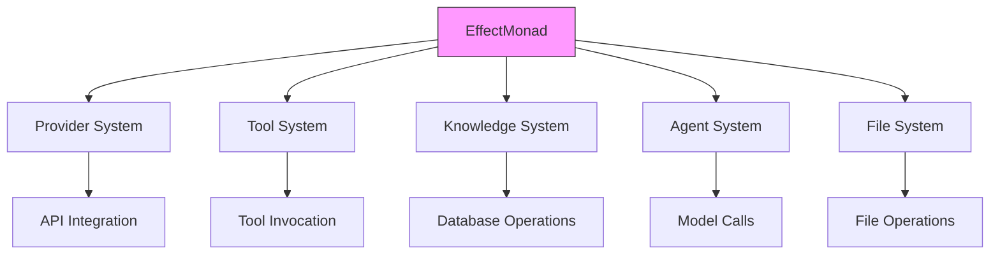

# EffectMonad Implementation

## Overview

The EffectMonad implements the Effect System pattern, providing explicit tracking and control of side effects in operations. It uses a monadic approach to encapsulate both computation results and their effects.

## Architectural Role

EffectMonad brings functional programming's safety to side effects:

- **API Integration**: Tracking external service interactions
- **IO Operations**: Making file and network operations explicit
- **Resource Management**: Explicit tracking of resource usage
- **State Mutations**: Controlled approach to state changes
- **Tool Invocation**: Explicit tracking of tool side effects

## Implementation Details

The EffectMonad implementation features:

1. **Monadic composition** for chaining operations with effects
2. **Effect tracking** for comprehensive monitoring of side effects 
3. **Effect handlers** for customizable processing of effects
4. **Effect isolation** for controlled execution and testing
5. **Pure operations** for side-effect free computation

## Key Components

- **Effect**: Dataclass describing a side effect's metadata
- **EffectType**: Enum categorizing different effect types
- **EffectHandler**: Processes effects during execution
- **EffectMonad**: Container for value and associated effects

## Implementation Library: Effect

The EffectMonad is implemented using the Python [Effect](https://github.com/python-effect/effect) library, which provides:

| Effect Library Feature | NERV Implementation |
|------------------------|---------------------|
| `Effect` base class | Extended as `AtlasEffect` for domain-specific typing |
| `TypedEffect` class | Used for strongly-typed effect variants |
| `perform()` function | Core runtime for effect execution |
| `sync_performer` decorator | For registering synchronous effect handlers |
| `async_performer` decorator | For asynchronous effect operations |
| `@do` notation | For sequential effect composition |
| `ComposedPerformer` | For building the effect handler registry |
| `TypeDispatcher` | For routing effects to appropriate handlers |
| `parallel_all()` function | For parallel effect execution |
| `retry()` function | For resilient effect processing |

The Effect library allows us to express operations as descriptions of what should happen rather than directly performing the actions. This makes code more testable, enables composition of effects, and provides a clear separation between pure business logic and effectful operations.

## Core Implementation Structure

The EffectMonad implementation consists of these key types:

```
EffectType (Enum)
  ├── FILE_READ/WRITE
  ├── API_CALL
  ├── DATABASE_QUERY  
  ├── MODEL_CALL
  ├── TOOL_INVOKE
  └── STATE_READ/MODIFY

EffectIntent (Dataclass)
  ├── type: EffectType
  ├── payload: Any
  ├── description: str
  └── metadata: Dict[str, Any]

EffectMonad[T] (Generic class)
  ├── value: T
  ├── effects: List[EffectIntent]
  ├── pure(): Creates effect-free value
  ├── with_effect(): Adds effect
  ├── map(): Transforms value
  ├── bind()/flat_map(): Chains effectful operations
  └── run(): Executes effects & returns value

EffectHandler (Class)
  ├── register_handler(): Maps effect types to handlers
  ├── handle(): Processes an effect
  ├── get_executed_effects(): Reports execution history
  └── clear_history(): Resets execution state
```

## Library-Specific Implementation Details

### Effect Library Integration

The EffectMonad leverages the Effect library's type system and execution model:

```python
from typing import TypeVar, Generic, List, Any, Optional, Callable
from effect import Effect as EffectBase, TypedEffect, sync_performer
from enum import Enum, auto

T = TypeVar('T')  # Value type

class EffectType(Enum):
    """Types of side effects in the system."""
    FILE_READ = auto()
    FILE_WRITE = auto()
    MODEL_CALL = auto()
    TOOL_INVOKE = auto()
    # Additional types...

class AtlasEffect(TypedEffect):
    """Base class for Atlas-specific typed effects."""
    def __init__(self, effect_type: EffectType, payload: Any = None, 
                 description: str = ""):
        self.effect_type = effect_type
        self.payload = payload or {}
        self.description = description
```

### Monadic Operations

The Effect library enables functional-style composition through monadic operations:

```python
class EffectMonad(Generic[T]):
    """Monadic container for tracking and controlling effects."""
    
    def __init__(self, value: T, effects: List[AtlasEffect]):
        self.value = value
        self.effects = effects
    
    @classmethod
    def pure(cls, value: T) -> 'EffectMonad[T]':
        """Create an effect-free computation."""
        return cls(value, [])
    
    def map(self, fn: Callable[[T], Any]) -> 'EffectMonad[Any]':
        """Transform the value while preserving effects."""
        # Implementation with proper type declarations
    
    def bind(self, fn: Callable[[T], 'EffectMonad[Any]']) -> 'EffectMonad[Any]':
        """Chain with another effectful operation."""
        # Implementation with proper type declarations
```

### Handler System

The Effect library enables type-based dispatch for handling different effect types:

```python
from effect import sync_performer, ComposedPerformer, TypeDispatcher

# File read effect handler
@sync_performer
def perform_file_read(dispatcher, effect):
    """Handler for file read operations."""
    path = effect.payload.get("path")
    with open(path, 'r') as f:
        return f.read()

# API call effect handler
@sync_performer
def perform_api_call(dispatcher, effect):
    """Handler for API call operations."""
    import requests
    url = effect.payload.get("url")
    method = effect.payload.get("method", "GET")
    data = effect.payload.get("data")
    return requests.request(method, url, json=data).json()
```

## Performance Considerations

The EffectMonad implementation includes optimizations for performance:

1. **Allocation Overhead Management**
   - Uses structural sharing for effect lists to minimize copying
   - Implements lazy evaluation to defer computation until needed
   - Employs thread-safe locking only when necessary

2. **Effect Batching**
   - Utilizes Effect library's `parallel_all()` for concurrent execution
   - Groups similar effects to reduce handler invocation overhead
   - Implements batched execution for parallel effect processing

3. **Handler Optimization**
   - Leverages Effect library's `TypeDispatcher` for efficient routing
   - Implements caching for repeatable effect operations
   - Provides configurable tracing with minimal overhead

4. **Memory Management**
   - Controls history growth through configurable limits
   - Implements strategic garbage collection for long-running operations
   - Provides memory-efficient effect representation

## Integration with Atlas

### Integration Architecture

The EffectMonad serves as a key integration component across Atlas's subsystems:



### Cross-Component Integration

EffectMonad enables robust integration patterns across Atlas subsystems:

- **Provider Integration**: Tracks API interactions with LLM providers
- **Tool Integration**: Logs tool invocations with parameters
- **Knowledge Integration**: Tracks document operations
- **Agent Integration**: Monitors agent actions and messages
- **File Integration**: Records file system operations

## Usage Patterns

### Do Notation for Effect Composition

The Effect library offers a powerful "do notation" for sequential composition:

```python
from effect.do import do

@do
def fetch_user_with_posts(user_id):
    """Compose multiple effects using do notation."""
    # Each yield is a separate effect operation
    user = yield get_user_effect(user_id)
    posts = yield get_posts_effect(user.id)
    return {**user, "posts": posts}
```

### Parallel Effect Execution

The Effect library supports concurrent effect execution:

```python
from effect import parallel_all

def fetch_dashboard_data(user_id):
    """Run multiple effects in parallel."""
    effects = [
        user_profile_effect(user_id),
        recent_activity_effect(user_id),
        notification_count_effect(user_id)
    ]
    # Execute all effects concurrently
    return parallel_all(effects)
```

### Error Handling

The Effect library provides clean error handling mechanisms:

```python
from effect import catch

def safe_api_call(api_url):
    """Handle errors in effectful operations."""
    # Attempt the API call effect
    return catch(
        api_call_effect(api_url),
        # Error handler for network issues
        lambda exc: EffectMonad.pure({"error": str(exc)})
    )
```

## Relationship to Patterns

Implements:
- **[Effect System](../patterns/effect_system.md)**: Primary implementation
- **[Monad Pattern](../primitives/monad.md)**: For functional composition

Supports:
- **[Reactive Event Mesh](../patterns/reactive_event_mesh.md)**: Effects can emit events
- **[Temporal Versioning](../patterns/temporal_versioning.md)**: Effect history can be versioned
- **[State Projection](../patterns/state_projection.md)**: Effects can trigger state changes
- **[Quantum Partitioning](../patterns/quantum_partitioning.md)**: Effects can be distributed