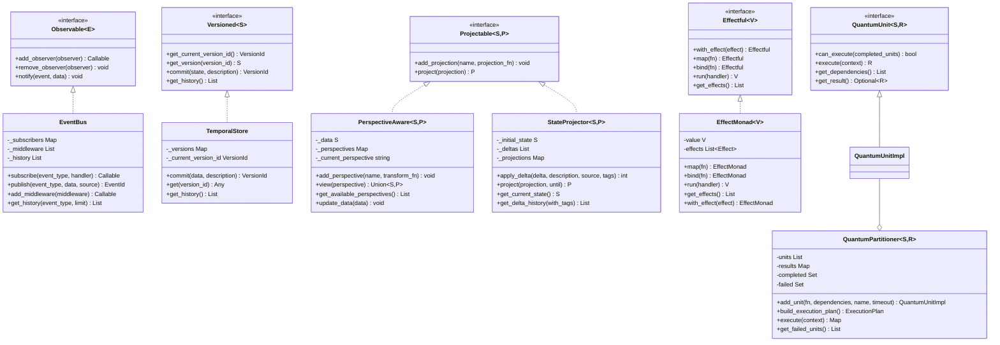

# NERV Component Implementations

This document provides an overview of the core component implementations that realize the NERV architectural patterns. These components are the concrete implementations of the architectural patterns, providing the actual functionality of the system.

## Component Overview

NERV defines six core components that implement the corresponding architectural patterns:

| Component                                    | Implements                                                  | Purpose                             |
| -------------------------------------------- | ----------------------------------------------------------- | ----------------------------------- |
| [EventBus](event_bus.md)                     | [Reactive Event Mesh](../patterns/reactive_event_mesh.md)   | Central event dispatch system       |
| [TemporalStore](temporal_store.md)           | [Temporal Versioning](../patterns/temporal_versioning.md)   | Versioned state container           |
| [PerspectiveAware](perspective_aware.md)     | [Perspective Shifting](../patterns/perspective_shifting.md) | Context-dependent views             |
| [StateProjector](state_projector.md)         | [State Projection](../patterns/state_projection.md)         | Delta-based state tracking          |
| [EffectMonad](effect_monad.md)               | [Effect System](../patterns/effect_system.md)               | Monadic effect tracking             |
| [QuantumPartitioner](quantum_partitioner.md) | [Quantum Partitioning](../patterns/quantum_partitioning.md) | Dependency-based parallel execution |

## Component Architecture

The components build upon the core interfaces defined in the patterns and implement them with concrete functionality:

## Implementation Details

Each component provides specific features and capabilities:

| Component              | Key Features                                                                          |
| ---------------------- | ------------------------------------------------------------------------------------- |
| **EventBus**           | Thread-safe event distribution, middleware pipeline, event history, typed subscribers |
| **TemporalStore**      | Complete version history, parent-child relationships, time-travel capability          |
| **PerspectiveAware**   | Multiple view transformations, dynamic perspective management, contextual views       |
| **StateProjector**     | Delta-based state tracking, efficient projections, tagged delta history               |
| **EffectMonad**        | Monadic composition, effect tracking, functional transformations                      |
| **QuantumPartitioner** | Dependency-aware scheduling, parallel execution, execution plan optimization          |

## Component Interactions

Components are designed to work together:

1. **EventBus + TemporalStore**: Events trigger state version creation
2. **TemporalStore + PerspectiveAware**: Versioned states can have multiple perspectives
3. **StateProjector + EventBus**: State changes can emit events
4. **EffectMonad + EventBus**: Effects can be emitted as events
5. **QuantumPartitioner + EventBus**: Execution status can be emitted as events
6. **StateProjector + PerspectiveAware**: State projections can be viewed through different perspectives

## Implementation Reference

All components are implemented as part of the NERV architecture, providing a unified implementation:

- **EventBus**: Core implementation of the Reactive Event Mesh pattern
- **TemporalStore**: Implementation of the Temporal Versioning pattern
- **PerspectiveAware**: Implementation of the Perspective Shifting pattern
- **StateProjector**: Implementation of the State Projection pattern
- **EffectMonad**: Implementation of the Effect System pattern
- **QuantumPartitioner**: Implementation of the Quantum Partitioning pattern

This consolidated implementation ensures consistent interaction between all components and provides a complete reference implementation of the NERV architecture.

## Composite Systems

These components are then combined into [composite systems](../composites/index.md) to create complete architectural solutions:

- [Event-Driven Architecture](../composites/event_driven_architecture.md): EventBus + EffectMonad + TemporalStore
- [Parallel Workflow Engine](../composites/parallel_workflow_engine.md): QuantumPartitioner + EventBus + StateProjector
- [Adaptive State Management](../composites/adaptive_state_management.md): TemporalStore + PerspectiveAware + StateProjector

## Learn More

Explore each component in detail:

- [EventBus](event_bus.md): Central event dispatch system
- [TemporalStore](temporal_store.md): Versioned state container
- [PerspectiveAware](perspective_aware.md): Context-dependent views
- [StateProjector](state_projector.md): Delta-based state tracking
- [EffectMonad](effect_monad.md): Monadic effect tracking
- [QuantumPartitioner](quantum_partitioner.md): Dependency-based parallel execution