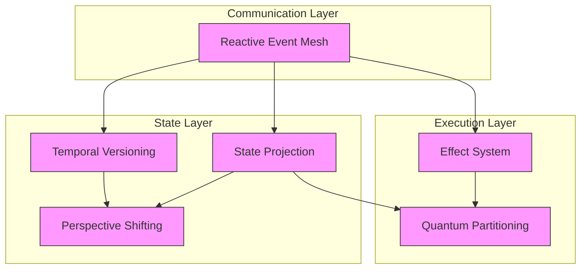
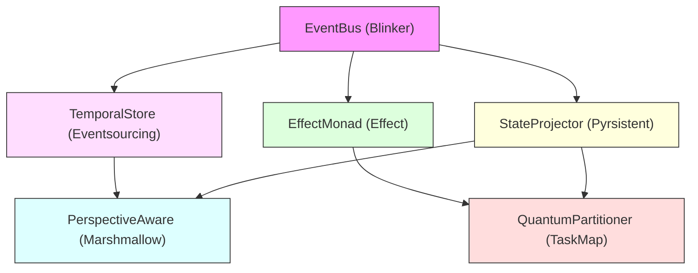

# Core Architectural Patterns

This document provides an overview of the core architectural patterns that make up the NERV architecture. These patterns build upon the [foundational design primitives](../primitives/index.md) to create powerful, composable building blocks for Atlas's core services.

## Pattern Overview

NERV defines six core architectural patterns that together create a flexible, introspectable, and composable system:

| Pattern                                         | Purpose                   | Key Implementation                                         | Library Foundation                                     |
| ----------------------------------------------- | ------------------------- | ---------------------------------------------------------- | ------------------------------------------------------ |
| [Reactive Event Mesh](reactive_event_mesh.md)   | Decoupled communication   | [EventBus](../components/event_bus.md)                     | [Blinker](https://pythonhosted.org/blinker/)           |
| [Temporal Versioning](temporal_versioning.md)   | Complete history tracking | [TemporalStore](../components/temporal_store.md)           | [Eventsourcing](https://eventsourcing.readthedocs.io/) |
| [Perspective Shifting](perspective_shifting.md) | Context-appropriate views | [PerspectiveAware](../components/perspective_aware.md)     | [Marshmallow](https://marshmallow.readthedocs.io/)     |
| [State Projection](state_projection.md)         | Efficient state evolution | [StateProjector](../components/state_projector.md)         | [Pyrsistent](https://pyrsistent.readthedocs.io/)       |
| [Effect System](effect_system.md)               | Explicit side effects     | [EffectMonad](../components/effect_monad.md)               | [Effect](https://github.com/python-effect/effect)      |
| [Quantum Partitioning](quantum_partitioning.md) | Optimal parallelism       | [QuantumPartitioner](../components/quantum_partitioner.md) | [TaskMap](https://github.com/dask/taskmap)             |

## Library Implementation

Each pattern is implemented using specific Python libraries that provide proven, robust foundations:

| Pattern                  | Primary Library | Key Features                                     | Usage in NERV                       |
| ------------------------ | --------------- | ------------------------------------------------ | ----------------------------------- |
| **Reactive Event Mesh**  | Blinker         | Signal dispatch system, lightweight, thread-safe | Event distribution and subscription |
| **Temporal Versioning**  | Eventsourcing   | Event-based persistence, temporal storage        | Historical state management         |
| **Perspective Shifting** | Marshmallow     | Schema-based validation and transformation       | Perspective-based data conversion   |
| **State Projection**     | Pyrsistent      | Immutable data structures, structural sharing    | Efficient state evolution           |
| **Effect System**        | Effect          | Monadic effect tracking, functional composition  | Explicit side effect management     |
| **Quantum Partitioning** | TaskMap         | Dependency-based execution, parallel processing  | Optimized concurrent execution      |

## Core Type Foundations

These patterns build upon foundational types and interfaces:

- [Types](types.md): Core type definitions and data classes
- [Interfaces](interfaces.md): Foundational protocol definitions
- [Boundaries](boundaries.md): System boundary concepts

## Pattern Relationships

The core patterns interact in meaningful ways:

## Key Benefits

These architectural patterns provide several key benefits:

| Pattern                  | Key Benefits                                              |
| ------------------------ | --------------------------------------------------------- |
| **Reactive Event Mesh**  | Decoupling, Observability, Extensibility                  |
| **Temporal Versioning**  | Undo/Redo, Debugging, Reproducibility                     |
| **Perspective Shifting** | Adaptability, Separation of Concerns, Multiple Views      |
| **State Projection**     | Efficiency, Consistency, Traceability                     |
| **Effect System**        | Explicit Side Effects, Composability, Testability         |
| **Quantum Partitioning** | Parallelism, Resource Optimization, Dependency Management |

## Primitive Foundations

Each pattern is built on specific [primitive design patterns](../primitives/index.md):

| NERV Pattern                                    | Primitive Composition                                                                                                 | Implementation Library |
| ----------------------------------------------- | --------------------------------------------------------------------------------------------------------------------- | ---------------------- |
| [Reactive Event Mesh](reactive_event_mesh.md)   | [Observer](../primitives/observer.md) + [Command](../primitives/command.md) + [Factory](../primitives/factory.md)     | Blinker                |
| [Temporal Versioning](temporal_versioning.md)   | [Command](../primitives/command.md) + [Decorator](../primitives/decorator.md) + [Factory](../primitives/factory.md)   | Eventsourcing          |
| [Perspective Shifting](perspective_shifting.md) | [Strategy](../primitives/strategy.md) + [Decorator](../primitives/decorator.md) + [Factory](../primitives/factory.md) | Marshmallow            |
| [State Projection](state_projection.md)         | [Command](../primitives/command.md) + [Strategy](../primitives/strategy.md) + [Builder](../primitives/builder.md)     | Pyrsistent             |
| [Effect System](effect_system.md)               | [Command](../primitives/command.md) + [Monad](../primitives/monad.md) + [Decorator](../primitives/decorator.md)       | Effect                 |
| [Quantum Partitioning](quantum_partitioning.md) | [Builder](../primitives/builder.md) + [DAG](../primitives/dag.md) + [Factory](../primitives/factory.md)               | TaskMap                |

## Components and Implementation

Each pattern has a corresponding component implementation:

- **Reactive Event Mesh**: Implemented by [EventBus](../components/event_bus.md) using Blinker
- **Temporal Versioning**: Implemented by [TemporalStore](../components/temporal_store.md) using Eventsourcing
- **Perspective Shifting**: Implemented by [PerspectiveAware](../components/perspective_aware.md) using Marshmallow
- **State Projection**: Implemented by [StateProjector](../components/state_projector.md) using Pyrsistent
- **Effect System**: Implemented by [EffectMonad](../components/effect_monad.md) using Effect
- **Quantum Partitioning**: Implemented by [QuantumPartitioner](../components/quantum_partitioner.md) using TaskMap

These components are then combined into [composite systems](../composites/index.md) to create complete architectural solutions.

## Integration Architecture

The integration between patterns and their library implementations creates a cohesive architecture:

## Learn More

Explore each pattern in detail:

- [Reactive Event Mesh](reactive_event_mesh.md): Decoupled communication with Blinker
- [Temporal Versioning](temporal_versioning.md): Complete history tracking with Eventsourcing
- [Perspective Shifting](perspective_shifting.md): Context-appropriate views with Marshmallow
- [State Projection](state_projection.md): Efficient state evolution with Pyrsistent
- [Effect System](effect_system.md): Explicit side effects with Effect
- [Quantum Partitioning](quantum_partitioning.md): Optimal parallelism with TaskMap

Or explore the foundation types:

- [Types](types.md): Core type definitions
- [Interfaces](interfaces.md): Protocol interfaces
- [Boundaries](boundaries.md): System boundaries
