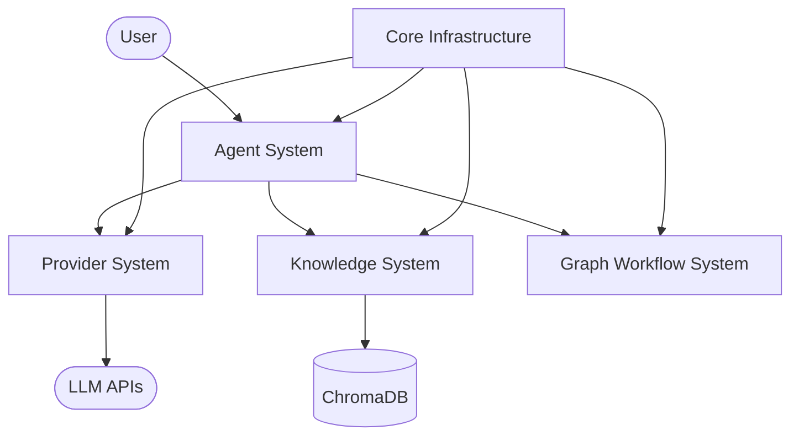
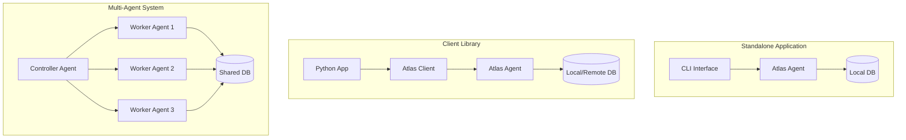

---

title: Index

---

# Atlas Architecture Overview

Atlas is a comprehensive framework for building intelligent agents with knowledge retrieval capabilities. It combines large language models with vector-based retrieval in a flexible, modular architecture that supports both simple queries and complex multi-agent workflows.

## Key Architectural Components

Atlas is built around several core architectural components that work together to provide a complete agent framework:

### 1. Agent System

The Agent System provides the primary interface for user interactions and coordinates the other components. Key features include:

- **Unified Agent Interface**: Common API across all agent types
- **Multi-Provider Support**: Compatible with Anthropic, OpenAI, and Ollama
- **Controller-Worker Pattern**: For parallel processing and specialization
- **Conversation Management**: Maintains chat history and context

### 2. Knowledge System

The Knowledge System manages document storage, retrieval, and processing. Key features include:

- **ChromaDB Integration**: Vector database for semantic search
- **Document Processing**: Chunking and embedding for efficient retrieval
- **Metadata Management**: Source tracking and document categorization
- **Relevance Ranking**: Scoring and filtering of search results

### 3. Provider System

The Provider System handles interactions with language model APIs. Key features include:

- **Provider Abstraction**: Unified interface across LLM providers
- **Provider Options**: Configuration framework with capability-based model selection
- **Streaming Support**: Real-time token-by-token responses
- **Error Handling**: Robust error recovery and retry logic
- **Auto-detection**: Automatic provider selection from model name

### 4. Graph Workflow System

The Graph Workflow System enables complex agent interactions and workflows. Key features include:

- **LangGraph Integration**: Graph-based workflow definition
- **Conditional Routing**: Dynamic decision-making and branching
- **State Management**: Tracking of workflow state and progress
- **Parallel Processing**: Concurrent execution of agent tasks

### 5. Core Infrastructure

Core Infrastructure provides foundational capabilities used by all components. Key features include:

- **Configuration Management**: Environment variables and defaults
- **Schema Validation**: Comprehensive data validation using Marshmallow schemas
- **Telemetry**: Performance monitoring and tracing
- **Error Handling**: Standardized error types and recovery
- **CLI Interface**: Command-line tools for all operations

## Architectural Principles

Atlas follows several key architectural principles:

1. **Modularity**: Components are decoupled and independently usable
2. **Extensibility**: Easy to add new providers, workflows, and capabilities
3. **Robustness**: Comprehensive error handling and recovery
4. **Transparency**: Clear visibility into operations and decisions
5. **Efficiency**: Optimal resource usage for cost-effective operation

## Deployment Model

Atlas can be deployed in several different configurations:

- **Standalone Application**: Run as a command-line tool with local database
- **Client Library**: Embedded in other Python applications
- **Multi-Agent System**: Distributed across multiple processes or machines
- **Specialized Worker**: Focused on specific tasks in a larger system

## Next Steps

- See [Components](./components.md) for detailed descriptions of each component
- See [Data Flow](./data_flow.md) for information on how data moves through Atlas
- See [Module Interaction](./module_interaction.md) for details on how modules integrate with each other
- See [Schema Validation](./schema_validation.md) for information on the schema validation architecture
