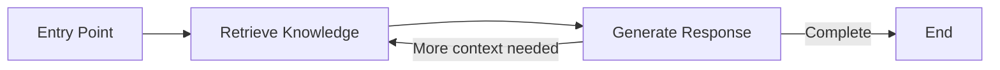
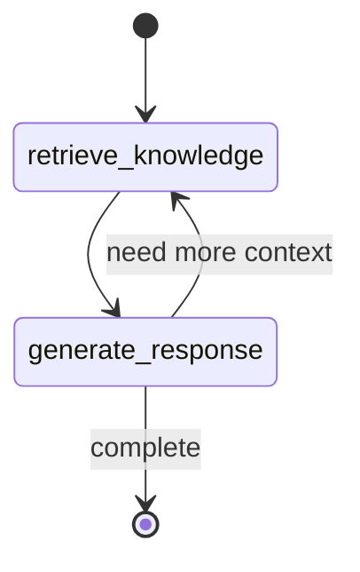
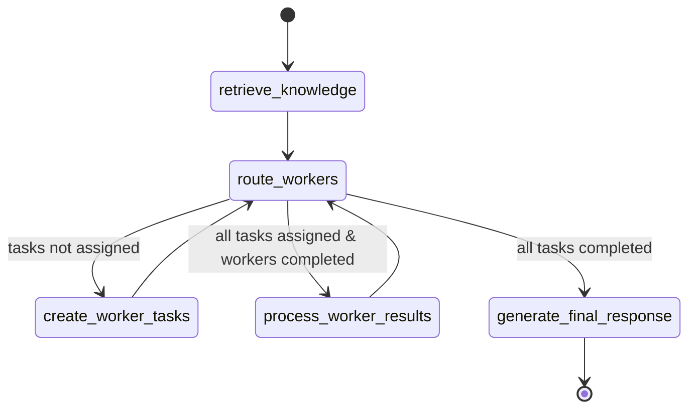

---

title: Framework Overview

---


# Graph Framework Overview

This document provides an overview of the LangGraph integration in Atlas, which powers the workflow orchestration and agent coordination.

## Introduction to LangGraph

Atlas uses [LangGraph](https://github.com/langchain-ai/langgraph), a library for building stateful, multi-actor applications with LLMs. LangGraph allows Atlas to define complex workflows as directed graphs, where:

- **Nodes** represent computational steps (like retrieving information or generating responses)
- **Edges** define the flow between steps
- **State** is managed and passed between nodes
- **Conditional routing** enables dynamic workflow decisions



## Key Components

The graph framework in Atlas consists of several key components:

### State Models

The state models define the data structure passed between nodes in the graph:

1. **AgentState**: Used for individual agents
   ```python
   class AgentState(BaseModel):
       messages: List[Message]  # Conversation history
       context: Optional[Context]  # Retrieved context information
       worker_id: Optional[str]  # ID of the current worker (if any)
       worker_results: Dict[str, Any]  # Results from worker agents
       worker_configs: List[WorkerConfig]  # Configurations for worker agents
       process_complete: bool  # Whether processing is complete
       error: Optional[str]  # Error message if any
   ```

2. **ControllerState**: Used for controller agents managing multiple workers
   ```python
   class ControllerState(BaseModel):
       messages: List[Message]  # Main conversation history
       context: Optional[Context]  # Retrieved context information
       workers: Dict[str, AgentState]  # States for all workers
       active_workers: List[str]  # Currently active worker IDs
       completed_workers: List[str]  # IDs of workers that have completed
       tasks: List[Dict[str, Any]]  # Tasks to be processed
       results: List[Dict[str, Any]]  # Results from completed tasks
   ```

### Node Functions

Node functions implement the computational steps in the workflow:

1. **retrieve_knowledge**: Queries the knowledge base for relevant documents
2. **generate_response**: Generates a response using the LLM
3. **route_to_workers**: Makes routing decisions in controller workflows
4. **create_worker_tasks**: Creates tasks for worker agents
5. **process_worker_results**: Processes results from completed worker tasks
6. **generate_final_response**: Creates the final response based on worker results

```python
def retrieve_knowledge(
    state: AgentState, config: Optional[AtlasConfig] = None
) -> AgentState:
    """Retrieve knowledge from the Atlas knowledge base."""
    # Initialize knowledge base
    kb = KnowledgeBase(collection_name=cfg.collection_name, db_path=cfg.db_path)

    # Get the query from the last user message
    # ...

    # Retrieve relevant documents
    documents = kb.retrieve(query)

    # Update state with retrieved documents
    state.context = {"documents": documents, "query": query}

    return state
```

### Workflow Graphs

The workflow graphs define how the nodes are connected:

1. **Basic RAG Graph**: A simple graph for retrieving knowledge and generating responses
2. **Controller-Worker Graph**: A more complex graph for coordinating multiple specialized workers

```python
def create_basic_rag_graph(
    system_prompt_file: Optional[str] = None, config: Optional[AtlasConfig] = None
) -> StateGraph:
    """Create a basic RAG workflow graph."""
    # Create StateGraph with AgentState
    builder = StateGraph(AgentState)

    # Add nodes
    builder.add_node("retrieve_knowledge", retrieve_knowledge)
    builder.add_node("generate_response", generate_response)

    # Define edges
    builder.add_edge("retrieve_knowledge", "generate_response")
    builder.add_conditional_edges(
        "generate_response", should_end, {True: END, False: "retrieve_knowledge"}
    )

    # Set the entry point
    builder.set_entry_point("retrieve_knowledge")

    # Compile the graph
    return builder.compile()
```

## Graph Types

Atlas implements two main types of workflow graphs:

### Basic RAG Workflow

The basic RAG (Retrieval-Augmented Generation) workflow is a simple graph that:

1. Retrieves relevant knowledge from the knowledge base
2. Generates a response using the LLM and retrieved knowledge
3. Can loop back for additional retrievals if needed



### Controller-Worker Workflow

The controller-worker workflow is a more complex graph that:

1. Retrieves initial knowledge
2. Creates tasks for specialized worker agents
3. Routes the workflow based on the state of tasks and workers
4. Processes results from completed worker tasks
5. Generates a final response integrating all worker results



## Using the Graph Framework

### Creating a Graph

```python
from atlas.graph.workflows import get_workflow_graph

# Create a basic RAG graph
rag_graph = get_workflow_graph(workflow_type="rag")

# Create a controller-worker graph
controller_graph = get_workflow_graph(workflow_type="controller")
```

### Running a Workflow

```python
from atlas.graph.workflows import run_rag_workflow, run_controller_workflow
from atlas.graph.state import AgentState, ControllerState

# Run a basic RAG workflow
query = "What is the trimodal methodology in Atlas?"
final_state = run_rag_workflow(query)

# Run a controller-worker workflow
final_state = run_controller_workflow(query)
```

### Accessing Results

```python
# Get the final response
final_response = None
for msg in reversed(final_state.messages):
    if msg["role"] == "assistant":
        final_response = msg["content"]
        break

print(final_response)

# Get worker results (from controller workflow)
if hasattr(final_state, "results"):
    for result in final_state.results:
        print(f"Worker {result['worker_id']} completed task {result['task_id']}")
        print(f"Result: {result['result'][:100]}...")
```

## Advanced Features

### Conditional Edges

LangGraph supports conditional routing based on the state:

```python
builder.add_conditional_edges(
    "route_workers",
    lambda x: x,
    {
        "generate_final_response": lambda state: state.all_tasks_completed,
        "create_worker_tasks": lambda state: not state.all_tasks_assigned,
        "process_worker_results": lambda state: (
            state.all_tasks_assigned
            and len(state.completed_workers) >= len(state.active_workers)
        ),
    },
)
```

### Parallel Processing

LangGraph supports parallel processing of nodes:

```python
# Enable parallel processing in a graph
from langgraph.graph import StateGraph, END

builder = StateGraph(AgentState)
builder.add_node("task1", task1_function)
builder.add_node("task2", task2_function)
builder.add_node("task3", task3_function)
builder.add_node("combine_results", combine_results_function)

# Add parallel edges
builder.add_edge("entry", "task1")
builder.add_edge("entry", "task2")
builder.add_edge("entry", "task3")
builder.add_edge("task1", "combine_results")
builder.add_edge("task2", "combine_results")
builder.add_edge("task3", "combine_results")
builder.add_edge("combine_results", END)
```

## Customizing the Graph Framework

### Creating Custom Nodes

You can create custom node functions for specialized processing:

```python
def custom_node_function(state: AgentState) -> AgentState:
    """Custom node function for specialized processing."""
    # Implement custom logic
    return state
```

### Creating Custom Workflows

You can create custom workflow graphs by defining new node functions and connections:

```python
def create_custom_workflow_graph(
    system_prompt_file: Optional[str] = None, config: Optional[AtlasConfig] = None
) -> StateGraph:
    """Create a custom workflow graph."""
    # Create StateGraph with appropriate state model
    builder = StateGraph(AgentState)

    # Add nodes and define their functions
    builder.add_node("custom_node1", custom_node_function1)
    builder.add_node("custom_node2", custom_node_function2)

    # Define edges
    builder.add_edge("custom_node1", "custom_node2")
    builder.add_edge("custom_node2", END)

    # Set the entry point
    builder.set_entry_point("custom_node1")

    # Compile the graph
    return builder.compile()
```

## Performance Considerations

When using the graph framework:

1. **State Size**: Keep the state objects reasonably sized to prevent memory issues
2. **Node Complexity**: Complex node functions can slow down the workflow
3. **Graph Depth**: Deep graphs with many nodes can increase response latency
4. **Conditional Logic**: Complex conditional routing can be hard to debug
5. **Parallel Processing**: Use parallel processing for independent tasks, but be aware of resource constraints

## Related Documentation

- [Multi-Agent Workflow](../../workflows/multi_agent.md) - Detailed information about the multi-agent workflow
- [Controller Agent](../agents/controller.md) - Documentation on the controller agent implementation
- [Worker Agents](../agents/workers.md) - Documentation on the worker agent implementations
