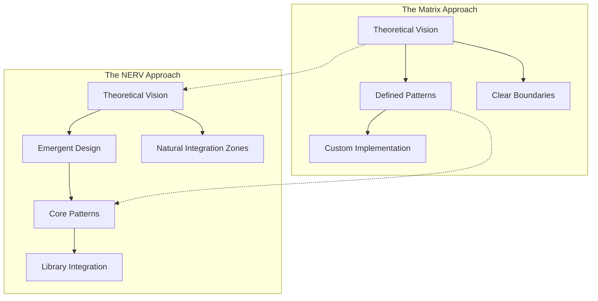

# Evolution from The Matrix to NERV Architecture

This document traces the evolutionary path from the original "Matrix" architecture to the refined "NERV" (Neural Extended Runtime Verifier) architecture, highlighting key shifts in approach, implementation strategy, and architectural maturity.

## Origin Story

The Matrix architecture was initially conceived as a framework for representing complex interdependencies in Atlas's core systems. It provided a conceptual foundation for thinking about multi-dimensional relationships between components, but had several limitations:

1. **Abstract Without Implementation** - While conceptually powerful, The Matrix lacked concrete implementation details
2. **Limited Component Integration** - The relationships between framework components weren't explicitly defined
3. **Insufficient Practical Examples** - Few examples demonstrated how Matrix concepts solved real-world problems
4. **Monolithic Architecture** - The Matrix was presented as a unified whole rather than composable parts

NERV emerged as a practical evolution of these concepts, preserving the core architectural vision while addressing these limitations through concrete implementation and enhanced composability.

## 1. Philosophical Evolution

| Aspect              | The Matrix                                                                       | NERV                                                                                 |
| ------------------- | -------------------------------------------------------------------------------- | ------------------------------------------------------------------------------------ |
| **Core Focus**      | Meta-framework with introspection, composition, and reconfiguration capabilities | Same vision but with greater emphasis on practical implementation                    |
| **Design Approach** | Defined architectural patterns as theoretical concepts                           | Added explicit "Emergent Design Approach" embracing adaptation and flexibility       |
| **Boundaries**      | Emphasized clear component boundaries and interfaces                             | Introduced "natural integration zones" where strict boundaries are counterproductive |
| **Implementation**  | Presented as a visionary architecture with theoretical implementation            | Emphasizes pragmatic library selection and evolutionary adaptation                   |

The key philosophical shift is from a more prescriptive architecture to one that explicitly embraces emergence and adaptation, recognizing that real-world systems often blur theoretical boundaries.



### Principles Preserved

1. **Explicit Over Implicit** - Both architectures prioritize making behaviors and dependencies explicit
2. **Composition Over Inheritance** - Component composition remains the primary means of building complex behaviors
3. **Immutability By Default** - Both favor immutable data structures with explicit state transitions
4. **Introspection First** - Deep introspection capabilities remain central to both designs

### New Principles Added in NERV

1. **Temporal Awareness** - Explicit history tracking and time-based operations
2. **Quantum Partitioning** - Optimized parallel execution with explicit dependencies
3. **Effect Isolation** - Side effects are separated from pure computations
4. **Perspective Fluidity** - Context-specific projections of the same underlying data

## 2. Structural Evolution

| Aspect             | The Matrix                                    | NERV                                                                              |
| ------------------ | --------------------------------------------- | --------------------------------------------------------------------------------- |
| **Organization**   | Organized around patterns and implementations | Organized in clear layers: Primitives → Patterns → Components → Composite Systems |
| **Implementation** | Less explicit about implementation libraries  | Explicitly links each pattern to specific implementation libraries                |
| **Foundation**     | Started with patterns as the base unit        | Adds "primitives" layer (foundational design patterns) beneath patterns           |
| **Composition**    | Limited guidance on component composition     | Introduces "composite systems" layer showing how components combine               |

This represents a maturation from theoretical architecture to practical implementation guide with clearer organization and composition strategy.

```
┌─────────────────────────────────────────┐      ┌─────────────────────────────────────────┐
│            MATRIX ARCHITECTURE          │      │            NERV ARCHITECTURE            │
│                                         │      │                                         │
│              ┌─────────────┐            │      │ ┌─────────────┐       ┌─────────────┐  │
│              │  Dependency │            │      │ │   Event     │◄─────►│   Effect    │  │
│              │     Grid    │            │      │ │   System    │       │   System    │  │
│              └─────────────┘            │      │ └─────────────┘       └─────────────┘  │
│                     ▲                   │      │        ▲                    ▲           │
│                     │                   │      │        │                    │           │
│                     ▼                   │      │        ▼                    ▼           │
│ ┌─────────────┐  ┌─────────────┐       │      │ ┌─────────────┐       ┌─────────────┐  │
│ │   State     │  │    View     │       │      │ │   State     │◄─────►│ Perspective │  │
│ │  Tracking   │◄►│ Projection  │       │      │ │   System    │       │   System    │  │
│ └─────────────┘  └─────────────┘       │      │ └─────────────┘       └─────────────┘  │
│       ▲                 ▲              │      │        ▲                    ▲           │
│       │                 │              │      │        │                    │           │
│       ▼                 ▼              │      │        ▼                    ▼           │
│ ┌─────────────┐  ┌─────────────┐       │      │ ┌─────────────┐       ┌─────────────┐  │
│ │  Parallel   │  │    Side     │       │      │ │  Execution  │◄─────►│  Boundary   │  │
│ │ Processing  │◄►│   Effects   │       │      │ │   System    │       │   System    │  │
│ └─────────────┘  └─────────────┘       │      │ └─────────────┘       └─────────────┘  │
│                                         │      │                                         │
└─────────────────────────────────────────┘      └─────────────────────────────────────────┘
   Unified Theoretical Framework                  Compositional Implementation Framework
```

## 3. Implementation Specificity

| Pattern                       | The Matrix                     | NERV                                                                                     |
| ----------------------------- | ------------------------------ | ---------------------------------------------------------------------------------------- |
| **Reactive Event Mesh**       | Custom implementation examples | Explicit use of [Blinker](https://pythonhosted.org/blinker/) for EventBus                |
| **Temporal Versioning**       | Custom implementation examples | Explicit use of [Eventsourcing](https://eventsourcing.readthedocs.io/) for TemporalStore |
| **Perspective Shifting**      | Custom implementation examples | Explicit use of [Marshmallow](https://marshmallow.readthedocs.io/) for PerspectiveAware  |
| **State Projection**          | Custom implementation examples | Explicit use of [Pyrsistent](https://pyrsistent.readthedocs.io/) for StateProjector      |
| **Effect System**             | Custom implementation examples | Explicit use of [Effect](https://github.com/python-effect/effect) for EffectMonad        |
| **Quantum Partitioning**      | Custom implementation examples | Explicit use of [TaskMap](https://github.com/dask/taskmap) for QuantumPartitioner        |
| **New: Aspect Orientation**   | Not explicitly covered         | Introduced with [AspectLib](https://github.com/src-d/python-aspectl)                     |
| **New: Dependency Inversion** | Not explicitly covered         | Introduced with [Dependency Injector](https://python-dependency-injector.ets-labs.org/)  |

This shift introduces a more pragmatic approach, leveraging existing libraries rather than reinventing components, adding implementation guidance for real-world constraints.

## 4. Architectural Pattern Evolution

### Core Patterns Alignment

Both architectures maintain the same six core patterns:

1. **Reactive Event Mesh**: Decoupled communication between components
2. **Temporal Versioning**: Complete history tracking of state changes
3. **Perspective Shifting**: Context-appropriate views of data
4. **State Projection**: Efficient state evolution through deltas
5. **Effect Systems**: Explicit tracking of side effects
6. **Quantum Partitioning**: Dependency-based parallel execution

The consistency of these patterns validates their architectural relevance and stability.

### Core Concept Evolution

The following table shows how key Matrix concepts evolved into NERV implementations:

| Matrix Concept         | NERV Evolution                     | Key Improvements                                         |
| ---------------------- | ---------------------------------- | -------------------------------------------------------- |
| Dependency Grid        | EventBus + QuantumPartitioner      | Explicit execution ordering with decoupled communication |
| State Snapshots        | TemporalStore + StateProjector     | Both coarse and fine-grained state management            |
| View Transformations   | PerspectiveAware                   | Context-specific projections with dynamic updates        |
| Side Effect Management | EffectMonad + EffectHandler        | Explicit effect tracking with centralized handling       |
| Concurrent Processing  | QuantumPartitioner + ExecutionPlan | Optimized parallel execution with dependency graphs      |

### New Patterns and Considerations in NERV

NERV enhances the architecture with:

1. **Aspect Orientation**: Managing cross-cutting concerns systematically
2. **Dependency Inversion**: Component wiring and composition
3. **Natural Integration Zones**:
   - State-Event Continuum: Where state management and event systems blend
   - Execution-Dependency Fabric: Where task execution and component wiring interweave
   - Perspective-Synchronization Mesh: Where data transformation and synchronization overlap
   - Effect-Aspect Continuum: Where side effect management and cross-cutting concerns merge

These additions reflect a more mature understanding of how architectural patterns interact in practice.

## 5. Visual Documentation Evolution

| Aspect                      | The Matrix                                          | NERV                                                          |
| --------------------------- | --------------------------------------------------- | ------------------------------------------------------------- |
| **Diagrams**                | ASCII diagrams for system boundaries and interfaces | More sophisticated Mermaid diagrams showing relationships     |
| **Component Visualization** | Basic illustrations of connections                  | Clearer visualization of integration architecture             |
| **Library Integration**     | Limited visualization of implementation             | Better visualization of how libraries integrate with patterns |
| **Hierarchy**               | Flat representation of components                   | Shows hierarchical relationships between layers               |

The visualization has evolved to be more comprehensive, educational, and useful for understanding the architecture.

## 6. Integration and Cohesion

| Aspect                     | The Matrix                                   | NERV                                                            |
| -------------------------- | -------------------------------------------- | --------------------------------------------------------------- |
| **Component Interaction**  | Components described largely in isolation    | Defines "Composite Systems" that combine components             |
| **System Integration**     | Limited guidance on system-level interaction | Adds "Pattern Integration" section showing pattern combinations |
| **Boundary Understanding** | Clear boundaries between patterns            | Introduces "Natural Integration Zones" where patterns blend     |

This represents a significant shift toward recognizing how patterns interact in realistic systems, moving from isolated patterns to an integrated architectural system.

## 7. Usage Examples and Documentation

| Aspect                      | The Matrix                        | NERV                                                         |
| --------------------------- | --------------------------------- | ------------------------------------------------------------ |
| **Description Style**       | Theoretical descriptions and code | Detailed cheatsheet with practical usage guidance            |
| **Examples**                | Limited usage examples            | Concrete examples for each component and integrated examples |
| **Implementation Guidance** | Focus on what components do       | Clear documentation on implementation strategy and phasing   |

The documentation has evolved from theoretical explanation to practical usage guidance that developers can directly apply.

### From Theory to Practice

The Matrix provided a theoretical foundation that NERV enhances with practical components. Here are specific examples of how Matrix concepts translate to NERV implementations:

#### Dependency Management Example

**Matrix Approach (Theoretical):**
```
Dependencies represented as abstract matrix relationships:
   Component A → Component B → Component C
```

**NERV Implementation (Practical):**
```python
# Explicit dependency management with QuantumPartitioner
partitioner = QuantumPartitioner()
unit_A = partitioner.add_unit(component_A_function, name="ComponentA")
unit_B = partitioner.add_unit(component_B_function, dependencies=[unit_A], name="ComponentB")
unit_C = partitioner.add_unit(component_C_function, dependencies=[unit_B], name="ComponentC")

# Execute with dependencies respected
results = partitioner.execute(context)
```

#### State Management Example

**Matrix Approach (Theoretical):**
```
State changes tracked through transitions:
   State₁ → State₂ → State₃
```

**NERV Implementation (Practical):**
```python
# Combining granular changes with milestone versions
store = TemporalStore()  # For milestone versions
projector = StateProjector(initial_state)  # For granular changes

# Apply fine-grained changes
delta_id1 = projector.apply_delta(delta1, "Small change 1")
delta_id2 = projector.apply_delta(delta2, "Small change 2")

# Create milestone snapshot
current_state = projector.get_current_state()
version_id = store.commit(current_state, "Major milestone version")
```

#### View Projections Example

**Matrix Approach (Theoretical):**
```
Different views projected from same data:
   Data → View₁ (User perspective)
   Data → View₂ (Admin perspective)
```

**NERV Implementation (Practical):**
```python
# Multiple perspectives of the same data
data = {"users": [{"id": 1, "name": "Alice", "email": "alice@example.com", "role": "admin"}]}
multi_view = PerspectiveAware(data)

# Add different projections
multi_view.add_perspective("public", lambda d: {
    "users": [{"id": u["id"], "name": u["name"]} for u in d["users"]]
})
multi_view.add_perspective("admin", lambda d: d)  # Full access

# Get role-specific views
public_view = multi_view.view("public")  # Limited information
admin_view = multi_view.view("admin")    # Complete information
```

## 8. Performance and Implementation Considerations

| Aspect                      | The Matrix                        | NERV                                                          |
| --------------------------- | --------------------------------- | ------------------------------------------------------------- |
| **Performance Focus**       | Limited discussion of performance | Detailed "Performance Considerations" for each component      |
| **Implementation Guidance** | Minimal guidance on choices       | Specific implementation advice for each library integration   |
| **Optimization**            | Focus on functional correctness   | Strategies for caching, lazy loading, and structural sharing  |
| **Resource Management**     | Limited consideration             | Explicit consideration of resource constraints and efficiency |

This shows increased maturity and focus on real-world implementation constraints and optimization opportunities.

## 9. Evolutionary Implementation Strategy

| Aspect                      | The Matrix                           | NERV                                                              |
| --------------------------- | ------------------------------------ | ----------------------------------------------------------------- |
| **Implementation Approach** | Implied "all at once" implementation | Defines clear four-phase implementation strategy                  |
| **Sequencing**              | Less clarity on implementation order | Clearly prioritized implementation sequence                       |
| **Adoption**                | Monolithic architecture adoption     | Emphasizes evolutionary adoption of patterns                      |
| **Complexity Management**   | Uniform complexity across components | Advocates starting simple and increasing sophistication as needed |

The four-phase NERV implementation strategy:

1. **Phase 1: Core Component Definition**
   - Define protocols and type system
   - Implement cross-cutting concerns with AspectLib
   - Set up event infrastructure with Blinker

2. **Phase 2: State and Effect Management**
   - Implement TemporalStore with Eventsourcing
   - Create StateProjector with Pyrsistent
   - Add effect tracking with Effect

3. **Phase 3: Perspective and Synchronization**
   - Implement PerspectiveAware with Marshmallow
   - Create DiffSynchronizer with DiffSync
   - Integrate perspectives with state projections

4. **Phase 4: Parallelism and Integration**
   - Implement QuantumPartitioner with TaskMap
   - Create Container with Dependency Injector
   - Assemble composite systems from components

This represents a shift toward pragmatic, incremental implementation that prioritizes core functionality and adds sophistication progressively.

## Integration With Atlas Systems

The NERV architecture is designed to integrate seamlessly with existing Atlas components, enhancing their capabilities:

1. **Provider System Integration**
   - TemporalStore provides versioned provider configurations
   - EffectSystem tracks provider side effects explicitly
   - QuantumPartitioner enables parallel provider operations
   - EventBus facilitates decoupled provider communication

2. **Agent System Integration**
   - PerspectiveAware enables context-specific agent views
   - StateProjector manages incremental agent state changes
   - EffectSystem isolates tool invocations and external actions
   - QuantumPartitioner optimizes parallel agent operations

3. **Knowledge System Integration**
   - TemporalStore provides versioned document management
   - PerspectiveAware enables role-based knowledge filtering
   - StateProjector manages incremental knowledge updates
   - EventBus facilitates knowledge change notifications

## Real-World Application Examples

These examples demonstrate how NERV solves practical problems that were challenging to address with the theoretical Matrix approach:

### 1. Document Management System

A document management system requires fine-grained change tracking with milestone versions:

```python
# Create versioning components
bus = EventBus()
store = TemporalStore()
projector = StateProjector({"documents": []})

# Register event handlers
def on_document_change(event):
    delta = event.data.get("delta")
    projector.apply_delta(delta, description=event.data.get("description", ""))

    # If major change, create a temporal store snapshot
    if event.data.get("major_change", False):
        store.commit(projector.get_current_state(),
                   description=event.data.get("description", ""))

bus.subscribe(EventType.DOCUMENT_PROCESSED, on_document_change)

# Usage example
def edit_document(doc_id, new_content, is_major=False):
    # Create a delta for this change
    def edit_document_delta(state):
        new_state = copy.deepcopy(state)
        for doc in new_state["documents"]:
            if doc["id"] == doc_id:
                doc["content"] = new_content
                doc["updated_at"] = time.time()
                break
        return new_state

    # Publish the change event
    bus.publish(
        EventType.DOCUMENT_PROCESSED,
        data={
            "delta": edit_document_delta,
            "description": f"Edit document: {doc_id}",
            "major_change": is_major
        },
        source="document_editor"
    )
```

### 2. Parallel Provider Execution with Fallbacks

A robust query system needs to try multiple providers in parallel with fallbacks:

```python
# Initialize components
effect_handler = EffectHandler()
partitioner = QuantumPartitioner()

# Define provider operation
def create_provider_unit(provider_config):
    def provider_operation(context):
        return EffectMonad.pure(provider_config) \
            .with_effect(Effect(
                EffectType.NETWORK_REQUEST,
                {"url": provider_config["endpoint"]}
            )) \
            .with_effect(Effect(
                EffectType.MODEL_CALL,
                {"model": provider_config["model"], "content": context["prompt"]}
            )) \
            .run(effect_handler.handle)

    return partitioner.add_unit(
        provider_operation,
        name=f"Provider-{provider_config['name']}",
        timeout=provider_config.get("timeout", 10.0)
    )

# Create units for multiple providers
provider_units = [
    create_provider_unit({"name": "primary", "endpoint": "https://api.provider1.com", "model": "gpt-4"}),
    create_provider_unit({"name": "backup", "endpoint": "https://api.provider2.com", "model": "claude-3"}),
    create_provider_unit({"name": "fallback", "endpoint": "https://api.provider3.com", "model": "local-model"})
]

# Collection unit for results
result_collector = partitioner.add_unit(
    lambda ctx: next(filter(None, ctx.get("provider_results", {}).values()), None),
    dependencies=provider_units,
    name="ResultCollector"
)

# Execute with parallelism and fallbacks
results = partitioner.execute({"prompt": "Tell me about NERV"})
final_result = results.get(result_collector.id)
```

## Conclusion: Key Evolution Themes

The evolution from Matrix to NERV reflects several key themes in architectural maturity:

1. **From Theory to Practice**: Evolution from a theoretical architecture to a pragmatic implementation guide

2. **Leveraging Existing Technologies**: Shift from custom implementations to integration with proven libraries

3. **Embracing Emergence**: Movement from prescriptive architecture to emergent design that adapts to actual usage

4. **Better Integration Understanding**: Improved recognition of how patterns combine and natural integration zones

5. **Practical Incremental Adoption**: Clear phasing strategy rather than monolithic implementation

6. **Enhanced Documentation**: More comprehensive examples, visualizations, and usage guidance

7. **Performance Awareness**: Greater focus on optimization and resource management

While the core architectural patterns remain consistent, NERV represents a more mature, practical evolution of the Matrix vision, with greater emphasis on real-world implementation and integration. This evolution demonstrates a deepening understanding of how theoretical patterns translate to effective real-world systems.
