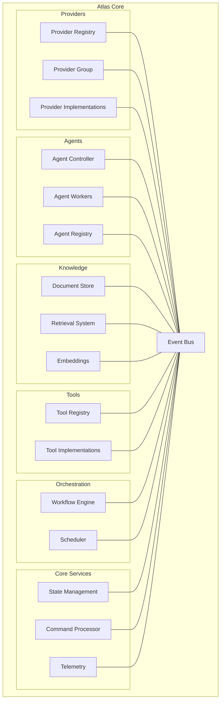
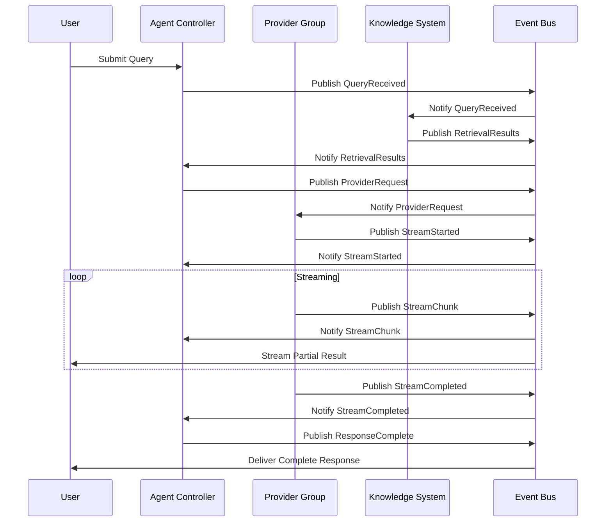

---

title: Events

---


# Event Bus Architecture and Event Flow

## Event Bus Architecture

The event bus is the central nervous system connecting all components. This visualization shows how different modules connect through the event bus.



## Event Flow Visualization

This diagram shows how events flow through the system during a typical operation.



## Component Interaction Sequence

### Network Boundary Interaction Example

```
┌────────┐          ┌───────────────┐       ┌───────────────┐       ┌─────────────┐
│ Client │          │ NetworkBoundr.│       │ BusinessLogic │       │ Repository  │
└───┬────┘          └───────┬───────┘       └───────┬───────┘       └──────┬──────┘
    │                        │                      │                      │
    │  RawApiRequest         │                      │                      │
    │─────────────────────────>                     │                      │
    │                        │                      │                      │
    │                        │  Validate            │                      │
    │                        │──────┐               │                      │
    │                        │      │               │                      │
    │                        │<─────┘               │                      │
    │                        │                      │                      │
    │                        │  ValidatedRequest    │                      │
    │                        │─────────────────────>│                      │
    │                        │                      │                      │
    │                        │                      │  DatabaseQuery       │
    │                        │                      │─────────────────────>│
    │                        │                      │                      │
    │                        │                      │  QueryResult         │
    │                        │                      │<─────────────────────│
    │                        │                      │                      │
    │                        │  DomainObject        │                      │
    │                        │<─────────────────────│                      │
    │                        │                      │                      │
    │                        │  Transform           │                      │
    │                        │──────┐               │                      │
    │                        │      │               │                      │
    │                        │<─────┘               │                      │
    │                        │                      │                      │
    │  ApiResponse           │                      │                      │
    │<─────────────────────────                     │                      │
    │                        │                      │                      │
```

## Event Types

The system defines various event types to classify different kinds of events. These event types help with event routing, filtering, and handling:

```python
class EventType(Enum):
    """Core event types in the system."""
    # System lifecycle events
    SYSTEM_INIT = auto()
    SYSTEM_SHUTDOWN = auto()

    # Provider events
    PROVIDER_CREATED = auto()
    PROVIDER_CONNECTED = auto()
    PROVIDER_DISCONNECTED = auto()
    PROVIDER_ERROR = auto()

    # Agent events
    AGENT_CREATED = auto()
    AGENT_STARTED = auto()
    AGENT_STOPPED = auto()
    AGENT_ERROR = auto()

    # Stream events
    STREAM_STARTED = auto()
    STREAM_CHUNK = auto()
    STREAM_PAUSED = auto()
    STREAM_RESUMED = auto()
    STREAM_COMPLETED = auto()
    STREAM_ERROR = auto()

    # Workflow events
    WORKFLOW_STARTED = auto()
    WORKFLOW_NODE_ENTERED = auto()
    WORKFLOW_NODE_EXITED = auto()
    WORKFLOW_COMPLETED = auto()
    WORKFLOW_ERROR = auto()

    # Knowledge events
    DOCUMENT_ADDED = auto()
    DOCUMENT_PROCESSED = auto()
    RETRIEVAL_STARTED = auto()
    RETRIEVAL_COMPLETED = auto()

    # Command events
    COMMAND_EXECUTED = auto()
    COMMAND_REVERTED = auto()
    COMMAND_FAILED = auto()
```
