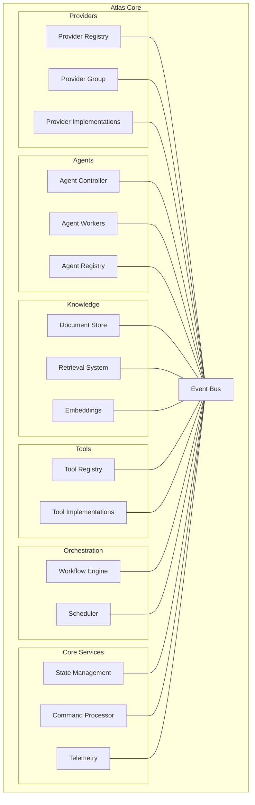
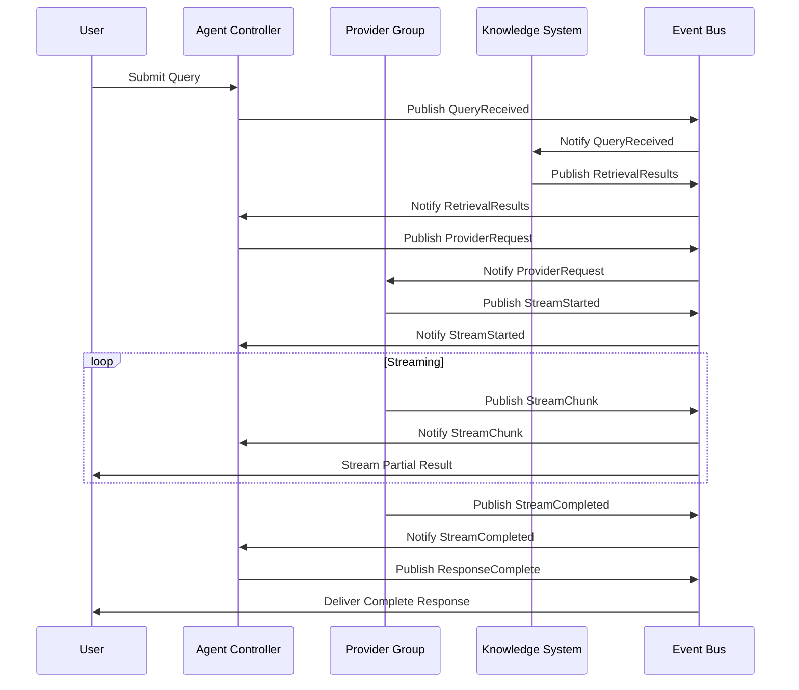
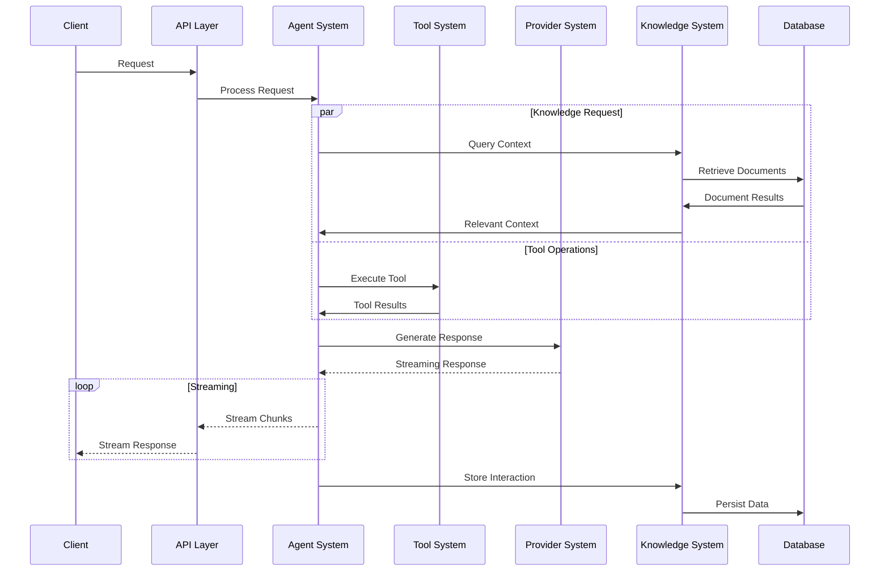

# The Matrix: Core Services Architecture

This document outlines the visionary architecture for Atlas's core services - a meta-framework that provides deep introspection, composition, and dynamic reconfiguration capabilities. While some elements will be implemented in the current development cycle, others represent future possibilities that align with the long-term vision.

## Type System & Core Primitives

The Matrix architecture is built on a foundation of clearly defined types that represent the fundamental building blocks of our system. These primitives serve both as documentation and as runtime guidance through Python's type system.

### Type Registry & System Boundaries

This registry establishes naming conventions, definitions, and relationships for all types in the system, with special attention to system boundaries where data transitions from external to internal representations.

#### System Boundaries

System boundaries are interfaces where data crosses between controlled and uncontrolled domains. Each boundary requires explicit typing, validation, and error handling:

| Boundary Type      | Description                                     | Entry Point            | Exit Point               | Validation                             |
| ------------------ | ----------------------------------------------- | ---------------------- | ------------------------ | -------------------------------------- |
| **Network API**    | HTTP/HTTPS communication with external services | `NetworkRequest[T_in]` | `NetworkResponse[T_out]` | Schema validation, response parsing    |
| **File System**    | Reading/writing files                           | `FileReadRequest`      | `FileContent[T]`         | Format validation, content parsing     |
| **Database**       | Data storage and retrieval                      | `QueryRequest[T]`      | `QueryResult[T]`         | Schema validation, constraint checking |
| **User Input**     | Commands or data from user                      | `UserInputData`        | `ValidatedCommand`       | Type conversion, constraint checking   |
| **Model Provider** | LLM API integration                             | `ModelRequest`         | `ModelResponse`          | Schema validation, content filtering   |

Each boundary enforces:
1. **Explicit Typing**: Clear input/output types with no implicit `Any`
2. **Validation**: Converting untrusted → validated data
3. **Error Handling**: Dedicated error types for boundary failures
4. **Telemetry**: Logging crossing events for observability

```
External                  │                  Internal
                          │
                          │
Raw JSON ────────────────►│───► Validated DTO ───► Domain Model
                          │
HTTP Response ◄───────────│◄─── Typed Request ◄─── Business Logic
                          │
                          │
```

#### Naming Conventions

| Prefix/Suffix       | Purpose                                 | Examples                                 |
| ------------------- | --------------------------------------- | ---------------------------------------- |
| `T`, `S`, `R`, etc. | Generic type parameters                 | `Generic[T]`, `Callable[[S], R]`         |
| `Raw` prefix        | Unvalidated external data               | `RawUserInput`, `RawApiResponse`         |
| `Dto` suffix        | Data Transfer Objects                   | `UserDto`, `ConfigurationDto`            |
| `Id` suffix         | Unique identifiers                      | `EntityId`, `VersionId`                  |
| `Aware` suffix      | Classes with a specific capability      | `PerspectiveAware`, `EventAware`         |
| `Handler` suffix    | Components that process events/requests | `EffectHandler`, `StreamHandler`         |
| `Manager` suffix    | Components that coordinate resources    | `ResourceManager`, `ConnectionManager`   |
| `Provider` suffix   | Sources of data or services             | `ModelProvider`, `StorageProvider`       |
| `Factory` suffix    | Components that create other components | `StreamFactory`, `EntityFactory`         |
| `Repository` suffix | Components that store/retrieve entities | `EntityRepository`, `DocumentRepository` |
| `State` suffix      | Represents a component state            | `UnitState`, `StreamState`               |
| `Result` suffix     | Output of an operation                  | `UnitResult`, `QueryResult`              |
| `Delta` suffix      | Represents a change to be applied       | `FunctionDelta`, `PatchDelta`            |
| `Error` suffix      | Error types                             | `ValidationError`, `NetworkError`        |

#### Core Type Definitions

| Category       | Type Name             | Definition                                  | Used For                             |
| -------------- | --------------------- | ------------------------------------------- | ------------------------------------ |
| **Identity**   | `EntityId`            | `str` identifier for any entity             | Component identification, reference  |
| **Identity**   | `VersionId`           | `str` identifier for a versioned state      | Version tracking, history navigation |
| **Identity**   | `ResourceId`          | `str` identifier for a managed resource     | Resource lifecycle management        |
| **Identity**   | `EventId`             | `str` identifier for an event               | Event correlation, deduplication     |
| **Events**     | `EventType`           | `Enum` classification of system events      | Event routing, filtering             |
| **Events**     | `Event[T]`            | `@dataclass` with event data and metadata   | Event transmission, history          |
| **State**      | `LifecycleState`      | `Enum` of component lifecycle stages        | Component state management           |
| **State**      | `StreamState`         | `Enum` of streaming operation states        | Stream control, monitoring           |
| **Effects**    | `EffectType`          | `Enum` classification of side effects       | Effect tracking, handling            |
| **Effects**    | `Effect`              | `@dataclass` declaration of a side effect   | Effect system, traceability          |
| **Resources**  | `ResourceType`        | `Enum` classification of system resources   | Resource management                  |
| **Resources**  | `Resource`            | `@dataclass` managed system resource        | Resource lifecycle tracking          |
| **Execution**  | `UnitState`           | `Enum` of computation unit states           | Execution tracking                   |
| **Execution**  | `UnitResult[R]`       | `@dataclass` result of a computation unit   | Result aggregation, error handling   |
| **Network**    | `NetworkRequest[T]`   | `@dataclass` wrapper for outgoing requests  | Network boundary input               |
| **Network**    | `NetworkResponse[T]`  | `@dataclass` wrapper for incoming responses | Network boundary output              |
| **Validation** | `ValidationResult[T]` | `@dataclass` validated data or errors       | Input validation                     |
| **Errors**     | `BoundaryError`       | Base class for system boundary errors       | Error classification                 |

#### Core Interface and Protocol Definitions

```python
# Core protocol interfaces that define behaviors
class Observable(Protocol[E]):
    """Interface for objects that emit events."""
    def add_observer(self, observer: Callable[[E, Any], None]) -> Callable[[], None]: ...
    def remove_observer(self, observer: Callable[[E, Any], None]) -> None: ...
    def notify(self, event: E, data: Any = None) -> None: ...

class Versioned(Protocol[S]):
    """Interface for objects with versioned state."""
    def get_current_version_id(self) -> VersionId: ...
    def get_version(self, version_id: Optional[VersionId] = None) -> S: ...
    def commit(self, state: S, description: str = "") -> VersionId: ...
    def get_history(self) -> List[Tuple[VersionId, S, str, float]]: ...

class Projectable(Protocol[S, P]):
    """Interface for objects that can be projected into different views."""
    def add_projection(self, name: str, projection_fn: Callable[[S], P]) -> None: ...
    def project(self, projection: str = "default") -> P: ...

class Effectful(Protocol[V]):
    """Interface for operations with explicit side effects."""
    def with_effect(self, effect: Effect) -> 'Effectful[V]': ...
    def map(self, fn: Callable[[V], Any]) -> 'Effectful[Any]': ...
    def bind(self, fn: Callable[[V], 'Effectful[Any]']) -> 'Effectful[Any]': ...
    def run(self, handler: Callable[[Effect], Any]) -> V: ...

class QuantumUnit(Protocol[S, R]):
    """Interface for parallelizable computation units."""
    def can_execute(self, completed_units: Set[Any]) -> bool: ...
    def execute(self, context: S) -> R: ...
    def get_dependencies(self) -> List[Any]: ...
    def get_result(self) -> Optional[R]: ...

class Boundary(Protocol[T_in, T_out]):
    """Interface for system boundaries that convert between domains."""
    def validate(self, data: T_in) -> ValidationResult[T_out]: ...
    def process(self, data: T_in) -> T_out: ...
    def handle_error(self, error: Exception) -> BoundaryError: ...
```

#### Core Error Hierarchy

```python
class AtlasError(Exception):
    """Base class for all Atlas errors."""
    def __init__(self, message: str, details: Optional[Dict[str, Any]] = None):
        self.message = message
        self.details = details or {}
        super().__init__(message)

class BoundaryError(AtlasError):
    """Error that occurs at system boundaries."""
    def __init__(self, message: str, boundary: str, details: Optional[Dict[str, Any]] = None):
        self.boundary = boundary
        super().__init__(message, details)

class ValidationError(BoundaryError):
    """Error during data validation at a boundary."""
    def __init__(self, message: str, boundary: str, validation_errors: List[Dict[str, Any]]):
        self.validation_errors = validation_errors
        super().__init__(message, boundary, {"validation_errors": validation_errors})

class NetworkError(BoundaryError):
    """Error during network operations at a boundary."""
    def __init__(self, message: str, status_code: Optional[int] = None,
                 response: Optional[Any] = None):
        self.status_code = status_code
        self.response = response
        super().__init__(message, "network", {
            "status_code": status_code,
            "response": str(response)[:1000] if response else None
        })
```

#### Core Interface Hierarchy

```
Observable[E]
├── EventEmitter         # Emits typed events
├── StateContainer       # Contains observable state
└── ResourceProvider     # Provides observable resources

Versioned[S]
├── TemporalStore        # Stores complete version history
└── VersionedEntity      # Entity with version history

Projectable[S, P]
├── PerspectiveAware     # Multiple views of same data
└── StateProjector       # Projects state through transformations

Effectful[V]
├── EffectMonad          # Tracks effects in computation chains
└── EffectfulOperation   # Operations with explicit effects

QuantumUnit[S, R]
├── ComputeUnit          # Basic computation unit
└── TransformUnit        # Data transformation unit

Boundary[T_in, T_out]
├── NetworkBoundary      # HTTP/API boundaries
├── FileBoundary         # File system boundaries
├── DatabaseBoundary     # Database access boundaries
└── UserInterfaceBoundary # User input boundaries
```

#### Component Interaction Sequence Diagram

**Example: Network Boundary Interaction**

```
┌────────┐          ┌───────────────┐       ┌───────────────┐       ┌─────────────┐
│ Client │          │ NetworkBoundr.│       │ BusinessLogic │       │ Repository  │
└───┬────┘          └───────┬───────┘       └───────┬───────┘       └──────┬──────┘
    │                        │                      │                      │
    │  RawApiRequest         │                      │                      │
    │─────────────────────────>                     │                      │
    │                        │                      │                      │
    │                        │  Validate            │                      │
    │                        │──────┐               │                      │
    │                        │      │               │                      │
    │                        │<─────┘               │                      │
    │                        │                      │                      │
    │                        │  ValidatedRequest    │                      │
    │                        │─────────────────────>│                      │
    │                        │                      │                      │
    │                        │                      │  DatabaseQuery       │
    │                        │                      │─────────────────────>│
    │                        │                      │                      │
    │                        │                      │  QueryResult         │
    │                        │                      │<─────────────────────│
    │                        │                      │                      │
    │                        │  DomainObject        │                      │
    │                        │<─────────────────────│                      │
    │                        │                      │                      │
    │                        │  Transform           │                      │
    │                        │──────┐               │                      │
    │                        │      │               │                      │
    │                        │<─────┘               │                      │
    │                        │                      │                      │
    │  ApiResponse           │                      │                      │
    │<─────────────────────────                     │                      │
    │                        │                      │                      │
```

```python
from typing import TypeVar, Generic, Protocol, Callable, Dict, List, Any, Optional, Union, Set, Tuple
from dataclasses import dataclass, field
from enum import Enum, auto
from datetime import datetime
import uuid
import copy
import time
import threading
import queue
from collections import defaultdict
from abc import ABC, abstractmethod

# Core type variables for generic definitions
T = TypeVar('T')  # Generic data type
S = TypeVar('S')  # Generic state type
R = TypeVar('R')  # Generic result type
E = TypeVar('E')  # Generic event type
V = TypeVar('V')  # Generic value type
P = TypeVar('P')  # Generic perspective type
K = TypeVar('K')  # Generic key type
C = TypeVar('C')  # Generic context type
M = TypeVar('M')  # Generic message type

# Identity and Reference Types
EntityId = str  # Unique identifier for any entity in the system
VersionId = str  # Unique identifier for a versioned state
ResourceId = str  # Identifier for a resource
EventId = str  # Identifier for an event

# Event System Types
class EventType(Enum):
    """Core event types in the system."""
    # System lifecycle events
    SYSTEM_INIT = auto()
    SYSTEM_SHUTDOWN = auto()

    # Provider events
    PROVIDER_CREATED = auto()
    PROVIDER_CONNECTED = auto()
    PROVIDER_DISCONNECTED = auto()
    PROVIDER_ERROR = auto()

    # Agent events
    AGENT_CREATED = auto()
    AGENT_STARTED = auto()
    AGENT_STOPPED = auto()
    AGENT_ERROR = auto()

    # Stream events
    STREAM_STARTED = auto()
    STREAM_CHUNK = auto()
    STREAM_PAUSED = auto()
    STREAM_RESUMED = auto()
    STREAM_COMPLETED = auto()
    STREAM_ERROR = auto()

    # Workflow events
    WORKFLOW_STARTED = auto()
    WORKFLOW_NODE_ENTERED = auto()
    WORKFLOW_NODE_EXITED = auto()
    WORKFLOW_COMPLETED = auto()
    WORKFLOW_ERROR = auto()

    # Knowledge events
    DOCUMENT_ADDED = auto()
    DOCUMENT_PROCESSED = auto()
    RETRIEVAL_STARTED = auto()
    RETRIEVAL_COMPLETED = auto()

    # Command events
    COMMAND_EXECUTED = auto()
    COMMAND_REVERTED = auto()
    COMMAND_FAILED = auto()

@dataclass
class Event(Generic[T]):
    """Core event structure for the event bus."""
    id: EventId = field(default_factory=lambda: str(uuid.uuid4()))
    type: EventType
    data: Optional[T] = None
    timestamp: float = field(default_factory=time.time)
    source: Optional[EntityId] = None

# Effect System Types
class EffectType(Enum):
    """Types of side effects in the system."""
    # I/O effects
    FILE_READ = auto()
    FILE_WRITE = auto()
    NETWORK_REQUEST = auto()
    DATABASE_QUERY = auto()

    # State effects
    STATE_READ = auto()
    STATE_MODIFY = auto()

    # System effects
    THREAD_CREATE = auto()
    PROCESS_SPAWN = auto()
    RESOURCE_ALLOCATE = auto()
    RESOURCE_RELEASE = auto()

    # External effects
    MODEL_CALL = auto()
    TOOL_INVOKE = auto()
    EXTERNAL_SERVICE = auto()

@dataclass
class Effect:
    """Representation of a side effect."""
    type: EffectType
    payload: Any = None
    description: str = ""

# Lifecycle State Types
class LifecycleState(Enum):
    """Lifecycle states for stateful components."""
    CREATED = auto()
    INITIALIZING = auto()
    READY = auto()
    ACTIVE = auto()
    PAUSED = auto()
    STOPPING = auto()
    STOPPED = auto()
    ERROR = auto()
    DISPOSED = auto()

# Stream Control Types
class StreamState(Enum):
    """States for streaming operations."""
    PENDING = auto()
    ACTIVE = auto()
    PAUSED = auto()
    COMPLETED = auto()
    CANCELLED = auto()
    ERROR = auto()

# Resource Management Types
class ResourceType(Enum):
    """Types of managed resources."""
    CONNECTION = auto()
    FILE = auto()
    THREAD = auto()
    PROCESS = auto()
    SOCKET = auto()
    DATABASE = auto()
    MODEL = auto()

@dataclass
class Resource:
    """Representation of a managed resource."""
    id: ResourceId
    type: ResourceType
    state: LifecycleState = LifecycleState.CREATED
    created_at: float = field(default_factory=time.time)
    metadata: Dict[str, Any] = field(default_factory=dict)

# Core Interfaces
class Observable(Protocol[E]):
    """Interface for objects that can be observed."""
    def add_observer(self, observer: Callable[[E, Any], None]) -> Callable[[], None]: ...
    def remove_observer(self, observer: Callable[[E, Any], None]) -> None: ...
    def notify(self, event: E, data: Any = None) -> None: ...

class Versioned(Protocol[S]):
    """Interface for objects with versioned state."""
    def get_current_version_id(self) -> VersionId: ...
    def get_version(self, version_id: Optional[VersionId] = None) -> S: ...
    def commit(self, state: S, description: str = "") -> VersionId: ...
    def get_history(self) -> List[Tuple[VersionId, S, str, float]]: ...

class Projectable(Protocol[S, P]):
    """Interface for objects that can be projected into different views."""
    def add_projection(self, name: str, projection_fn: Callable[[S], P]) -> None: ...
    def project(self, projection: str = "default") -> P: ...

class Effectful(Protocol[V]):
    """Interface for operations with explicit side effects."""
    def with_effect(self, effect: Effect) -> 'Effectful[V]': ...
    def map(self, fn: Callable[[V], Any]) -> 'Effectful[Any]': ...
    def bind(self, fn: Callable[[V], 'Effectful[Any]']) -> 'Effectful[Any]': ...
    def run(self, handler: Callable[[Effect], Any]) -> V: ...

class QuantumUnit(Protocol[S, R]):
    """Interface for parallelizable computation units."""
    def can_execute(self, completed_units: Set[Any]) -> bool: ...
    def execute(self, context: S) -> R: ...
    def get_dependencies(self) -> List[Any]: ...
    def get_result(self) -> Optional[R]: ...
```

This type system establishes the core primitives and provides a foundation for implementing the architectural patterns described below.

## Core Concepts

### Reactive Event Mesh

The Reactive Event Mesh forms the "nervous system" of Atlas, allowing components to communicate without direct coupling.

#### Concept

Rather than connecting components through direct method calls, the event mesh creates a decentralized communication layer where:

1. Components emit events without knowledge of subscribers
2. Components subscribe to events without knowledge of publishers
3. Events can be observed, filtered, transformed, and composed

#### Implementation Approach

```python
class EventBus:
    """Central event dispatch system for the Reactive Event Mesh."""

    def __init__(self):
        self._subscribers: Dict[EventType, List[Callable[[Event[Any]], None]]] = defaultdict(list)
        self._middleware: List[Callable[[Event[Any]], Optional[Event[Any]]]] = []
        self._history: List[Event[Any]] = []
        self._history_limit: int = 1000
        self._lock: threading.RLock = threading.RLock()

    def subscribe(self, event_type: EventType, handler: Callable[[Event[Any]], None]) -> Callable[[], None]:
        """Subscribe to events of a specific type.

        Args:
            event_type: Type of events to subscribe to
            handler: Callback function to handle events

        Returns:
            A function that can be called to unsubscribe
        """
        with self._lock:
            self._subscribers[event_type].append(handler)

        def unsubscribe():
            with self._lock:
                if handler in self._subscribers[event_type]:
                    self._subscribers[event_type].remove(handler)

        return unsubscribe

    def publish(self, event_type: EventType, data: Any = None, source: Optional[EntityId] = None) -> EventId:
        """Publish an event to all subscribers.

        Args:
            event_type: Type of event to publish
            data: Data payload for the event
            source: Identifier for the event source

        Returns:
            The ID of the published event
        """
        event = Event(type=event_type, data=data, source=source)

        with self._lock:
            # Apply middleware
            current_event = event
            for middleware in self._middleware:
                current_event = middleware(current_event)
                if current_event is None:
                    return event.id  # Event filtered out

            # Save to history
            self._history.append(current_event)
            if len(self._history) > self._history_limit:
                self._history = self._history[-self._history_limit:]

            # Notify subscribers
            for handler in self._subscribers.get(event_type, []):
                try:
                    handler(current_event)
                except Exception as e:
                    # In a real implementation, log this error
                    pass

        return event.id

    def add_middleware(self, middleware: Callable[[Event[Any]], Optional[Event[Any]]]) -> Callable[[], None]:
        """Add middleware to process events before they reach subscribers.

        Args:
            middleware: Function that transforms events or filters them out

        Returns:
            A function that can be called to remove the middleware
        """
        with self._lock:
            self._middleware.append(middleware)

        def remove_middleware():
            with self._lock:
                if middleware in self._middleware:
                    self._middleware.remove(middleware)

        return remove_middleware

    def get_history(self, event_type: Optional[EventType] = None, limit: int = 100) -> List[Event[Any]]:
        """Get recent events from the history.

        Args:
            event_type: Optional filter for specific event types
            limit: Maximum number of events to return

        Returns:
            List of recent events, most recent first
        """
        with self._lock:
            if event_type is None:
                return list(reversed(self._history))[:limit]
            else:
                return list(reversed([e for e in self._history if e.type == event_type]))[:limit]
```

#### Benefits for Atlas

- **Decoupling**: Components can evolve independently
- **Observability**: Events can be logged, analyzed, and replayed
- **Extensibility**: New components can integrate by subscribing to existing events
- **Testing**: Components can be tested in isolation with simulated events

### Temporal Versioning

Temporal versioning treats every state change as immutable, creating a timeline of system states rather than mutations.

#### Concept

Instead of modifying objects in place, each change creates a new version with:

1. A unique identifier
2. The delta from the previous version
3. Metadata about the cause of the change
4. Temporal relationship to other versions

#### Implementation Approach

```python
@dataclass
class VersionedState:
    version_id: str
    data: Any
    parent_version_id: Optional[str] = None
    timestamp: float = field(default_factory=time.time)
    change_description: str = ""

class TemporalStore:
    def __init__(self):
        self._versions = {}
        self._current_version_id = None

    def commit(self, data, description=""):
        version_id = str(uuid.uuid4())
        version = VersionedState(
            version_id=version_id,
            data=copy.deepcopy(data),
            parent_version_id=self._current_version_id,
            change_description=description
        )
        self._versions[version_id] = version
        self._current_version_id = version_id
        return version_id

    def get(self, version_id=None):
        if version_id is None:
            version_id = self._current_version_id
        return self._versions[version_id].data

    def get_history(self):
        # Return full version history
        history = []
        version_id = self._current_version_id
        while version_id:
            version = self._versions[version_id]
            history.append(version)
            version_id = version.parent_version_id
        return list(reversed(history))
```

#### Benefits for Atlas

- **Time Travel**: Inspect and revert to any previous system state
- **Auditing**: Every change is documented with its cause
- **Analysis**: Track how state evolves over time
- **Concurrency**: Simplifies concurrent operations by avoiding shared mutable state

### Perspective Shifting

Perspective shifting allows components to adapt their abstraction level dynamically based on the observer's needs.

#### Concept

Components provide multiple interfaces or views based on:

1. The observer's role or permissions
2. The required level of detail
3. The current context or operation
4. The stage in the processing pipeline

#### Implementation Approach

```python
class PerspectiveAware(Generic[S, P]):
    """A class that provides multiple views of the same data based on context.

    This implementation supports dynamic shifting between different abstraction
    levels or viewpoints on the same underlying data.
    """

    def __init__(self, data: S):
        """Initialize with the raw data and empty perspectives map.

        Args:
            data: The raw data to provide perspectives on
        """
        self._data: S = data
        self._perspectives: Dict[str, Callable[[S], P]] = {}
        self._current_perspective: str = "default"
        self._lock: threading.RLock = threading.RLock()

    def add_perspective(self, name: str, transform_fn: Callable[[S], P]) -> None:
        """Add a new perspective transformation function.

        Args:
            name: The name of the perspective
            transform_fn: Function that transforms data to this perspective
        """
        with self._lock:
            self._perspectives[name] = transform_fn

    def remove_perspective(self, name: str) -> bool:
        """Remove a perspective transformation.

        Args:
            name: The name of the perspective to remove

        Returns:
            True if the perspective was removed, False if it wasn't found
        """
        with self._lock:
            if name in self._perspectives:
                del self._perspectives[name]
                if self._current_perspective == name:
                    self._current_perspective = "default"
                return True
            return False

    def set_default_perspective(self, name: str) -> None:
        """Set the current default perspective.

        Args:
            name: Name of the perspective to use as default

        Raises:
            ValueError: If the perspective doesn't exist
        """
        with self._lock:
            if name not in self._perspectives and name != "default":
                raise ValueError(f"Perspective '{name}' not found")
            self._current_perspective = name

    def view(self, perspective: Optional[str] = None) -> Union[S, P]:
        """View the data through a specific perspective.

        Args:
            perspective: Name of the perspective to use,
                         or None to use the current default

        Returns:
            The transformed data, or raw data if perspective not found
        """
        with self._lock:
            perspective = perspective or self._current_perspective

            if perspective in self._perspectives:
                return self._perspectives[perspective](self._data)

            # Fall back to raw data
            return self._data

    def get_available_perspectives(self) -> List[str]:
        """Get the names of all available perspectives.

        Returns:
            List of perspective names
        """
        with self._lock:
            return list(self._perspectives.keys())

    def update_data(self, data: S) -> None:
        """Update the underlying data without changing perspectives.

        Args:
            data: New data to use
        """
        with self._lock:
            self._data = data
```

#### Benefits for Atlas

- **Simplified Interfaces**: Present only relevant information for each use case
- **Progressive Disclosure**: Reveal complexity gradually as needed
- **Adaptable Views**: Transform data based on context
- **Separation of Concerns**: Keep raw data separate from presentation logic

### State Projection

State projection stores minimal deltas and projection functions rather than complete states.

#### Concept

Instead of storing the full state at each change:

1. Store the initial state and subsequent changes (deltas)
2. Apply projection functions to construct any desired view of the state
3. Allow different projections for different use cases

#### Implementation Approach

```python
class Delta(Generic[S]):
    """Represents a change to be applied to a state."""

    @staticmethod
    def function_delta(fn: Callable[[S], S]) -> 'Delta[S]':
        """Create a delta from a function that transforms state.

        Args:
            fn: Function that takes state and returns modified state

        Returns:
            A new Delta instance
        """
        return FunctionDelta(fn)

    @staticmethod
    def patch_delta(patch: Dict[str, Any]) -> 'Delta[S]':
        """Create a delta from a dictionary patch.

        Args:
            patch: Dictionary of updates to apply to state

        Returns:
            A new Delta instance
        """
        return PatchDelta(patch)

    @abstractmethod
    def apply(self, state: S) -> S:
        """Apply this delta to a state.

        Args:
            state: The state to update

        Returns:
            The updated state
        """
        pass

class FunctionDelta(Delta[S]):
    """A delta represented by a function that transforms state."""

    def __init__(self, fn: Callable[[S], S]):
        self.fn = fn

    def apply(self, state: S) -> S:
        return self.fn(state)

class PatchDelta(Delta[S]):
    """A delta represented by a dictionary patch."""

    def __init__(self, patch: Dict[str, Any]):
        self.patch = patch

    def apply(self, state: S) -> S:
        if not isinstance(state, dict):
            raise TypeError("PatchDelta can only be applied to dict-like states")
        return {**state, **self.patch}

@dataclass
class DeltaMetadata:
    """Metadata about a delta change."""
    timestamp: float = field(default_factory=time.time)
    source: Optional[EntityId] = None
    description: str = ""
    tags: List[str] = field(default_factory=list)

class StateProjector(Generic[S, P]):
    """Manages state through deltas and supports multiple projections.

    This class implements a space-efficient approach to state management by
    storing only the initial state and subsequent changes (deltas), then
    applying projection functions to provide different views.
    """

    def __init__(self, initial_state: S):
        """Initialize with initial state.

        Args:
            initial_state: The initial state
        """
        self._initial_state: S = copy.deepcopy(initial_state)
        self._deltas: List[Tuple[Delta[S], DeltaMetadata]] = []
        self._projections: Dict[str, Callable[[S], P]] = {}
        self._lock: threading.RLock = threading.RLock()

    def apply_delta(self, delta: Union[Delta[S], Dict[str, Any], Callable[[S], S]],
                    description: str = "",
                    source: Optional[EntityId] = None,
                    tags: Optional[List[str]] = None) -> int:
        """Apply a delta to the state.

        Args:
            delta: The delta to apply (Delta object, dict patch or function)
            description: Description of the change
            source: Source of the change
            tags: Optional tags for categorizing the change

        Returns:
            Index of the newly added delta
        """
        with self._lock:
            # Convert to Delta if needed
            if not isinstance(delta, Delta):
                if callable(delta):
                    delta = Delta.function_delta(delta)
                else:
                    delta = Delta.patch_delta(delta)

            # Create metadata
            metadata = DeltaMetadata(
                description=description,
                source=source,
                tags=tags or []
            )

            # Store delta with metadata
            self._deltas.append((delta, metadata))
            return len(self._deltas) - 1

    def add_projection(self, name: str, projection_fn: Callable[[S], P]) -> None:
        """Add a new projection function.

        Args:
            name: Name of the projection
            projection_fn: Function that transforms state into projection
        """
        with self._lock:
            self._projections[name] = projection_fn

    def project(self, projection: str = "default", until: Optional[int] = None) -> P:
        """Project the current state through a specific projection.

        Args:
            projection: Name of the projection to use
            until: Optional index to stop applying deltas at

        Returns:
            The projected state

        Raises:
            ValueError: If projection doesn't exist
        """
        with self._lock:
            # Validate projection
            if projection not in self._projections:
                raise ValueError(f"Projection '{projection}' not found")

            # Compute current state
            state = copy.deepcopy(self._initial_state)
            deltas = self._deltas if until is None else self._deltas[:until]

            # Apply deltas sequentially
            for delta, _ in deltas:
                state = delta.apply(state)

            # Apply projection
            return self._projections[projection](state)

    def get_current_state(self) -> S:
        """Get the current state without any projection.

        Returns:
            The current state
        """
        with self._lock:
            # Compute current state
            state = copy.deepcopy(self._initial_state)

            # Apply all deltas
            for delta, _ in self._deltas:
                state = delta.apply(state)

            return state

    def get_delta_history(self, with_tags: Optional[List[str]] = None) -> List[Tuple[int, DeltaMetadata]]:
        """Get history of changes with their metadata.

        Args:
            with_tags: Optional filter to include only deltas with specific tags

        Returns:
            List of (index, metadata) pairs
        """
        with self._lock:
            if with_tags is None:
                return [(i, meta) for i, (_, meta) in enumerate(self._deltas)]
            else:
                return [
                    (i, meta) for i, (_, meta) in enumerate(self._deltas)
                    if any(tag in meta.tags for tag in with_tags)
                ]

    def reset_to_initial(self) -> None:
        """Clear all deltas and return to initial state."""
        with self._lock:
            self._deltas = []
```

#### Benefits for Atlas

- **Efficiency**: Store only the changes, not redundant state copies
- **Flexibility**: Generate different views from the same history
- **Analysis**: Understand how specific changes impact the final state
- **Space Efficiency**: Minimal storage requirements for historical states

### Effect Systems

Effect systems make side effects explicit and trackable, originally from functional programming.

#### Concept

Instead of allowing implicit side effects, an effect system:

1. Explicitly declares what effects an operation might have
2. Tracks effects through the call stack
3. Allows controlled composition of effectful operations
4. Enables reasoning about side effects statically

#### Implementation Approach

```python
class EffectfulOperation(Generic[V]):
    """Interface for operations with tracked effects."""

    @abstractmethod
    def map(self, fn: Callable[[V], Any]) -> 'EffectfulOperation[Any]':
        """Transform the result value without adding effects.

        Args:
            fn: Function to transform the result

        Returns:
            New operation with transformed result
        """
        pass

    @abstractmethod
    def bind(self, fn: Callable[[V], 'EffectfulOperation[Any]']) -> 'EffectfulOperation[Any]':
        """Chain with another effectful operation.

        Args:
            fn: Function that returns another effectful operation

        Returns:
            New operation with combined effects
        """
        pass

    @abstractmethod
    def run(self, handler: Callable[[Effect], Any]) -> V:
        """Execute the operation with a specific effect handler.

        Args:
            handler: Function to handle effects

        Returns:
            The result value
        """
        pass

    @abstractmethod
    def get_effects(self) -> List[Effect]:
        """Get all effects in this operation.

        Returns:
            List of effects
        """
        pass

    @classmethod
    def pure(cls, value: V) -> 'EffectfulOperation[V]':
        """Create an effectful operation with no effects.

        Args:
            value: The value to wrap

        Returns:
            New effectful operation
        """
        return EffectMonad(value, [])

    @classmethod
    def effect(cls, effect_type: EffectType, payload: Any = None,
               description: str = "") -> 'EffectfulOperation[None]':
        """Create an operation with a single effect.

        Args:
            effect_type: Type of effect
            payload: Effect payload
            description: Description of the effect

        Returns:
            New effectful operation
        """
        effect = Effect(type=effect_type, payload=payload, description=description)
        return EffectMonad(None, [effect])

class EffectHandler:
    """Handles and processes effect descriptions."""

    def __init__(self):
        self._handlers: Dict[EffectType, Callable[[Any], Any]] = {}
        self._fallback: Optional[Callable[[Effect], Any]] = None
        self._executed_effects: List[Tuple[Effect, Any]] = []
        self._lock: threading.RLock = threading.RLock()

    def register_handler(self, effect_type: EffectType,
                         handler: Callable[[Any], Any]) -> None:
        """Register a handler for a specific effect type.

        Args:
            effect_type: Type of effect to handle
            handler: Function to handle the effect
        """
        with self._lock:
            self._handlers[effect_type] = handler

    def set_fallback_handler(self, handler: Callable[[Effect], Any]) -> None:
        """Set a fallback handler for unknown effect types.

        Args:
            handler: Function to handle unknown effects
        """
        with self._lock:
            self._fallback = handler

    def handle(self, effect: Effect) -> Any:
        """Handle a specific effect.

        Args:
            effect: The effect to handle

        Returns:
            Result of handling the effect

        Raises:
            ValueError: If no handler exists for the effect type
        """
        with self._lock:
            if effect.type in self._handlers:
                result = self._handlers[effect.type](effect.payload)
                self._executed_effects.append((effect, result))
                return result
            elif self._fallback is not None:
                result = self._fallback(effect)
                self._executed_effects.append((effect, result))
                return result

            raise ValueError(f"No handler for effect: {effect.type}")

    def get_executed_effects(self) -> List[Tuple[Effect, Any]]:
        """Get all effects that have been handled.

        Returns:
            List of (effect, result) pairs
        """
        with self._lock:
            return list(self._executed_effects)

    def clear_history(self) -> None:
        """Clear the history of executed effects."""
        with self._lock:
            self._executed_effects = []

class EffectMonad(EffectfulOperation[V]):
    """Implementation of the effectful operation interface using a monad pattern.

    This class encapsulates a value and associated effects, allowing for
    functional composition of operations with explicit tracking of side effects.
    """

    def __init__(self, value: V, effects: List[Effect]):
        """Initialize with a value and list of effects.

        Args:
            value: The wrapped value
            effects: List of effects associated with this value
        """
        self.value: V = value
        self.effects: List[Effect] = effects

    def map(self, fn: Callable[[V], Any]) -> 'EffectMonad[Any]':
        """Transform the result value without adding effects.

        Args:
            fn: Function to transform the value

        Returns:
            New EffectMonad with transformed value and same effects
        """
        return EffectMonad(fn(self.value), self.effects)

    def bind(self, fn: Callable[[V], 'EffectfulOperation[Any]']) -> 'EffectMonad[Any]':
        """Chain with another effectful operation.

        Args:
            fn: Function that returns another effectful operation

        Returns:
            New EffectMonad with combined value and effects
        """
        result = fn(self.value)
        return EffectMonad(result.run(lambda e: None),
                           self.effects + result.get_effects())

    def run(self, handler: Callable[[Effect], Any]) -> V:
        """Execute the operation, handling all effects.

        Args:
            handler: Function to handle effects

        Returns:
            The wrapped value
        """
        for effect in self.effects:
            handler(effect)
        return self.value

    def get_effects(self) -> List[Effect]:
        """Get all effects in this operation.

        Returns:
            List of effects
        """
        return list(self.effects)

    def with_effect(self, effect: Effect) -> 'EffectMonad[V]':
        """Add an effect to this operation.

        Args:
            effect: The effect to add

        Returns:
            New EffectMonad with the additional effect
        """
        return EffectMonad(self.value, self.effects + [effect])

    def then(self, other: 'EffectfulOperation[Any]') -> 'EffectMonad[Any]':
        """Sequence this operation with another, ignoring this operation's value.

        Args:
            other: Next operation to execute

        Returns:
            New EffectMonad with the other's value and combined effects
        """
        return EffectMonad(other.run(lambda e: None),
                           self.effects + other.get_effects())

    @staticmethod
    def sequence(operations: List['EffectfulOperation[Any]']) -> 'EffectMonad[List[Any]]':
        """Combine multiple effectful operations into one.

        Args:
            operations: List of operations to combine

        Returns:
            New EffectMonad with list of results and combined effects
        """
        if not operations:
            return EffectMonad.pure([])

        results = []
        all_effects = []

        for op in operations:
            results.append(op.run(lambda e: None))
            all_effects.extend(op.get_effects())

        return EffectMonad(results, all_effects)
```

#### Benefits for Atlas

- **Transparency**: Clear documentation of what operations do
- **Predictability**: Easier reasoning about program behavior
- **Testability**: Side effects can be mocked or verified
- **Composition**: Complex operations from simple ones with controlled effects

### Quantum Partitioning

Quantum partitioning breaks operations into parallelizable units that maintain relationships.

#### Concept

Unlike traditional parallel programming models, quantum partitioning:

1. Divides work into "quantum units" with explicit dependencies
2. Schedules execution dynamically based on runtime conditions
3. Maintains cross-cutting relationships between units
4. Allows both sequential and parallel composition

The name comes from the concept of quantum superposition - units exist in a state of potential execution until their dependencies are resolved.

#### Implementation Approach

```python
class UnitState(Enum):
    """Possible states for a quantum unit."""
    PENDING = auto()   # Not yet executed
    READY = auto()     # Ready to execute (dependencies satisfied)
    RUNNING = auto()   # Currently executing
    COMPLETED = auto() # Successfully completed
    FAILED = auto()    # Execution failed
    CANCELLED = auto() # Execution cancelled

@dataclass
class UnitResult(Generic[R]):
    """Result of a quantum unit execution."""
    success: bool
    value: Optional[R] = None
    error: Optional[Exception] = None
    execution_time: float = 0.0
    metadata: Dict[str, Any] = field(default_factory=dict)

class QuantumUnit(Generic[S, R]):
    """A self-contained unit of computation with explicit dependencies.

    This class represents a parallelizable computation unit that can be
    scheduled based on its dependencies. Units exist in a state of
    potential execution until their dependencies are resolved.
    """

    def __init__(self, fn: Callable[[S], R],
                 dependencies: Optional[List['QuantumUnit']] = None,
                 name: Optional[str] = None,
                 timeout: Optional[float] = None):
        """Initialize with function and dependencies.

        Args:
            fn: Function that performs the computation
            dependencies: Other units that must complete before this one
            name: Optional name for the unit
            timeout: Optional timeout in seconds
        """
        self.id: str = str(uuid.uuid4())
        self.name: str = name or f"Unit-{self.id[:8]}"
        self.fn: Callable[[S], R] = fn
        self.dependencies: List[QuantumUnit] = dependencies or []
        self.state: UnitState = UnitState.PENDING
        self.result: Optional[UnitResult[R]] = None
        self.timeout: Optional[float] = timeout
        self.metadata: Dict[str, Any] = {}
        self._lock: threading.RLock = threading.RLock()

    def can_execute(self, completed_units: Set[str]) -> bool:
        """Check if this unit can be executed.

        Args:
            completed_units: Set of IDs of completed units

        Returns:
            True if all dependencies are satisfied
        """
        with self._lock:
            if self.state != UnitState.PENDING:
                return False

            return all(dep.id in completed_units for dep in self.dependencies)

    def execute(self, context: S) -> UnitResult[R]:
        """Execute this unit's function.

        Args:
            context: The execution context

        Returns:
            Result of the execution
        """
        with self._lock:
            if self.state == UnitState.COMPLETED:
                return self.result

            if self.state == UnitState.CANCELLED:
                return UnitResult(success=False, error=ValueError("Unit was cancelled"))

            self.state = UnitState.RUNNING

        start_time = time.time()

        try:
            # Execute with optional timeout
            if self.timeout is not None:
                # A real implementation would use a proper timeout mechanism
                value = self.fn(context)
            else:
                value = self.fn(context)

            execution_time = time.time() - start_time
            result = UnitResult(
                success=True,
                value=value,
                execution_time=execution_time
            )

        except Exception as e:
            execution_time = time.time() - start_time
            result = UnitResult(
                success=False,
                error=e,
                execution_time=execution_time
            )

        with self._lock:
            self.result = result
            self.state = UnitState.COMPLETED if result.success else UnitState.FAILED

        return result

    def cancel(self) -> bool:
        """Cancel this unit if it hasn't started yet.

        Returns:
            True if successfully cancelled
        """
        with self._lock:
            if self.state == UnitState.PENDING:
                self.state = UnitState.CANCELLED
                return True
            return False

    def get_dependencies(self) -> List['QuantumUnit']:
        """Get this unit's dependencies.

        Returns:
            List of dependency units
        """
        return list(self.dependencies)

    def get_result(self) -> Optional[R]:
        """Get this unit's result value, if any.

        Returns:
            Result value if execution was successful, None otherwise
        """
        with self._lock:
            if self.result and self.result.success:
                return self.result.value
            return None

class ExecutionPlan:
    """A structured plan for executing quantum units.

    This class creates an execution schedule that maximizes parallelism
    while respecting dependencies between units.
    """

    def __init__(self, units: List[QuantumUnit]):
        """Build an execution plan from units.

        Args:
            units: List of units to schedule
        """
        self.units = {unit.id: unit for unit in units}
        self.graph = self._build_dependency_graph()
        self.levels = self._compute_levels()

    def _build_dependency_graph(self) -> Dict[str, Set[str]]:
        """Build a dependency graph from units.

        Returns:
            Dict mapping unit IDs to sets of dependency IDs
        """
        graph = {}
        for unit_id, unit in self.units.items():
            graph[unit_id] = {dep.id for dep in unit.get_dependencies()}
        return graph

    def _compute_levels(self) -> List[List[str]]:
        """Compute execution levels for parallelization.

        Units in the same level can be executed in parallel.

        Returns:
            List of levels, each containing unit IDs
        """
        # Compute in-degree (number of dependencies) for each unit
        in_degree = {unit_id: len(deps) for unit_id, deps in self.graph.items()}

        # Units with no dependencies go in the first level
        zero_degree = [unit_id for unit_id, degree in in_degree.items() if degree == 0]

        levels = []
        while zero_degree:
            levels.append(zero_degree)

            next_zero_degree = []
            for unit_id in zero_degree:
                # Find units that depend on the current units
                for next_id, deps in self.graph.items():
                    if unit_id in deps:
                        in_degree[next_id] -= 1
                        if in_degree[next_id] == 0:
                            next_zero_degree.append(next_id)

            zero_degree = next_zero_degree

        # Check for cycles
        if sum(len(level) for level in levels) < len(self.units):
            raise ValueError("Circular dependencies detected in quantum units")

        return levels

    def get_level_count(self) -> int:
        """Get the number of execution levels.

        Returns:
            Number of levels
        """
        return len(self.levels)

    def get_units_at_level(self, level: int) -> List[QuantumUnit]:
        """Get units at a specific execution level.

        Args:
            level: The level to retrieve

        Returns:
            List of units at that level
        """
        if level < 0 or level >= len(self.levels):
            return []

        return [self.units[unit_id] for unit_id in self.levels[level]]

    def get_maximum_parallelism(self) -> int:
        """Get the maximum number of units that can run in parallel.

        Returns:
            Maximum parallelism
        """
        return max(len(level) for level in self.levels) if self.levels else 0

class QuantumPartitioner(Generic[S, R]):
    """Executes quantum units with maximum parallelism while respecting dependencies.

    This class manages the execution of quantum units, automatically
    parallelizing them based on their dependencies.
    """

    def __init__(self):
        """Initialize an empty partitioner."""
        self.units: List[QuantumUnit[S, R]] = []
        self.results: Dict[str, UnitResult[R]] = {}
        self.completed: Set[str] = set()
        self.failed: Set[str] = set()
        self._lock: threading.RLock = threading.RLock()

    def add_unit(self, fn: Callable[[S], R],
                 dependencies: Optional[List[QuantumUnit]] = None,
                 name: Optional[str] = None,
                 timeout: Optional[float] = None) -> QuantumUnit[S, R]:
        """Add a unit to the partitioner.

        Args:
            fn: Function that performs the computation
            dependencies: Other units that must complete before this one
            name: Optional name for the unit
            timeout: Optional timeout in seconds

        Returns:
            The created unit
        """
        with self._lock:
            unit = QuantumUnit(fn, dependencies, name, timeout)
            self.units.append(unit)
            return unit

    def build_execution_plan(self) -> ExecutionPlan:
        """Build an execution plan for the current units.

        Returns:
            An execution plan
        """
        with self._lock:
            return ExecutionPlan(self.units)

    def execute(self, context: S, max_parallel: Optional[int] = None) -> Dict[str, R]:
        """Execute all units with maximum parallelism.

        Args:
            context: The execution context
            max_parallel: Maximum number of units to run in parallel

        Returns:
            Dict mapping unit IDs to results

        Raises:
            ValueError: If circular dependencies are detected
        """
        with self._lock:
            # Reset state
            self.results = {}
            self.completed = set()
            self.failed = set()

            # Build execution plan
            plan = self.build_execution_plan()

            # In a real implementation, this would use a thread/process pool
            for level in range(plan.get_level_count()):
                level_units = plan.get_units_at_level(level)

                # Process units in this level (would be parallel in real implementation)
                for unit in level_units:
                    # Skip if dependencies failed
                    if any(dep.id in self.failed for dep in unit.get_dependencies()):
                        continue

                    # Execute the unit
                    result = unit.execute(context)
                    self.results[unit.id] = result

                    if result.success:
                        self.completed.add(unit.id)
                    else:
                        self.failed.add(unit.id)

            # Collect successful results
            return {unit_id: result.value
                    for unit_id, result in self.results.items()
                    if result.success}

    def get_failed_units(self) -> List[Tuple[QuantumUnit[S, R], Exception]]:
        """Get units that failed during execution.

        Returns:
            List of (unit, error) pairs
        """
        with self._lock:
            return [
                (unit, self.results[unit.id].error)
                for unit in self.units
                if unit.id in self.failed and self.results[unit.id].error is not None
            ]

    def cancel_all_pending(self) -> int:
        """Cancel all pending units.

        Returns:
            Number of units cancelled
        """
        with self._lock:
            cancelled = 0
            for unit in self.units:
                if unit.cancel():
                    cancelled += 1
            return cancelled
```

#### Benefits for Atlas

- **Concurrency**: Automatic parallelism without explicit thread management
- **Declarative**: Express relationships without imperative scheduling
- **Adaptability**: Scales from single-threaded to many-core execution
- **Safety**: Automatically detects dependency cycles

## Event Bus Architecture

The event bus is the central nervous system connecting all components. This visualization shows how different modules connect through the event bus.



### Event Flow Visualization

This diagram shows how events flow through the system during a typical operation.



## Implementation Strategy

### Architectural Pattern Implementation Hierarchy

Each core architectural pattern will be implemented in a layered approach, from foundational protocols to concrete implementations:

1. **Protocol Layer**: Core interfaces defining behaviors
2. **Base Layer**: Abstract base classes with partial implementations
3. **Implementation Layer**: Concrete implementations for different contexts
4. **Composition Layer**: Utilities for combining and extending implementations

This hierarchy enables flexibility while maintaining consistent behaviors across the system.

| Layer          | Reactive Event Mesh             | Temporal Versioning                | Perspective Shifting            | State Projection                    | Effect Systems                 | Quantum Partitioning                  |
| -------------- | ------------------------------- | ---------------------------------- | ------------------------------- | ----------------------------------- | ------------------------------ | ------------------------------------- |
| Protocol       | `Observable[E]`                 | `Versioned[S]`                     | `Projectable[S,P]`              | `StateProjector[S,P]`               | `Effectful[V]`                 | `QuantumUnit[S,R]`                    |
| Base           | `AbstractEventBus`              | `AbstractTemporalStore`            | `AbstractPerspective`           | `DeltaProjector`                    | `EffectfulBase`                | `AbstractExecutionPlan`               |
| Implementation | `EventBus`, `LocalEventBus`     | `TemporalStore`, `BranchableStore` | `PerspectiveAware`, `MultiView` | `StateProjector`, `TaggedProjector` | `EffectMonad`, `EffectHandler` | `QuantumPartitioner`, `ExecutionPlan` |
| Composition    | `EventBusBridge`, `EventFilter` | `VersionMerger`, `VersionSelector` | `PerspectiveComposer`           | `ProjectionPipeline`                | `EffectSequence`               | `DynamicExecutor`                     |

### Domain and Type Relationships

The Matrix architecture establishes clear relationships between types and domains, creating a coherent system:

```
┌───────────────────┐       ┌───────────────────┐       ┌───────────────────┐
│   Event System    │       │  State System     │       │  Effect System    │
│                   │       │                   │       │                   │
│ ┌───────────────┐ │       │ ┌───────────────┐ │       │ ┌───────────────┐ │
│ │ EventType     │ │       │ │LifecycleState │ │       │ │ EffectType    │ │
│ └───────┬───────┘ │       │ └───────┬───────┘ │       │ └───────┬───────┘ │
│         │         │       │         │         │       │         │         │
│ ┌───────▼───────┐ │       │ ┌───────▼───────┐ │       │ ┌───────▼───────┐ │
│ │ Event[T]      │ │       │ │VersionedState │ │       │ │ Effect        │ │
│ └───────┬───────┘ │       │ └───────┬───────┘ │       │ └───────┬───────┘ │
│         │         │       │         │         │       │         │         │
│ ┌───────▼───────┐ │       │ ┌───────▼───────┐ │       │ ┌───────▼───────┐ │
│ │ EventBus      │◄┼───────┼─┤TemporalStore  │◄┼───────┼─┤ EffectMonad   │ │
│ └───────────────┘ │       │ └───────────────┘ │       │ └───────────────┘ │
└─────────┬─────────┘       └─────────┬─────────┘       └─────────┬─────────┘
          │                           │                           │
          │         ┌─────────────────▼─────────────────┐         │
          └────────►│       Core Service System         │◄────────┘
                    │                                   │
                    │ ┌───────────────┐ ┌─────────────┐ │
                    │ │CommandProcess.│ │ResourceMgr  │ │
                    │ └───────┬───────┘ └─────┬───────┘ │
                    │         │               │         │
                    │ ┌───────▼───────────────▼───────┐ │
                    │ │      Component Registry       │ │
                    │ └───────────────────────────────┘ │
                    └───────────────┬───────────────────┘
                                    │
┌───────────────────┐      ┌────────▼─────────┐      ┌───────────────────┐
│   View System     │      │ Execution System │      │  Resource System  │
│                   │      │                  │      │                   │
│ ┌───────────────┐ │      │ ┌──────────────┐ │      │ ┌───────────────┐ │
│ │ Projectable   │ │      │ │ UnitState    │ │      │ │ ResourceType  │ │
│ └───────┬───────┘ │      │ └──────┬───────┘ │      │ └───────┬───────┘ │
│         │         │      │        │         │      │         │         │
│ ┌───────▼───────┐ │      │ ┌──────▼───────┐ │      │ ┌───────▼───────┐ │
│ │ Perspective   │ │      │ │ QuantumUnit  │ │      │ │ Resource      │ │
│ └───────┬───────┘ │      │ └──────┬───────┘ │      │ └───────┬───────┘ │
│         │         │      │        │         │      │         │         │
│ ┌───────▼───────┐ │      │ ┌──────▼───────┐ │      │ ┌───────▼───────┐ │
│ │ StateProjector│◄┼──────┼─┤ExecutionPlan │◄┼──────┼─┤ResourceManager│ │
│ └───────────────┘ │      │ └──────────────┘ │      │ └───────────────┘ │
└───────────────────┘      └──────────────────┘      └───────────────────┘
```

### Evolutionary Implementation

Rather than implementing the entire matrix at once, we'll adopt an evolutionary approach:

1. **Phase 1 (Current Sprint)**: Implement the base streaming infrastructure with enhanced observability
   - Stream control interfaces with pause/resume/cancel
   - Buffer implementation with rate limiting
   - Thread-safe event publishing
   - Initial telemetry integration

2. **Phase 2**: Add the event bus as a central communication mechanism
   - Event definition and routing system
   - Component lifecycle events
   - Event filtering and middleware
   - Observability and history tracking

3. **Phase 3**: Introduce temporal versioning for critical state objects
   - Provider configuration versioning
   - Agent state history
   - Immutable state transitions
   - Version branching and merging

4. **Phase 4**: Implement perspective shifting for complex objects
   - Multiple views of data objects
   - Context-aware representations
   - Progressive disclosure interfaces
   - User role perspectives

5. **Phase 5**: Add quantum partitioning for parallel operations
   - Dependency-based scheduling
   - Dynamic parallelization
   - Resource-aware execution
   - Cross-cutting optimization

### MVP Integration Map

This map shows how these architectural concepts integrate with Atlas components.

| Architectural Pattern | Atlas Component     | Integration Points                                                                                                                                        |
| --------------------- | ------------------- | --------------------------------------------------------------------------------------------------------------------------------------------------------- |
| Reactive Event Mesh   | Core Services       | - Provider lifecycle events<br>- Agent communication<br>- Workflow state transitions<br>- Component coordination<br>- System-wide observability           |
| Temporal Versioning   | State Management    | - Provider configurations<br>- Agent states<br>- Knowledge base versions<br>- Configuration history<br>- Time-travel debugging                            |
| Perspective Shifting  | Response Processing | - Different views of the same response<br>- Configuration interfaces<br>- Debugging views<br>- User-specific presentations<br>- Abstraction level control |
| State Projection      | Workflow Engine     | - Tracking execution state<br>- Resumable workflows<br>- Audit trails<br>- Execution visualization<br>- State checkpointing                               |
| Effect Systems        | Tool Integration    | - Tracking tool side effects<br>- Composing tool operations<br>- Testing tool interactions<br>- Effect isolation<br>- Deterministic replays               |
| Quantum Partitioning  | Parallel Execution  | - Parallel retrieval operations<br>- Concurrent agent tasks<br>- Resource-aware scheduling<br>- Dynamic load balancing<br>- Dependency optimization       |

### Implementation Guidelines

When implementing the Matrix architecture, follow these guidelines:

1. **Separation of Interfaces and Implementations**:
   - Define clean interfaces using protocols
   - Implement abstract base classes for shared behavior
   - Create concrete implementations for specific contexts
   - Use composition over inheritance for flexibility

2. **Thread Safety by Default**:
   - All shared state must be protected by locks
   - Use immutable state when possible
   - Document thread safety guarantees clearly
   - Provide both synchronous and asynchronous APIs

3. **Consistent Error Handling**:
   - Use structured error types with clear hierarchy
   - Provide rich error context for troubleshooting
   - Document error scenarios in method contracts
   - Ensure proper resource cleanup on errors

4. **Lifecycle Management**:
   - Every component must have a well-defined lifecycle
   - Implement proper initialization and cleanup
   - Document resource acquisition and release patterns
   - Use context managers for resource-bound operations

5. **Testability Focus**:
   - Design for testability from the start
   - Provide hooks for instrumentation and observation
   - Create test-specific implementations of interfaces
   - Support deterministic replay of operations

### Primitive Building Blocks

To implement this architecture, we'll create primitive building blocks just above Python's object system:

1. **Observable**: Base class for objects that emit events when changed
2. **Versioned**: Base class for objects that maintain history
3. **Projectable**: Base class for objects with multiple views
4. **Effectful**: Base class for operations with explicit side effects
5. **Quantum**: Base class for parallelizable operations

```python
class Observable(Generic[E]):
    """Base class for objects that emit observable events."""

    def __init__(self):
        self._observers: List[Callable[[E, Any], None]] = []
        self._lock: threading.RLock = threading.RLock()

    def add_observer(self, observer: Callable[[E, Any], None]) -> Callable[[], None]:
        """Add an observer to this object.

        Args:
            observer: Callback to handle events

        Returns:
            Function that removes this observer when called
        """
        with self._lock:
            self._observers.append(observer)

        def remove():
            with self._lock:
                if observer in self._observers:
                    self._observers.remove(observer)

        return remove

    def notify(self, event: E, data: Any = None) -> None:
        """Notify all observers of an event.

        Args:
            event: The event that occurred
            data: Optional data associated with the event
        """
        observers = []
        with self._lock:
            observers = list(self._observers)  # Copy to avoid mutation during iteration

        for observer in observers:
            try:
                observer(event, data)
            except Exception as e:
                # In a real implementation, log this error
                pass

class Versioned(Generic[S]):
    """Base class for objects that maintain version history."""

    def __init__(self, initial_state: Optional[S] = None):
        """Initialize with an optional initial state.

        Args:
            initial_state: The starting state, if any
        """
        self._history: List[Tuple[S, str, float]] = []
        self._current_state: Optional[S] = initial_state
        self._lock: threading.RLock = threading.RLock()

        if initial_state is not None:
            self._history.append((initial_state, "Initial state", time.time()))

    def update(self, new_state: S, description: str = "") -> None:
        """Update to a new state, preserving history.

        Args:
            new_state: The new state
            description: Description of the change
        """
        with self._lock:
            if self._current_state is not None:
                self._history.append((self._current_state, description, time.time()))
            self._current_state = new_state

    def get_history(self) -> List[Tuple[S, str, float]]:
        """Get the complete state history.

        Returns:
            List of (state, description, timestamp) tuples
        """
        with self._lock:
            return list(self._history)  # Return a copy

    def get_state(self) -> Optional[S]:
        """Get the current state.

        Returns:
            The current state, or None if no state exists
        """
        with self._lock:
            return self._current_state

    def rollback(self, steps: int = 1) -> Optional[S]:
        """Roll back to a previous state.

        Args:
            steps: Number of steps to roll back

        Returns:
            The restored state, or None if rollback not possible

        Raises:
            ValueError: If steps is non-positive or exceeds history
        """
        if steps <= 0:
            raise ValueError("Steps must be positive")

        with self._lock:
            if len(self._history) < steps:
                return None

            # Roll back the specified number of steps
            for _ in range(steps):
                if not self._history:
                    return None
                self._current_state = self._history.pop()[0]

            return self._current_state

class Projectable(Generic[S, P]):
    """Base class for objects that support multiple views/projections."""

    def __init__(self, data: S):
        """Initialize with data and empty projections map.

        Args:
            data: The source data
        """
        self._data: S = data
        self._projections: Dict[str, Callable[[S], P]] = {}
        self._lock: threading.RLock = threading.RLock()

    def add_projection(self, name: str, fn: Callable[[S], P]) -> None:
        """Add a named projection function.

        Args:
            name: Projection name
            fn: Transformation function
        """
        with self._lock:
            self._projections[name] = fn

    def has_projection(self, name: str) -> bool:
        """Check if a projection exists.

        Args:
            name: Projection name to check

        Returns:
            True if the projection exists
        """
        with self._lock:
            return name in self._projections

    def project(self, projection: str = "default") -> Union[S, P]:
        """Apply a projection to the data.

        Args:
            projection: Name of projection to apply

        Returns:
            Transformed data, or raw data if projection not found
        """
        transform_fn = None

        with self._lock:
            transform_fn = self._projections.get(projection)

        if transform_fn is not None:
            return transform_fn(self._data)

        return self._data

    def update_data(self, data: S) -> None:
        """Update the underlying data.

        Args:
            data: New data to use
        """
        with self._lock:
            self._data = data

    def get_raw_data(self) -> S:
        """Get the raw underlying data.

        Returns:
            The raw data
        """
        with self._lock:
            return self._data

class Effectful(Generic[V]):
    """Base class for operations with tracked side effects."""

    def __init__(self, value: V, effects: List[Effect] = None):
        """Initialize with a value and optional effects.

        Args:
            value: The value produced by this operation
            effects: Side effects caused by this operation
        """
        self.value: V = value
        self.effects: List[Effect] = effects or []

    def map(self, fn: Callable[[V], Any]) -> "Effectful[Any]":
        """Transform the value without adding effects.

        Args:
            fn: Function to transform the value

        Returns:
            New operation with transformed value
        """
        return Effectful(fn(self.value), self.effects)

    def bind(self, fn: Callable[[V], "Effectful[Any]"]) -> "Effectful[Any]":
        """Chain with another effectful operation.

        Args:
            fn: Function returning another effectful operation

        Returns:
            Combined operation with all effects
        """
        next_op = fn(self.value)
        return Effectful(next_op.value, self.effects + next_op.effects)

    def add_effect(self, effect: Effect) -> "Effectful[V]":
        """Add a side effect to this operation.

        Args:
            effect: The effect to add

        Returns:
            New operation with the additional effect
        """
        return Effectful(self.value, self.effects + [effect])

    def run(self, handler: Callable[[Effect], Any]) -> V:
        """Execute this operation, handling all effects.

        Args:
            handler: Function to handle each effect

        Returns:
            The final value
        """
        for effect in self.effects:
            handler(effect)
        return self.value

    @classmethod
    def pure(cls, value: V) -> "Effectful[V]":
        """Create an operation with no effects.

        Args:
            value: The value to wrap

        Returns:
            Pure effectful operation
        """
        return cls(value, [])

    @classmethod
    def of_effect(cls, effect_type: EffectType, payload: Any = None) -> "Effectful[None]":
        """Create an operation with a single effect.

        Args:
            effect_type: Type of the effect
            payload: Optional effect payload

        Returns:
            Effectful operation with no value
        """
        effect = Effect(type=effect_type, payload=payload)
        return cls(None, [effect])

class QuantumComputation(Generic[S, R]):
    """Base class for computations with explicit dependencies."""

    def __init__(self, fn: Callable[[S], R], dependencies: List["QuantumComputation"] = None,
                 name: str = None):
        """Initialize with function and dependencies.

        Args:
            fn: Function implementing the computation
            dependencies: Other computations this one depends on
            name: Optional name for debugging
        """
        self.id: str = str(uuid.uuid4())
        self.name: str = name or f"Quantum-{self.id[:8]}"
        self.fn: Callable[[S], R] = fn
        self.dependencies: List[QuantumComputation] = dependencies or []
        self.state: UnitState = UnitState.PENDING
        self.result: Optional[R] = None
        self._lock: threading.RLock = threading.RLock()

    def can_execute(self, completed: Set[str]) -> bool:
        """Check if this computation can be executed.

        Args:
            completed: Set of IDs of completed computations

        Returns:
            True if all dependencies are satisfied
        """
        with self._lock:
            if self.state != UnitState.PENDING:
                return False

            return all(dep.id in completed for dep in self.dependencies)

    def execute(self, context: S) -> R:
        """Execute this computation.

        Args:
            context: Context object for the computation

        Returns:
            Result of the computation

        Raises:
            RuntimeError: If already executed or dependencies not satisfied
        """
        with self._lock:
            if self.state == UnitState.COMPLETED:
                return self.result

            if self.state != UnitState.PENDING:
                raise RuntimeError(f"Cannot execute computation in state {self.state}")

            self.state = UnitState.RUNNING

        try:
            result = self.fn(context)

            with self._lock:
                self.result = result
                self.state = UnitState.COMPLETED

            return result

        except Exception as e:
            with self._lock:
                self.state = UnitState.FAILED
            raise
```

## System Dependency Graph

The following dependency graph illustrates the relationships between the core systems of Atlas and their interdependencies. This serves as a blueprint for understanding how different components interact and rely on each other.

### Core Services Layer Dependencies

The Core Services Layer provides fundamental capabilities that all other components depend on:

```
Core Services Layer
├── Buffer System
│   ├── Thread-safe queues
│   ├── Flow control (backpressure)
│   └── Rate limiting
│
├── Event System
│   ├── Event bus
│   ├── Event routing
│   └── Event history
│
├── State Management
│   ├── Lifecycle states
│   ├── State transitions
│   └── Versioned state
│
├── Error Handling
│   ├── Error hierarchy
│   ├── Error context
│   └── Recovery strategies
│
└── Resource Management
    ├── Connection management
    ├── Lifecycle tracking
    └── Cleanup strategies
```

### Provider System Dependencies

The Provider System builds on the Core Services and defines specialized components:

```
Provider System
├── Depends on: Core Services Layer
│
├── Base Provider Interface
│   ├── Model identification
│   ├── Capability definitions
│   └── Configuration handling
│
├── Streaming Infrastructure
│   ├── Depends on: Buffer System
│   ├── Stream control interface
│   ├── Chunk processing
│   └── Streaming transformations
│
├── Provider Registry
│   ├── Depends on: Event System
│   ├── Provider discovery
│   ├── Provider resolution
│   └── Configuration management
│
├── Provider Group
│   ├── Depends on: Base Provider Interface
│   ├── Fallback strategies
│   ├── Capability-based selection
│   └── Performance monitoring
│
└── Provider Reliability
    ├── Depends on: Error Handling
    ├── Retry mechanisms
    ├── Circuit breaker pattern
    └── Health checking
```

### Agent System Dependencies

The Agent System leverages both Core Services and Provider System:

```
Agent System
├── Depends on: Core Services Layer
├── Depends on: Provider System
│
├── Base Agent Interface
│   ├── Task handling
│   ├── Context management
│   └── Agent identification
│
├── Agent Registry
│   ├── Depends on: Event System
│   ├── Agent discovery
│   ├── Capability advertising
│   └── Status tracking
│
├── Agent Controller
│   ├── Depends on: Provider Registry
│   ├── Task distribution
│   ├── Result aggregation
│   └── Error handling
│
├── Agent Workers
│   ├── Depends on: Base Provider Interface
│   ├── Specialized processing
│   ├── Tool integration
│   └── Provider interaction
│
└── Messaging System
    ├── Depends on: Buffer System
    ├── Message routing
    ├── Message serialization
    └── Delivery guarantees
```

### Tool System Dependencies

The Tool System provides extension capabilities:

```
Tool System
├── Depends on: Core Services Layer
│
├── Tool Interface
│   ├── Tool definition
│   ├── Capability declaration
│   └── Parameter validation
│
├── Tool Registry
│   ├── Depends on: Event System
│   ├── Tool discovery
│   ├── Permission management
│   └── Availability tracking
│
├── Tool Execution
│   ├── Depends on: Error Handling
│   ├── Safety checks
│   ├── Result validation
│   └── Effect tracking
│
└── Tool Integration
    ├── Depends on: Agent Workers
    ├── Tool invocation
    ├── Result handling
    └── Error recovery
```

### Orchestration System Dependencies

The Orchestration System coordinates high-level workflows:

```
Orchestration System
├── Depends on: Core Services Layer
├── Depends on: Agent System
│
├── Workflow Engine
│   ├── Depends on: State Management
│   ├── Graph execution
│   ├── State transitions
│   └── Edge conditions
│
├── Coordinator
│   ├── Depends on: Agent Controller
│   ├── Multi-agent coordination
│   ├── Task sequencing
│   └── Result aggregation
│
├── Scheduler
│   ├── Depends on: Resource Management
│   ├── Task scheduling
│   ├── Priority management
│   └── Resource allocation
│
└── Parallel Execution
    ├── Depends on: Tool Execution
    ├── Quantum partitioning
    ├── Dependency resolution
    └── Concurrent processing
```

### Knowledge System Dependencies

The Knowledge System provides information retrieval capabilities:

```
Knowledge System
├── Depends on: Core Services Layer
│
├── Document Processing
│   ├── Ingest pipeline
│   ├── Chunking strategies
│   └── Format handling
│
├── Embedding Generation
│   ├── Depends on: Provider System
│   ├── Vectorization
│   ├── Embedding models
│   └── Dimension reduction
│
├── Retrieval Engine
│   ├── Depends on: Buffer System
│   ├── Vector search
│   ├── Filtering
│   └── Reranking
│
└── Database Integration
    ├── Depends on: Resource Management
    ├── Connection pooling
    ├── Query optimization
    └── Schema management
```

### Cross-Cutting Dependencies

Several capabilities span across all systems:

```
Cross-Cutting Concerns
├── Logging & Telemetry
│   ├── Used by: All Systems
│   ├── Performance metrics
│   ├── Error tracking
│   └── Usage statistics
│
├── Configuration
│   ├── Used by: All Systems
│   ├── Environment integration
│   ├── Configuration validation
│   └── Default management
│
├── Security
│   ├── Used by: Provider System, Tool System
│   ├── Authentication
│   ├── Authorization
│   └── Content safety
│
└── Testing Infrastructure
    ├── Used by: All Systems
    ├── Mocking capabilities
    ├── Test fixtures
    └── Verification utilities
```

### Unified System Dependency Diagram

The following diagram visualizes the relationships between major systems in a single view:

```mermaid
flowchart TD
    %% Core Services Layer
    CoreServices[Core Services Layer]
    Buffer[Buffer System]
    Event[Event System]
    State[State Management]
    Error[Error Handling]
    Resource[Resource Management]

    %% Provider System
    ProviderSystem[Provider System]
    ProviderBase[Base Provider Interface]
    Streaming[Streaming Infrastructure]
    ProviderRegistry[Provider Registry]
    ProviderGroup[Provider Group]
    Reliability[Provider Reliability]

    %% Agent System
    AgentSystem[Agent System]
    AgentBase[Base Agent Interface]
    AgentRegistry[Agent Registry]
    Controller[Agent Controller]
    Workers[Agent Workers]
    Messaging[Messaging System]

    %% Tool System
    ToolSystem[Tool System]
    ToolInterface[Tool Interface]
    ToolRegistry[Tool Registry]
    ToolExecution[Tool Execution]
    ToolIntegration[Tool Integration]

    %% Orchestration System
    OrchestrationSystem[Orchestration System]
    Workflow[Workflow Engine]
    Coordinator[Coordinator]
    Scheduler[Scheduler]
    ParallelExecution[Parallel Execution]

    %% Knowledge System
    KnowledgeSystem[Knowledge System]
    DocumentProcessing[Document Processing]
    EmbeddingGeneration[Embedding Generation]
    RetrievalEngine[Retrieval Engine]
    DatabaseIntegration[Database Integration]

    %% Cross-Cutting Concerns
    CrossCutting[Cross-Cutting Concerns]
    Logging[Logging & Telemetry]
    Configuration[Configuration]
    Security[Security]
    Testing[Testing Infrastructure]

    %% Core Services Internal Dependencies
    CoreServices --> Buffer
    CoreServices --> Event
    CoreServices --> State
    CoreServices --> Error
    CoreServices --> Resource

    %% Provider System Dependencies
    ProviderSystem --> CoreServices
    ProviderSystem --> ProviderBase
    ProviderSystem --> Streaming
    ProviderSystem --> ProviderRegistry
    ProviderSystem --> ProviderGroup
    ProviderSystem --> Reliability
    Streaming --> Buffer
    ProviderRegistry --> Event
    ProviderGroup --> ProviderBase
    Reliability --> Error

    %% Agent System Dependencies
    AgentSystem --> CoreServices
    AgentSystem --> ProviderSystem
    AgentSystem --> AgentBase
    AgentSystem --> AgentRegistry
    AgentSystem --> Controller
    AgentSystem --> Workers
    AgentSystem --> Messaging
    AgentRegistry --> Event
    Controller --> ProviderRegistry
    Workers --> ProviderBase
    Messaging --> Buffer

    %% Tool System Dependencies
    ToolSystem --> CoreServices
    ToolSystem --> ToolInterface
    ToolSystem --> ToolRegistry
    ToolSystem --> ToolExecution
    ToolSystem --> ToolIntegration
    ToolRegistry --> Event
    ToolExecution --> Error
    ToolIntegration --> Workers

    %% Orchestration System Dependencies
    OrchestrationSystem --> CoreServices
    OrchestrationSystem --> AgentSystem
    OrchestrationSystem --> Workflow
    OrchestrationSystem --> Coordinator
    OrchestrationSystem --> Scheduler
    OrchestrationSystem --> ParallelExecution
    Workflow --> State
    Coordinator --> Controller
    Scheduler --> Resource
    ParallelExecution --> ToolExecution

    %% Knowledge System Dependencies
    KnowledgeSystem --> CoreServices
    KnowledgeSystem --> DocumentProcessing
    KnowledgeSystem --> EmbeddingGeneration
    KnowledgeSystem --> RetrievalEngine
    KnowledgeSystem --> DatabaseIntegration
    EmbeddingGeneration --> ProviderSystem
    RetrievalEngine --> Buffer
    DatabaseIntegration --> Resource

    %% Cross-Cutting Dependencies
    CrossCutting --> Logging
    CrossCutting --> Configuration
    CrossCutting --> Security
    CrossCutting --> Testing
    Logging -.-> CoreServices
    Logging -.-> ProviderSystem
    Logging -.-> AgentSystem
    Logging -.-> ToolSystem
    Logging -.-> OrchestrationSystem
    Logging -.-> KnowledgeSystem
    Configuration -.-> CoreServices
    Configuration -.-> ProviderSystem
    Configuration -.-> AgentSystem
    Configuration -.-> ToolSystem
    Configuration -.-> OrchestrationSystem
    Configuration -.-> KnowledgeSystem
    Security -.-> ProviderSystem
    Security -.-> ToolSystem
    Testing -.-> CoreServices
    Testing -.-> ProviderSystem
    Testing -.-> AgentSystem
    Testing -.-> ToolSystem
    Testing -.-> OrchestrationSystem
    Testing -.-> KnowledgeSystem
```



### Data Flow Diagram

The following diagram illustrates the typical data flow patterns between systems:



## Type Completion for Boundary Interfaces

To complete the type definitions for boundaries and remove all `Any` types, here's an enhanced specification for the boundary interfaces:

```python
# Import specific types instead of using Any
from typing import TypeVar, Generic, Protocol, Callable, Dict, List, Optional, Union, Set, Tuple
from dataclasses import dataclass, field
from enum import Enum, auto
import threading
import time
import uuid
import copy
import json
from abc import ABC, abstractmethod

# Type variables for boundary interfaces
T_in = TypeVar('T_in')  # Input type
T_out = TypeVar('T_out')  # Output type
T_payload = TypeVar('T_payload')  # Payload type for effects

@dataclass
class ValidationResult(Generic[T_out]):
    """Result of data validation at a boundary."""
    is_valid: bool
    data: Optional[T_out] = None
    errors: List[Dict[str, Union[str, int, float, bool]]] = field(default_factory=list)

# Type-safe observable interface
class Observable(Protocol[E]):
    """Interface for objects that emit events."""
    def add_observer(self, observer: Callable[[E, Dict[str, Union[str, int, float, bool]]], None]) -> Callable[[], None]: ...
    def remove_observer(self, observer: Callable[[E, Dict[str, Union[str, int, float, bool]]], None]) -> None: ...
    def notify(self, event: E, data: Optional[Dict[str, Union[str, int, float, bool]]] = None) -> None: ...

# Type-safe boundary interface
class Boundary(Protocol[T_in, T_out]):
    """Interface for system boundaries that convert between domains."""
    def validate(self, data: T_in) -> ValidationResult[T_out]: ...
    def process(self, data: T_in) -> T_out: ...
    def handle_error(self, error: Exception) -> 'BoundaryError': ...

# Implementation of network boundary
class NetworkBoundary(Boundary[Dict[str, Union[str, int, float, bool, List, Dict]], T_out]):
    """Handles communication across network boundaries."""

    def validate(self, data: Dict[str, Union[str, int, float, bool, List, Dict]]) -> ValidationResult[T_out]:
        """Validate input data against schema."""
        # Implementation would validate against a schema
        pass

    def process(self, data: Dict[str, Union[str, int, float, bool, List, Dict]]) -> T_out:
        """Process validated data into domain object."""
        # Implementation would transform network data to domain object
        pass

    def handle_error(self, error: Exception) -> 'NetworkError':
        """Convert network exceptions to boundary errors."""
        # Implementation would map exceptions to NetworkError
        pass

# Implementation of file system boundary
class FileBoundary(Boundary[bytes, T_out]):
    """Handles file system interactions."""

    def validate(self, data: bytes) -> ValidationResult[T_out]:
        """Validate file content."""
        # Implementation would validate file content
        pass

    def process(self, data: bytes) -> T_out:
        """Process file content into domain object."""
        # Implementation would parse file content into domain object
        pass

    def handle_error(self, error: Exception) -> 'FileError':
        """Convert file system exceptions to boundary errors."""
        # Implementation would map exceptions to FileError
        pass

# Implementation of model provider boundary
class ModelProviderBoundary(Boundary[Dict[str, Union[str, List[Dict]]], Dict[str, Union[str, List[Dict]]]]):
    """Handles interactions with LLM providers."""

    def validate(self, data: Dict[str, Union[str, List[Dict]]]) -> ValidationResult[Dict[str, Union[str, List[Dict]]]]:
        """Validate request to model provider."""
        # Implementation would validate model request
        pass

    def process(self, data: Dict[str, Union[str, List[Dict]]]) -> Dict[str, Union[str, List[Dict]]]:
        """Process validated request to LLM provider."""
        # Implementation would transform request into provider format
        pass

    def handle_error(self, error: Exception) -> 'ProviderError':
        """Convert provider exceptions to boundary errors."""
        # Implementation would map exceptions to ProviderError
        pass

# Type-safe effect handler
class EffectHandler:
    """Type-safe handler for effects."""

    def __init__(self):
        self._handlers: Dict[EffectType, Callable[[T_payload], Union[str, int, float, bool, Dict, List]]] = {}
        self._fallback: Optional[Callable[[Effect], Union[str, int, float, bool, Dict, List]]] = None
        self._executed_effects: List[Tuple[Effect, Union[str, int, float, bool, Dict, List]]] = []
        self._lock: threading.RLock = threading.RLock()

    def register_handler(self, effect_type: EffectType,
                         handler: Callable[[T_payload], Union[str, int, float, bool, Dict, List]]) -> None:
        """Register a handler for a specific effect type."""
        with self._lock:
            self._handlers[effect_type] = handler

    def set_fallback_handler(self, handler: Callable[[Effect], Union[str, int, float, bool, Dict, List]]) -> None:
        """Set a fallback handler for unknown effect types."""
        with self._lock:
            self._fallback = handler

    def handle(self, effect: Effect) -> Union[str, int, float, bool, Dict, List]:
        """Handle an effect with the appropriate handler."""
        with self._lock:
            if effect.type in self._handlers:
                result = self._handlers[effect.type](effect.payload)
                self._executed_effects.append((effect, result))
                return result
            elif self._fallback is not None:
                result = self._fallback(effect)
                self._executed_effects.append((effect, result))
                return result

            raise ValueError(f"No handler for effect: {effect.type}")
```

This enhanced type system eliminates ambiguous `Any` types in favor of more specific type signatures. Using generics and type variables, we enable type-checking tools to detect type errors while maintaining flexibility across different contexts. Additionally, by using more specific Union types rather than `Any`, we provide better documentation of the expected data structures without losing flexibility.

The implementation of `Boundary` protocols for different system interfaces (Network, File System, Model Provider) demonstrates how the type system can be consistently applied across diverse boundary types, ensuring proper validation, processing, and error handling at each boundary. This approach significantly improves code safety and reduces the likelihood of type-related errors at runtime.

```python
# Import specific types instead of using Any
from typing import TypeVar, Generic, Protocol, Callable, Dict, List, Optional, Union, Set, Tuple
from dataclasses import dataclass, field
from enum import Enum, auto
import threading
import time
import uuid
import copy
import json
from abc import ABC, abstractmethod

# Type variables for boundary interfaces
T_in = TypeVar('T_in')  # Input type
T_out = TypeVar('T_out')  # Output type
T_payload = TypeVar('T_payload')  # Payload type for effects

@dataclass
class ValidationResult(Generic[T_out]):
    """Result of data validation at a boundary."""
    is_valid: bool
    data: Optional[T_out] = None
    errors: List[Dict[str, Union[str, int, float, bool]]] = None

    def __post_init__(self):
        if self.errors is None:
            self.errors = []

# Replace Any with specific types in interfaces
class Observable(Protocol[E]):
    """Interface for objects that emit events."""
    def add_observer(self, observer: Callable[[E, Dict[str, Union[str, int, float, bool]]], None]) -> Callable[[], None]: ...
    def remove_observer(self, observer: Callable[[E, Dict[str, Union[str, int, float, bool]]], None]) -> None: ...
    def notify(self, event: E, data: Optional[Dict[str, Union[str, int, float, bool]]] = None) -> None: ...

class Boundary(Protocol[T_in, T_out]):
    """Interface for system boundaries that convert between domains."""
    def validate(self, data: T_in) -> ValidationResult[T_out]: ...
    def process(self, data: T_in) -> T_out: ...
    def handle_error(self, error: Exception) -> 'BoundaryError': ...

# Type-safe implementations for effect handling
class EffectHandler:
    """Type-safe handler for effects."""

    def __init__(self):
        self._handlers: Dict[EffectType, Callable[[T_payload], Union[str, int, float, bool, Dict, List]]] = {}
        self._fallback: Optional[Callable[[Effect], Union[str, int, float, bool, Dict, List]]] = None
        self._executed_effects: List[Tuple[Effect, Union[str, int, float, bool, Dict, List]]] = []
        self._lock: threading.RLock = threading.RLock()

    def register_handler(self, effect_type: EffectType,
                         handler: Callable[[T_payload], Union[str, int, float, bool, Dict, List]]) -> None:
        """Register a handler for a specific effect type."""
        with self._lock:
            self._handlers[effect_type] = handler

    def set_fallback_handler(self, handler: Callable[[Effect], Union[str, int, float, bool, Dict, List]]) -> None:
        """Set a fallback handler for unknown effect types."""
        with self._lock:
            self._fallback = handler

    def handle(self, effect: Effect) -> Union[str, int, float, bool, Dict, List]:
        """Handle an effect with the appropriate handler."""
        with self._lock:
            if effect.type in self._handlers:
                result = self._handlers[effect.type](effect.payload)
                self._executed_effects.append((effect, result))
                return result
            elif self._fallback is not None:
                result = self._fallback(effect)
                self._executed_effects.append((effect, result))
                return result

            raise ValueError(f"No handler for effect: {effect.type}")
```

## Conclusion: The Vision for Atlas

The Matrix architecture represents a long-term vision for Atlas - a system that is not only powerful and flexible but also deeply introspectable, composable, and self-modifying. While we'll implement this architecture incrementally, keeping the full vision in mind ensures that each step moves us toward a cohesive, unified system.

By building on these architectural patterns, Atlas will become:

1. **Adaptive**: Changing its behavior based on context and requirements
2. **Transparent**: Providing visibility into its operations
3. **Resilient**: Gracefully handling failures and unexpected conditions
4. **Evolvable**: Growing and changing without requiring complete rewrites

The true power of Atlas will emerge not just from what it can do, but from how its components interact, compose, and evolve over time.
