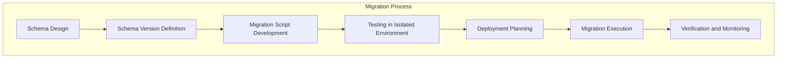

# NERV and Inner Universe Migration Guide

This document provides a comprehensive guide for managing schema evolution and data migrations between NERV and Inner Universe systems, ensuring smooth transitions between versions and maintaining data integrity.

## Overview

As the NERV architecture and Inner Universe persistence layer evolve, both systems will undergo changes that require careful migration planning. This guide outlines strategies for:

1. **Schema Evolution**: How to evolve database schemas and type definitions
2. **Data Migration**: How to migrate existing data to new schemas
3. **Compatibility Management**: How to maintain compatibility across versions
4. **Deployment Strategies**: How to deploy migrations safely



## Versioning Strategy

The NERV and Inner Universe integration uses explicit schema versioning:

::: info Schema Version Tracking
Each schema version is tracked explicitly in both systems, with clear compatibility rules between versions.
:::

### Version Naming Convention

Schema versions follow semantic versioning principles:

```
MAJOR.MINOR.PATCH
```

Where:
- **MAJOR**: Incompatible schema changes requiring explicit migration
- **MINOR**: Schema additions that are backward compatible
- **PATCH**: Bug fixes and non-schema changes

### Version Compatibility Matrix

| Inner Universe Version | Compatible NERV Versions | Migration Required                                 |
| ---------------------- | ------------------------ | -------------------------------------------------- |
| 1.0.x                  | 1.0.x                    | No                                                 |
| 1.1.x                  | 1.0.x, 1.1.x             | No (for NERV 1.1.x), Forward-only (for NERV 1.0.x) |
| 2.0.x                  | 2.0.x                    | Yes (from 1.x)                                     |

## Schema Migration Patterns

### 1. Additive Schema Changes

For backward-compatible schema additions:

```rust
// Original Entity Schema (v1.0)
#[table(name = entity, public)]
pub struct Entity {
    #[primary_key]
    id: String,
    entity_type: String,
    created_at: Timestamp,
    updated_at: Timestamp,
    metadata: EntityMetadata
}

// Updated Entity Schema (v1.1) - Backward compatible addition
#[table(name = entity, public)]
pub struct Entity {
    #[primary_key]
    id: String,
    entity_type: String,
    created_at: Timestamp,
    updated_at: Timestamp,
    metadata: EntityMetadata,
    // New field with default value for backward compatibility
    deleted: bool = false
}
```

Corresponding Python type change:

```python
# Original EntityMetadata (v1.0)
@dataclass
class EntityMetadata:
    name: Optional[str] = None
    description: Optional[str] = None
    tags: List[str] = field(default_factory=list)
    properties: Dict[str, Any] = field(default_factory=dict)

# Updated EntityMetadata (v1.1) - Backward compatible addition
@dataclass
class EntityMetadata:
    name: Optional[str] = None
    description: Optional[str] = None
    tags: List[str] = field(default_factory=list)
    properties: Dict[str, Any] = field(default_factory=dict)
    # New field with default value
    visibility: str = "public"
```

### 2. Table Structure Changes

For changes to table structures:

```rust
// Migration function for table structure changes
#[spacetimedb::migration]
pub fn add_visibility_column(db: &mut spacetimedb::Database) {
    // Add a new column with a default value
    db.execute("
        ALTER TABLE entity
        ADD COLUMN visibility TEXT NOT NULL DEFAULT 'public';
    ");
}
```

### 3. Type Definition Changes

For changes to type definitions:

```rust
// Old type definition (v1.0)
#[spacetimedb_derive::spacetimedb_type]
pub struct EntityMetadata {
    pub name: Option<String>,
    pub description: Option<String>,
    pub tags: Vec<String>,
    pub properties: Map<String, Value>
}

// New type definition (v2.0)
#[spacetimedb_derive::spacetimedb_type]
pub struct EntityMetadata {
    pub name: Option<String>,
    pub description: Option<String>,
    pub tags: Vec<String>,
    pub properties: Map<String, Value>,
    pub visibility: String,
    pub last_accessed: Option<Timestamp>,
    pub version: u32
}

// Migration function for entity metadata
#[spacetimedb::migration]
pub fn update_entity_metadata(db: &mut spacetimedb::Database) {
    // This requires a complex migration because it changes a type
    // Step 1: Create temporary table with new schema
    db.execute("
        CREATE TABLE temp_entity (
            id TEXT PRIMARY KEY,
            entity_type TEXT NOT NULL,
            created_at BIGINT NOT NULL,
            updated_at BIGINT NOT NULL,
            metadata BLOB NOT NULL
        );
    ");

    // Step 2: Copy data with transformation
    db.execute("
        INSERT INTO temp_entity
        SELECT
            id,
            entity_type,
            created_at,
            updated_at,
            -- Transform metadata to include new fields
            transform_metadata(metadata)
        FROM entity;
    ");

    // Step 3: Drop old table
    db.execute("DROP TABLE entity;");

    // Step 4: Rename temp table
    db.execute("ALTER TABLE temp_entity RENAME TO entity;");

    // Step 5: Recreate indices
    db.execute("CREATE INDEX entity_type_idx ON entity(entity_type);");
    db.execute("CREATE INDEX entity_created_idx ON entity(created_at);");
}
```

## Migration Implementation

### Planning Phase

Before implementing migrations:

::: warning Migration Planning is Critical
Careful planning is essential for successful migrations. All stakeholders should be involved in the planning process, and thorough testing is required before production deployment.
:::

1. **Catalog Current Schema**: Document the current schema in both systems
2. **Define Target Schema**: Clearly define the target schema
3. **Identify Changes**: List all schema changes and their impacts
4. **Design Migration Path**: Design the step-by-step migration process
5. **Define Rollback Plan**: Prepare fallback procedures in case of issues

### Migration Script Development

Develop migration scripts for both systems:

#### Inner Universe Migrations

```rust
// SpacetimeDB module migration
#[spacetimedb::migration]
pub fn v2_0_0_migration(db: &mut spacetimedb::Database) {
    log::info!("Running migration to v2.0.0");

    // Step 1: Add new tables
    db.execute("
        CREATE TABLE access_control (
            entity_id TEXT PRIMARY KEY,
            owner_identity BLOB NOT NULL,
            access_level INTEGER NOT NULL,
            last_modified BIGINT NOT NULL
        );
    ");

    // Step 2: Update existing tables
    db.execute("
        ALTER TABLE entity
        ADD COLUMN owner_identity BLOB;
    ");

    // Step 3: Set default values for new columns
    db.execute("
        UPDATE entity
        SET owner_identity = X'00000000000000000000000000000000'
        WHERE owner_identity IS NULL;
    ");

    // Step 4: Create new indices
    db.execute("
        CREATE INDEX entity_owner_idx ON entity(owner_identity);
    ");

    log::info!("Migration to v2.0.0 completed successfully");
}
```

#### NERV System Migrations

```python
async def migrate_nerv_to_v2(inner_universe_client):
    """Migrate NERV system to v2.0.0 compatibility"""
    logger.info("Starting NERV migration to v2.0.0")

    # Step 1: Update NERV's entity store
    entity_store = EntityStore.get_instance()

    # Step 2: Add new fields to in-memory entities
    for entity_id, entity in entity_store.entities.items():
        if "owner_identity" not in entity.metadata:
            entity.metadata["owner_identity"] = None

    # Step 3: Create new access control structures
    access_control_store = AccessControlStore()

    # Step 4: Sync with Inner Universe
    entities = await inner_universe_client.query_entities(limit=1000)

    for entity in entities:
        # Update local store with migrated data
        owner_identity = entity.get("owner_identity")
        if owner_identity:
            entity_store.update_entity_owner(
                entity.get("id"),
                owner_identity
            )

    logger.info("NERV migration to v2.0.0 completed successfully")
```

### Testing Migrations

All migrations must be thoroughly tested:

```python
async def test_migration_v1_to_v2():
    """Test migration from v1.0 to v2.0"""
    # Step 1: Set up v1.0 environment
    v1_config = InnerUniverseConfig(
        module_path="/path/to/inner_universe_v1.wasm",
        db_path=temp_db_path()
    )

    v1_controller = InnerUniverseController(v1_config)
    await v1_controller.start_deployment_mode()

    # Step 2: Create test data in v1.0 format
    v1_client = v1_controller.client

    # Create entities
    entity_ids = []
    for i in range(10):
        entity_id = await v1_client.create_entity(
            "TestType",
            {
                "name": f"Test Entity {i}",
                "description": f"Description {i}",
                "tags": ["test", f"tag_{i}"],
                "properties": {"index": i}
            }
        )
        entity_ids.append(entity_id)

    # Create relations
    relation_ids = []
    for i in range(5):
        relation_id = await v1_client.create_relation(
            entity_ids[i],
            entity_ids[i+5],
            "TEST_RELATION",
            {
                "description": f"Relation {i}",
                "strength": 0.5,
                "bidirectional": False,
                "tags": ["test_relation"]
            }
        )
        relation_ids.append(relation_id)

    # Step 3: Shut down v1.0
    await v1_controller.stop()

    # Step 4: Set up v2.0 environment with same database
    v2_config = InnerUniverseConfig(
        module_path="/path/to/inner_universe_v2.wasm",
        db_path=v1_config.db_path
    )

    v2_controller = InnerUniverseController(v2_config)

    # Step 5: Run migration by starting deployment mode
    await v2_controller.start_deployment_mode()

    try:
        v2_client = v2_controller.client

        # Step 6: Verify all data migrated correctly
        for entity_id in entity_ids:
            entity = await v2_client.get_entity(entity_id)

            # Check new fields have default values
            assert "owner_identity" in entity

            # Check original data preserved
            assert entity["entity_type"] == "TestType"
            assert "test" in entity["metadata"]["tags"]

        # Step 7: Test new functionality
        # Set owner identity
        await v2_client.update_entity_owner(
            entity_ids[0],
            "test_identity"
        )

        updated_entity = await v2_client.get_entity(entity_ids[0])
        assert updated_entity["owner_identity"] == "test_identity"
    finally:
        await v2_controller.stop()
```

## Deployment Strategies

### 1. Phased Deployment

For large migrations, use a phased deployment approach:

::: tip Phased Migration
Phased migrations minimize risk by updating components incrementally, with verification at each step.
:::

1. **Schema Updates**: Deploy schema changes first
2. **Migration Script Execution**: Run data migration scripts
3. **API Compatibility Layer**: Deploy compatibility interfaces
4. **Client Updates**: Update client applications
5. **Cleanup**: Remove compatibility layers after all clients migrate

### 2. Blue-Green Deployment

For critical migrations, use a blue-green deployment strategy:

```
             ┌──────────────────┐
             │                  │
             │  Load Balancer   │
             │                  │
             └──────────────────┘
                 ↙           ↘
    ┌──────────────────┐  ┌──────────────────┐
    │                  │  │                  │
    │  Blue (Current)  │  │  Green (New)     │
    │                  │  │                  │
    └──────────────────┘  └──────────────────┘
             ↓                     ↓
    ┌──────────────────┐  ┌──────────────────┐
    │                  │  │                  │
    │  Database V1     │  │  Database V2     │
    │                  │  │                  │
    └──────────────────┘  └──────────────────┘
```

1. **Set Up New Environment**: Create a complete new environment with the new schema
2. **Data Migration**: Copy and migrate data to the new environment
3. **Verification**: Verify the new environment works correctly
4. **Switch Traffic**: Redirect traffic to the new environment
5. **Fallback Option**: Keep the old environment for quick rollback if needed

### 3. Feature Flags

Use feature flags to control migration behavior:

```python
# Feature flag based migration
async def update_entity(entity_id, metadata):
    # Check if new schema is enabled
    if feature_flags.is_enabled("new_entity_schema"):
        # Use new schema fields
        if "visibility" not in metadata:
            metadata["visibility"] = "public"

        # Call new API
        await inner_universe_client.update_entity_v2(entity_id, metadata)
    else:
        # Use old schema fields
        # Remove any new fields
        if "visibility" in metadata:
            del metadata["visibility"]

        # Call old API
        await inner_universe_client.update_entity(entity_id, metadata)
```

## Backward Compatibility Strategies

### 1. API Version Support

Support multiple API versions during migration periods:

```python
# Version-aware API endpoint
async def handle_entity_request(request):
    # Check API version from request
    api_version = request.headers.get("API-Version", "1.0")

    if api_version == "1.0":
        # Handle using v1.0 logic
        return await handle_entity_request_v1(request)
    elif api_version == "2.0":
        # Handle using v2.0 logic
        return await handle_entity_request_v2(request)
    else:
        # Unsupported version
        return Error("Unsupported API version", 400)
```

### 2. Schema Downgrading

For backward compatibility, implement schema downgrade functions:

```python
# Downgrade metadata from v2 to v1 format
def downgrade_metadata_v2_to_v1(metadata_v2):
    """Convert v2 metadata to v1 format for older clients"""
    # Create a copy to avoid modifying original
    metadata_v1 = metadata_v2.copy()

    # Remove v2-specific fields
    if "visibility" in metadata_v1:
        del metadata_v1["visibility"]

    if "version" in metadata_v1:
        del metadata_v1["version"]

    if "last_accessed" in metadata_v1:
        del metadata_v1["last_accessed"]

    return metadata_v1
```

### 3. Adapter Pattern

Use adapters to handle version differences:

```python
# Entity schema adapter
class EntitySchemaAdapter:
    """Adapts between different entity schema versions"""

    @staticmethod
    def to_v1(entity_v2):
        """Convert v2 entity to v1 format"""
        return {
            "id": entity_v2["id"],
            "entity_type": entity_v2["entity_type"],
            "created_at": entity_v2["created_at"],
            "updated_at": entity_v2["updated_at"],
            "metadata": downgrade_metadata_v2_to_v1(entity_v2["metadata"])
        }

    @staticmethod
    def to_v2(entity_v1):
        """Convert v1 entity to v2 format"""
        entity_v2 = entity_v1.copy()

        # Add v2 fields with defaults
        entity_v2["owner_identity"] = None

        # Upgrade metadata
        metadata_v2 = entity_v1["metadata"].copy()
        metadata_v2["visibility"] = "public"
        metadata_v2["version"] = 1
        metadata_v2["last_accessed"] = None

        entity_v2["metadata"] = metadata_v2

        return entity_v2
```

## Data Migration Utilities

Create reusable utilities for common migration tasks:

```python
# Data migration toolkit
class MigrationUtility:
    """Utilities for data migration between Inner Universe versions"""

    def __init__(self, source_client, target_client):
        self.source = source_client
        self.target = target_client
        self.logger = get_logger("migration_utility")

    async def migrate_entities(self, batch_size=50, transform_func=None):
        """Migrate all entities from source to target"""
        self.logger.info("Starting entity migration")

        offset = 0
        total_migrated = 0

        while True:
            # Get batch of entities from source
            entities = await self.source.query_entities(
                limit=batch_size,
                offset=offset
            )

            if not entities:
                break

            # Process each entity
            for entity in entities:
                # Apply transformation if provided
                if transform_func:
                    entity = transform_func(entity)

                # Create in target
                try:
                    await self.target.create_entity_raw(
                        entity["id"],
                        entity["entity_type"],
                        entity["metadata"],
                        entity["created_at"],
                        entity["updated_at"]
                    )
                    total_migrated += 1
                except Exception as e:
                    self.logger.error(f"Error migrating entity {entity['id']}: {e}")

            # Update offset
            offset += len(entities)
            self.logger.info(f"Migrated {total_migrated} entities so far")

        self.logger.info(f"Entity migration completed. Total: {total_migrated}")
        return total_migrated

    async def migrate_relations(self, batch_size=50, transform_func=None):
        """Migrate all relations from source to target"""
        # Similar implementation to migrate_entities
        pass

    async def migrate_state_versions(self, batch_size=50, transform_func=None):
        """Migrate all state versions from source to target"""
        # Similar implementation to migrate_entities
        pass

    async def migrate_events(self, batch_size=100, transform_func=None):
        """Migrate event log from source to target"""
        # Similar implementation to migrate_entities
        pass

    async def verify_migration(self):
        """Verify migration completeness and correctness"""
        self.logger.info("Verifying migration")

        # Compare entity counts
        source_entities = await self.source.count_entities()
        target_entities = await self.target.count_entities()

        if source_entities != target_entities:
            self.logger.warning(
                f"Entity count mismatch: source={source_entities}, target={target_entities}"
            )

        # Compare relation counts
        source_relations = await self.source.count_relations()
        target_relations = await self.target.count_relations()

        if source_relations != target_relations:
            self.logger.warning(
                f"Relation count mismatch: source={source_relations}, target={target_relations}"
            )

        # Sample verification
        sample_entities = await self.source.query_entities(limit=10)

        for entity in sample_entities:
            target_entity = await self.target.get_entity(entity["id"])

            if not target_entity:
                self.logger.error(f"Entity {entity['id']} not found in target")
                continue

            # Verify key fields
            for field in ["entity_type", "created_at", "updated_at"]:
                if entity[field] != target_entity[field]:
                    self.logger.error(
                        f"Field mismatch for entity {entity['id']}.{field}: "
                        f"source={entity[field]}, target={target_entity[field]}"
                    )

        self.logger.info("Migration verification completed")
```

## Monitoring and Rollback

### Monitoring Migrations

Implement comprehensive monitoring for migrations:

```python
# Migration monitoring
class MigrationMonitor:
    """Monitors migration progress and health"""

    def __init__(self):
        self.logger = get_logger("migration_monitor")
        self.metrics = {}
        self.start_time = None
        self.end_time = None
        self.status = "not_started"

    def start_migration(self):
        """Record migration start"""
        self.start_time = time.time()
        self.status = "in_progress"
        self.logger.info("Migration started")

    def record_metric(self, name, value):
        """Record a migration metric"""
        self.metrics[name] = value
        self.logger.info(f"Migration metric {name}: {value}")

    def increment_metric(self, name, increment=1):
        """Increment a migration metric"""
        if name not in self.metrics:
            self.metrics[name] = 0

        self.metrics[name] += increment

    def complete_migration(self, success=True):
        """Record migration completion"""
        self.end_time = time.time()
        self.status = "completed" if success else "failed"

        duration = self.end_time - self.start_time
        self.metrics["duration_seconds"] = duration

        self.logger.info(
            f"Migration {self.status} in {duration:.2f} seconds. "
            f"Metrics: {self.metrics}"
        )

    def get_report(self):
        """Generate migration report"""
        return {
            "status": self.status,
            "start_time": self.start_time,
            "end_time": self.end_time,
            "duration": self.end_time - self.start_time if self.end_time else None,
            "metrics": self.metrics
        }
```

### Rollback Procedures

Define clear rollback procedures for failed migrations:

::: warning Document Rollback Procedures
Every migration should have a documented rollback procedure in case of failure.
:::

```python
async def rollback_migration(controller, backup_path):
    """Roll back a failed migration"""
    logger.info("Starting migration rollback")

    # Step 1: Stop the current server
    await controller.stop()
    logger.info("Stopped current server")

    # Step 2: Restore database from backup
    backup_file = os.path.join(backup_path, "pre_migration_backup.stb")

    if not os.path.exists(backup_file):
        logger.error(f"Backup file not found: {backup_file}")
        return False

    # Step 3: Restore command
    restore_cmd = [
        "spacetime", "backup", "restore",
        "--input", backup_file,
        "--db-path", controller.config.db_path
    ]

    logger.info(f"Restoring from backup: {backup_file}")

    process = await asyncio.create_subprocess_exec(
        *restore_cmd,
        stdout=asyncio.subprocess.PIPE,
        stderr=asyncio.subprocess.PIPE
    )

    stdout, stderr = await process.communicate()

    if process.returncode != 0:
        logger.error(f"Restore failed: {stderr.decode()}")
        return False

    logger.info("Backup restored successfully")

    # Step 4: Restart with old module
    old_module_path = os.path.join(backup_path, "pre_migration_module.wasm")

    if os.path.exists(old_module_path):
        controller.config.module_path = old_module_path

    # Step 5: Start server
    await controller.start_server_mode()
    logger.info("Server restarted with pre-migration state")

    return True
```

## Schema Audit and Validation

Before migrations, audit the schema for integrity:

```python
async def audit_schema_integrity(client):
    """Audit schema integrity before migration"""
    issues = []

    # Check for entity references
    relations = await client.query_relations(limit=1000)

    for relation in relations:
        from_entity = relation["from_entity"]
        to_entity = relation["to_entity"]

        # Check if from_entity exists
        try:
            from_entity_obj = await client.get_entity(from_entity)
        except EntityNotFoundError:
            issues.append(f"Relation {relation['id']} references non-existent from_entity {from_entity}")

        # Check if to_entity exists
        try:
            to_entity_obj = await client.get_entity(to_entity)
        except EntityNotFoundError:
            issues.append(f"Relation {relation['id']} references non-existent to_entity {to_entity}")

    # Check for state version integrity
    versions = await client.query_state_versions(limit=1000)

    for version in versions:
        parent_id = version.get("parent_version_id")

        if parent_id:
            try:
                parent = await client.get_state_version(parent_id)
            except VersionNotFoundError:
                issues.append(f"State version {version['id']} references non-existent parent {parent_id}")

    # Check for data consistency
    entities = await client.query_entities(limit=100)

    for entity in entities:
        # Check required fields
        for field in ["id", "entity_type", "created_at", "updated_at", "metadata"]:
            if field not in entity:
                issues.append(f"Entity {entity.get('id', 'unknown')} missing required field {field}")

        # Check metadata structure
        metadata = entity.get("metadata", {})

        if not isinstance(metadata, dict):
            issues.append(f"Entity {entity.get('id')} has invalid metadata type: {type(metadata)}")

    return issues
```

## Conclusion

Effective migration between NERV and Inner Universe versions requires careful planning, thorough testing, and robust implementation strategies. By following the patterns and practices in this guide, you can ensure smooth transitions while maintaining data integrity and system reliability.

Key takeaways:

1. **Version Explicitly**: Use clear version identifiers for both schemas and APIs
2. **Plan Thoroughly**: Design migrations with detailed steps and rollback procedures
3. **Test Comprehensively**: Verify migrations in isolated environments before production
4. **Deploy Strategically**: Use phased or blue-green deployment to minimize risk
5. **Monitor Carefully**: Track migration progress and system health
6. **Maintain Compatibility**: Implement backward compatibility strategies during transitions

The next steps for your migration planning should be:

1. Document your current schema in both systems
2. Define the target schema for your next version
3. Develop migration scripts following the patterns in this guide
4. Create a test plan to verify migration correctness
5. Implement monitoring for the migration process
6. Document rollback procedures in case of issues
