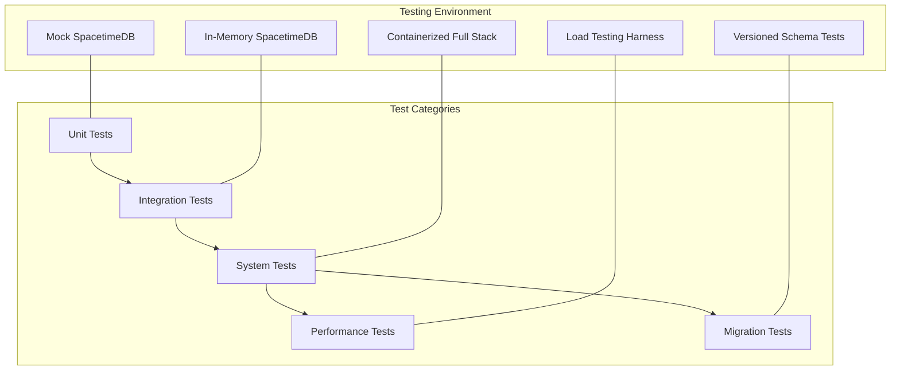

# NERV and Inner Universe Testing Strategy

This document outlines the comprehensive testing strategy for the integration between NERV architecture and the Inner Universe persistence layer, focusing on ensuring reliability, data integrity, and performance across system boundaries.

## Overview

Testing the integration between NERV and Inner Universe requires a multi-layered approach that covers both individual components and their interactions. The overall testing strategy encompasses:

1. **Unit Testing**: Testing individual components in isolation
2. **Integration Testing**: Testing the interaction between components
3. **System Testing**: Testing the complete NERV and Inner Universe stack
4. **Performance Testing**: Verifying system performance under load
5. **Migration Testing**: Testing schema and data migrations



## Testing Environments

### 1. Unit Testing Environment

For unit tests, components are tested in isolation with dependencies mocked:

::: info Mock Dependencies
All external dependencies, including SpacetimeDB, should be mocked to ensure tests are fast, deterministic, and focused only on the component under test.
:::

```python
# Example of mocking Inner Universe client for NERV unit tests
@pytest.fixture
def mock_inner_universe_client():
    """Create a mock Inner Universe client for unit testing"""
    mock_client = MagicMock(spec=InnerUniverseClient)

    # Set up mock responses
    mock_client.create_entity.return_value = "mock-entity-id"
    mock_client.get_entity.return_value = {
        "id": "mock-entity-id",
        "entity_type": "TestType",
        "metadata": {
            "name": "Test Entity",
            "tags": ["test"]
        }
    }

    return mock_client
```

### 2. Integration Testing Environment

Integration tests verify the correct functioning of component interactions:

::: tip Integration Test Isolation
Use an in-memory or ephemeral SpacetimeDB instance to ensure integration tests don't interfere with each other and can be run in parallel.
:::

```python
@pytest.fixture(scope="function")
async def integration_test_environment():
    """Create an integration test environment with real SpacetimeDB"""
    # Create a temporary database directory
    temp_dir = tempfile.mkdtemp()
    db_path = os.path.join(temp_dir, "test_db")

    try:
        # Configure Inner Universe with test settings
        config = InnerUniverseConfig(
            address="127.0.0.1",
            port=3789,  # Use a different port for testing
            db_path=db_path,
            module_path="/path/to/test_module.wasm"
        )

        # Create and start controller
        controller = InnerUniverseController(config)
        await controller.start_server_mode()

        yield controller
    finally:
        # Clean up
        if controller:
            await controller.stop()
        shutil.rmtree(temp_dir)
```

### 3. System Testing Environment

System tests verify the complete NERV and Inner Universe stack:

::: warning Docker Required
System tests require Docker to create isolated environments with all components running together.
:::

```bash
# Docker Compose file for system testing
version: '3'
services:
  spacetimedb:
    image: spacetimedb/spacetimedb:latest
    volumes:
      - ./test_module.wasm:/module/test_module.wasm
    ports:
      - "3000:3000"
    command: ["run", "--db-path", "/data", "--module-path", "/module/test_module.wasm"]

  test-runner:
    build:
      context: .
      dockerfile: Dockerfile.test
    depends_on:
      - spacetimedb
    environment:
      - SPACETIMEDB_ADDRESS=spacetimedb
      - SPACETIMEDB_PORT=3000
```

## Unit Testing Strategy

### Component Unit Tests

Each NERV and Inner Universe component should have comprehensive unit tests:

#### NERV Component Tests

```python
def test_spacetime_event_bus():
    """Test the SpacetimeEventBus adapter"""
    # Create mock client
    mock_client = mock_inner_universe_client()

    # Create the adapter
    event_bus = SpacetimeEventBus(mock_client)

    # Register a handler
    handler = MagicMock()
    event_bus.register_handler("TEST_EVENT", handler)

    # Simulate an event from Inner Universe
    event = {
        "event_id": "test-event-id",
        "event_type": "TEST_EVENT",
        "source": "test-source",
        "timestamp": 1234567890,
        "data": {"key": "value"}
    }

    event_bus._on_event_change("INSERTED", event)

    # Verify handler was called with correct message
    handler.assert_called_once()
    message = handler.call_args[0][0]
    assert message.id == "test-event-id"
    assert message.type == "TEST_EVENT"
    assert message.data == {"key": "value"}
```

#### Inner Universe Client Tests

```python
def test_inner_universe_client_entity_operations():
    """Test Inner Universe client entity operations"""
    # Mock SpacetimeDB client
    mock_spacetime_client = MagicMock()
    mock_spacetime_client.call_reducer.return_value = "test-entity-id"

    # Create Inner Universe client with mock SpacetimeDB client
    client = InnerUniverseClient(config)
    client.client = mock_spacetime_client

    # Test create_entity
    metadata = EntityMetadata(name="Test Entity", tags=["test"])
    entity_id = await client.create_entity("TestType", metadata)

    # Verify correct parameters were passed
    mock_spacetime_client.call_reducer.assert_called_with(
        "create_entity",
        "TestType",
        asdict(metadata)
    )

    assert entity_id == "test-entity-id"
```

## Integration Testing Strategy

Integration tests focus on the correct functioning of interconnected components:

### Event Flow Integration Tests

```python
async def test_event_bidirectional_flow(integration_test_environment):
    """Test bidirectional event flow between NERV and Inner Universe"""
    controller = integration_test_environment

    # Create NERV EventBus
    nerv_event_bus = EventBus()

    # Create adapter
    adapter = SpacetimeEventBus(controller.client)

    # Set up test event handler
    received_events = []
    def event_handler(message):
        received_events.append(message)

    # Register handler
    nerv_event_bus.subscribe("TEST_EVENT", event_handler)

    # Connect the adapter to NERV
    adapter.connect_to_nerv(nerv_event_bus)

    # Publish an event from NERV
    event_data = {"test_key": "test_value"}
    event_id = await nerv_event_bus.publish("TEST_EVENT", event_data)

    # Wait for event propagation
    await asyncio.sleep(0.1)

    # Verify event was persisted in Inner Universe
    events = await controller.client.query_events(event_type="TEST_EVENT")
    assert len(events) == 1
    assert events[0]["data"]["test_key"] == "test_value"

    # Simulate an event from Inner Universe
    await controller.client.publish_event(
        "ANOTHER_EVENT",
        None,
        {"another_key": "another_value"}
    )

    # Wait for event propagation
    await asyncio.sleep(0.1)

    # Verify NERV received the event
    assert len(received_events) == 1
    assert received_events[0].type == "ANOTHER_EVENT"
    assert received_events[0].data["another_key"] == "another_value"
```

### State Versioning Integration Tests

```python
async def test_temporal_store_integration(integration_test_environment):
    """Test TemporalStore integration with Inner Universe"""
    controller = integration_test_environment

    # Create temporal store adapter
    temporal_store = SpacetimeTemporalStore(controller.client)

    # Commit initial state
    initial_state = {"version": "1.0", "data": {"key": "value"}}
    version_id = await temporal_store.commit_version(initial_state, "Initial state")

    # Verify version was created
    assert version_id is not None

    # Get the version
    version = await controller.client.get_state_version(version_id)
    assert version is not None
    assert version["description"] == "Initial state"

    # Update state
    updated_state = {"version": "1.1", "data": {"key": "updated_value"}}
    new_version_id = await temporal_store.commit_version(updated_state, "Updated state")

    # Verify new version references previous version
    new_version = await controller.client.get_state_version(new_version_id)
    assert new_version["parent_version_id"] == version_id
```

## System Testing Strategy

System tests verify the complete stack running together:

### End-to-End Flow Tests

```python
async def test_end_to_end_entity_creation():
    """Test end-to-end entity creation from NERV to Inner Universe"""
    # Create persistence manager with system testing configuration
    config = InnerUniverseConfig(
        address=os.environ.get("SPACETIMEDB_ADDRESS", "localhost"),
        port=int(os.environ.get("SPACETIMEDB_PORT", "3000"))
    )

    manager = PersistenceManager(config)
    await manager.initialize()

    try:
        # Create entity through NERV
        entity_metadata = EntityMetadata(
            name="System Test Entity",
            description="Entity created in system test",
            tags=["system-test"],
            properties={"test_prop": "test_value"}
        )

        # Create the entity
        entity_id = await manager.create_entity("SystemTestType", entity_metadata)

        # Verify entity was created in Inner Universe
        entity = await manager.get_entity(entity_id)

        # Check entity properties
        assert entity["entity_type"] == "SystemTestType"
        assert entity["metadata"]["name"] == "System Test Entity"
        assert "system-test" in entity["metadata"]["tags"]
        assert entity["metadata"]["properties"]["test_prop"] == "test_value"

        # Update the entity
        updated_metadata = asdict(entity_metadata)
        updated_metadata["description"] = "Updated description"
        updated_metadata["tags"].append("updated")

        success = await manager.update_entity(entity_id, updated_metadata)
        assert success is True

        # Verify update was persisted
        updated_entity = await manager.get_entity(entity_id)
        assert updated_entity["metadata"]["description"] == "Updated description"
        assert "updated" in updated_entity["metadata"]["tags"]
    finally:
        await manager.shutdown()
```

### Failure Recovery Tests

::: warning Critical Testing Area
Failure recovery is crucial for robust production systems. These tests verify that the system can recover from various failure scenarios.
:::

```python
async def test_connection_recovery():
    """Test recovery from SpacetimeDB connection failures"""
    # Create manager with connection retry settings
    config = InnerUniverseConfig(
        address="localhost",
        port=3000,
        retry_attempts=3,
        retry_delay_ms=100
    )

    manager = PersistenceManager(config)

    # Start with SpacetimeDB unavailable
    # (Assume Docker container for SpacetimeDB is stopped)

    # Initialize should fail due to connection issues
    initialized = await manager.initialize()
    assert initialized is False

    # Start SpacetimeDB container
    # (Code to start Docker container would go here)

    # Retry initialization
    initialized = await manager.initialize()
    assert initialized is True

    # Verify system is functional
    entity_id = await manager.create_entity("TestType", {"name": "Recovery Test"})
    assert entity_id is not None
```

## Performance Testing Strategy

Performance tests verify system behavior under load:

### Event Throughput Tests

```python
async def test_event_throughput():
    """Test event throughput between NERV and Inner Universe"""
    # Create test environment
    manager = PersistenceManager(test_config())
    await manager.initialize()

    try:
        # Parameters
        event_count = 1000
        max_concurrent = 50

        # Generate test events
        events = [
            {
                "type": f"TEST_EVENT_{i % 10}",
                "data": {"index": i, "payload": f"test_payload_{i}"},
                "source": "throughput_test"
            }
            for i in range(event_count)
        ]

        # Publish events with limited concurrency
        start_time = time.time()

        async def publish_event(event):
            await manager.publish_event(event["type"], event["data"], event["source"])

        # Use semaphore to limit concurrency
        semaphore = asyncio.Semaphore(max_concurrent)

        async def bounded_publish(event):
            async with semaphore:
                await publish_event(event)

        # Create and gather tasks
        tasks = [bounded_publish(event) for event in events]
        await asyncio.gather(*tasks)

        end_time = time.time()
        duration = end_time - start_time

        # Calculate metrics
        events_per_second = event_count / duration

        print(f"Published {event_count} events in {duration:.2f} seconds")
        print(f"Throughput: {events_per_second:.2f} events/second")

        # Verify all events were stored
        all_events = await manager.client.query_events(
            source="throughput_test",
            limit=event_count + 10
        )

        assert len(all_events) == event_count
    finally:
        await manager.shutdown()
```

### Load Testing Strategy

For comprehensive load testing, use a separate load testing framework:

```python
# Example load test configuration for Locust
from locust import HttpUser, task, between

class InnerUniverseUser(HttpUser):
    wait_time = between(1, 3)

    def on_start(self):
        # Authentication if needed
        pass

    @task(10)
    def create_entity(self):
        # Create a random entity
        entity_type = random.choice(["User", "Document", "Product"])
        name = f"Test Entity {uuid.uuid4()}"

        metadata = {
            "name": name,
            "tags": [random.choice(["test", "benchmark", "load"])],
            "properties": {
                "timestamp": time.time(),
                "random_value": random.random()
            }
        }

        self.client.post("/api/entities", json={
            "entity_type": entity_type,
            "metadata": metadata
        })

    @task(5)
    def query_entities(self):
        # Query entities with random filters
        entity_type = random.choice(["User", "Document", "Product", None])
        params = {}

        if entity_type:
            params["entity_type"] = entity_type

        self.client.get("/api/entities", params=params)
```

## Migration Testing Strategy

Testing schema and data migrations between versions:

::: info Version Compatibility Matrix
Create a compatibility matrix to ensure all supported version combinations are tested.
:::

```python
async def test_schema_migration():
    """Test migration between schema versions"""
    # Set up old schema version
    old_config = InnerUniverseConfig(
        module_path="/path/to/old_version.wasm",
        db_path=temp_db_path()
    )

    # Initialize with old schema
    old_controller = InnerUniverseController(old_config)
    await old_controller.start_deployment_mode()

    # Create data using old schema
    old_client = old_controller.client
    entity_id = await old_client.create_entity(
        "TestType",
        {
            "name": "Migration Test",
            "tags": ["test"],
            # Old schema doesn't have 'properties' field
        }
    )

    # Shutdown old version
    await old_controller.stop()

    # Set up new schema version using same DB path
    new_config = InnerUniverseConfig(
        module_path="/path/to/new_version.wasm",
        db_path=old_config.db_path
    )

    # Initialize with new schema (this should run migrations)
    new_controller = InnerUniverseController(new_config)
    await new_controller.start_deployment_mode()

    try:
        # Verify data was migrated properly
        new_client = new_controller.client
        entity = await new_client.get_entity(entity_id)

        # Check entity properties
        assert entity["entity_type"] == "TestType"
        assert entity["metadata"]["name"] == "Migration Test"
        assert "test" in entity["metadata"]["tags"]

        # New schema should have initialized 'properties' field
        assert "properties" in entity["metadata"]
        assert isinstance(entity["metadata"]["properties"], dict)

        # Test new schema capabilities
        await new_client.update_entity(
            entity_id,
            {
                "name": "Updated Migration Test",
                "tags": ["test", "migrated"],
                "properties": {"new_field": "new_value"}
            }
        )

        # Verify update with new schema fields
        updated_entity = await new_client.get_entity(entity_id)
        assert updated_entity["metadata"]["properties"]["new_field"] == "new_value"
    finally:
        await new_controller.stop()
```

## Test Fixtures and Utilities

Common test fixtures and utilities:

```python
# Test utilities module
import asyncio
import os
import pytest
import tempfile
import uuid
from unittest.mock import MagicMock, patch

from atlas.graph.persistence.config import InnerUniverseConfig
from atlas.graph.persistence.controller import InnerUniverseController
from atlas.graph.persistence.inner_universe import InnerUniverseClient
from atlas.graph.persistence.event_bus import SpacetimeEventBus
from atlas.graph.persistence.temporal_store import SpacetimeTemporalStore
from atlas.graph.persistence.manager import PersistenceManager

# Test configuration utility
def test_config(unique=True):
    """Create a test configuration"""
    port = 3789
    if unique:
        # Use a unique port to avoid conflicts in parallel tests
        port = 3789 + (uuid.uuid4().int % 1000)

    return InnerUniverseConfig(
        address="127.0.0.1",
        port=port,
        db_path=temp_db_path(),
        log_level="error"  # Quieter logs during tests
    )

def temp_db_path():
    """Create a temporary database path"""
    return os.path.join(tempfile.mkdtemp(), "test_db")

# Common fixtures
@pytest.fixture
def entity_metadata():
    """Create test entity metadata"""
    return {
        "name": "Test Entity",
        "description": "Entity for testing",
        "tags": ["test", "fixture"],
        "properties": {
            "test_prop": "test_value",
            "numeric_prop": 42
        }
    }

@pytest.fixture
async def persistence_manager():
    """Create an initialized persistence manager"""
    manager = PersistenceManager(test_config())
    await manager.initialize()

    yield manager

    await manager.shutdown()
```

## Test Automation and CI/CD Integration

Automated testing should be integrated into the CI/CD pipeline:

```yaml
# Example GitHub Actions workflow for testing
name: NERV-Inner Universe Tests

on:
  push:
    branches: [ main ]
  pull_request:
    branches: [ main ]

jobs:
  unit-tests:
    runs-on: ubuntu-latest
    steps:
      - uses: actions/checkout@v2
      - name: Set up Python
        uses: actions/setup-python@v2
        with:
          python-version: 3.13
      - name: Install dependencies
        run: |
          python -m pip install --upgrade pip
          pip install pytest pytest-asyncio pytest-cov
          pip install -e .
      - name: Run unit tests
        run: |
          pytest -xvs atlas/tests/graph/persistence/unit

  integration-tests:
    runs-on: ubuntu-latest
    steps:
      - uses: actions/checkout@v2
      - name: Set up Python
        uses: actions/setup-python@v2
        with:
          python-version: 3.13
      - name: Install dependencies
        run: |
          python -m pip install --upgrade pip
          pip install pytest pytest-asyncio pytest-cov
          pip install -e .
      - name: Set up SpacetimeDB
        run: |
          curl -L https://github.com/clockworklabs/SpacetimeDB/releases/download/v0.7.0/spacetime-ubuntu-latest -o spacetime
          chmod +x spacetime
          mkdir -p $HOME/.spacetime/bin
          mv spacetime $HOME/.spacetime/bin/
          echo "$HOME/.spacetime/bin" >> $GITHUB_PATH
      - name: Run integration tests
        run: |
          pytest -xvs atlas/tests/graph/persistence/integration

  system-tests:
    runs-on: ubuntu-latest
    steps:
      - uses: actions/checkout@v2
      - name: Set up Docker
        uses: docker/setup-buildx-action@v1
      - name: Build test containers
        run: docker-compose -f docker-compose.test.yml build
      - name: Run system tests
        run: docker-compose -f docker-compose.test.yml run test-runner
```

## Test Coverage Goals

Establish clear coverage goals for the testing strategy:

| Test Category     | Coverage Goal | Critical Areas                                           |
| ----------------- | ------------- | -------------------------------------------------------- |
| Unit Tests        | 95%+          | Type mappings, error handling, data validation           |
| Integration Tests | 90%+          | Event flow, state versioning, entity-relation operations |
| System Tests      | 80%+          | End-to-end flows, recovery scenarios                     |
| Performance Tests | Key metrics   | Throughput, latency, resource usage                      |
| Migration Tests   | All versions  | Version N to N+1 migrations                              |

## Conclusion

A comprehensive testing strategy is critical for ensuring the reliability, performance, and correctness of the NERV and Inner Universe integration. By implementing the multi-layered approach described in this document, you can:

1. **Validate Correctness**: Ensure all components function correctly in isolation and together
2. **Verify Performance**: Confirm the system meets performance requirements under load
3. **Test Recovery**: Verify graceful handling of failure scenarios
4. **Ensure Compatibility**: Validate compatibility across schema versions

The next steps for implementing this testing strategy are:

1. Set up the basic test fixtures and utilities
2. Implement unit tests for all components
3. Create the integration test environment
4. Develop system tests for end-to-end validation
5. Build performance testing harness
6. Integrate tests into CI/CD pipeline
