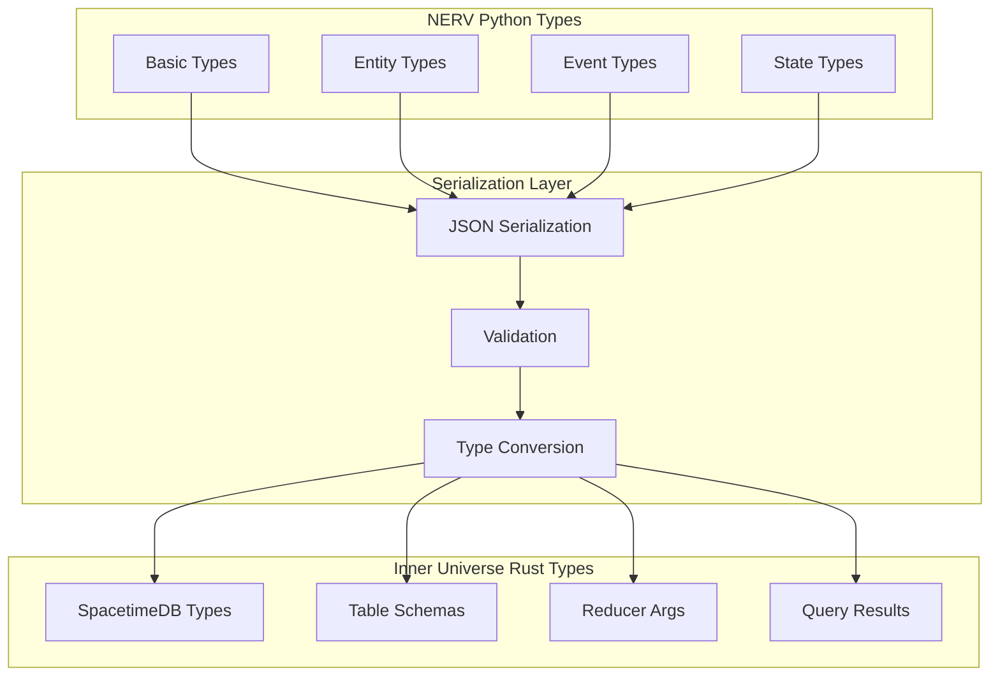

# NERV and Inner Universe Type Mappings

This document provides a comprehensive reference for type mappings between NERV's Python types and Inner Universe's Rust types, ensuring consistent data serialization and deserialization across system boundaries.

## Overview

Consistent type mappings are critical for the integration between NERV and Inner Universe. This guide:

1. Documents standard type conversions
2. Defines mapping for complex types
3. Identifies and resolves inconsistencies
4. Provides serialization strategies
5. Offers validation patterns for type integrity



## Basic Type Mappings

### Primitive Types

The following table shows the standard mapping between Python and Rust primitive types:

| Python Type | Rust Type         | SpacetimeDB Type | Notes                 |
| ----------- | ----------------- | ---------------- | --------------------- |
| `str`       | `String`          | `string`         | UTF-8 encoded         |
| `int`       | `i64`             | `i64`            | 64-bit signed integer |
| `float`     | `f64`             | `f64`            | 64-bit floating point |
| `bool`      | `bool`            | `bool`           | Boolean value         |
| `None`      | `Option<T>::None` | `option<T>`      | Null value            |
| `bytes`     | `Vec<u8>`         | `bytes`          | Byte array            |

### Container Types

Container types require special handling for proper serialization:

| Python Type    | Rust Type             | SpacetimeDB Type | Notes                                |
| -------------- | --------------------- | ---------------- | ------------------------------------ |
| `list[T]`      | `Vec<T>`              | `array<T>`       | Homogeneous array                    |
| `dict[str, T]` | `BTreeMap<String, T>` | `map<string, T>` | Key-value mapping                    |
| `tuple[T, U]`  | Custom struct         | Table row        | Tuples convert to/from struct fields |
| `set[T]`       | `BTreeSet<T>`         | Custom type      | Sets convert to/from ordered arrays  |

::: warning Collection Type Handling
Collections containing different types in Python must be converted to homogeneous collections in Rust, often requiring intermediate structure definition.
:::

## Entity Types

### EntityMetadata Mapping

This critical type had several inconsistencies that are resolved in this mapping:

```python
# NERV Python Entity Metadata
@dataclass
class EntityMetadata:
    name: Optional[str] = None
    description: Optional[str] = None
    tags: List[str] = field(default_factory=list)
    properties: Dict[str, Any] = field(default_factory=dict)
```

```rust
// Inner Universe Rust Entity Metadata
#[spacetimedb_derive::spacetimedb_type]
pub struct EntityMetadata {
    pub name: Option<String>,
    pub description: Option<String>,
    pub tags: Vec<String>,
    pub properties: Map<String, Value>
}

// Value enum for heterogeneous property values
#[spacetimedb_derive::spacetimedb_type]
pub enum Value {
    Null,
    Bool(bool),
    Integer(i64),
    Float(f64),
    String(String),
    Array(Vec<Value>),
    Object(Map<String, Value>)
}
```

**Inconsistency**: The `properties` field in both systems uses different approaches for handling arbitrary values.

**Resolution**:
- Python side: Create a value converter that properly transforms Python values to the enumerated Value types
- Rust side: Ensure Value serialization/deserialization handles all property types

```python
# Python value converter
def convert_to_value_enum(python_value: Any) -> Dict[str, Any]:
    """Convert Python value to Value enum representation"""
    if python_value is None:
        return {"type": "Null", "value": None}
    elif isinstance(python_value, bool):
        return {"type": "Bool", "value": python_value}
    elif isinstance(python_value, int):
        return {"type": "Integer", "value": python_value}
    elif isinstance(python_value, float):
        return {"type": "Float", "value": python_value}
    elif isinstance(python_value, str):
        return {"type": "String", "value": python_value}
    elif isinstance(python_value, list):
        return {"type": "Array", "value": [convert_to_value_enum(v) for v in python_value]}
    elif isinstance(python_value, dict):
        return {"type": "Object", "value": {k: convert_to_value_enum(v) for k, v in python_value.items()}}
    else:
        # Default to string representation for unsupported types
        return {"type": "String", "value": str(python_value)}
```

### Entity Table Mapping

The full entity table mapping between systems:

```python
# NERV Python Entity
@dataclass
class Entity:
    id: str
    entity_type: str
    metadata: EntityMetadata
    created_at: float = field(default_factory=lambda: time.time())
    updated_at: float = field(default_factory=lambda: time.time())
```

```rust
// Inner Universe Rust Entity Table
#[table(name = entity, public)]
pub struct Entity {
    #[primary_key]
    id: String,
    entity_type: String,
    created_at: Timestamp,
    updated_at: Timestamp,
    metadata: EntityMetadata
}
```

**Inconsistency**: Timestamp handling differs (float seconds in Python vs. milliseconds in Rust).

**Resolution**: Convert timestamps during serialization:

```python
# Python timestamp conversion
def python_to_rust_timestamp(python_timestamp: float) -> int:
    """Convert Python timestamp (seconds) to Rust timestamp (milliseconds)"""
    return int(python_timestamp * 1000)

def rust_to_python_timestamp(rust_timestamp: int) -> float:
    """Convert Rust timestamp (milliseconds) to Python timestamp (seconds)"""
    return rust_timestamp / 1000
```

## Relation Types

### RelationMetadata Mapping

```python
# NERV Python Relation Metadata
@dataclass
class RelationMetadata:
    description: Optional[str] = None
    strength: float = 1.0
    bidirectional: bool = False
    tags: List[str] = field(default_factory=list)
    properties: Dict[str, Any] = field(default_factory=dict)
```

```rust
// Inner Universe Rust Relation Metadata
#[spacetimedb_derive::spacetimedb_type]
pub struct RelationMetadata {
    pub description: Option<String>,
    pub strength: f32,  // INCONSISTENCY: f32 vs f64
    pub bidirectional: bool,
    pub tags: Vec<String>,
    pub properties: Map<String, Value>
}
```

**Inconsistency**: `strength` uses `float` (f64) in Python but `f32` in Rust.

**Resolution**: Convert all `strength` values to f32 precision during serialization and standardize on f32 in both systems:

```python
# Updated NERV Python Relation Metadata
@dataclass
class RelationMetadata:
    description: Optional[str] = None
    strength: float = 1.0  # Note: Will be limited to f32 precision
    bidirectional: bool = False
    tags: List[str] = field(default_factory=list)
    properties: Dict[str, Any] = field(default_factory=dict)

    def __post_init__(self):
        # Ensure strength is within f32 range
        if not isfinite(self.strength) or self.strength < -3.4e38 or self.strength > 3.4e38:
            raise ValueError("Relation strength must be within f32 range")
```

### Relation Table Mapping

The full relation table mapping:

```python
# NERV Python Relation
@dataclass
class Relation:
    id: str
    from_entity: str
    to_entity: str
    relation_type: str
    metadata: RelationMetadata
    created_at: float = field(default_factory=lambda: time.time())
```

```rust
// Inner Universe Rust Relation Table
#[table(name = relation, public)]
pub struct Relation {
    #[primary_key]
    id: String,
    from_entity: String,
    to_entity: String,
    relation_type: String,
    created_at: Timestamp,
    metadata: RelationMetadata
}
```

**Inconsistency**: NERV's Relation has no `updated_at` field while many other entities do.

**Resolution**: Add consistency by including `updated_at` in NERV's Relation class:

```python
# Updated NERV Python Relation
@dataclass
class Relation:
    id: str
    from_entity: str
    to_entity: str
    relation_type: str
    metadata: RelationMetadata
    created_at: float = field(default_factory=lambda: time.time())
    updated_at: float = field(default_factory=lambda: time.time())  # Added for consistency
```

## Event Types

### Event Data Mapping

```python
# NERV Python Event
@dataclass
class Event:
    id: str
    type: str
    timestamp: float = field(default_factory=lambda: time.time())
    source: Optional[str] = None
    data: Optional[Dict[str, Any]] = None
```

```rust
// Inner Universe Rust EventLog Table
#[table(name = event_log, public)]
pub struct EventLog {
    #[primary_key]
    event_id: String,
    event_type: String,
    source: Option<String>,
    timestamp: Timestamp,
    data: EventData
}

// Event data for different event types
#[spacetimedb_derive::spacetimedb_type]
pub enum EventData {
    EntityCreated(EntityCreatedData),
    EntityUpdated(EntityUpdatedData),
    EntityDeleted(EntityDeletedData),
    RelationCreated(RelationCreatedData),
    RelationUpdated(RelationUpdatedData),
    RelationDeleted(RelationDeletedData),
    StateVersionCommitted(VersionCommitData),
    DeltaRecorded(DeltaRecordedData),
    ClientConnected(ClientConnectedData),
    ClientDisconnected(ClientDisconnectedData),
    Custom(Map<String, Value>)
}
```

**Inconsistency**:
1. Field naming differs (`id` vs `event_id`, `type` vs `event_type`)
2. NERV uses generic Dict for data, Inner Universe uses typed EventData enum

**Resolution**:
1. Create adapter functions to convert between formats
2. Use standardized event type constants to map between systems

```python
# Event type constants
class EventTypes:
    ENTITY_CREATED = "ENTITY_CREATED"
    ENTITY_UPDATED = "ENTITY_UPDATED"
    ENTITY_DELETED = "ENTITY_DELETED"
    RELATION_CREATED = "RELATION_CREATED"
    RELATION_UPDATED = "RELATION_UPDATED"
    RELATION_DELETED = "RELATION_DELETED"
    STATE_VERSION_COMMITTED = "STATE_VERSION_COMMITTED"
    DELTA_RECORDED = "DELTA_RECORDED"
    CLIENT_CONNECTED = "CLIENT_CONNECTED"
    CLIENT_DISCONNECTED = "CLIENT_DISCONNECTED"

# Convert NERV Event to Inner Universe format
def nerv_event_to_inner_universe(event: Event) -> Dict[str, Any]:
    """Convert NERV Event to Inner Universe format"""
    # Convert event data based on type
    event_data = {"type": "Custom", "value": event.data or {}}

    # Map known event types to specific EventData variants
    if event.type == EventTypes.ENTITY_CREATED and "entity_id" in event.data:
        event_data = {
            "type": "EntityCreated",
            "value": {
                "entity_id": event.data["entity_id"],
                "entity_type": event.data.get("entity_type", ""),
                "metadata": event.data.get("metadata", {})
            }
        }
    # Add mappings for other event types...

    return {
        "event_id": event.id,
        "event_type": event.type,
        "source": event.source,
        "timestamp": python_to_rust_timestamp(event.timestamp),
        "data": event_data
    }
```

## State Version Types

### State Version Mapping

```python
# NERV Python State Version
@dataclass
class StateVersion:
    version_id: str
    timestamp: float
    description: str
    data_hash: str
    parent_version_id: Optional[str] = None
    owner: Optional[str] = None
```

```rust
// Inner Universe Rust StateVersion Table
#[table(name = state_version, public)]
pub struct StateVersion {
    #[primary_key]
    version_id: String,
    parent_version_id: Option<String>,
    timestamp: Timestamp,
    description: String,
    data_hash: String,
    owner: Identity
}
```

**Inconsistency**:
1. Field order is different
2. Inner Universe uses `Identity` type while NERV uses Optional[str]

**Resolution**:
1. Standardize field order in serialization
2. Create Identity converter to handle different representations

```python
# Identity conversion helpers
def str_to_identity(identity_str: Optional[str]) -> Dict[str, Any]:
    """Convert string to Identity representation"""
    if identity_str is None:
        # Default empty identity
        return {"bytes": [0] * 32}

    # Hash the string to create a deterministic identity
    # In real implementation, this would be proper identity conversion
    import hashlib
    identity_hash = hashlib.sha256(identity_str.encode()).digest()
    return {"bytes": list(identity_hash)}

def identity_to_str(identity: Dict[str, Any]) -> Optional[str]:
    """Convert Identity representation to string"""
    if not identity or "bytes" not in identity:
        return None

    # Convert bytes back to string representation
    # In real implementation, this would be proper identity conversion
    import hashlib
    identity_bytes = bytes(identity["bytes"])
    return identity_bytes.hex()
```

### Delta Record Mapping

```python
# NERV Python Delta Record
@dataclass
class DeltaRecord:
    delta_id: str
    state_version_id: str
    operations: List[Dict[str, Any]]
    timestamp: float
    metadata: Dict[str, Any]
```

```rust
// Inner Universe Rust DeltaRecord Table
#[table(name = delta_record, public)]
pub struct DeltaRecord {
    #[primary_key]
    delta_id: String,
    state_version_id: String,
    operations: Vec<DeltaOperation>,
    timestamp: Timestamp,
    metadata: DeltaMetadata
}

// Delta operation enum
#[spacetimedb_derive::spacetimedb_type]
pub enum DeltaOperation {
    Set {
        path: String,
        value: Value
    },
    Delete {
        path: String
    },
    Insert {
        path: String,
        index: Option<usize>,
        value: Value
    },
    Remove {
        path: String,
        index: usize
    },
    Patch {
        path: String,
        patch: Map<String, Value>
    }
}

// Delta metadata struct
#[spacetimedb_derive::spacetimedb_type]
pub struct DeltaMetadata {
    pub description: String,
    pub author: Option<String>,
    pub tags: Vec<String>,
    pub parent_delta_id: Option<String>
}
```

**Inconsistency**:
1. NERV uses generic List[Dict] for operations while Inner Universe uses typed DeltaOperation enum
2. NERV uses generic Dict for metadata while Inner Universe uses DeltaMetadata struct

**Resolution**:
1. Create strongly typed classes for NERV to match Inner Universe structures
2. Implement conversion functions between formats

```python
# Enhanced NERV types to match Inner Universe structures
class DeltaOperationType(Enum):
    SET = "Set"
    DELETE = "Delete"
    INSERT = "Insert"
    REMOVE = "Remove"
    PATCH = "Patch"

@dataclass
class DeltaOperation:
    """Strongly typed delta operation matching Inner Universe structure"""
    operation_type: DeltaOperationType
    path: str
    value: Any = None
    index: Optional[int] = None
    patch: Optional[Dict[str, Any]] = None

    def to_dict(self) -> Dict[str, Any]:
        """Convert to dictionary for serialization"""
        result = {
            "type": self.operation_type.value,
            "path": self.path
        }

        if self.operation_type == DeltaOperationType.SET:
            result["value"] = self.value
        elif self.operation_type == DeltaOperationType.DELETE:
            pass  # No additional fields
        elif self.operation_type == DeltaOperationType.INSERT:
            result["value"] = self.value
            if self.index is not None:
                result["index"] = self.index
        elif self.operation_type == DeltaOperationType.REMOVE:
            result["index"] = self.index
        elif self.operation_type == DeltaOperationType.PATCH:
            result["patch"] = self.patch

        return result

    @classmethod
    def from_dict(cls, data: Dict[str, Any]) -> 'DeltaOperation':
        """Create from dictionary representation"""
        op_type = data.get("type")
        if not op_type:
            raise ValueError("Missing operation type")

        try:
            operation_type = DeltaOperationType(op_type)
        except ValueError:
            raise ValueError(f"Unknown operation type: {op_type}")

        path = data.get("path")
        if not path:
            raise ValueError("Missing path")

        value = data.get("value")
        index = data.get("index")
        patch = data.get("patch")

        return cls(
            operation_type=operation_type,
            path=path,
            value=value,
            index=index,
            patch=patch
        )

@dataclass
class DeltaMetadata:
    """Strongly typed delta metadata matching Inner Universe structure"""
    description: str
    author: Optional[str] = None
    tags: List[str] = field(default_factory=list)
    parent_delta_id: Optional[str] = None
```

## System-Wide Type Validations

To ensure data integrity across system boundaries, implement validation functions:

```python
def validate_entity_metadata(metadata: Dict[str, Any]) -> bool:
    """Validate entity metadata structure"""
    # Check required structure
    if not isinstance(metadata, dict):
        return False

    # Check name type
    if "name" in metadata and metadata["name"] is not None and not isinstance(metadata["name"], str):
        return False

    # Check description type
    if "description" in metadata and metadata["description"] is not None and not isinstance(metadata["description"], str):
        return False

    # Check tags type
    if "tags" in metadata:
        if not isinstance(metadata["tags"], list):
            return False
        if not all(isinstance(tag, str) for tag in metadata["tags"]):
            return False

    # Check properties type
    if "properties" in metadata and not isinstance(metadata["properties"], dict):
        return False

    return True

def validate_relation_metadata(metadata: Dict[str, Any]) -> bool:
    """Validate relation metadata structure"""
    # Check required structure
    if not isinstance(metadata, dict):
        return False

    # Check description type
    if "description" in metadata and metadata["description"] is not None and not isinstance(metadata["description"], str):
        return False

    # Check strength type and range
    if "strength" in metadata:
        if not isinstance(metadata["strength"], (int, float)):
            return False
        # Check f32 range
        if metadata["strength"] < -3.4e38 or metadata["strength"] > 3.4e38:
            return False

    # Check bidirectional type
    if "bidirectional" in metadata and not isinstance(metadata["bidirectional"], bool):
        return False

    # Check tags type
    if "tags" in metadata:
        if not isinstance(metadata["tags"], list):
            return False
        if not all(isinstance(tag, str) for tag in metadata["tags"]):
            return False

    # Check properties type
    if "properties" in metadata and not isinstance(metadata["properties"], dict):
        return False

    return True
```

## Serialization Helper Functions

Create a comprehensive set of serialization functions to ensure consistent type conversions:

```python
class TypeConverter:
    """Helper for converting between NERV and Inner Universe types"""

    @staticmethod
    def entity_to_inner_universe(entity: Entity) -> Dict[str, Any]:
        """Convert NERV Entity to Inner Universe format"""
        return {
            "id": entity.id,
            "entity_type": entity.entity_type,
            "created_at": python_to_rust_timestamp(entity.created_at),
            "updated_at": python_to_rust_timestamp(entity.updated_at),
            "metadata": TypeConverter.entity_metadata_to_inner_universe(entity.metadata)
        }

    @staticmethod
    def entity_from_inner_universe(data: Dict[str, Any]) -> Entity:
        """Convert Inner Universe entity to NERV Entity"""
        return Entity(
            id=data["id"],
            entity_type=data["entity_type"],
            created_at=rust_to_python_timestamp(data["created_at"]),
            updated_at=rust_to_python_timestamp(data["updated_at"]),
            metadata=TypeConverter.entity_metadata_from_inner_universe(data["metadata"])
        )

    @staticmethod
    def entity_metadata_to_inner_universe(metadata: EntityMetadata) -> Dict[str, Any]:
        """Convert NERV EntityMetadata to Inner Universe format"""
        # Convert properties to Value enum representation
        properties = {}
        for key, value in metadata.properties.items():
            properties[key] = convert_to_value_enum(value)

        return {
            "name": metadata.name,
            "description": metadata.description,
            "tags": metadata.tags,
            "properties": properties
        }

    @staticmethod
    def entity_metadata_from_inner_universe(data: Dict[str, Any]) -> EntityMetadata:
        """Convert Inner Universe entity metadata to NERV EntityMetadata"""
        # Convert Value enum properties back to Python types
        properties = {}
        raw_properties = data.get("properties", {})

        for key, value_obj in raw_properties.items():
            properties[key] = TypeConverter.value_from_inner_universe(value_obj)

        return EntityMetadata(
            name=data.get("name"),
            description=data.get("description"),
            tags=data.get("tags", []),
            properties=properties
        )

    @staticmethod
    def value_from_inner_universe(value_obj: Dict[str, Any]) -> Any:
        """Convert Inner Universe Value to Python value"""
        value_type = value_obj.get("type")
        value = value_obj.get("value")

        if value_type == "Null":
            return None
        elif value_type == "Bool":
            return bool(value)
        elif value_type == "Integer":
            return int(value)
        elif value_type == "Float":
            return float(value)
        elif value_type == "String":
            return str(value)
        elif value_type == "Array":
            return [TypeConverter.value_from_inner_universe(v) for v in value]
        elif value_type == "Object":
            return {k: TypeConverter.value_from_inner_universe(v) for k, v in value.items()}
        else:
            # Default fallback
            return value

    # Add similar methods for Relation, Event, StateVersion, etc.
```

## Query Parameters and Results

Query parameter mappings between systems:

```python
# NERV Python query parameters
@dataclass
class EntityQueryParams:
    entity_type: Optional[str] = None
    filters: List[QueryFilter] = field(default_factory=list)
    limit: int = 100
    offset: int = 0

@dataclass
class QueryFilter:
    field: str
    operator: FilterOperator
    value: Any

class FilterOperator(Enum):
    EQUALS = "EQUALS"
    NOT_EQUALS = "NOT_EQUALS"
    GREATER_THAN = "GREATER_THAN"
    LESS_THAN = "LESS_THAN"
    GREATER_OR_EQUAL = "GREATER_OR_EQUAL"
    LESS_OR_EQUAL = "LESS_OR_EQUAL"
    CONTAINS = "CONTAINS"
    STARTS_WITH = "STARTS_WITH"
    ENDS_WITH = "ENDS_WITH"
    IN = "IN"
    NOT_IN = "NOT_IN"
```

```rust
// Inner Universe Rust query filters
#[spacetimedb_derive::spacetimedb_type]
pub struct QueryFilter {
    pub field: String,
    pub operator: FilterOperator,
    pub value: Value
}

#[spacetimedb_derive::spacetimedb_type]
pub enum FilterOperator {
    Equals,
    NotEquals,
    GreaterThan,
    LessThan,
    GreaterOrEqual,
    LessOrEqual,
    Contains,
    StartsWith,
    EndsWith,
    In,
    NotIn
}
```

**Inconsistency**: Naming conventions differ (UPPERCASE_WITH_UNDERSCORES vs PascalCase).

**Resolution**: Create mapping functions between formats:

```python
# Filter operator mapping
FILTER_OPERATOR_MAPPING = {
    FilterOperator.EQUALS: "Equals",
    FilterOperator.NOT_EQUALS: "NotEquals",
    FilterOperator.GREATER_THAN: "GreaterThan",
    FilterOperator.LESS_THAN: "LessThan",
    FilterOperator.GREATER_OR_EQUAL: "GreaterOrEqual",
    FilterOperator.LESS_OR_EQUAL: "LessOrEqual",
    FilterOperator.CONTAINS: "Contains",
    FilterOperator.STARTS_WITH: "StartsWith",
    FilterOperator.ENDS_WITH: "EndsWith",
    FilterOperator.IN: "In",
    FilterOperator.NOT_IN: "NotIn"
}

def convert_query_filter(filter_obj: QueryFilter) -> Dict[str, Any]:
    """Convert QueryFilter to Inner Universe format"""
    return {
        "field": filter_obj.field,
        "operator": FILTER_OPERATOR_MAPPING[filter_obj.operator],
        "value": convert_to_value_enum(filter_obj.value)
    }
```

## Type Registration and Discovery

To ensure all types are properly registered and discoverable, create a type registry:

```python
class TypeRegistry:
    """Registry of type mappings between NERV and Inner Universe"""

    # Map of NERV type to Inner Universe type name
    TYPE_MAPPINGS = {
        Entity: "Entity",
        EntityMetadata: "EntityMetadata",
        Relation: "Relation",
        RelationMetadata: "RelationMetadata",
        Event: "EventLog",
        StateVersion: "StateVersion",
        DeltaRecord: "DeltaRecord",
        DeltaOperation: "DeltaOperation",
        DeltaMetadata: "DeltaMetadata",
        QueryFilter: "QueryFilter"
    }

    # Converters from NERV to Inner Universe
    TO_INNER_UNIVERSE = {
        Entity: TypeConverter.entity_to_inner_universe,
        EntityMetadata: TypeConverter.entity_metadata_to_inner_universe,
        Relation: TypeConverter.relation_to_inner_universe,
        RelationMetadata: TypeConverter.relation_metadata_to_inner_universe,
        Event: TypeConverter.event_to_inner_universe,
        StateVersion: TypeConverter.state_version_to_inner_universe,
        DeltaRecord: TypeConverter.delta_record_to_inner_universe,
        DeltaOperation: TypeConverter.delta_operation_to_inner_universe,
        DeltaMetadata: TypeConverter.delta_metadata_to_inner_universe,
        QueryFilter: TypeConverter.query_filter_to_inner_universe
    }

    # Converters from Inner Universe to NERV
    FROM_INNER_UNIVERSE = {
        "Entity": TypeConverter.entity_from_inner_universe,
        "EntityMetadata": TypeConverter.entity_metadata_from_inner_universe,
        "Relation": TypeConverter.relation_from_inner_universe,
        "RelationMetadata": TypeConverter.relation_metadata_from_inner_universe,
        "EventLog": TypeConverter.event_from_inner_universe,
        "StateVersion": TypeConverter.state_version_from_inner_universe,
        "DeltaRecord": TypeConverter.delta_record_from_inner_universe,
        "DeltaOperation": TypeConverter.delta_operation_from_inner_universe,
        "DeltaMetadata": TypeConverter.delta_metadata_from_inner_universe,
        "QueryFilter": TypeConverter.query_filter_from_inner_universe
    }

    @staticmethod
    def get_inner_universe_type(nerv_type: Type) -> str:
        """Get the Inner Universe type name for a NERV type"""
        return TypeRegistry.TYPE_MAPPINGS.get(nerv_type, "Unknown")

    @staticmethod
    def to_inner_universe(obj: Any) -> Dict[str, Any]:
        """Convert NERV object to Inner Universe format"""
        obj_type = type(obj)
        converter = TypeRegistry.TO_INNER_UNIVERSE.get(obj_type)

        if converter:
            return converter(obj)
        else:
            raise ValueError(f"No converter found for NERV type {obj_type.__name__}")

    @staticmethod
    def from_inner_universe(data: Dict[str, Any], target_type: str) -> Any:
        """Convert Inner Universe data to NERV object"""
        converter = TypeRegistry.FROM_INNER_UNIVERSE.get(target_type)

        if converter:
            return converter(data)
        else:
            raise ValueError(f"No converter found for Inner Universe type {target_type}")
```

## Conclusion

Consistent type mappings between NERV and Inner Universe are critical for reliable operation across system boundaries. This document:

1. Identified and resolved key inconsistencies in type definitions
2. Provided complete mapping between Python and Rust type systems
3. Implemented validation and serialization strategies
4. Created structured conversion between system-specific representations
5. Defined a type registry for discovery and mapping

By following these type mapping conventions, you ensure:

- Data integrity across system boundaries
- Consistent serialization and deserialization
- Type-safe operations between languages
- Maintainable integration points

### Implementation Recommendations

1. Create a shared types package to centralize these mappings
2. Implement the TypeConverter and validation functions
3. Use property-based testing to verify bidirectional conversions
4. Add runtime validation during serialization/deserialization
5. Document any future type changes in both systems simultaneously

### Next Steps

1. Update the NERV data classes to implement fixes for the identified inconsistencies
2. Implement the TypeConverter class with all conversion methods
3. Add validation to all boundary crossing points
4. Create tests to verify type consistency across systems
5. Monitor for type-related issues during operations
