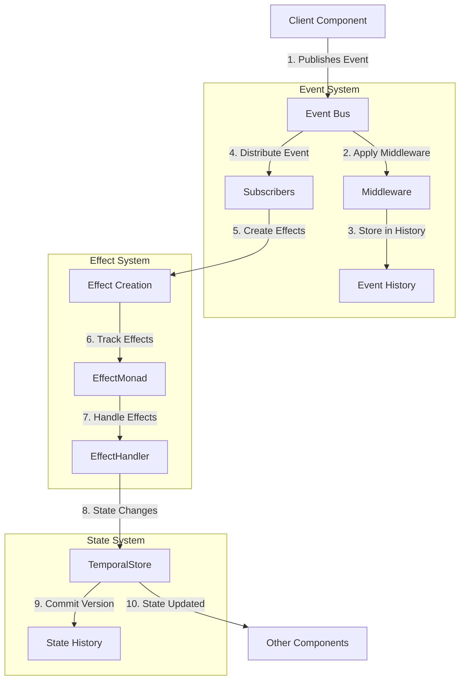

# Event-Driven Architecture

This document describes how the NERV architectural patterns combine to create a comprehensive event-driven architecture for Atlas.

## Overview

Event-Driven Architecture (EDA) in Atlas combines multiple core patterns to create a responsive, decoupled system where components communicate through events rather than direct method calls.

## Component Integration

### Core Components

| Component                                        | Library       | Pattern                                                   | Role in EDA                                   |
| ------------------------------------------------ | ------------- | --------------------------------------------------------- | --------------------------------------------- |
| [EventBus](../components/event_bus.md)           | Blinker       | [Reactive Event Mesh](../patterns/reactive_event_mesh.md) | Central nervous system for event distribution |
| [EffectMonad](../components/effect_monad.md)     | Effect        | [Effect System](../patterns/effect_system.md)             | Tracks side effects of event handlers         |
| [TemporalStore](../components/temporal_store.md) | Eventsourcing | [Temporal Versioning](../patterns/temporal_versioning.md) | Versioned event history for replay/debugging  |
| AspectWeaver                                     | AspectLib     | [Aspect Orientation](../patterns/aspect_orientation.md)   | Cross-cutting concerns injection              |

### Foundational Elements

The EDA implementation is built on these foundational elements:

- [Observable Interface](../patterns/interfaces.md#observablee): Defines event emission behavior
- [Event Data Class](../patterns/types.md#core-data-classes): Structured event representation
- [EventType Enum](../patterns/types.md#core-enumerations): Classification of event types

These elements leverage the [design primitives](../primitives/index.md) such as the Observer pattern.

## Architecture Diagram



## Workflow Description

1. **Event Publication**: Components publish events to the EventBus
2. **Middleware Processing**: Events pass through middleware for transformation/filtering
3. **History Tracking**: Events are stored in history for replay/debugging
4. **Event Distribution**: Events are distributed to registered subscribers
5. **Effect Generation**: Event handlers generate explicit effects
6. **Effect Tracking**: Effects are tracked through the EffectMonad
7. **Effect Handling**: Effects are processed by appropriate handlers
8. **State Updates**: State changes are applied to the TemporalStore
9. **Version Creation**: New state versions are committed with metadata
10. **State Notification**: Other components observe state changes

## Implementation Benefits

Combining these patterns provides several benefits:

1. **Decoupling**: Components don't need direct references to communicate
2. **Traceability**: All events and their effects are explicitly tracked
3. **Debugging**: Event and state history enable time-travel debugging
4. **Testing**: Components can be tested in isolation with simulated events
5. **Extensibility**: New functionality can be added by subscribing to existing events

## Library Integration

This section demonstrates how the different libraries are integrated to form a cohesive event-driven architecture.

### Blinker + Effect + Eventsourcing Integration

```python
from blinker import Signal
from effect import Effect as EffectBase, sync_performer
from eventsourcing.domain import Aggregate, event
from typing import Dict, Any, List, Optional, Callable, TypeVar, Generic
from enum import Enum, auto
from dataclasses import dataclass, field
import uuid
import time
import threading
from collections import defaultdict

# Type definitions
T = TypeVar('T')
EventId = str

# Enums
class EventType(Enum):
    """Core event types in the system."""
    DOCUMENT_CREATED = auto()
    DOCUMENT_UPDATED = auto()
    DOCUMENT_DELETED = auto()
    COMMAND_EXECUTED = auto()
    QUERY_EXECUTED = auto()

class EffectType(Enum):
    """Types of side effects in the system."""
    DATABASE_WRITE = auto()
    DATABASE_READ = auto()
    NOTIFICATION = auto()
    LOGGING = auto()
    FILE_OPERATION = auto()

# Core event structure
@dataclass
class Event(Generic[T]):
    """Core event structure for the event bus."""
    id: EventId = field(default_factory=lambda: str(uuid.uuid4()))
    type: EventType
    data: Optional[T] = None
    timestamp: float = field(default_factory=time.time)
    source: Optional[str] = None
    metadata: Dict[str, Any] = field(default_factory=dict)

# Effect representation
@dataclass
class Effect:
    """Representation of a side effect."""
    type: EffectType
    payload: Any = None
    description: str = ""

# EventBus implementation using Blinker
class EventBus:
    """Central event dispatch system using Blinker signals."""

    def __init__(self, history_limit: int = 1000):
        self._signals: Dict[EventType, Signal] = {}
        self._middleware: List[Callable[[Event[Any]], Optional[Event[Any]]]] = []
        self._history: List[Event[Any]] = []
        self._history_limit = history_limit
        self._lock = threading.RLock()

    def get_signal(self, event_type: EventType) -> Signal:
        """Get or create a signal for an event type."""
        if event_type not in self._signals:
            self._signals[event_type] = Signal(str(event_type))
        return self._signals[event_type]

    def subscribe(self, event_type: EventType,
                 handler: Callable[[Event[Any]], None]) -> Callable[[], None]:
        """Subscribe to events of a specific type."""
        signal = self.get_signal(event_type)

        # Connect handler with weak reference to prevent memory leaks
        signal.connect(handler, weak=True)

        # Return unsubscribe function
        def unsubscribe():
            signal.disconnect(handler)

        return unsubscribe

    def publish(self, event_type: EventType, data: Any = None,
               source: Optional[str] = None) -> EventId:
        """Publish an event to all subscribers."""
        event = Event(type=event_type, data=data, source=source)

        with self._lock:
            # Apply middleware
            current_event = event
            for middleware in self._middleware:
                if current_event is None:
                    return event.id  # Event filtered out
                current_event = middleware(current_event)

            # If event was filtered out by middleware
            if current_event is None:
                return event.id

            # Store in history
            self._history.append(current_event)
            if len(self._history) > self._history_limit:
                self._history = self._history[-self._history_limit:]

        # Send event through signal
        signal = self.get_signal(event_type)
        signal.send(current_event)

        return event.id

    def add_middleware(self, middleware: Callable[[Event[Any]], Optional[Event[Any]]]) -> Callable[[], None]:
        """Add middleware to process events before they reach subscribers."""
        with self._lock:
            self._middleware.append(middleware)

        def remove_middleware():
            with self._lock:
                if middleware in self._middleware:
                    self._middleware.remove(middleware)

        return remove_middleware

    def get_history(self, event_type: Optional[EventType] = None,
                   limit: int = 100) -> List[Event[Any]]:
        """Get recent events from the history."""
        with self._lock:
            if event_type is None:
                history = self._history
            else:
                history = [e for e in self._history if e.type == event_type]

            return list(reversed(history))[:limit]

# EffectMonad implementation
class EffectMonad(Generic[T]):
    """A monad for tracking effects during operations."""

    def __init__(self, value: T, effects: List[Effect] = None):
        self.value = value
        self.effects = effects or []

    @classmethod
    def pure(cls, value: T) -> 'EffectMonad[T]':
        """Create a pure value with no effects."""
        return cls(value, [])

    def with_effect(self, effect: Effect) -> 'EffectMonad[T]':
        """Add an effect to this monadic value."""
        return EffectMonad(self.value, self.effects + [effect])

    def map(self, fn: Callable[[T], Any]) -> 'EffectMonad[Any]':
        """Transform the wrapped value without adding effects."""
        return EffectMonad(fn(self.value), self.effects)

    def bind(self, fn: Callable[[T], 'EffectMonad[Any]']) -> 'EffectMonad[Any]':
        """Chain with another effectful operation."""
        result = fn(self.value)
        return EffectMonad(result.value, self.effects + result.effects)

    def run(self, handler: Callable[[Effect], Any]) -> T:
        """Execute all effects and return the value."""
        for effect in self.effects:
            handler(effect)
        return self.value

# Effect handler implementation
class EffectHandler:
    """Handler for processing effects."""

    def __init__(self, temporal_store=None, event_bus=None):
        self._handlers: Dict[EffectType, Callable[[Effect], Any]] = {}
        self._temporal_store = temporal_store
        self._event_bus = event_bus

    def register_handler(self, effect_type: EffectType,
                        handler: Callable[[Effect], Any]) -> None:
        """Register a handler for a specific effect type."""
        self._handlers[effect_type] = handler

    def handle(self, effect: Effect) -> Any:
        """Handle a specific effect based on its type."""
        if effect.type in self._handlers:
            return self._handlers[effect.type](effect)
        else:
            raise ValueError(f"No handler registered for effect type: {effect.type}")

# Event-sourced document implementation
class Document(Aggregate):
    """An event-sourced document entity."""

    @event
    def created(self, document_id: str, title: str, content: str, author: str):
        self.document_id = document_id
        self.title = title
        self.content = content
        self.author = author
        self.created_at = time.time()
        self.modified_at = self.created_at
        self.version = 1

    @event
    def updated(self, title: Optional[str] = None,
               content: Optional[str] = None, editor: Optional[str] = None):
        if title is not None:
            self.title = title
        if content is not None:
            self.content = content
        self.modified_at = time.time()
        self.last_editor = editor or self.author
        self.version += 1

    @event
    def deleted(self, reason: Optional[str] = None):
        self.is_deleted = True
        self.deleted_at = time.time()
        self.deletion_reason = reason
        self.version += 1

# Temporal store implementation
class TemporalStore:
    """A store for versioned entities using event sourcing."""

    def __init__(self, event_bus=None):
        self.documents: Dict[str, Document] = {}
        self.event_bus = event_bus

    def create_document(self, title: str, content: str, author: str) -> str:"        """Create a new document.""

        document_id = str(uuid.uuid4())
        document = Document(id=document_id)
        document.created(document_id, title, content, author)
        self.documents[document_id] = document

        # Publish event if we have an event bus
        if self.event_bus:
            self.event_bus.publish(
                EventType.DOCUMENT_CREATED,
                {"id": document_id, "title": title, "author": author}
            )

        return document_id

    def update_document(self, document_id: str, title: Optional[str] = None,
                      content: Optional[str] = None, editor: Optional[str] = None) -> bool:
        """Update an existing document."""
        document = self.documents.get(document_id)
        if document:
            document.updated(title, content, editor)

            # Publish event if we have an event bus
            if self.event_bus:
                self.event_bus.publish(
                    EventType.DOCUMENT_UPDATED,
                    {"id": document_id, "title": title, "editor": editor}
                )

            return True
        return False

    def delete_document(self, document_id: str, reason: Optional[str] = None) -> bool:
        """Delete an existing document."""
        document = self.documents.get(document_id)
        if document:
            document.deleted(reason)

            # Publish event if we have an event bus
            if self.event_bus:
                self.event_bus.publish(
                    EventType.DOCUMENT_DELETED,
                    {"id": document_id, "reason": reason}
                )

            return True
        return False

    def get_document(self, document_id: str) -> Optional[Document]:
        """Get a document by ID."""
        return self.documents.get(document_id)

    def get_all_documents(self) -> List[Document]:
        """Get all non-deleted documents."""
        return [doc for doc in self.documents.values()
               if not getattr(doc, "is_deleted", False)]
```

### Integration with Aspect-Oriented Programming

```python
from aspectlib import Aspect, weave, Proceed
import time
import uuid
from typing import Any, Dict, Optional, Callable, List

# Logging aspect
class LoggingAspect:
    """Aspect for logging method calls."""

    def __init__(self, logger=None, event_bus=None):
        self.logger = logger or print
        self.event_bus = event_bus

    def __call__(self, *args, **kwargs):
        frame = Proceed.current_frame()
        fn_name = frame.f_code.co_name
        class_name = frame.f_locals.get('self', None).__class__.__name__ if 'self' in frame.f_locals else None

        # Generate request ID for tracking
        request_id = str(uuid.uuid4())
        start_time = time.time()

        # Log entry
        self.logger(f"[{request_id}] ENTER {class_name}.{fn_name} - Args: {args}, Kwargs: {kwargs}")

        try:
            # Execute the original method
            result = Proceed(*args, **kwargs)

            # Calculate execution time
            execution_time = time.time() - start_time

            # Log exit with success
            self.logger(f"[{request_id}] EXIT {class_name}.{fn_name} - Time: {execution_time:.4f}s - Success")

            return result

        except Exception as e:
            # Calculate execution time
            execution_time = time.time() - start_time

            # Log exit with error
            self.logger(f"[{request_id}] ERROR {class_name}.{fn_name} - Time: {execution_time:.4f}s - Error: {type(e).__name__}: {str(e)}")

            # Publish error event if we have an event bus
            if self.event_bus:
                self.event_bus.publish(
                    EventType.ERROR,
                    {
                        "request_id": request_id,
                        "class": class_name,
                        "method": fn_name,
                        "error_type": type(e).__name__,
                        "error_message": str(e),
                        "execution_time": execution_time
                    }
                )

            # Re-raise the exception
            raise

# Metrics tracking aspect
class MetricsAspect:
    """Aspect for collecting method execution metrics."""

    def __init__(self, metrics_collector=None):
        self.metrics = {}
        self.metrics_collector = metrics_collector

    def __call__(self, *args, **kwargs):
        frame = Proceed.current_frame()
        fn_name = frame.f_code.co_name
        class_name = frame.f_locals.get('self', None).__class__.__name__ if 'self' in frame.f_locals else None

        method_key = f"{class_name}.{fn_name}" if class_name else fn_name

        # Initialize metrics for this method if not exists
        if method_key not in self.metrics:
            self.metrics[method_key] = {
                "count": 0,
                "total_time": 0,
                "min_time": float('inf'),
                "max_time": 0,
                "errors": 0
            }

        # Increment invocation count
        self.metrics[method_key]["count"] += 1

        # Record start time
        start_time = time.time()

        try:
            # Execute the original method
            result = Proceed(*args, **kwargs)

            # Calculate execution time
            execution_time = time.time() - start_time

            # Update metrics
            self.metrics[method_key]["total_time"] += execution_time
            self.metrics[method_key]["min_time"] = min(self.metrics[method_key]["min_time"], execution_time)
            self.metrics[method_key]["max_time"] = max(self.metrics[method_key]["max_time"], execution_time)

            # Send metrics if we have a collector
            if self.metrics_collector:
                self.metrics_collector.record(
                    method_key,
                    execution_time,
                    success=True
                )

            return result

        except Exception:
            # Increment error count
            self.metrics[method_key]["errors"] += 1

            # Calculate execution time
            execution_time = time.time() - start_time

            # Send metrics if we have a collector
            if self.metrics_collector:
                self.metrics_collector.record(
                    method_key,
                    execution_time,
                    success=False
                )

            # Re-raise the exception
            raise

    def get_metrics(self) -> Dict[str, Dict[str, Any]]:
        """Get collected metrics."""
        # Calculate averages
        result = {}
        for method, metrics in self.metrics.items():
            result[method] = metrics.copy()
            if metrics["count"] > 0:
                result[method]["avg_time"] = metrics["total_time"] / metrics["count"]
                result[method]["error_rate"] = metrics["errors"] / metrics["count"]
        return result

# Aspect weaver
class AspectWeaver:
    """Manages the application of aspects to components."""

    def __init__(self):
        self.aspects = {}
        self.applied_aspects = {}

    def register_aspect(self, name: str, aspect: Any) -> None:
        """Register an aspect for later use."""
        self.aspects[name] = aspect

    def apply_aspect(self, aspect_name: str, target: Any) -> Any:
        """Apply a registered aspect to a target."""
        if aspect_name not in self.aspects:
            raise ValueError(f"Unknown aspect: {aspect_name}")

        aspect = self.aspects[aspect_name]
        patched = weave(target, aspect)

        # Track which targets have which aspects
        target_id = id(target)
        if target_id not in self.applied_aspects:
            self.applied_aspects[target_id] = []
        self.applied_aspects[target_id].append(aspect_name)

        return patched

    def get_applied_aspects(self, target: Any) -> List[str]:
        """Get all aspects applied to a target."""
        return self.applied_aspects.get(id(target), [])
```

## Complete Event-Driven Application Example

Here's a complete example showing how all components work together in a cohesive event-driven architecture:

```python
# First, set up the base components
event_bus = EventBus()
temp_store = TemporalStore(event_bus=event_bus)
effect_handler = EffectHandler(temporal_store=temp_store, event_bus=event_bus)

# Set up aspects
logging_aspect = LoggingAspect(event_bus=event_bus)
metrics_aspect = MetricsAspect()
aspect_weaver = AspectWeaver()

# Register aspects
aspect_weaver.register_aspect("logging", logging_aspect)
aspect_weaver.register_aspect("metrics", metrics_aspect)

# Set up effect handlers
def handle_database_write(effect):
    print(f"Handling database write: {effect.description}")
    # Actual database operation would go here
    return {"success": True}

def handle_notification(effect):
    print(f"Sending notification: {effect.description}")
    # Actual notification sending would go here
    return {"success": True}

def handle_logging(effect):
    print(f"Logging effect: {effect.description}")
    # Actual logging would go here
    return {"success": True}

# Register effect handlers
effect_handler.register_handler(EffectType.DATABASE_WRITE, handle_database_write)
effect_handler.register_handler(EffectType.NOTIFICATION, handle_notification)
effect_handler.register_handler(EffectType.LOGGING, handle_logging)

# Document service that uses the event-driven architecture
class DocumentService:
    def __init__(self, event_bus, temporal_store, effect_handler):
        self.event_bus = event_bus
        self.temporal_store = temporal_store
        self.effect_handler = effect_handler

        # Subscribe to document events
        self.event_bus.subscribe(EventType.DOCUMENT_CREATED, self._handle_document_created)
        self.event_bus.subscribe(EventType.DOCUMENT_UPDATED, self._handle_document_updated)
        self.event_bus.subscribe(EventType.DOCUMENT_DELETED, self._handle_document_deleted)

    def create_document(self, title, content, author):
        # Create an effect chain
        effect_monad = EffectMonad.pure({"title": title, "content": content, "author": author})

        # Add effects
        effect_monad = effect_monad.with_effect(
            Effect(
                EffectType.DATABASE_WRITE,
                {"operation": "create", "title": title, "author": author},
                f"Creating document: {title}"
            )
        )

        effect_monad = effect_monad.with_effect(
            Effect(
                EffectType.LOGGING,
                {"author": author, "action": "create"},
                f"Document created by {author}"
            )
        )

        # Execute effects and transform result
        result = effect_monad.map(
            lambda data: self.temporal_store.create_document(
                data["title"], data["content"], data["author"]
            )
        ).run(self.effect_handler)

        return result

    def update_document(self, document_id, title=None, content=None, editor=None):
        # Get document to verify it exists
        document = self.temporal_store.get_document(document_id)
        if not document:
            raise ValueError(f"Document not found: {document_id}")

        # Create an effect chain
        effect_monad = EffectMonad.pure({
            "id": document_id,
            "title": title,
            "content": content,
            "editor": editor
        })

        # Add effects
        effect_monad = effect_monad.with_effect(
            Effect(
                EffectType.DATABASE_WRITE,
                {"operation": "update", "id": document_id},
                f"Updating document: {document_id}"
            )
        )

        effect_monad = effect_monad.with_effect(
            Effect(
                EffectType.NOTIFICATION,
                {"recipient": document.author, "document_id": document_id},
                f"Document '{document.title}' was updated by {editor or 'unknown'}"
            )
        )

        # Execute effects and transform result
        result = effect_monad.map(
            lambda data: self.temporal_store.update_document(
                data["id"], data["title"], data["content"], data["editor"]
            )
        ).run(self.effect_handler)

        return result

    def delete_document(self, document_id, reason=None):
        # Get document to verify it exists
        document = self.temporal_store.get_document(document_id)
        if not document:
            raise ValueError(f"Document not found: {document_id}")

        # Create an effect chain
        effect_monad = EffectMonad.pure({"id": document_id, "reason": reason})

        # Add effects
        effect_monad = effect_monad.with_effect(
            Effect(
                EffectType.DATABASE_WRITE,
                {"operation": "delete", "id": document_id},
                f"Deleting document: {document_id}"
            )
        )

        effect_monad = effect_monad.with_effect(
            Effect(
                EffectType.NOTIFICATION,
                {"recipient": document.author, "document_id": document_id},
                f"Document '{document.title}' was deleted"
            )
        )

        # Execute effects and transform result
        result = effect_monad.map(
            lambda data: self.temporal_store.delete_document(
                data["id"], data["reason"]
            )
        ).run(self.effect_handler)

        return result

    def get_document(self, document_id):
        effect_monad = EffectMonad.pure(document_id)

        # Add effects
        effect_monad = effect_monad.with_effect(
            Effect(
                EffectType.DATABASE_READ,
                {"id": document_id},
                f"Reading document: {document_id}"
            )
        )

        # Execute effects and transform result
        result = effect_monad.map(
            lambda id: self.temporal_store.get_document(id)
        ).run(self.effect_handler)

        return result

    def _handle_document_created(self, event):
        print(f"Document created event received: {event.data}")
        # Additional handling logic can go here

    def _handle_document_updated(self, event):
        print(f"Document updated event received: {event.data}")
        # Additional handling logic can go here

    def _handle_document_deleted(self, event):
        print(f"Document deleted event received: {event.data}")
        # Additional handling logic can go here

# Create the service
doc_service = DocumentService(event_bus, temp_store, effect_handler)

# Apply aspects to service methods
doc_service.create_document = aspect_weaver.apply_aspect("logging", doc_service.create_document)
doc_service.create_document = aspect_weaver.apply_aspect("metrics", doc_service.create_document)
doc_service.update_document = aspect_weaver.apply_aspect("logging", doc_service.update_document)
doc_service.delete_document = aspect_weaver.apply_aspect("logging", doc_service.delete_document)

# Now we can use the service with event-driven architecture
# Create a document
doc_id = doc_service.create_document(
    "Event-Driven Architecture with NERV",
    "This document explains how to implement event-driven architecture...",
    "alice@example.com"
)

# Update the document
doc_service.update_document(
    doc_id,
    content="Updated content about event-driven architecture with NERV...",
    editor="bob@example.com"
)

# Get recent events
recent_events = event_bus.get_history(limit=5)
for event in recent_events:
    print(f"Event: {event.type.name}, Data: {event.data}")

# Get metrics
print("\nMethod metrics:")
for method, metrics in metrics_aspect.get_metrics().items():
    print(f"{method}: {metrics['count']} calls, Avg time: {metrics.get('avg_time', 0):.4f}s")
```

## Performance Considerations

When implementing Event-Driven Architecture with these components, consider these performance optimizations:

1. **EventBus with Blinker**
   - Use weak references in signal connections to prevent memory leaks: `signal.connect(handler, weak=True)`
   - Implement a separate background thread for processing events if handlers are slow
   - Consider batching events during high-volume periods
   - Use a bounded history buffer to limit memory growth

2. **EffectMonad with Effect**
   - Batch similar effects when possible
   - Implement effect caching for idempotent operations
   - Use lazy effect evaluation for expensive operations
   - Consider effect prioritization for critical operations

3. **TemporalStore with Eventsourcing**
   - Create periodic snapshots for faster reconstruction of frequently accessed entities
   - Implement event pruning or archiving strategies for long-lived entities
   - Use event compression for storage efficiency
   - Consider separate read models for query performance

4. **AspectWeaver with AspectLib**
   - Be selective about which methods to apply aspects to
   - Keep aspect logic lightweight to minimize overhead
   - Consider conditional aspect application based on runtime conditions
   - Use sampling for high-throughput methods if metrics collection is expensive

## Integration with Atlas

This event-driven architecture integrates with Atlas's core components:

1. **Provider System**
   - Provider lifecycle events (creation, connection, disconnection)
   - API call tracking with the Effect System
   - Provider capability discovery with EventBus

2. **Agent Framework**
   - Agent lifecycle management using EventBus
   - Inter-agent communication through events
   - Task execution tracking with EffectMonad

3. **Knowledge System**
   - Document addition and processing events
   - Versioned document storage with TemporalStore
   - Retrieval operations tracked as effects

4. **Orchestration**
   - Workflow state transitions as events
   - Cross-component coordination through EventBus
   - Parallel execution with QuantumPartitioner

## Advanced Patterns

The basic EDA can be extended with these advanced patterns:

### Event Sourcing

Using the Temporal Versioning pattern to store a complete history of events as the source of truth, enabling:

- Complete system reconstruction from event history
- Event replay for debugging or testing
- Auditing of all system actions

### Command-Query Responsibility Segregation (CQRS)

Separating read and write operations using the Perspective Shifting pattern:

- Command side: Changes state through events
- Query side: Reads optimized projections of state
- Different models for different needs

### Saga Pattern

Managing distributed transactions using events and the Effect System:

- Long-running transactions as event sequences
- Compensating actions for failures
- Explicit tracking of transaction state

## Integration Points

This pattern integrates with other composite patterns:

- [Parallel Workflow Engine](parallel_workflow_engine.md): Execute event-triggered workflows in parallel
- [Adaptive State Management](adaptive_state_management.md): Event-driven state management with history
