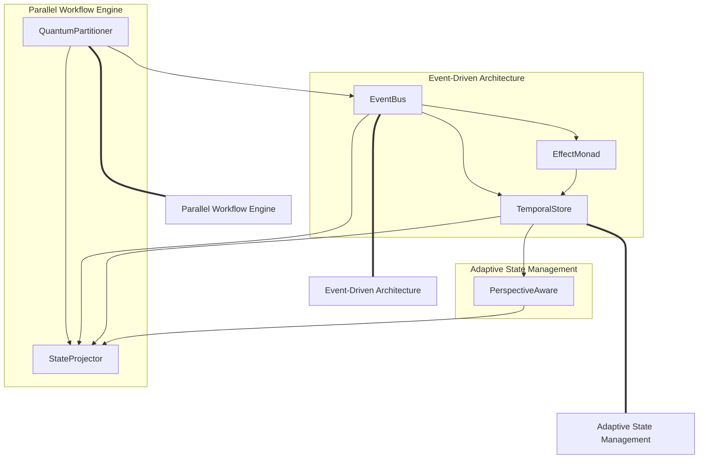

# NERV Composite Systems

This document provides an overview of the composite systems built by combining NERV components. These composite systems demonstrate how the individual architectural patterns and components can be integrated to create powerful, comprehensive architectural solutions.

## Composite System Overview

NERV defines three primary composite systems that solve common architectural challenges:

| System                                                    | Components                                      | Purpose                          |
| --------------------------------------------------------- | ----------------------------------------------- | -------------------------------- |
| [Event-Driven Architecture](event_driven_architecture.md) | EventBus, EffectMonad, TemporalStore            | Reactive, decoupled system       |
| [Parallel Workflow Engine](parallel_workflow_engine.md)   | QuantumPartitioner, EventBus, StateProjector    | Efficient workflow execution     |
| [Adaptive State Management](adaptive_state_management.md) | TemporalStore, PerspectiveAware, StateProjector | Context-aware state with history |

## Composite Architecture Visualization

The composite systems integrate multiple components to create cohesive architectures:

## Composite System Benefits

Each composite system provides specific architectural benefits:

### Event-Driven Architecture

- **Decoupling**: Components communicate without direct references
- **Reactivity**: System responds automatically to events
- **Extensibility**: New behaviors can be added without modifying existing code
- **Traceability**: All system events are tracked and can be audited
- **Reproducibility**: Event history enables replay and debugging

### Parallel Workflow Engine

- **Efficiency**: Maximizes parallel execution where possible
- **Dependency Management**: Respects execution order requirements
- **Scalability**: Adapts to available computing resources
- **Fault Tolerance**: Handles failures in individual units
- **Observability**: Provides detailed execution metrics and status

### Adaptive State Management

- **History Tracking**: Complete state history with version navigation
- **Multiple Perspectives**: Different views of the same state for different contexts
- **Efficiency**: Delta-based state tracking for optimal performance
- **Auditability**: Every state change is tracked with metadata
- **Time Travel**: Navigate to any point in state history

## Integration with Atlas

These composite systems are designed to integrate with Atlas's core architecture:

| System                        | Atlas Integration Points                                                  |
| ----------------------------- | ------------------------------------------------------------------------- |
| **Event-Driven Architecture** | Provider lifecycle, agent communication, workflow state transitions       |
| **Parallel Workflow Engine**  | Multi-agent coordination, parallel task execution, workflow orchestration |
| **Adaptive State Management** | Configuration management, session state, document representation          |

## Implementation Strategy

The implementation of these composite systems follows a layered approach:

1. **[Primitive Patterns](../primitives/index.md)**: Foundational design patterns
2. **[Architectural Patterns](../patterns/index.md)**: Core NERV architectural patterns
3. **[Components](../components/index.md)**: Concrete implementations of patterns
4. **Composite Systems**: Integration of components into cohesive architectures

This approach ensures that each composite system builds on a solid foundation of well-defined, tested components.

## Learn More

Explore each composite system in detail:

- [Event-Driven Architecture](event_driven_architecture.md): Reactive, decoupled system
- [Parallel Workflow Engine](parallel_workflow_engine.md): Efficient workflow execution
- [Adaptive State Management](adaptive_state_management.md): Context-aware state with history
