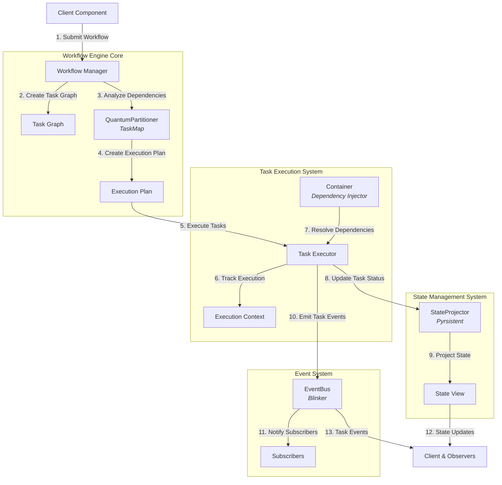

# Parallel Workflow Engine

This document describes how NERV's architectural patterns combine to create a powerful parallel workflow execution engine for Atlas.

## Overview

The Parallel Workflow Engine integrates multiple NERV patterns with modern Python libraries to maximize processing efficiency while respecting task dependencies, enabling optimal utilization of computing resources for complex workflows. It serves as a cornerstone composite system that implements high-level orchestration for multi-agent systems in Atlas.

## Library Integration

The Parallel Workflow Engine leverages four primary libraries working in concert:

| Library                 | Purpose                             | Key Features                                                     |
| ----------------------- | ----------------------------------- | ---------------------------------------------------------------- |
| **TaskMap**             | Dependency-based task execution     | Task graphs, parallel execution, dependency resolution           |
| **Blinker**             | Event signaling and message passing | Signal management, weak references, broadcast/narrowcast         |
| **Pyrsistent**          | Immutable state management          | Persistent data structures, state transitions, efficient sharing |
| **Dependency Injector** | Component wiring and configuration  | Container management, factory providers, singleton providers     |

### TaskMap Integration

TaskMap provides the core parallel execution engine that powers the QuantumPartitioner:

| Feature            | Implementation              | Usage in NERV                                   |
| ------------------ | --------------------------- | ----------------------------------------------- |
| Task Graphs        | `create_graph` function     | Constructs execution graphs from dependencies   |
| Parallel Execution | `execute_parallel` function | Efficiently executes tasks across worker pools  |
| Execution State    | `State` class               | Tracks execution state and intermediate results |
| Workers Management | Worker pool configuration   | CPU and I/O optimization based on task types    |

### Blinker Integration

Blinker powers the EventBus with robust signaling capabilities:

| Feature           | Implementation        | Usage in NERV                           |
| ----------------- | --------------------- | --------------------------------------- |
| Signal Objects    | `Signal` class        | Represents distinct event channels      |
| Weak References   | Connection management | Prevents memory leaks in event handlers |
| Anonymous Signals | Named signals         | Enables central event registry          |
| Sender Filtering  | Signal dispatch       | Targeted event delivery                 |

### Pyrsistent Integration

Pyrsistent provides immutable data structures for the StateProjector:

| Feature            | Implementation           | Usage in NERV                              |
| ------------------ | ------------------------ | ------------------------------------------ |
| Persistent Maps    | `pmap` and `m` functions | Efficient immutable dictionaries           |
| Deep Freezing      | `freeze` function        | Converting mutable to immutable structures |
| Thawing            | `thaw` function          | Creating mutable copies for updates        |
| Structural Sharing | Internal implementation  | Memory-efficient state transitions         |

### Dependency Injector Integration

Dependency Injector manages component wiring and configuration:

| Feature                 | Implementation                    | Usage in NERV                |
| ----------------------- | --------------------------------- | ---------------------------- |
| Containers              | `containers.DeclarativeContainer` | Component registries         |
| Singleton Providers     | `providers.Singleton`             | Single-instance services     |
| Factory Providers       | `providers.Factory`               | Task and component factories |
| Configuration Providers | `providers.Configuration`         | Centralized configuration    |

## Component Integration

### Core Components

| Component                                                  | Implementation Library | Pattern                                                     | Role in Engine                                |
| ---------------------------------------------------------- | ---------------------- | ----------------------------------------------------------- | --------------------------------------------- |
| [QuantumPartitioner](../components/quantum_partitioner.md) | TaskMap                | [Quantum Partitioning](../patterns/quantum_partitioning.md) | Determines optimal parallel execution order   |
| [EventBus](../components/event_bus.md)                     | Blinker                | [Reactive Event Mesh](../patterns/reactive_event_mesh.md)   | Coordinates task execution and status updates |
| [StateProjector](../components/state_projector.md)         | Pyrsistent             | [State Projection](../patterns/state_projection.md)         | Manages workflow state transitions            |
| [Container](../components/container.md)                    | Dependency Injector    | [Dependency Inversion](../patterns/dependency_inversion.md) | Provides component wiring and task factories  |

### Foundational Elements

The Parallel Workflow Engine is built on these foundational elements:

- [Executable Interface](../patterns/interfaces.md#executable): Defines task execution behavior
- [TaskDef Data Class](../patterns/types.md#core-data-classes): Represents tasks with dependencies
- [TaskResult Data Class](../patterns/types.md#core-data-classes): Contains results of task execution
- [TaskStatus Enum](../patterns/types.md#core-enumerations): Tracks task execution states

These elements leverage [design primitives](../primitives/index.md) such as the Strategy and Command patterns.

## Architecture Diagram



## Workflow Description

1. **Workflow Submission**: Client submits a workflow definition
2. **Task Graph Creation**: Workflow is converted to a task dependency graph
3. **Dependency Analysis**: QuantumPartitioner analyzes task dependencies
4. **Plan Creation**: An optimal execution plan is generated based on dependencies
5. **Task Execution**: Tasks are executed respecting the dependency order
6. **Execution Tracking**: Context maintains execution state and intermediary results
7. **Dependency Resolution**: Container provides dependencies for task execution
8. **Status Updates**: StateProjector maintains immutable task status records
9. **State Projection**: Different views of execution state are generated
10. **Event Emission**: TaskExecutor emits events for significant task state changes
11. **Notification**: Subscribers react to task execution events
12. **State Visibility**: Clients and observers receive state updates
13. **Event Stream**: Clients receive task execution events

## Implementation Example

Here's a comprehensive implementation showing how the libraries integrate:

```python
from typing import Dict, List, Any, Set, Optional, Callable, TypeVar, Generic, Union, NamedTuple
import time
import uuid
from dataclasses import dataclass, field
from enum import Enum, auto
import threading
import concurrent.futures
from collections import defaultdict
import os

# TaskMap for dependency-based execution
from taskmap import create_graph, execute_parallel, State

# Blinker for event dispatch
from blinker import Signal

# Pyrsistent for immutable data structures
from pyrsistent import pmap, m, freeze, thaw

# Dependency Injector for component wiring
from dependency_injector import containers, providers

# Type definitions
T = TypeVar('T')  # Task result type
TaskId = str


class TaskStatus(Enum):
    """Task execution status."""
    PENDING = auto()
    RUNNING = auto()
    COMPLETED = auto()
    FAILED = auto()
    SKIPPED = auto()
    CANCELLED = auto()


class TaskPriority(Enum):
    """Priority levels for tasks."""
    LOW = 0
    MEDIUM = 1
    HIGH = 2
    CRITICAL = 3


@dataclass
class TaskMetadata:
    """Metadata for tasks."""
    created_at: float = field(default_factory=time.time)
    updated_at: float = field(default_factory=time.time)
    scheduled_at: Optional[float] = None
    started_at: Optional[float] = None
    completed_at: Optional[float] = None
    timeout_at: Optional[float] = None
    creator: Optional[str] = None
    tags: Set[str] = field(default_factory=set)
    retry_count: int = 0
    max_retries: int = 0


@dataclass
class TaskResult(Generic[T]):
    """Result of a task execution."""
    task_id: TaskId
    status: TaskStatus
    result: Optional[T] = None
    error: Optional[Exception] = None
    execution_time: float = 0.0
    metadata: Dict[str, Any] = field(default_factory=dict)


@dataclass
class TaskDef:
    """Definition of a workflow task."""
    id: TaskId = field(default_factory=lambda: str(uuid.uuid4()))
    name: str = ""
    description: str = ""
    dependencies: List[TaskId] = field(default_factory=list)
    fn: Optional[Callable] = None
    args: tuple = field(default_factory=tuple)
    kwargs: Dict[str, Any] = field(default_factory=dict)
    priority: TaskPriority = TaskPriority.MEDIUM
    timeout: Optional[float] = None
    retry_policy: Optional[Dict[str, Any]] = None
    metadata: TaskMetadata = field(default_factory=TaskMetadata)


class EventType(Enum):
    """Event types for workflow execution."""
    WORKFLOW_CREATED = auto()
    WORKFLOW_STARTED = auto()
    WORKFLOW_COMPLETED = auto()
    WORKFLOW_FAILED = auto()
    TASK_PENDING = auto()
    TASK_STARTED = auto()
    TASK_COMPLETED = auto()
    TASK_FAILED = auto()
    TASK_SKIPPED = auto()
    TASK_CANCELLED = auto()


@dataclass
class Event(Generic[T]):
    """Event representation for the event bus."""
    id: str = field(default_factory=lambda: str(uuid.uuid4()))
    type: EventType
    data: Optional[T] = None
    timestamp: float = field(default_factory=time.time)
    source: Optional[str] = None


class EventBus:
    """Central event dispatch system using Blinker signals."""

    def __init__(self, history_limit: int = 1000):
        self._signals: Dict[EventType, Signal] = {}
        self._middleware: List[Callable[[Event[Any]], Optional[Event[Any]]]] = []
        self._history: List[Event[Any]] = []
        self._history_limit = history_limit
        self._lock = threading.RLock()

    def get_signal(self, event_type: EventType) -> Signal:
        """Get or create a signal for an event type."""
        with self._lock:
            if event_type not in self._signals:
                self._signals[event_type] = Signal(str(event_type))
            return self._signals[event_type]

    def subscribe(self, event_type: EventType,
                 handler: Callable[[Event[Any]], None]) -> Callable[[], None]:
        """Subscribe to events of a specific type."""
        signal = self.get_signal(event_type)

        # Connect handler with weak reference to prevent memory leaks
        signal.connect(handler, weak=True)

        # Return unsubscribe function
        def unsubscribe():
            signal.disconnect(handler)

        return unsubscribe

    def publish(self, event_type: EventType, data: Any = None,
               source: Optional[str] = None) -> str:
        """Publish an event to all subscribers."""
        event = Event(type=event_type, data=data, source=source)

        with self._lock:
            # Apply middleware
            current_event = event
            for middleware in self._middleware:
                if current_event is None:
                    return event.id  # Event filtered out
                current_event = middleware(current_event)

            # If event was filtered out by middleware
            if current_event is None:
                return event.id

            # Store in history
            self._history.append(current_event)
            if len(self._history) > self._history_limit:
                self._history = self._history[-self._history_limit:]

        # Send event through signal
        signal = self.get_signal(event_type)
        signal.send(current_event)

        return event.id


class StateProjector:
    """Manages state projections with immutable data structures using Pyrsistent."""

    def __init__(self, initial_state: Dict[str, Any]):
        # Convert to persistent data structure
        self._initial_state = freeze(initial_state)
        self._current_state = self._initial_state
        self._projections: Dict[str, Callable[[Any], Any]] = {}

    def update_state(self, updater: Callable[[Dict[str, Any]], Dict[str, Any]]) -> Dict[str, Any]:
        """Update state with a function."""
        # Create mutable version for updater function
        mutable_state = thaw(self._current_state)

        # Apply update
        new_mutable_state = updater(mutable_state)

        # Convert back to immutable
        self._current_state = freeze(new_mutable_state)
        return self._current_state

    def get_state(self) -> Dict[str, Any]:
        """Get current state."""
        return self._current_state

    def add_projection(self, name: str, projection_fn: Callable[[Dict[str, Any]], Any]) -> None:
        """Add a named projection function."""
        self._projections[name] = projection_fn

    def project(self, name: str) -> Optional[Any]:
        """Get a specific projection of the current state."""
        if name in self._projections:
            return self._projections[name](self._current_state)
        return None

    def reset(self) -> None:
        """Reset to initial state."""
        self._current_state = self._initial_state


class Services(containers.DeclarativeContainer):
    """Container for all workflow services."""

    # Service providers
    event_bus = providers.Singleton(EventBus)
    state_projector = providers.Singleton(
        StateProjector,
        initial_state={"tasks": {}, "workflows": {}}
    )

    # Task factory
    task_factory = providers.Factory(TaskDef)


class QuantumPartitioner:
    """Dependency-based task partitioning using TaskMap."""

    def __init__(self, max_workers: int = None):
        self.max_workers = max_workers or min(32, (os.cpu_count() or 1) + 4)

    def analyze_dependencies(self, tasks: List[TaskDef]) -> Dict[TaskId, List[TaskId]]:
        """Analyze task dependencies and return dependency map."""
        dependency_map = {}
        for task in tasks:
            dependency_map[task.id] = task.dependencies
        return dependency_map

    def create_execution_plan(self, tasks: List[TaskDef]) -> Dict[str, Any]:
        """Create an execution plan based on task dependencies."""
        # Create task lookup
        task_map = {task.id: task for task in tasks}

        # Create dependency map
        dependency_map = self.analyze_dependencies(tasks)

        # Calculate levels (tasks at the same level can run in parallel)
        levels = self._calculate_levels(dependency_map)

        # Sort within levels by priority
        for level in levels:
            level.sort(key=lambda task_id: task_map[task_id].priority.value, reverse=True)

        return {
            "levels": levels,
            "dependencies": dependency_map,
            "task_map": task_map
        }

    def execute_workflow(self, tasks: List[TaskDef],
                        context: Dict[str, Any] = None) -> Dict[TaskId, TaskResult]:
        """Execute tasks respecting dependencies."""
        # Prepare context
        execution_context = context or {}

        # Create task functions map
        funcs = {}
        for task in tasks:
            task_fn = task.fn

            # Create wrapper function that includes args/kwargs
            def task_wrapper(task_def=task, ctx=execution_context):
                try:
                    start_time = time.time()

                    # Call the actual function with context and arguments
                    result = task_def.fn(ctx, *task_def.args, **task_def.kwargs)

                    # Create task result
                    task_result = TaskResult(
                        task_id=task_def.id,
                        status=TaskStatus.COMPLETED,
                        result=result,
                        execution_time=time.time() - start_time
                    )
                    return task_result
                except Exception as e:
                    execution_time = time.time() - start_time
                    # Create failure result
                    task_result = TaskResult(
                        task_id=task_def.id,
                        status=TaskStatus.FAILED,
                        error=e,
                        execution_time=execution_time
                    )
                    return task_result

            funcs[task.id] = task_wrapper

        # Get dependencies
        dependencies = {task.id: task.dependencies for task in tasks}

        # Use TaskMap to execute with dependency tracking
        graph = create_graph(funcs, dependencies)
        results = execute_parallel(graph, [execution_context], nprocs=self.max_workers)

        return results

    def _calculate_levels(self, dependencies: Dict[TaskId, List[TaskId]]) -> List[List[TaskId]]:
        """Calculate execution levels based on dependencies."""
        task_ids = set(dependencies.keys())

        # Track tasks with no unmet dependencies
        no_deps = {tid for tid, deps in dependencies.items() if not deps}

        # Track which tasks are not yet scheduled
        remaining = task_ids - no_deps

        # Keep track of satisfied dependencies
        satisfied = set(no_deps)

        # Build levels
        levels = []

        # First level is tasks with no dependencies
        if no_deps:
            levels.append(list(no_deps))

        # Continue until all tasks are scheduled
        while remaining:
            # Find tasks whose dependencies are satisfied
            next_level = set()

            for task_id in remaining:
                deps = dependencies[task_id]
                if all(dep in satisfied for dep in deps):
                    next_level.add(task_id)

            # If we can't make progress, there might be a circular dependency
            if not next_level:
                raise ValueError("Circular dependency detected in tasks")

            # Add the new level
            levels.append(list(next_level))

            # Update tracking
            satisfied.update(next_level)
            remaining -= next_level

        return levels


class WorkflowManager:
    """Manages workflow execution using the parallel workflow engine."""

    def __init__(self,
                event_bus: EventBus,
                state_projector: StateProjector,
                quantum_partitioner: QuantumPartitioner,
                container: containers.Container):

        self.event_bus = event_bus
        self.state_projector = state_projector
        self.quantum_partitioner = quantum_partitioner
        self.container = container
        self._lock = threading.RLock()
        self._workflows = {}

        # Set up state projections
        self._setup_projections()

        # Subscribe to events
        self._subscribe_to_events()

    def _setup_projections(self):
        """Set up state projections for different views."""
        # Add task status projection
        self.state_projector.add_projection(
            "task_status",
            lambda state: {
                task_id: task.get("status")
                for task_id, task in state.get("tasks", {}).items()
            }
        )

        # Add workflow status projection
        self.state_projector.add_projection(
            "workflow_status",
            lambda state: {
                workflow_id: workflow.get("status")
                for workflow_id, workflow in state.get("workflows", {}).items()
            }
        )

        # Add completed tasks projection
        self.state_projector.add_projection(
            "completed_tasks",
            lambda state: [
                task_id for task_id, task in state.get("tasks", {}).items()
                if task.get("status") == TaskStatus.COMPLETED.name
            ]
        )

        # Add failed tasks projection
        self.state_projector.add_projection(
            "failed_tasks",
            lambda state: [
                task_id for task_id, task in state.get("tasks", {}).items()
                if task.get("status") == TaskStatus.FAILED.name
            ]
        )

    def _subscribe_to_events(self):
        """Subscribe to relevant events."""
        self.event_bus.subscribe(
            EventType.TASK_STARTED,
            self._handle_task_started
        )

        self.event_bus.subscribe(
            EventType.TASK_COMPLETED,
            self._handle_task_completed
        )

        self.event_bus.subscribe(
            EventType.TASK_FAILED,
            self._handle_task_failed
        )

        self.event_bus.subscribe(
            EventType.WORKFLOW_STARTED,
            self._handle_workflow_started
        )

        self.event_bus.subscribe(
            EventType.WORKFLOW_COMPLETED,
            self._handle_workflow_completed
        )

    def _handle_task_started(self, event):
        """Handle task started event."""
        task_id = event.data["task_id"]

        # Update state
        self.state_projector.update_state(
            lambda state: {
                **state,
                "tasks": {
                    **state.get("tasks", {}),
                    task_id: {
                        **state.get("tasks", {}).get(task_id, {}),
                        "status": TaskStatus.RUNNING.name,
                        "started_at": event.timestamp
                    }
                }
            }
        )

    def _handle_task_completed(self, event):
        """Handle task completed event."""
        task_id = event.data["task_id"]
        result = event.data.get("result")

        # Update state
        self.state_projector.update_state(
            lambda state: {
                **state,
                "tasks": {
                    **state.get("tasks", {}),
                    task_id: {
                        **state.get("tasks", {}).get(task_id, {}),
                        "status": TaskStatus.COMPLETED.name,
                        "completed_at": event.timestamp,
                        "result": result
                    }
                }
            }
        )

    def _handle_task_failed(self, event):
        """Handle task failed event."""
        task_id = event.data["task_id"]
        error = event.data.get("error")

        # Update state
        self.state_projector.update_state(
            lambda state: {
                **state,
                "tasks": {
                    **state.get("tasks", {}),
                    task_id: {
                        **state.get("tasks", {}).get(task_id, {}),
                        "status": TaskStatus.FAILED.name,
                        "completed_at": event.timestamp,
                        "error": str(error)
                    }
                }
            }
        )

    def _handle_workflow_started(self, event):
        """Handle workflow started event."""
        workflow_id = event.data["workflow_id"]

        # Update state
        self.state_projector.update_state(
            lambda state: {
                **state,
                "workflows": {
                    **state.get("workflows", {}),
                    workflow_id: {
                        **state.get("workflows", {}).get(workflow_id, {}),
                        "status": "RUNNING",
                        "started_at": event.timestamp
                    }
                }
            }
        )

    def _handle_workflow_completed(self, event):
        """Handle workflow completed event."""
        workflow_id = event.data["workflow_id"]
        status = event.data["status"]

        # Update state
        self.state_projector.update_state(
            lambda state: {
                **state,
                "workflows": {
                    **state.get("workflows", {}),
                    workflow_id: {
                        **state.get("workflows", {}).get(workflow_id, {}),
                        "status": status,
                        "completed_at": event.timestamp
                    }
                }
            }
        )

    def create_workflow(self, name: str, description: str = "",
                       tasks: List[TaskDef] = None) -> str:
        """Create a new workflow definition."""
        workflow_id = str(uuid.uuid4())

        with self._lock:
            self._workflows[workflow_id] = {
                "id": workflow_id,
                "name": name,
                "description": description,
                "tasks": tasks or [],
                "created_at": time.time(),
                "status": "CREATED"
            }

        # Update state
        self.state_projector.update_state(
            lambda state: {
                **state,
                "workflows": {
                    **state.get("workflows", {}),
                    workflow_id: {
                        "id": workflow_id,
                        "name": name,
                        "description": description,
                        "created_at": time.time(),
                        "status": "CREATED"
                    }
                }
            }
        )

        # Publish event
        self.event_bus.publish(
            EventType.WORKFLOW_CREATED,
            {"workflow_id": workflow_id, "name": name}
        )

        return workflow_id

    def add_task(self, workflow_id: str, task: TaskDef) -> TaskId:
        """Add a task to a workflow."""
        with self._lock:
            if workflow_id not in self._workflows:
                raise ValueError(f"Workflow not found: {workflow_id}")

            # Add task to workflow
            self._workflows[workflow_id]["tasks"].append(task)

        # Update state
        self.state_projector.update_state(
            lambda state: {
                **state,
                "tasks": {
                    **state.get("tasks", {}),
                    task.id: {
                        "id": task.id,
                        "workflow_id": workflow_id,
                        "name": task.name,
                        "description": task.description,
                        "status": TaskStatus.PENDING.name,
                        "dependencies": task.dependencies,
                        "created_at": time.time()
                    }
                }
            }
        )

        # Publish event
        self.event_bus.publish(
            EventType.TASK_PENDING,
            {
                "task_id": task.id,
                "workflow_id": workflow_id,
                "name": task.name,
                "dependencies": task.dependencies
            }
        )

        return task.id

    def execute_workflow(self, workflow_id: str,
                        context: Dict[str, Any] = None) -> str:
        """Execute a workflow with the provided context."""
        with self._lock:
            if workflow_id not in self._workflows:
                raise ValueError(f"Workflow not found: {workflow_id}")

            workflow = self._workflows[workflow_id]

            # Mark workflow as started
            self._workflows[workflow_id]["status"] = "RUNNING"
            self._workflows[workflow_id]["started_at"] = time.time()

        # Publish workflow started event
        execution_id = str(uuid.uuid4())
        self.event_bus.publish(
            EventType.WORKFLOW_STARTED,
            {
                "workflow_id": workflow_id,
                "execution_id": execution_id,
                "name": workflow["name"]
            }
        )

        # Prepare execution context
        execution_context = context or {}
        execution_context["workflow_id"] = workflow_id
        execution_context["execution_id"] = execution_id

        # Execute workflow in a separate thread to not block
        def execute_async():
            try:
                # Get tasks for the workflow
                tasks = workflow["tasks"]

                # Execute tasks with quantum partitioner
                results = self.quantum_partitioner.execute_workflow(tasks, execution_context)

                # Check if all tasks completed successfully
                all_successful = all(
                    result.status == TaskStatus.COMPLETED
                    for result in results.values()
                )

                # Determine workflow status
                workflow_status = "COMPLETED" if all_successful else "FAILED"

                # Update workflow status
                with self._lock:
                    self._workflows[workflow_id]["status"] = workflow_status
                    self._workflows[workflow_id]["completed_at"] = time.time()
                    self._workflows[workflow_id]["results"] = {
                        task_id: {"status": str(result.status), "result": result.result}
                        for task_id, result in results.items()
                    }

                # Publish workflow completed event
                self.event_bus.publish(
                    EventType.WORKFLOW_COMPLETED,
                    {
                        "workflow_id": workflow_id,
                        "execution_id": execution_id,
                        "status": workflow_status,
                        "task_count": len(tasks),
                        "successful_tasks": sum(1 for r in results.values()
                                              if r.status == TaskStatus.COMPLETED)
                    }
                )

                return results

            except Exception as e:
                # Update workflow status to FAILED
                with self._lock:
                    self._workflows[workflow_id]["status"] = "FAILED"
                    self._workflows[workflow_id]["completed_at"] = time.time()
                    self._workflows[workflow_id]["error"] = str(e)

                # Publish workflow failed event
                self.event_bus.publish(
                    EventType.WORKFLOW_FAILED,
                    {
                        "workflow_id": workflow_id,
                        "execution_id": execution_id,
                        "error": str(e)
                    }
                )

                return None

        # Start execution thread
        executor = concurrent.futures.ThreadPoolExecutor(max_workers=1)
        future = executor.submit(execute_async)

        # Store future in workflow
        with self._lock:
            self._workflows[workflow_id]["future"] = future

        return execution_id

    def get_workflow_status(self, workflow_id: str) -> Dict[str, Any]:
        """Get the current status of a workflow."""
        with self._lock:
            if workflow_id not in self._workflows:
                raise ValueError(f"Workflow not found: {workflow_id}")

            workflow = self._workflows[workflow_id]

            # Create status report
            status_report = {
                "id": workflow["id"],
                "name": workflow["name"],
                "status": workflow["status"],
                "created_at": workflow["created_at"],
                "task_count": len(workflow["tasks"])
            }

            # Add timing information if available
            if "started_at" in workflow:
                status_report["started_at"] = workflow["started_at"]

            if "completed_at" in workflow:
                status_report["completed_at"] = workflow["completed_at"]

                # Calculate duration if we have both timestamps
                if "started_at" in workflow:
                    status_report["duration"] = workflow["completed_at"] - workflow["started_at"]

            # Add results if available
            if "results" in workflow:
                status_report["task_results"] = workflow["results"]

            # Add error if available
            if "error" in workflow:
                status_report["error"] = workflow["error"]

            return status_report

    def get_task_status(self, task_id: str) -> Optional[Dict[str, Any]]:
        """Get the current status of a specific task."""
        # Use state projector to get task status
        state = self.state_projector.get_state()
        tasks = state.get("tasks", {})

        if task_id in tasks:
            return tasks[task_id]

        return None
```

## Integration with Atlas

The Parallel Workflow Engine integrates with Atlas's core architecture in several key areas, utilizing the combined power of all four libraries.

### 1. Multi-Agent Coordination

The Parallel Workflow Engine implements Atlas's multi-agent orchestration pattern through concurrent agent execution. This implementation leverages the following library integrations:

- **TaskMap**: Handles dependency-based execution of agent tasks
- **Blinker**: Enables agent communication through event signaling
- **Pyrsistent**: Tracks immutable agent state transitions
- **Dependency Injector**: Provides wiring for agent creation and dependencies

#### Implementation Strategy

Agent coordination requires these key patterns:

| Pattern                     | Implementation                              | Library             |
| --------------------------- | ------------------------------------------- | ------------------- |
| Task Dependency Graph       | Explicit task hierarchy with dependencies   | TaskMap             |
| Event-based Communication   | Signals for agent lifecycle and results     | Blinker             |
| State Transition Management | Immutable state updates for consistent view | Pyrsistent          |
| Dynamic Agent Creation      | Factory providers for agent instantiation   | Dependency Injector |

#### Integration Architecture

The agent coordination architecture follows this flow:

1. Agent tasks are defined using factory providers from Dependency Injector
2. Dependencies between agents are modeled using TaskMap's dependency system
3. Execution order is determined by QuantumPartitioner's dependency analysis
4. Agents communicate through EventBus signals powered by Blinker
5. State history is preserved through StateProjector's immutable structures

### 2. Workflow Orchestration

The StateProjector combined with the EventBus create a reactive pattern for workflow orchestration, connecting multiple libraries:

- **Blinker**: Powers the event signaling backbone
- **Pyrsistent**: Ensures consistent state views across components
- **TaskMap**: Coordinates execution timing and dependencies
- **Dependency Injector**: Provides component access and instantiation

#### Key Orchestration Patterns

| Pattern             | Implementation                              | Benefits                        |
| ------------------- | ------------------------------------------- | ------------------------------- |
| Event Subscription  | Weak reference signal connections (Blinker) | Memory-efficient event handling |
| State Projection    | Persistent data structures (Pyrsistent)     | Consistent state views          |
| Flow Control        | Dependency resolution (TaskMap)             | Optimized parallel execution    |
| Component Discovery | Container registries (Dependency Injector)  | Dynamic component lookup        |

### 3. Knowledge Pipeline Integration

Atlas's knowledge retrieval system leverages the Parallel Workflow Engine for efficient document processing through:

- **TaskMap**: Parallel document processing with dependency chains
- **Pyrsistent**: Immutable result collection and transformation
- **Blinker**: Progress communication and completion signals
- **Dependency Injector**: Dynamic document processor instantiation

#### Pipeline Architecture

Knowledge processing implements these library-specific patterns:

| Library             | Implementation Pattern        | Usage in Knowledge Pipeline                                  |
| ------------------- | ----------------------------- | ------------------------------------------------------------ |
| TaskMap             | Fan-out/fan-in execution      | Process multiple documents concurrently then combine results |
| Pyrsistent          | Immutable result accumulation | Build retrieval results without mutation concerns            |
| Blinker             | Progress signaling            | Report document processing status to observers               |
| Dependency Injector | Processor factories           | Create appropriate document processors based on content type |

## Performance Considerations

The integration of multiple libraries in the Parallel Workflow Engine requires careful performance optimization. Each library contributes specific performance characteristics that must be balanced for optimal system behavior.

### 1. Task Granularity Optimization

TaskMap performance is heavily dependent on appropriate task granularity. The optimal task size balances parallel execution benefits against scheduling overhead:

| Granularity Pattern  | Library Impact                                       | Implementation Considerations                                         |
| -------------------- | ---------------------------------------------------- | --------------------------------------------------------------------- |
| Coarse-grained Tasks | Reduces TaskMap scheduling overhead                  | Better for compute-intensive operations                               |
| Medium-grained Tasks | Balances TaskMap parallelism with overhead           | Ideal for most workflow scenarios                                     |
| Fine-grained Tasks   | Maximizes TaskMap parallelism but increases overhead | Only suitable for very quick tasks with significant interdependencies |

#### Granularity Guidelines

- **Optimal task duration**: 100ms-10s per task for balanced performance
- **TaskMap overhead**: ~5-10ms per task for scheduling and queueing
- **Dependency cost**: Each dependency adds ~1-2ms to scheduling calculations

#### TaskMap-specific Considerations

- Use TaskMap's batching capabilities for fine-grained operations
- Group related operations into single tasks to reduce scheduling overhead
- Consider task splitting threshold based on operation complexity

### 2. Worker Pool Configuration

The QuantumPartitioner component relies on appropriate TaskMap worker pool configuration based on workload characteristics:

| Workload Type    | TaskMap Worker Configuration        | Performance Impact                      |
| ---------------- | ----------------------------------- | --------------------------------------- |
| CPU-bound        | Processes matching core count       | Maximizes computational throughput      |
| I/O-bound        | Threads at 4-8x core count          | Optimizes for concurrent I/O operations |
| Mixed            | Hybrid pool with 2-3x core count    | Balances compute and I/O operations     |
| Memory-intensive | Limited pool with 0.5-1x core count | Prevents memory pressure                |

#### Library-specific Tuning

- **TaskMap**: Configure process vs. thread mode based on workload type
- **Blinker**: Optimize signal connection counts for high-frequency events
- **Pyrsistent**: Monitor structure size to prevent excessive memory usage
- **Dependency Injector**: Use scoped providers for resource-intensive components

### 3. Cross-Library Resource Management

Effective resource management requires coordination between all four libraries:

| Resource | Primary Library | Management Strategy                                   |
| -------- | --------------- | ----------------------------------------------------- |
| CPU      | TaskMap         | Adaptive worker pool sizing                           |
| Memory   | Pyrsistent      | Structure sharing and garbage collection optimization |
| I/O      | TaskMap/Blinker | Non-blocking operations and efficient event handling  |
| Locks    | Multiple        | Fine-grained locking with deadlock prevention         |

#### Implementation Guidelines

- Monitor Pyrsistent memory usage for large state projections
- Configure TaskMap worker pools based on system capabilities
- Optimize Blinker signal connections for high-frequency events
- Manage Dependency Injector provider lifecycle for resource-intensive services

### 4. Library-specific Caching Strategies

Each library benefits from specific caching approaches:

| Library             | Caching Strategy          | Implementation                                       |
| ------------------- | ------------------------- | ---------------------------------------------------- |
| TaskMap             | Result memoization        | Cache expensive task results by input parameters     |
| Pyrsistent          | Structure reuse           | Leverage structural sharing for similar states       |
| Dependency Injector | Provider caching          | Cache provider resolution for commonly used services |
| Blinker             | Signal connection caching | Optimize frequent signal connection patterns         |

#### Caching Implementation Patterns

- Use memoization for pure computational tasks
- Implement TTL-based invalidation for time-sensitive data
- Apply structural sharing for immutable state transitions
- Consider memory pressure when sizing caches

## Advanced Patterns

The Parallel Workflow Engine enables several advanced patterns through the integration of its core libraries. These patterns extend basic functionality to address complex workflow scenarios.

### Dynamic Task Generation

TaskMap combined with Dependency Injector enables runtime task adaptation:

| Library             | Role in Dynamic Generation           | Implementation Details                                       |
| ------------------- | ------------------------------------ | ------------------------------------------------------------ |
| TaskMap             | Executes dynamically generated tasks | Modifies task graph during execution                         |
| Dependency Injector | Creates task instances dynamically   | Uses factory providers to instantiate appropriate task types |
| Blinker             | Signals task generation events       | Reports on dynamic execution path updates                    |
| Pyrsistent          | Tracks changing execution topology   | Maintains consistent state view despite changing plans       |

#### Dynamic Generation Strategies

1. **Workload-based Splitting**: Divide large tasks based on data size
2. **Resource-adaptive Chunking**: Adjust chunk size based on available resources
3. **Specialized Task Selection**: Choose task implementation based on data characteristics
4. **Progressive Refinement**: Generate additional tasks based on preliminary results

### Fault Tolerance and Recovery

The combination of TaskMap execution with Blinker's signaling and Pyrsistent's immutable state creates robust fault tolerance:

| Pattern             | Primary Library     | Implementation Approach                                       |
| ------------------- | ------------------- | ------------------------------------------------------------- |
| Circuit Breaking    | Blinker             | Signal-based failure detection and circuit state management   |
| Retry Logic         | TaskMap             | Task-specific retry policies with exponential backoff         |
| Failure Isolation   | Pyrsistent          | Immutable failure state that doesn't corrupt in-progress work |
| Recovery Strategies | Dependency Injector | Factory providers for alternative execution paths             |

#### Multi-layer Resilience Architecture

1. **Task-level Resilience**: Individual task retry policies and error handling
2. **Workflow-level Recovery**: Alternative execution paths when subtasks fail
3. **System-level Adaptation**: Resource reallocation based on failure patterns
4. **State Recovery**: Consistent state views despite partial failures

### Adaptive Execution

TaskMap's flexible execution planning combined with other libraries enables adaptive workflow behavior:

| Library             | Adaptive Capability       | Implementation Approach                              |
| ------------------- | ------------------------- | ---------------------------------------------------- |
| TaskMap             | Execution plan adjustment | Modify task sequence based on runtime conditions     |
| Blinker             | Load signaling            | Resource utilization events trigger adaptation       |
| Pyrsistent          | Execution state history   | Track execution patterns to inform future adaptation |
| Dependency Injector | Component reconfiguration | Adjust service configuration based on workload       |

#### Adaptation Strategies

1. **Resource-aware Scheduling**: Prioritize tasks based on system load
2. **Execution Mode Switching**: Toggle between process/thread execution models
3. **Priority Adjustment**: Dynamically modify task priorities
4. **Component Substitution**: Replace components with specialized versions

## Cross-Component Integration

The Parallel Workflow Engine demonstrates how multiple NERV components work together through shared library patterns:

| Integration Point           | Libraries Involved            | Integration Mechanism                                |
| --------------------------- | ----------------------------- | ---------------------------------------------------- |
| Task Creation and Execution | TaskMap + Dependency Injector | Factory providers create tasks executed by TaskMap   |
| State Management and Events | Pyrsistent + Blinker          | Events trigger immutable state transitions           |
| Component Communication     | Blinker + Dependency Injector | Events connect independently instantiated components |
| Resource Coordination       | TaskMap + Pyrsistent          | Execution state shapes resource allocation           |

## Integration with Other Composite Systems

The Parallel Workflow Engine forms the foundation for other composite patterns in NERV:

### Event-Driven Architecture Integration

| Parallel Workflow Feature | Event-Driven Architecture Role | Integration Benefit                                |
| ------------------------- | ------------------------------ | -------------------------------------------------- |
| Task Execution            | Event source                   | Tasks emit events at lifecycle points              |
| Dependency Management     | Event synchronization          | Events coordinate dependent workflows              |
| State Management          | Event tracking                 | Events create an audit trail of workflow execution |

### Adaptive State Management Integration

| Parallel Workflow Feature | Adaptive State Management Role | Integration Benefit                             |
| ------------------------- | ------------------------------ | ----------------------------------------------- |
| Task State                | State source                   | Task status updates flow into state projections |
| Execution Context         | State context                  | Workflow context influences state adaptations   |
| Result Accumulation       | State composition              | Results compose adaptive state views            |

### Integration Architecture

The complete integration architecture creates a composable system that combines multiple NERV patterns:

1. Task definitions leverage **Quantum Partitioning** for parallelism
2. Task communication uses **Reactive Event Mesh** for decoupling
3. Task state management employs **State Projection** for consistency
4. Task instantiation utilizes **Dependency Inversion** for flexibility
5. The combined system enables **Adaptive State Management** for the overall application

This architecture demonstrates how the four core libraries (TaskMap, Blinker, Pyrsistent, and Dependency Injector) work together to create a powerful and flexible framework for complex distributed workflows.
