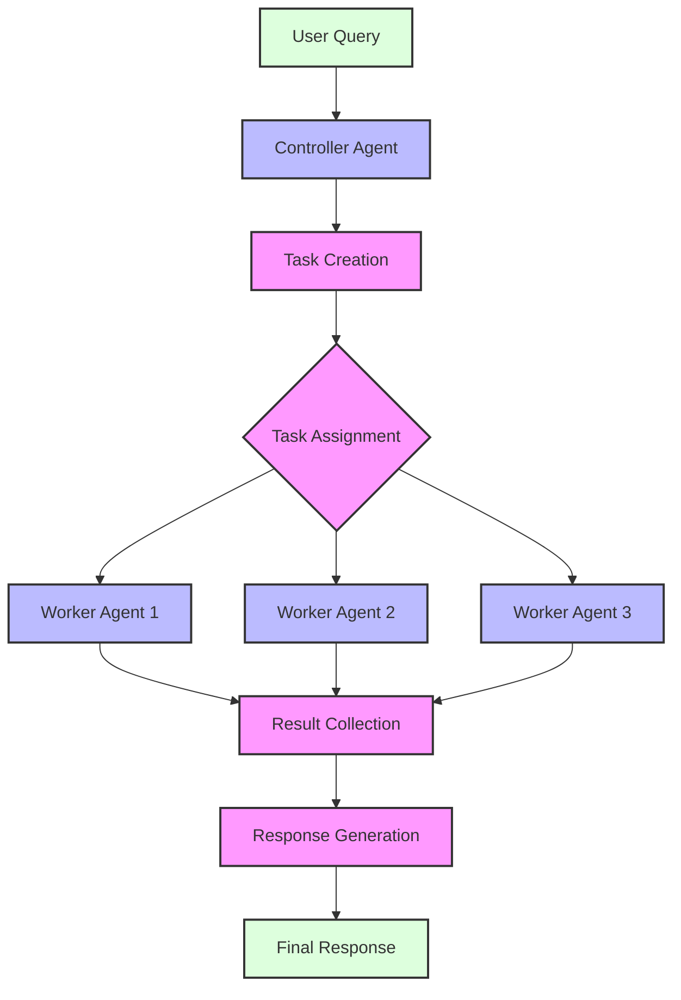
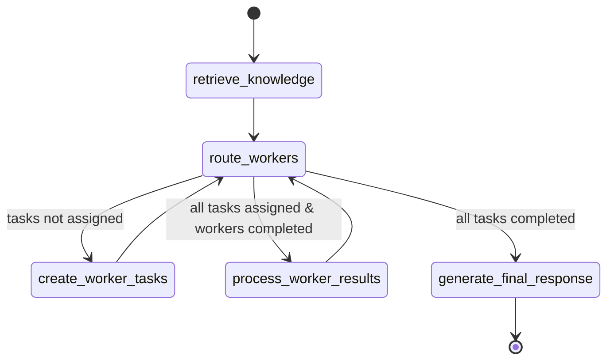

# Multi-Agent Workflow

This document describes the multi-agent workflow in Atlas, which enables collaboration between specialized agents for complex information processing.

## Overview

The multi-agent workflow in Atlas follows a controller-worker architecture where a controller agent orchestrates multiple specialized worker agents to process different aspects of a query. This approach enables:

1. **Parallel Processing**: Multiple agents can work simultaneously on different aspects of a task
2. **Specialization**: Agents can focus on specific types of processing or knowledge domains
3. **Collaborative Intelligence**: The combined insights of multiple agents lead to more comprehensive results
4. **Scalable Architecture**: The system can dynamically adjust the number and types of workers based on needs



## Components

### Controller Agent

The `ControllerAgent` class in `atlas.agents.controller` manages the multi-agent workflow. It is responsible for:

1. Creating and assigning tasks to worker agents
2. Tracking the progress of workers
3. Collecting results from all workers
4. Generating a final integrated response

```python
from atlas.agents.controller import ControllerAgent

# Create a controller with 3 workers
controller = ControllerAgent(worker_count=3)

# Process a query using the multi-agent workflow
response = controller.process_message("What is the trimodal methodology?")
```

### Worker Agents

The `WorkerAgent` class in `atlas.agents.worker` provides the foundation for specialized agents. Atlas comes with several predefined worker types:

1. **RetrievalWorker**: Specializes in document retrieval and summarization
2. **AnalysisWorker**: Specializes in query analysis and information needs identification
3. **DraftWorker**: Specializes in generating draft responses

```python
from atlas.agents.worker import RetrievalWorker, AnalysisWorker, DraftWorker

# Create specialized workers
retrieval_worker = RetrievalWorker()
analysis_worker = AnalysisWorker()
draft_worker = DraftWorker()
```

You can also create custom worker types by extending the `WorkerAgent` class:

```python
from atlas.agents.worker import WorkerAgent

class CustomWorker(WorkerAgent):
    """Worker that specializes in a custom domain."""

    def __init__(
        self,
        worker_id: str = "custom_worker",
        system_prompt_file: Optional[str] = None,
        collection_name: str = "atlas_knowledge_base",
        config: Optional[AtlasConfig] = None,
    ):
        # Define specialization
        specialization = "Custom Domain Specialization"

        # Initialize worker
        super().__init__(
            worker_id, specialization, system_prompt_file, collection_name, config
        )
```

## LangGraph Integration

The multi-agent workflow is implemented using LangGraph, which provides a powerful framework for creating complex agent workflows.

### State Models

Two key state models drive the multi-agent workflow:

1. **AgentState**: Represents the state of an individual agent
2. **ControllerState**: Represents the state of the controller and its workers

```python
from atlas.graph.state import AgentState, ControllerState

# Create a controller state
state = ControllerState(
    messages=[{"role": "user", "content": "What is the trimodal methodology?"}]
)
```

### Workflow Graph

The controller-worker workflow is defined as a LangGraph `StateGraph` in `atlas.graph.workflows`:

```python
from atlas.graph.workflows import create_controller_worker_graph

# Create a controller-worker graph
graph = create_controller_worker_graph()

# Create initial state
initial_state = ControllerState(messages=[{"role": "user", "content": query}])

# Run the graph
final_state = graph.invoke(initial_state)
```

The graph defines the following workflow:

1. **Knowledge Retrieval**: Retrieve relevant documents from the knowledge base
2. **Task Creation**: Create tasks for worker agents based on the query and retrieved documents
3. **Worker Processing**: Distribute tasks to workers and collect results
4. **Final Response Generation**: Generate a coherent response integrating all worker results



## Multi-Agent Workflow in Action

### Execution Flow

When a query is processed through the multi-agent workflow:

1. The controller receives the user query
2. Relevant knowledge is retrieved from the database
3. The controller creates specialized tasks for different workers
4. Workers process their assigned tasks in parallel
5. The controller collects results from all workers
6. The controller generates a final response integrating all insights

### Worker Synchronization

Workers are synchronized through the controller state, which tracks:

- Active workers: Currently processing tasks
- Completed workers: Workers that have finished their tasks
- Task tracking: Status of all tasks in the workflow
- Results collection: Compiled results from all workers

### Parallel Processing

The multi-agent workflow supports true parallel processing when the `--parallel` flag is enabled:

```bash
# Run Atlas with parallel processing
python main.py -m controller --parallel --workers 5
```

## Using the Multi-Agent Workflow

### CLI Mode

The multi-agent workflow can be accessed through the CLI:

```bash
# Run in controller mode with default 3 workers
python main.py -m controller

# Run with custom worker count
python main.py -m controller --workers 5

# Run with parallel processing
python main.py -m controller --parallel
```

### API Usage

You can also use the multi-agent workflow programmatically:

```python
from atlas.agents.controller import ControllerAgent

# Create a controller agent
controller = ControllerAgent(worker_count=3)

# Process a query
response = controller.process_message("What is the trimodal methodology in Atlas?")

# Inspect worker results
worker_results = controller.get_worker_results()
```

## Advanced Usage

### Custom Worker Types

You can extend the system with custom worker types by subclassing `WorkerAgent`:

```python
from atlas.agents.worker import WorkerAgent

class ResearchWorker(WorkerAgent):
    """Worker specialized in deep research on a topic."""

    def __init__(self, worker_id="research_worker", **kwargs):
        specialization = "Deep Research and Literature Analysis"
        super().__init__(worker_id, specialization, **kwargs)
```

### Dynamic Worker Allocation

The controller can dynamically adjust the number and types of workers based on the query complexity:

```python
from atlas.agents.controller import ControllerAgent

class AdaptiveController(ControllerAgent):
    """Controller that adapts worker count based on query complexity."""

    def process_message(self, message: str) -> str:
        # Analyze query complexity
        complexity = self._analyze_complexity(message)

        # Adjust worker count based on complexity
        self.worker_count = min(2 + complexity, 7)  # Between 2 and 7 workers

        # Process with adjusted workers
        return super().process_message(message)

    def _analyze_complexity(self, query: str) -> int:
        # Simple complexity analysis based on query length and structure
        return len(query.split()) // 20  # 1 worker per ~20 words
```

## Performance Considerations

When using the multi-agent workflow:

1. **Worker Count**: More workers require more resources but can process more complex queries
2. **Memory Usage**: Each worker maintains its own state and requires additional memory
3. **API Costs**: Multiple workers make multiple API calls, increasing costs
4. **Response Time**: Parallel processing can reduce latency, but more workers don't always mean faster responses

## Related Documentation

- [Controller Agent Documentation](../components/agents/controller.md) - Details on the controller agent
- [Worker Agent Documentation](../components/agents/workers.md) - Details on worker agents
- [Graph Framework Documentation](../components/graph/) - Information on the LangGraph implementation
