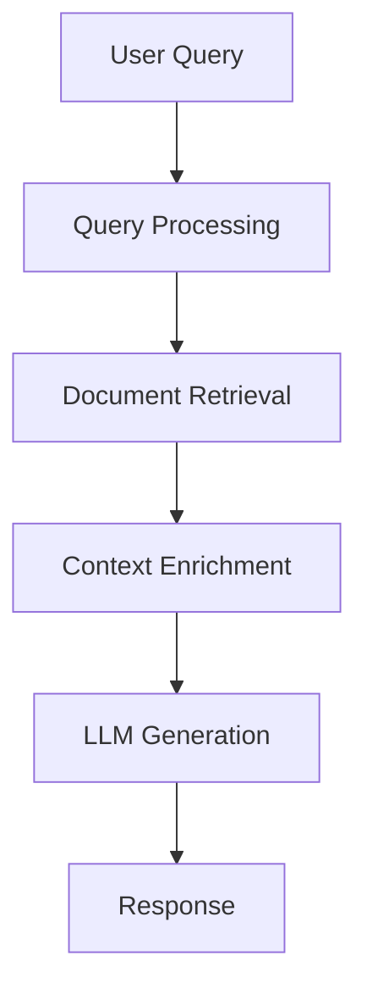
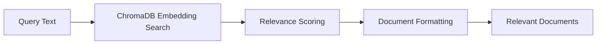

# Query Workflow

This document describes the query workflow in Atlas, which is the primary way to interact with the system for knowledge-augmented responses.

## Overview

The query workflow in Atlas combines document retrieval from a knowledge base with language model generation to provide contextually relevant responses to user queries. This workflow is designed for conversational, document-grounded interactions where accuracy and relevance are critical.



## Query Types

Atlas supports several query modes to accommodate different use cases:

1. **Standard Query**: Basic query with knowledge-augmented response
2. **Retrieval-Only Query**: Document retrieval without LLM generation
3. **Streaming Query**: Response streamed as it's generated
4. **Query with Context**: Returns both the response and context documents

## Components

### AtlasQuery Client

The `AtlasQuery` class in `atlas.query` serves as the primary interface for the query workflow. It provides a lightweight, query-focused API that can be integrated into other applications.

Key features:
- Simple initialization with sensible defaults
- Support for different model providers
- Flexible query methods for different use cases
- Error handling and fallback mechanisms

```python
from atlas import create_query_client

# Create a client with default settings
client = create_query_client()

# Query with knowledge augmentation
response = client.query("What is the trimodal methodology?")
```

### Knowledge Retrieval

The knowledge retrieval component is handled by the `KnowledgeBase` class in `atlas.knowledge.retrieval`. This class:

1. Connects to a ChromaDB database
2. Retrieves relevant documents based on semantic similarity
3. Provides metadata and relevance scores for each document



### LLM Generation

The language model generation is managed by the `AtlasAgent` class in `atlas.agents.base`. This component:

1. Formats the query and retrieved documents
2. Sends the context-enhanced prompt to the LLM provider
3. Processes and returns the response

## Workflow Details

### Standard Query Flow

1. User provides a query text
2. Knowledge base retrieves relevant documents
3. Documents are formatted with the query
4. Formatted context is sent to the language model
5. Model generates a response informed by the retrieved knowledge
6. Response is returned to the user

### Retrieval-Only Flow

1. User provides a query text
2. Knowledge base retrieves relevant documents
3. Documents are returned without LLM processing
4. This flow is useful for:
   - Debugging document retrieval
   - Applications that want to use Atlas as a knowledge base only
   - Scenarios where API keys aren't available

### Streaming Query Flow

1. User provides a query and a callback function
2. Knowledge retrieval happens as in standard flow
3. Language model generates response with streaming
4. Callback function is called for each chunk of text
5. Complete response is assembled and returned

```python
def print_streaming(delta: str, full_text: str) -> None:
    """Print streaming output character by character."""
    print(delta, end="", flush=True)

# Stream the response
client.query_streaming("How does Atlas work?", print_streaming)
```

## Code Example

```python
from atlas import create_query_client

# Create a query client
client = create_query_client()

# Standard query
response = client.query("What is the trimodal methodology?")
print(response)

# Retrieval-only query
documents = client.retrieve_only("knowledge graph structure")
for doc in documents[:3]:  # Show top 3
    print(f"Document: {doc['metadata'].get('source', 'Unknown')}")
    print(f"Relevance: {doc['relevance_score']:.4f}")
    print(f"Content: {doc['content'][:150]}...\n")

# Query with context
result = client.query_with_context("How does Atlas handle knowledge representation?")
print(result["response"])
print(f"Based on {len(result['context']['documents'])} documents")
```

## Configuration

The query workflow can be configured through several parameters and environment variables:

| Parameter            | Environment Variable     | Description                | Default                      |
| -------------------- | ------------------------ | -------------------------- | ---------------------------- |
| `collection_name`    | `ATLAS_COLLECTION_NAME`  | ChromaDB collection name   | `atlas_knowledge_base`       |
| `db_path`            | `ATLAS_DB_PATH`          | Path to ChromaDB database  | `~/atlas_chroma_db`          |
| `provider_name`      | `ATLAS_DEFAULT_PROVIDER` | Model provider to use      | `anthropic`                  |
| `model_name`         | `ATLAS_DEFAULT_MODEL`    | Model to use               | `claude-3-7-sonnet-20250219` |
| `system_prompt_file` | -                        | Path to system prompt file | Built-in prompt              |

## Advanced Usage

### Custom System Prompts

You can provide a custom system prompt to guide the model's behavior:

```python
client = create_query_client(system_prompt_file="path/to/prompt.md")
```

### Provider Selection

Atlas supports multiple model providers that can be selected at initialization:

```python
# Use OpenAI
openai_client = create_query_client(provider_name="openai", model_name="gpt-4o")

# Use Ollama
ollama_client = create_query_client(provider_name="ollama", model_name="llama3")
```

### Error Handling

The query workflow includes robust error handling:

1. If knowledge retrieval fails, the system falls back to direct LLM query
2. If streaming is not supported, it falls back to standard query
3. API errors are caught and reported clearly

## Integration with Other Systems

The query workflow is designed to be integrated into other applications:

1. **As a knowledge base**: Use `retrieve_only()` to access documents
2. **As an augmented LLM**: Use `query()` for knowledge-grounded responses
3. **As a streaming interface**: Use `query_streaming()` for interactive UIs

## Related Documentation

- [Retrieval Workflow](./retrieval.md) - Deeper details on document retrieval
- [Getting Started Guide](../guides/getting_started.md) - Basic usage tutorial
- [Providers](../components/providers/) - Supported LLM providers
