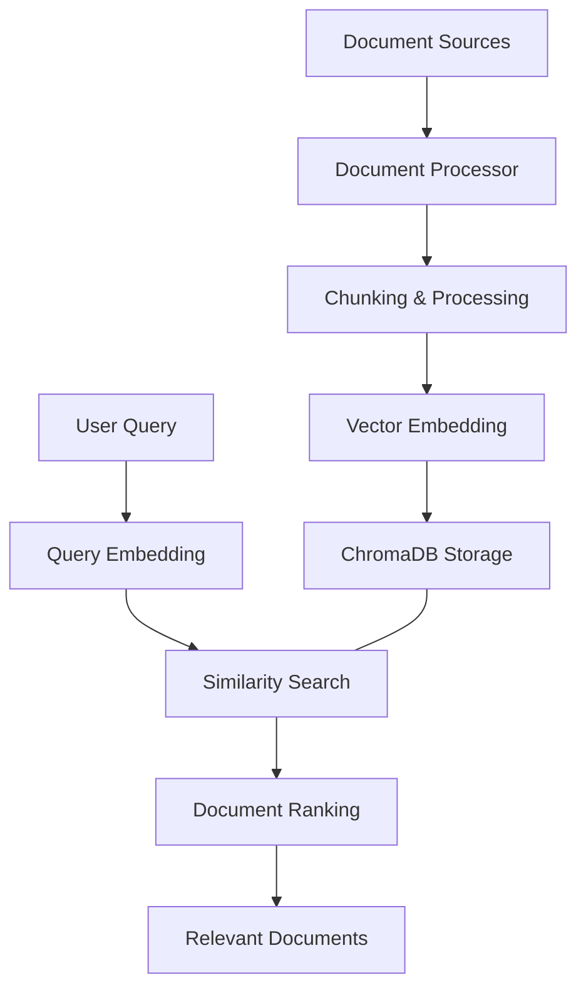
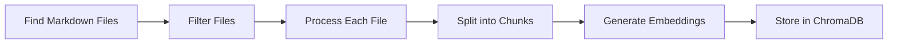

# Retrieval Workflow

This document describes the retrieval workflow in Atlas, which enables knowledge-based document retrieval and ingestion.

## Overview

The retrieval workflow in Atlas encompasses two key processes:
1. **Document Ingestion**: Loading and processing documents into the vector database
2. **Knowledge Retrieval**: Finding relevant documents based on query semantics

This workflow forms the foundation of Atlas's knowledge capabilities, allowing it to ground responses in specific documents and provide evidence-based answers.



## Components

### Knowledge Base

The `KnowledgeBase` class in `atlas.knowledge.retrieval` manages document storage and retrieval. Key responsibilities include:

1. Connecting to a persistent ChromaDB database
2. Retrieving documents based on semantic similarity
3. Filtering results based on metadata
4. Providing relevance scoring

```python
from atlas.knowledge.retrieval import KnowledgeBase

# Initialize knowledge base
kb = KnowledgeBase(
    collection_name="atlas_knowledge_base",
    db_path="~/atlas_chroma_db"
)

# Retrieve documents
documents = kb.retrieve("What is the trimodal methodology?", n_results=5)
```

### Document Processor

The `DocumentProcessor` class in `atlas.knowledge.ingest` handles document ingestion. Its responsibilities include:

1. Finding all markdown files in a directory
2. Processing files into suitable chunks
3. Managing metadata extraction
4. Handling document updates and versions

```python
from atlas.knowledge.ingest import DocumentProcessor

# Initialize processor
processor = DocumentProcessor(
    collection_name="atlas_knowledge_base",
    db_path="~/atlas_chroma_db"
)

# Process a directory
processor.process_directory("docs/", recursive=True)
```

## Workflow Details

### Document Ingestion Flow

1. **Document Discovery**: Find all markdown files in specified directories
2. **Filtering**: Apply gitignore patterns to exclude irrelevant files
3. **Chunking**: Split documents into manageable chunks based on content
4. **Metadata Extraction**: Extract source, version, and other metadata
5. **Embedding**: Generate vector embeddings for each document chunk
6. **Storage**: Store documents and metadata in ChromaDB collection



### Document Retrieval Flow

1. **Query Analysis**: Process the user query
2. **Embedding Generation**: Create vector embeddings for the query
3. **Similarity Search**: Find documents with similar embeddings
4. **Relevance Scoring**: Rank documents by relevance
5. **Metadata Filtering**: Apply filters based on version or other metadata
6. **Result Formatting**: Format and return documents with relevance scores

## Storage Architecture

Atlas uses ChromaDB as its vector database, with the following structure:

- **Collection**: Named container for documents (default: `atlas_knowledge_base`)
- **Documents**: Text chunks with associated embeddings
- **Metadata**: Structured information about each document:
  - `source`: Origin file path or URL
  - `chunk_id`: Identifier for the document chunk
  - `version`: Atlas version this document belongs to
  - `content_type`: Type of content (e.g., "markdown", "code")

## Document Processing

### Chunking Strategy

Documents are split into manageable chunks using a combination of:

1. **Heading-Based Chunking**: Natural document sections based on headings
2. **Size-Based Chunking**: Maximum token length constraints for LLM context
3. **Content-Aware Chunking**: Respecting content boundaries like code blocks

### Metadata Management

Each document chunk includes metadata to enable effective retrieval:

- File path for source attribution
- Section information for hierarchical context
- Version information for tracking changes
- Content type for specialized processing

## Retrieval Mechanisms

### Similarity Search

Atlas uses cosine similarity between vector embeddings to find relevant documents:

1. The query is converted to a vector embedding
2. ChromaDB finds documents with similar embeddings
3. Results are ranked by similarity score
4. A relevance threshold can be applied

### Filtering Capabilities

Retrieval can be filtered using metadata:

```python
# Retrieve documents with version filtering
documents = kb.retrieve(
    "What is the trimodal methodology?",
    n_results=5,
    version_filter="v2"
)
```

## Standalone Retrieval

The retrieval workflow can be used without requiring a language model:

```python
from atlas import create_query_client

# Create a query client
client = create_query_client()

# Retrieve documents without LLM generation
documents = client.retrieve_only("knowledge graph structure")

# Use the retrieved documents directly
for doc in documents[:3]:
    print(f"Document: {doc['metadata'].get('source', 'Unknown')}")
    print(f"Relevance: {doc['relevance_score']:.4f}")
    print(f"Content: {doc['content'][:150]}...")
```

## Configuration

The retrieval workflow can be configured through several parameters and environment variables:

| Parameter         | Environment Variable    | Description               | Default                |
| ----------------- | ----------------------- | ------------------------- | ---------------------- |
| `collection_name` | `ATLAS_COLLECTION_NAME` | ChromaDB collection name  | `atlas_knowledge_base` |
| `db_path`         | `ATLAS_DB_PATH`         | Path to ChromaDB database | `~/atlas_chroma_db`    |

## CLI Usage

The ingestion process can be triggered from the command line:

```bash
# Ingest documents from a directory
uv run python main.py -m ingest -d path/to/documents/ -r

# Check the database status
uv run python atlas/scripts/debug/check_db.py --details
```

## Error Handling

The retrieval workflow includes robust error handling:

1. Fallback to in-memory database if persistent storage fails
2. Graceful handling of empty collections
3. Error reporting for failed document processing
4. Automatic directory creation if needed

## Advanced Features

### Version-Based Retrieval

Atlas can retrieve documents from specific versions:

```python
# Get all available versions
versions = kb.get_versions()

# Retrieve documents from a specific version
documents = kb.retrieve(
    "What is the trimodal methodology?",
    version_filter="v3"
)
```

### Relevance Scoring

Retrieved documents include relevance scores converted from embedding distances:

```python
# Documents are sorted by relevance score (1.0 = perfect match, 0.0 = no match)
for doc in documents:
    print(f"Relevance: {doc['relevance_score']:.4f}")
    print(f"Content: {doc['content'][:100]}...")
```

## Related Documentation

- [Query Workflow](./query.md) - How queries use retrieved documents
- [Knowledge Base API](../components/knowledge/) - Detailed API documentation
- [ChromaDB Integration](../components/core/env.md) - Environment configuration for ChromaDB
