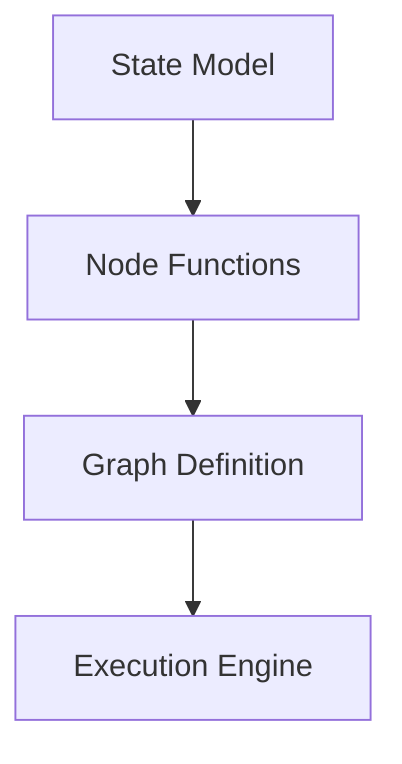

# Creating Custom Workflows

This document describes how to create custom workflows in Atlas using the LangGraph framework.

## Introduction

Atlas provides a flexible framework for creating custom workflows to meet specific needs. A workflow in Atlas defines how information flows between different processing nodes, allowing you to create complex agent behaviors and specialized information processing pipelines.

## Workflow Architecture

A workflow in Atlas consists of:

1. **State Model**: Defines the data structure passed between nodes
2. **Node Functions**: Implement the computational steps in the workflow
3. **Graph Definition**: Specifies how nodes are connected and how data flows
4. **Execution Engine**: Runs the workflow with a given initial state



## Creating a Custom Workflow

### 1. Define a State Model

Start by defining the state model that will be passed between nodes:

```python
from typing import List, Dict, Any, Optional
from pydantic import BaseModel, Field

class Message(TypedDict):
    """Message in the conversation."""
    role: str
    content: str

class CustomState(BaseModel):
    """Custom state model for the workflow."""

    # Conversation history
    messages: List[Message] = Field(
        default_factory=list, description="Conversation history"
    )

    # Custom fields
    custom_data: Dict[str, Any] = Field(
        default_factory=dict, description="Custom workflow data"
    )

    # Status flags
    process_complete: bool = Field(
        default=False, description="Whether processing is complete"
    )
    error: Optional[str] = Field(
        default=None, description="Error message if any"
    )
```

### 2. Implement Node Functions

Next, create the node functions that will process the state:

```python
from atlas.core.config import AtlasConfig
from atlas.knowledge.retrieval import KnowledgeBase

def custom_node_1(state: CustomState, config: Optional[AtlasConfig] = None) -> CustomState:
    """First node in the custom workflow."""
    # Implementation details...

    # Example: Extract query from the last user message
    query = ""
    for message in reversed(state.messages):
        if message["role"] == "user":
            query = message["content"]
            break

    # Store in custom data
    state.custom_data["query"] = query

    return state

def custom_node_2(state: CustomState, config: Optional[AtlasConfig] = None) -> CustomState:
    """Second node in the custom workflow."""
    # Implementation details...

    # Example: Retrieve knowledge based on the query
    cfg = config or AtlasConfig()
    kb = KnowledgeBase(collection_name=cfg.collection_name, db_path=cfg.db_path)

    query = state.custom_data.get("query", "")
    if query:
        documents = kb.retrieve(query)
        state.custom_data["documents"] = documents

    return state

def custom_node_3(state: CustomState, config: Optional[AtlasConfig] = None) -> CustomState:
    """Third node in the custom workflow."""
    # Implementation details...

    # Example: Generate a response
    # (Implementation would use a model provider to generate a response)

    # Mark processing as complete
    state.process_complete = True

    return state

def should_end(state: CustomState) -> bool:
    """Condition function to determine if the workflow should end."""
    return state.process_complete or bool(state.error)
```

### 3. Define the Workflow Graph

Create the workflow graph that connects the nodes:

```python
from langgraph.graph import StateGraph, END
from atlas.core.config import AtlasConfig

def create_custom_workflow(
    config: Optional[AtlasConfig] = None
) -> StateGraph:
    """Create a custom workflow graph.

    Args:
        config: Optional configuration. If not provided, default values are used.

    Returns:
        A StateGraph for the custom workflow.
    """
    # Create StateGraph with CustomState
    builder = StateGraph(CustomState)

    # Add nodes
    builder.add_node("custom_node_1", lambda state: custom_node_1(state, config))
    builder.add_node("custom_node_2", lambda state: custom_node_2(state, config))
    builder.add_node("custom_node_3", lambda state: custom_node_3(state, config))

    # Define edges
    builder.add_edge("custom_node_1", "custom_node_2")
    builder.add_edge("custom_node_2", "custom_node_3")

    # Add conditional edges for loop or end
    builder.add_conditional_edges(
        "custom_node_3", should_end, {True: END, False: "custom_node_1"}
    )

    # Set the entry point
    builder.set_entry_point("custom_node_1")

    # Compile the graph
    return builder.compile()
```

### 4. Create a Runner Function

Implement a function to run the workflow:

```python
def run_custom_workflow(
    query: str,
    config: Optional[AtlasConfig] = None
) -> CustomState:
    """Run the custom workflow.

    Args:
        query: User query to process.
        config: Optional configuration. If not provided, default values are used.

    Returns:
        Final state after workflow execution.
    """
    # Create the graph
    graph = create_custom_workflow(config)

    # Create initial state
    initial_state = CustomState(messages=[{"role": "user", "content": query}])

    # Run the graph
    final_state = graph.invoke(initial_state)

    return final_state
```

## Advanced Workflow Features

### Parallel Processing

You can implement parallel processing in your workflow:

```python
def create_parallel_workflow(config: Optional[AtlasConfig] = None) -> StateGraph:
    """Create a workflow with parallel processing."""
    # Create StateGraph
    builder = StateGraph(CustomState)

    # Add nodes
    builder.add_node("entry_node", entry_node)
    builder.add_node("parallel_node_1", parallel_node_1)
    builder.add_node("parallel_node_2", parallel_node_2)
    builder.add_node("parallel_node_3", parallel_node_3)
    builder.add_node("combine_results", combine_results)

    # Add parallel edges
    builder.add_edge("entry_node", "parallel_node_1")
    builder.add_edge("entry_node", "parallel_node_2")
    builder.add_edge("entry_node", "parallel_node_3")

    # Add edges to combine results
    builder.add_edge("parallel_node_1", "combine_results")
    builder.add_edge("parallel_node_2", "combine_results")
    builder.add_edge("parallel_node_3", "combine_results")

    # Add edge to end
    builder.add_edge("combine_results", END)

    # Set the entry point
    builder.set_entry_point("entry_node")

    # Compile the graph
    return builder.compile()
```

### Dynamic Routing

You can implement dynamic routing based on the state:

```python
def router(state: CustomState) -> str:
    """Route to different nodes based on the state."""
    query = state.custom_data.get("query", "")

    # Route based on query content
    if "explain" in query.lower():
        return "explanation_node"
    elif "compare" in query.lower():
        return "comparison_node"
    elif "list" in query.lower():
        return "listing_node"
    else:
        return "default_node"

def create_dynamic_workflow(config: Optional[AtlasConfig] = None) -> StateGraph:
    """Create a workflow with dynamic routing."""
    # Create StateGraph
    builder = StateGraph(CustomState)

    # Add nodes
    builder.add_node("entry_node", entry_node)
    builder.add_node("router_node", lambda state: state)  # Just passes state through
    builder.add_node("explanation_node", explanation_node)
    builder.add_node("comparison_node", comparison_node)
    builder.add_node("listing_node", listing_node)
    builder.add_node("default_node", default_node)
    builder.add_node("final_node", final_node)

    # Add edges
    builder.add_edge("entry_node", "router_node")

    # Add conditional edges from router
    builder.add_conditional_edges(
        "router_node",
        router,
        {
            "explanation_node": lambda state: router(state) == "explanation_node",
            "comparison_node": lambda state: router(state) == "comparison_node",
            "listing_node": lambda state: router(state) == "listing_node",
            "default_node": lambda state: router(state) == "default_node",
        },
    )

    # Add edges to final node
    builder.add_edge("explanation_node", "final_node")
    builder.add_edge("comparison_node", "final_node")
    builder.add_edge("listing_node", "final_node")
    builder.add_edge("default_node", "final_node")

    # Add edge to end
    builder.add_edge("final_node", END)

    # Set the entry point
    builder.set_entry_point("entry_node")

    # Compile the graph
    return builder.compile()
```

## Integration with Custom Agents

You can integrate your custom workflow with a custom agent:

```python
from atlas.agents.base import AtlasAgent
from atlas.core.config import AtlasConfig

class CustomWorkflowAgent(AtlasAgent):
    """Agent that uses a custom workflow."""

    def __init__(
        self,
        system_prompt_file: Optional[str] = None,
        collection_name: str = "atlas_knowledge_base",
        config: Optional[AtlasConfig] = None,
    ):
        """Initialize the custom workflow agent."""
        # Initialize base agent
        super().__init__(system_prompt_file, collection_name, config)

        # Set workflow type
        self.workflow_type = "custom"

    def process_message(self, message: str) -> str:
        """Process a user message using the custom workflow.

        Args:
            message: The user's message.

        Returns:
            The agent's response.
        """
        try:
            # Add user message to history
            self.messages.append({"role": "user", "content": message})

            # Run the custom workflow
            final_state = run_custom_workflow(
                query=message,
                config=self.config,
            )

            # Extract the response
            assistant_message = ""
            for msg in reversed(final_state.messages):
                if msg["role"] == "assistant":
                    assistant_message = msg["content"]
                    break

            if not assistant_message:
                assistant_message = "I'm sorry, I couldn't generate a response."

            # Add assistant response to history
            self.messages.append({"role": "assistant", "content": assistant_message})

            return assistant_message

        except Exception as e:
            # Error handling
            print(f"Error in custom workflow processing: {str(e)}")
            error_msg = "I'm sorry, I encountered an error processing your request."
            self.messages.append({"role": "assistant", "content": error_msg})
            return error_msg
```

## Example: Custom Research Workflow

Here's a complete example of a custom research workflow that analyzes a query, retrieves documents, cross-references information, and generates a comprehensive response:

```python
from typing import List, Dict, Any, Optional
from pydantic import BaseModel, Field
from langgraph.graph import StateGraph, END

# Import Atlas components
from atlas.core.config import AtlasConfig
from atlas.knowledge.retrieval import KnowledgeBase
from atlas.providers.factory import create_provider

# Define state model
class ResearchState(BaseModel):
    """State for the research workflow."""

    # Conversation
    messages: List[Dict[str, str]] = Field(
        default_factory=list, description="Conversation history"
    )

    # Research data
    query: str = Field(default="", description="Original research query")
    sub_queries: List[str] = Field(
        default_factory=list, description="Decomposed sub-queries"
    )
    primary_documents: List[Dict[str, Any]] = Field(
        default_factory=list, description="Documents from primary query"
    )
    secondary_documents: Dict[str, List[Dict[str, Any]]] = Field(
        default_factory=dict, description="Documents from sub-queries"
    )

    # Analysis results
    query_analysis: str = Field(default="", description="Analysis of the query")
    document_analysis: str = Field(default="", description="Analysis of retrieved documents")
    contradictions: List[str] = Field(
        default_factory=list, description="Contradictory information found"
    )
    supporting_evidence: List[str] = Field(
        default_factory=list, description="Supporting evidence found"
    )

    # Status
    process_complete: bool = Field(default=False, description="Workflow completion status")
    error: Optional[str] = Field(default=None, description="Error message if any")

# Define node functions
def extract_query(state: ResearchState, config: Optional[AtlasConfig] = None) -> ResearchState:
    """Extract the research query from the messages."""
    # Get the last user message
    for message in reversed(state.messages):
        if message["role"] == "user":
            state.query = message["content"]
            break

    return state

def analyze_query(state: ResearchState, config: Optional[AtlasConfig] = None) -> ResearchState:
    """Analyze the query and decompose it into sub-queries."""
    # Create model provider
    cfg = config or AtlasConfig()
    provider = create_provider(provider_name="anthropic")

    # Generate analysis
    response = provider.process_messages(
        messages=[{"role": "user", "content": f"Analyze this research query and break it down into 2-4 distinct sub-queries for comprehensive research: {state.query}"}],
        system_prompt="You are a research assistant. Your task is to analyze research queries and break them down into focused sub-queries."
    )

    # Store analysis
    state.query_analysis = response

    # Extract sub-queries (simplified implementation)
    # In a real implementation, use more robust parsing
    sub_queries = []
    for line in response.split("\n"):
        if line.strip().startswith("- ") or line.strip().startswith("* "):
            sub_query = line.strip()[2:].strip()
            if sub_query:
                sub_queries.append(sub_query)

    # Store sub-queries
    state.sub_queries = sub_queries[:4]  # Limit to 4 sub-queries

    return state

def retrieve_primary_documents(state: ResearchState, config: Optional[AtlasConfig] = None) -> ResearchState:
    """Retrieve documents for the primary query."""
    # Create knowledge base
    cfg = config or AtlasConfig()
    kb = KnowledgeBase(collection_name=cfg.collection_name, db_path=cfg.db_path)

    # Retrieve documents
    if state.query:
        documents = kb.retrieve(state.query, n_results=5)
        state.primary_documents = documents

    return state

def retrieve_secondary_documents(state: ResearchState, config: Optional[AtlasConfig] = None) -> ResearchState:
    """Retrieve documents for each sub-query."""
    # Create knowledge base
    cfg = config or AtlasConfig()
    kb = KnowledgeBase(collection_name=cfg.collection_name, db_path=cfg.db_path)

    # Retrieve documents for each sub-query
    for sub_query in state.sub_queries:
        documents = kb.retrieve(sub_query, n_results=3)
        state.secondary_documents[sub_query] = documents

    return state

def cross_reference_documents(state: ResearchState, config: Optional[AtlasConfig] = None) -> ResearchState:
    """Cross-reference information from all documents."""
    # Create model provider
    cfg = config or AtlasConfig()
    provider = create_provider(provider_name="anthropic")

    # Prepare document summaries
    document_content = "Primary documents:\n"
    for i, doc in enumerate(state.primary_documents[:3]):
        source = doc["metadata"].get("source", "Unknown")
        content = doc["content"][:500]  # Limit size
        document_content += f"\nDocument {i+1} ({source}):\n{content}...\n"

    document_content += "\nSecondary documents:\n"
    for sub_query, docs in state.secondary_documents.items():
        document_content += f"\nFor sub-query: {sub_query}\n"
        for i, doc in enumerate(docs[:2]):
            source = doc["metadata"].get("source", "Unknown")
            content = doc["content"][:300]  # Limit size
            document_content += f"Document {i+1} ({source}):\n{content}...\n"

    # Generate analysis
    response = provider.process_messages(
        messages=[{"role": "user", "content": f"Analyze these documents related to the research query: \"{state.query}\". Identify supporting evidence and any contradictions.\n\n{document_content}"}],
        system_prompt="You are a research analyst. Your task is to analyze documents, identify supporting evidence, and note any contradictions."
    )

    # Store analysis
    state.document_analysis = response

    # Extract contradictions and supporting evidence (simplified implementation)
    # In a real implementation, use more robust parsing
    state.contradictions = []
    state.supporting_evidence = []

    section = None
    for line in response.split("\n"):
        if "contradiction" in line.lower() or "conflict" in line.lower():
            section = "contradictions"
            continue
        elif "support" in line.lower() or "evidence" in line.lower():
            section = "supporting"
            continue

        if section == "contradictions" and line.strip().startswith("- "):
            state.contradictions.append(line.strip()[2:].strip())
        elif section == "supporting" and line.strip().startswith("- "):
            state.supporting_evidence.append(line.strip()[2:].strip())

    return state

def generate_research_response(state: ResearchState, config: Optional[AtlasConfig] = None) -> ResearchState:
    """Generate a comprehensive research response."""
    # Create model provider
    cfg = config or AtlasConfig()
    provider = create_provider(provider_name="anthropic")

    # Prepare research summary
    research_summary = f"Query: {state.query}\n\n"
    research_summary += f"Query Analysis: {state.query_analysis}\n\n"
    research_summary += "Supporting Evidence:\n"
    for evidence in state.supporting_evidence:
        research_summary += f"- {evidence}\n"

    research_summary += "\nContradictions or Uncertainties:\n"
    for contradiction in state.contradictions:
        research_summary += f"- {contradiction}\n"

    # Generate response
    response = provider.process_messages(
        messages=[{"role": "user", "content": f"Based on this research summary, provide a comprehensive response to the original query: \"{state.query}\"\n\n{research_summary}"}],
        system_prompt="You are a research assistant providing thorough, evidence-based responses. Always acknowledge areas of uncertainty or conflicting information."
    )

    # Add assistant response to messages
    state.messages.append({"role": "assistant", "content": response})

    # Mark as complete
    state.process_complete = True

    return state

def should_end(state: ResearchState) -> bool:
    """Determine if the workflow should end."""
    return state.process_complete or bool(state.error)

# Define workflow graph
def create_research_workflow(config: Optional[AtlasConfig] = None) -> StateGraph:
    """Create a research workflow graph."""
    # Create StateGraph
    builder = StateGraph(ResearchState)

    # Add nodes
    builder.add_node("extract_query", lambda state: extract_query(state, config))
    builder.add_node("analyze_query", lambda state: analyze_query(state, config))
    builder.add_node("retrieve_primary_documents", lambda state: retrieve_primary_documents(state, config))
    builder.add_node("retrieve_secondary_documents", lambda state: retrieve_secondary_documents(state, config))
    builder.add_node("cross_reference_documents", lambda state: cross_reference_documents(state, config))
    builder.add_node("generate_research_response", lambda state: generate_research_response(state, config))

    # Define edges
    builder.add_edge("extract_query", "analyze_query")
    builder.add_edge("analyze_query", "retrieve_primary_documents")
    builder.add_edge("retrieve_primary_documents", "retrieve_secondary_documents")
    builder.add_edge("retrieve_secondary_documents", "cross_reference_documents")
    builder.add_edge("cross_reference_documents", "generate_research_response")

    # Add conditional edge for end
    builder.add_conditional_edges(
        "generate_research_response", should_end, {True: END, False: "extract_query"}
    )

    # Set the entry point
    builder.set_entry_point("extract_query")

    # Compile the graph
    return builder.compile()

# Define runner function
def run_research_workflow(
    query: str,
    config: Optional[AtlasConfig] = None
) -> ResearchState:
    """Run the research workflow.

    Args:
        query: Research query to process.
        config: Optional configuration. If not provided, default values are used.

    Returns:
        Final state after workflow execution.
    """
    # Create the graph
    graph = create_research_workflow(config)

    # Create initial state
    initial_state = ResearchState(messages=[{"role": "user", "content": query}])

    # Run the graph
    final_state = graph.invoke(initial_state)

    return final_state
```

## Best Practices

When creating custom workflows, follow these best practices:

1. **Clear State Model**: Define a clear state model with well-documented fields
2. **Single-Responsibility Nodes**: Each node should have a single, clear responsibility
3. **Error Handling**: Implement robust error handling in all nodes
4. **Conditional Logic**: Use conditional edges for complex decision making
5. **Testing**: Test your workflow thoroughly with different inputs
6. **Logging**: Add logging to nodes to help with debugging
7. **Documentation**: Document your workflow's behavior and requirements
8. **Resource Management**: Be mindful of resource usage, especially with parallel processing

## Related Documentation

- [Graph Framework Overview](../components/graph/) - Details on the LangGraph implementation
- [Multi-Agent Workflow](./multi_agent.md) - Complex workflow example
- [Query Workflow](./query.md) - Simple workflow example
- [Controller Agent](../components/agents/controller.md) - Documentation on the controller agent
