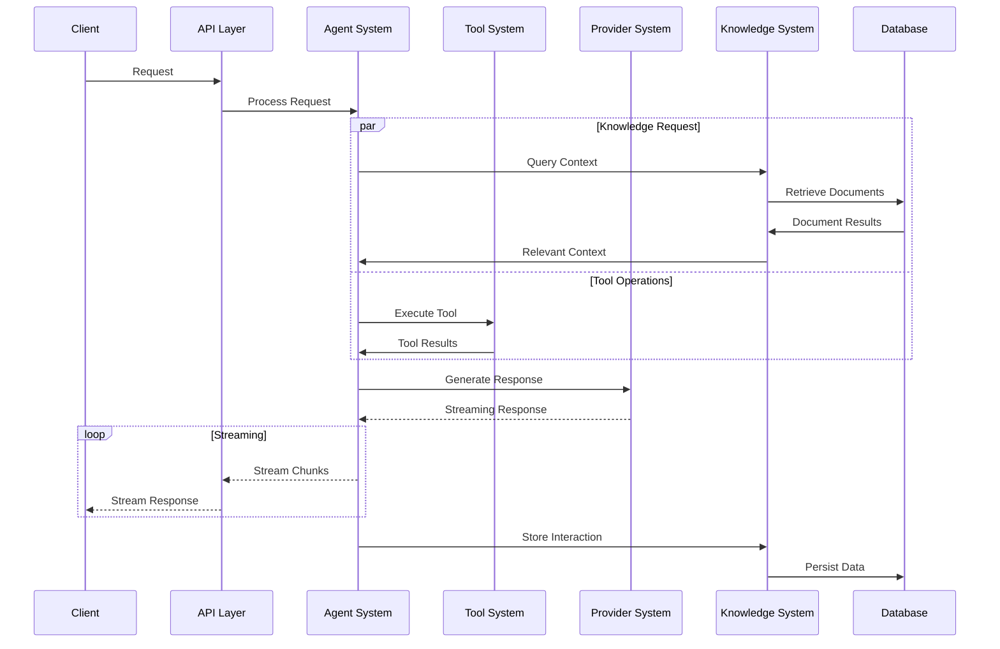

# System Dependency Graph

This document illustrates the relationships between the core systems of Atlas and their interdependencies. This serves as a blueprint for understanding how different components interact and rely on each other.

## Core Services Layer Dependencies

The Core Services Layer provides fundamental capabilities that all other components depend on:

```
Core Services Layer
├── Buffer System
│   ├── Thread-safe queues
│   ├── Flow control (backpressure)
│   └── Rate limiting
│
├── Event System
│   ├── Event bus
│   ├── Event routing
│   └── Event history
│
├── State Management
│   ├── Lifecycle states
│   ├── State transitions
│   └── Versioned state
│
├── Error Handling
│   ├── Error hierarchy
│   ├── Error context
│   └── Recovery strategies
│
└── Resource Management
    ├── Connection management
    ├── Lifecycle tracking
    └── Cleanup strategies
```

## Provider System Dependencies

The Provider System builds on the Core Services and defines specialized components:

```
Provider System
├── Depends on: Core Services Layer
│
├── Base Provider Interface
│   ├── Model identification
│   ├── Capability definitions
│   └── Configuration handling
│
├── Streaming Infrastructure
│   ├── Depends on: Buffer System
│   ├── Stream control interface
│   ├── Chunk processing
│   └── Streaming transformations
│
├── Provider Registry
│   ├── Depends on: Event System
│   ├── Provider discovery
│   ├── Provider resolution
│   └── Configuration management
│
├── Provider Group
│   ├── Depends on: Base Provider Interface
│   ├── Fallback strategies
│   ├── Capability-based selection
│   └── Performance monitoring
│
└── Provider Reliability
    ├── Depends on: Error Handling
    ├── Retry mechanisms
    ├── Circuit breaker pattern
    └── Health checking
```

## Agent System Dependencies

The Agent System leverages both Core Services and Provider System:

```
Agent System
├── Depends on: Core Services Layer
├── Depends on: Provider System
│
├── Base Agent Interface
│   ├── Task handling
│   ├── Context management
│   └── Agent identification
│
├── Agent Registry
│   ├── Depends on: Event System
│   ├── Agent discovery
│   ├── Capability advertising
│   └── Status tracking
│
├── Agent Controller
│   ├── Depends on: Provider Registry
│   ├── Task distribution
│   ├── Result aggregation
│   └── Error handling
│
├── Agent Workers
│   ├── Depends on: Base Provider Interface
│   ├── Specialized processing
│   ├── Tool integration
│   └── Provider interaction
│
└── Messaging System
    ├── Depends on: Buffer System
    ├── Message routing
    ├── Message serialization
    └── Delivery guarantees
```

## Tool System Dependencies

The Tool System provides extension capabilities:

```
Tool System
├── Depends on: Core Services Layer
│
├── Tool Interface
│   ├── Tool definition
│   ├── Capability declaration
│   └── Parameter validation
│
├── Tool Registry
│   ├── Depends on: Event System
│   ├── Tool discovery
│   ├── Permission management
│   └── Availability tracking
│
├── Tool Execution
│   ├── Depends on: Error Handling
│   ├── Safety checks
│   ├── Result validation
│   └── Effect tracking
│
└── Tool Integration
    ├── Depends on: Agent Workers
    ├── Tool invocation
    ├── Result handling
    └── Error recovery
```

## Orchestration System Dependencies

The Orchestration System coordinates high-level workflows:

```
Orchestration System
├── Depends on: Core Services Layer
├── Depends on: Agent System
│
├── Workflow Engine
│   ├── Depends on: State Management
│   ├── Graph execution
│   ├── State transitions
│   └── Edge conditions
│
├── Coordinator
│   ├── Depends on: Agent Controller
│   ├── Multi-agent coordination
│   ├── Task sequencing
│   └── Result aggregation
│
├── Scheduler
│   ├── Depends on: Resource Management
│   ├── Task scheduling
│   ├── Priority management
│   └── Resource allocation
│
└── Parallel Execution
    ├── Depends on: Tool Execution
    ├── Quantum partitioning
    ├── Dependency resolution
    └── Concurrent processing
```

## Knowledge System Dependencies

The Knowledge System provides information retrieval capabilities:

```
Knowledge System
├── Depends on: Core Services Layer
│
├── Document Processing
│   ├── Ingest pipeline
│   ├── Chunking strategies
│   └── Format handling
│
├── Embedding Generation
│   ├── Depends on: Provider System
│   ├── Vectorization
│   ├── Embedding models
│   └── Dimension reduction
│
├── Retrieval Engine
│   ├── Depends on: Buffer System
│   ├── Vector search
│   ├── Filtering
│   └── Reranking
│
└── Database Integration
    ├── Depends on: Resource Management
    ├── Connection pooling
    ├── Query optimization
    └── Schema management
```

## Cross-Cutting Dependencies

Several capabilities span across all systems:

```
Cross-Cutting Concerns
├── Logging & Telemetry
│   ├── Used by: All Systems
│   ├── Performance metrics
│   ├── Error tracking
│   └── Usage statistics
│
├── Configuration
│   ├── Used by: All Systems
│   ├── Environment integration
│   ├── Configuration validation
│   └── Default management
│
├── Security
│   ├── Used by: Provider System, Tool System
│   ├── Authentication
│   ├── Authorization
│   └── Content safety
│
└── Testing Infrastructure
    ├── Used by: All Systems
    ├── Mocking capabilities
    ├── Test fixtures
    └── Verification utilities
```

## Unified System Dependency Diagram

```mermaid
flowchart TD
    %% Core Services Layer
    CoreServices[Core Services Layer]
    Buffer[Buffer System]
    Event[Event System]
    State[State Management]
    Error[Error Handling]
    Resource[Resource Management]

    %% Provider System
    ProviderSystem[Provider System]
    ProviderBase[Base Provider Interface]
    Streaming[Streaming Infrastructure]
    ProviderRegistry[Provider Registry]
    ProviderGroup[Provider Group]
    Reliability[Provider Reliability]

    %% Agent System
    AgentSystem[Agent System]
    AgentBase[Base Agent Interface]
    AgentRegistry[Agent Registry]
    Controller[Agent Controller]
    Workers[Agent Workers]
    Messaging[Messaging System]

    %% Tool System
    ToolSystem[Tool System]
    ToolInterface[Tool Interface]
    ToolRegistry[Tool Registry]
    ToolExecution[Tool Execution]
    ToolIntegration[Tool Integration]

    %% Orchestration System
    OrchestrationSystem[Orchestration System]
    Workflow[Workflow Engine]
    Coordinator[Coordinator]
    Scheduler[Scheduler]
    ParallelExecution[Parallel Execution]

    %% Knowledge System
    KnowledgeSystem[Knowledge System]
    DocumentProcessing[Document Processing]
    EmbeddingGeneration[Embedding Generation]
    RetrievalEngine[Retrieval Engine]
    DatabaseIntegration[Database Integration]

    %% Cross-Cutting Concerns
    CrossCutting[Cross-Cutting Concerns]
    Logging[Logging & Telemetry]
    Configuration[Configuration]
    Security[Security]
    Testing[Testing Infrastructure]

    %% Core Services Internal Dependencies
    CoreServices --> Buffer
    CoreServices --> Event
    CoreServices --> State
    CoreServices --> Error
    CoreServices --> Resource

    %% Provider System Dependencies
    ProviderSystem --> CoreServices
    ProviderSystem --> ProviderBase
    ProviderSystem --> Streaming
    ProviderSystem --> ProviderRegistry
    ProviderSystem --> ProviderGroup
    ProviderSystem --> Reliability
    Streaming --> Buffer
    ProviderRegistry --> Event
    ProviderGroup --> ProviderBase
    Reliability --> Error

    %% Agent System Dependencies
    AgentSystem --> CoreServices
    AgentSystem --> ProviderSystem
    AgentSystem --> AgentBase
    AgentSystem --> AgentRegistry
    AgentSystem --> Controller
    AgentSystem --> Workers
    AgentSystem --> Messaging
    AgentRegistry --> Event
    Controller --> ProviderRegistry
    Workers --> ProviderBase
    Messaging --> Buffer

    %% Tool System Dependencies
    ToolSystem --> CoreServices
    ToolSystem --> ToolInterface
    ToolSystem --> ToolRegistry
    ToolSystem --> ToolExecution
    ToolSystem --> ToolIntegration
    ToolRegistry --> Event
    ToolExecution --> Error
    ToolIntegration --> Workers

    %% Orchestration System Dependencies
    OrchestrationSystem --> CoreServices
    OrchestrationSystem --> AgentSystem
    OrchestrationSystem --> Workflow
    OrchestrationSystem --> Coordinator
    OrchestrationSystem --> Scheduler
    OrchestrationSystem --> ParallelExecution
    Workflow --> State
    Coordinator --> Controller
    Scheduler --> Resource
    ParallelExecution --> ToolExecution

    %% Knowledge System Dependencies
    KnowledgeSystem --> CoreServices
    KnowledgeSystem --> DocumentProcessing
    KnowledgeSystem --> EmbeddingGeneration
    KnowledgeSystem --> RetrievalEngine
    KnowledgeSystem --> DatabaseIntegration
    EmbeddingGeneration --> ProviderSystem
    RetrievalEngine --> Buffer
    DatabaseIntegration --> Resource

    %% Cross-Cutting Dependencies
    CrossCutting --> Logging
    CrossCutting --> Configuration
    CrossCutting --> Security
    CrossCutting --> Testing
    Logging -.-> CoreServices
    Logging -.-> ProviderSystem
    Logging -.-> AgentSystem
    Logging -.-> ToolSystem
    Logging -.-> OrchestrationSystem
    Logging -.-> KnowledgeSystem
    Configuration -.-> CoreServices
    Configuration -.-> ProviderSystem
    Configuration -.-> AgentSystem
    Configuration -.-> ToolSystem
    Configuration -.-> OrchestrationSystem
    Configuration -.-> KnowledgeSystem
    Security -.-> ProviderSystem
    Security -.-> ToolSystem
    Testing -.-> CoreServices
    Testing -.-> ProviderSystem
    Testing -.-> AgentSystem
    Testing -.-> ToolSystem
    Testing -.-> OrchestrationSystem
    Testing -.-> KnowledgeSystem
```



## Data Flow Diagram

The following diagram illustrates the typical data flow patterns between systems:


