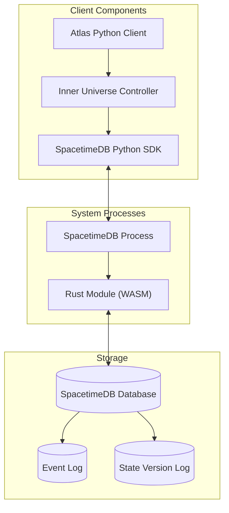

# Inner Universe Deployment System

This document outlines the minimal deployment architecture for the Inner Universe persistence layer, focusing on how the system will be deployed, initialized, and operated.

## Deployment Modes

The Inner Universe system operates in two distinct modes:

1. **Deployment Mode**: Used for initial setup, migrations, and configuration changes
2. **Server Mode**: Used for normal operation and handling client requests

## System Components



## Deployment Mode Process

The deployment mode process initializes or updates the SpacetimeDB instance with the Inner Universe module:

1. **Compile Rust Module**: Build and compile the Rust module to WebAssembly
2. **Launch SpacetimeDB**: Start the SpacetimeDB process in deployment mode
3. **Execute Migrations**: Apply any pending schema migrations
4. **Initialize Data**: Set up initial data and configuration
5. **Verify Deployment**: Run validation tests to ensure proper operation

### Deployment Command Sequence

```bash
# Compile Rust module to WebAssembly
cd inner-universe-module
cargo build --release --target wasm32-unknown-unknown

# Start deployment process
spacetime deploy \
  --module-path ./target/wasm32-unknown-unknown/release/inner_universe_module.wasm \
  --db-path /path/to/database \
  --log-level info
```

## Server Mode Process

The server mode process runs the SpacetimeDB instance for normal operation:

1. **Launch SpacetimeDB**: Start the SpacetimeDB process in server mode
2. **Connect Clients**: Accept connections from Python clients
3. **Process Requests**: Handle reducer calls and query requests
4. **Push Updates**: Stream table changes to subscribed clients
5. **Maintain State**: Persist changes to the database

### Server Command Sequence

```bash
# Start server process
spacetime run \
  --db-path /path/to/database \
  --address 0.0.0.0 \
  --port 3000 \
  --log-level info
```

## Python Client Integration

The Python client integration connects Atlas to the Inner Universe persistence layer:

```python
# Minimal Python client controller for Inner Universe
class InnerUniverseController:
    def __init__(self, config):
        self.config = config
        self.process = None
        self.client = None

    async def deploy(self):
        """Deploy a new instance or update an existing one"""
        # Build module if needed
        if self.config.get("build_module", True):
            await self._build_module()

        # Launch SpacetimeDB in deployment mode
        deployment_cmd = [
            "spacetime", "deploy",
            "--module-path", self.config["module_path"],
            "--db-path", self.config["db_path"],
            "--log-level", self.config.get("log_level", "info")
        ]

        self.process = await asyncio.create_subprocess_exec(
            *deployment_cmd,
            stdout=asyncio.subprocess.PIPE,
            stderr=asyncio.subprocess.PIPE
        )

        # Wait for deployment to complete
        stdout, stderr = await self.process.communicate()

        if self.process.returncode != 0:
            raise RuntimeError(f"Deployment failed: {stderr.decode()}")

        return {"status": "deployed", "stdout": stdout.decode()}

    async def start_server(self):
        """Start the server in normal operation mode"""
        # Launch SpacetimeDB in server mode
        server_cmd = [
            "spacetime", "run",
            "--db-path", self.config["db_path"],
            "--address", self.config.get("address", "127.0.0.1"),
            "--port", str(self.config.get("port", 3000)),
            "--log-level", self.config.get("log_level", "info")
        ]

        self.process = await asyncio.create_subprocess_exec(
            *server_cmd,
            stdout=asyncio.subprocess.PIPE,
            stderr=asyncio.subprocess.PIPE
        )

        # Connect client
        from spacetimedb_sdk.client import SpacetimeDBClient

        self.client = SpacetimeDBClient(
            address=self.config.get("address", "127.0.0.1"),
            port=self.config.get("port", 3000)
        )

        await self.client.connect()
        return self.client

    async def stop(self):
        """Stop the running SpacetimeDB process"""
        if self.client:
            await self.client.disconnect()
            self.client = None

        if self.process and self.process.returncode is None:
            self.process.terminate()
            await self.process.wait()

        self.process = None
        return {"status": "stopped"}

    async def _build_module(self):
        """Build the Rust module to WebAssembly"""
        build_cmd = [
            "cargo", "build",
            "--release",
            "--target", "wasm32-unknown-unknown"
        ]

        # Run in the module directory
        process = await asyncio.create_subprocess_exec(
            *build_cmd,
            cwd=self.config["module_dir"],
            stdout=asyncio.subprocess.PIPE,
            stderr=asyncio.subprocess.PIPE
        )

        stdout, stderr = await process.communicate()

        if process.returncode != 0:
            raise RuntimeError(f"Module build failed: {stderr.decode()}")
```

## Configuration Schema

The configuration for the Inner Universe system is defined as follows:

```json
{
  "module_config": {
    "module_dir": "/path/to/inner-universe-module",
    "module_path": "/path/to/inner-universe-module/target/wasm32-unknown-unknown/release/inner_universe_module.wasm",
    "build_module": true
  },
  "spacetimedb_config": {
    "db_path": "/path/to/database",
    "address": "127.0.0.1",
    "port": 3000,
    "log_level": "info"
  },
  "server_config": {
    "max_connections": 100,
    "timeout_ms": 30000,
    "cache_size_mb": 512,
    "auth_required": true
  },
  "feature_flags": {
    "enable_state_versioning": true,
    "enable_audit_log": true,
    "enable_metrics": true,
    "enable_caching": true,
    "enable_distribution": false
  }
}
```

## Deployment Environments

### Local Development

For local development, the Inner Universe system can be run entirely on the developer's machine:

1. SpacetimeDB runs as a local process
2. Database files are stored locally
3. Python client connects to localhost
4. Changes persist between restarts

### Testing Environment

For testing, a containerized setup is recommended:

1. SpacetimeDB runs in a Docker container
2. Database is mounted as a volume or in-memory
3. Tests connect via container network
4. State can be reset between test runs

```bash
# Run SpacetimeDB in a Docker container
docker run -d \
  --name spacetimedb \
  -v ./module:/module \
  -v ./data:/data \
  -p 3000:3000 \
  spacetimedb/spacetimedb:latest \
  run --db-path /data --module-path /module/inner_universe_module.wasm
```

### Production Environment

For production deployments, a more robust setup is required:

1. SpacetimeDB runs on dedicated server(s)
2. Database is backed by persistent storage
3. TLS is configured for secure connections
4. Authentication and authorization are enforced
5. Regular backups are scheduled
6. Monitoring and alerting are in place

## Initialization Process

When the Inner Universe system is first deployed, it goes through these initialization steps:

1. **Schema Creation**: Tables and indexes are created
2. **Admin Setup**: Initial administrative identity is created
3. **Base Configuration**: Default configuration values are set
4. **System Initialization**: System state is initialized
5. **Readiness Check**: The system verifies it's ready to accept connections

```rust
#[reducer(init)]
pub fn init(ctx: &ReducerContext) {
    // Called when the module is initially published
    log::info!("Initializing Inner Universe module");

    // Create the default configuration
    let default_config = ModuleConfig {
        name: "inner-universe".to_string(),
        version: "0.1.0".to_string(),
        cache_size_mb: 256,
        log_level: LogLevel::Info,
        features: vec![FeatureFlag::EnableStateVersioning, FeatureFlag::EnableAuditLog]
    };

    // Store initial configuration
    ctx.db.config().insert(Config {
        key: "module_config".to_string(),
        value: serde_json::to_string(&default_config).unwrap(),
        description: Some("Default module configuration".to_string()),
        updated_at: ctx.timestamp,
        updated_by: ctx.sender
    });

    // Log the initialization event
    ctx.db.event_log().insert(EventLog {
        event_id: generate_uuid(),
        event_type: "SYSTEM_INITIALIZED".to_string(),
        source: None,
        timestamp: ctx.timestamp,
        data: EventData::Custom(BTreeMap::from([
            ("version".to_string(), Value::String("0.1.0".to_string())),
            ("initialized_by".to_string(), Value::String(ctx.sender.to_string()))
        ]))
    });

    log::info!("Inner Universe module initialized successfully");
}
```

## Authentication and Security

The Inner Universe system leverages SpacetimeDB's authentication system:

1. **Identity-Based Auth**: SpacetimeDB provides unique identities for clients
2. **Owner Permissions**: Module owner has administrative privileges
3. **Reducer-Level Authorization**: Access control is enforced in reducer functions
4. **TLS Encryption**: Network communication is encrypted in production

```rust
// Example of authorization check in a reducer
#[reducer]
fn admin_operation(ctx: &ReducerContext, config_key: String, config_value: String) -> Result<(), String> {
    // Check if sender is the module owner or an admin
    if !is_admin(ctx.sender) {
        return Err("Unauthorized: Admin privileges required".into());
    }

    // Perform the administrative operation
    ctx.db.config().insert(Config {
        key: config_key,
        value: config_value,
        description: None,
        updated_at: ctx.timestamp,
        updated_by: ctx.sender
    });

    Ok(())
}
```

## Backup and Recovery

The Inner Universe system supports backup and recovery through these mechanisms:

1. **Database Snapshots**: Point-in-time snapshots of the database
2. **Event Log Export**: Export of event log for replay
3. **State Version Export**: Export of versioned state
4. **Configuration Backup**: Backup of system configuration
5. **Manual Recovery**: Process for manual intervention if needed

```bash
# Create a backup of the SpacetimeDB database
spacetime backup create --db-path /path/to/database --output /path/to/backup.stb

# Restore from a backup
spacetime backup restore --input /path/to/backup.stb --db-path /path/to/restored_database
```

## Monitoring and Metrics

The Inner Universe system provides metrics for monitoring through:

1. **System Status Reducer**: Provides current system status
2. **Metrics Table**: Records performance metrics
3. **Health Check Endpoint**: Simple health check for monitoring
4. **Log Output**: Detailed logs for troubleshooting
5. **Event Stream**: Stream of system events for real-time monitoring

```rust
#[reducer]
fn get_system_status(ctx: &ReducerContext) -> SystemStatus {
    // Count entities and relations
    let entity_count = ctx.db.entity().count() as u64;
    let relation_count = ctx.db.relation().count() as u64;
    let event_count = ctx.db.event_log().count() as u64;

    // Count connected clients
    let connected_clients = ctx.db.client_connection()
        .filter(|c| matches!(c.status, ConnectionStatus::Connected))
        .count() as u32;

    // Calculate uptime (if we stored start time in a config entry)
    let start_time = ctx.db.config()
        .filter(|c| c.key == "start_time")
        .first()
        .and_then(|c| c.value.parse::<u64>().ok())
        .unwrap_or(ctx.timestamp);

    let uptime_seconds = (ctx.timestamp - start_time) / 1000;

    // Return status report
    SystemStatus {
        status: SystemState::Running,
        version: "0.1.0".to_string(),
        uptime_seconds,
        entity_count,
        relation_count,
        event_count,
        connected_clients
    }
}
```

## Scaling Considerations

While initial deployment will be single-instance, the system design considers future scaling:

1. **Read Replicas**: Potential for read-only replicas to scale queries
2. **Sharding**: Database sharding for large datasets
3. **Client Connection Pooling**: Connection pooling for high client counts
4. **Horizontal Scaling**: Design that supports future horizontal scaling
5. **Caching Layer**: Integrated caching for frequently accessed data

## Deployment Checklist

Before deploying the Inner Universe system, ensure:

1. ✅ Rust module compiles successfully to WebAssembly
2. ✅ SpacetimeDB is installed on the target system
3. ✅ Database directory is created and writable
4. ✅ Network ports are properly configured
5. ✅ Authentication requirements are met
6. ✅ Backup strategy is in place
7. ✅ Monitoring is configured
8. ✅ Initial configuration is validated
