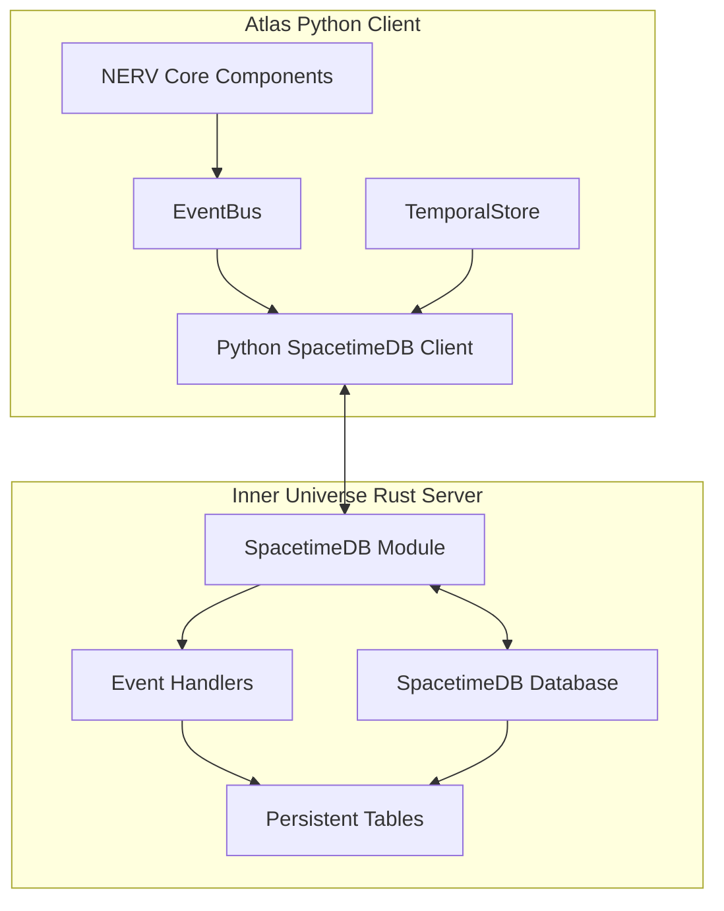
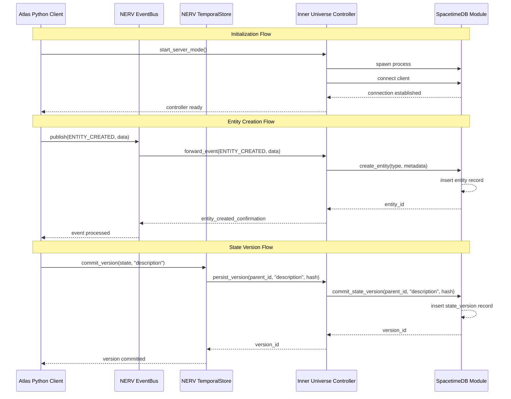

# Inner Universe: NERV Persistence Architecture

## Overview

The Inner Universe component provides a persistent data layer for the Atlas ecosystem using SpacetimeDB. This document outlines the architecture for a Rust-based persistence server that complements the Python client implementation of Atlas.

Inner Universe serves as the bridge between the ephemeral, in-memory state management of NERV components and long-term, distributed persistence. It leverages SpacetimeDB's unique architecture to provide both storage and compute capabilities directly within the database.



## Architecture Components

The Inner Universe persistence layer consists of two core components:

1. **SpacetimeDB Module (Rust)**: A WebAssembly-compiled Rust module that defines schemas, reducers, and event handlers
2. **Python Client Controller**: A Python interface that manages the lifecycle of the SpacetimeDB instance and communicates with the Rust module

### Implementation Modes

The Inner Universe system operates in two distinct modes:

1. **Deployment Mode**: Handles initial setup, schema migration, and configuration of the SpacetimeDB instance
2. **Server Mode**: Processes ongoing requests from the Python client, maintaining persistence and state synchronization

## SpacetimeDB Integration

### Table Schemas

Inner Universe provides persistent storage for NERV's core data types:

```rust
#[table(name = entity, public)]
pub struct Entity {
    #[primary_key]
    id: String,
    entity_type: String,
    created_at: Timestamp,
    updated_at: Timestamp,
    metadata: EntityMetadata
}

#[table(name = relation, public)]
pub struct Relation {
    #[primary_key]
    id: String,
    from_entity: String,
    to_entity: String,
    relation_type: String,
    created_at: Timestamp,
    metadata: RelationMetadata
}

#[table(name = state_version, public)]
pub struct StateVersion {
    #[primary_key]
    version_id: String,
    parent_version_id: Option<String>,
    timestamp: Timestamp,
    description: String,
    data_hash: String,
    owner: Identity
}

#[table(name = event_log, public)]
pub struct EventLog {
    #[primary_key]
    event_id: String,
    event_type: String,
    source: Option<String>,
    timestamp: Timestamp,
    data: EventData
}

#[table(name = delta_record, public)]
pub struct DeltaRecord {
    #[primary_key]
    delta_id: String,
    state_version_id: String,
    operations: Vec<DeltaOperation>,
    timestamp: Timestamp,
    metadata: DeltaMetadata
}
```

### Reducers

Reducers provide the interface for the Python client to interact with the persistence layer:

```rust
#[reducer]
fn create_entity(ctx: &ReducerContext, entity_type: String, metadata: EntityMetadata) -> String {
    // Generate a unique ID
    let id = generate_uuid();
    let now = ctx.timestamp;

    // Insert the entity
    ctx.db.entity().insert(Entity {
        id: id.clone(),
        entity_type,
        created_at: now,
        updated_at: now,
        metadata
    });

    // Log the event
    log_event(ctx, "ENTITY_CREATED", Some(id.clone()), EntityCreatedData {
        entity_id: id.clone(),
        entity_type,
        metadata
    });

    // Return the ID
    id
}

#[reducer]
fn create_relation(
    ctx: &ReducerContext,
    from_entity: String,
    to_entity: String,
    relation_type: String,
    metadata: RelationMetadata
) -> String {
    // Generate a unique ID
    let id = generate_uuid();
    let now = ctx.timestamp;

    // Verify entities exist
    if !entity_exists(ctx, &from_entity) || !entity_exists(ctx, &to_entity) {
        return Err("One or both entities do not exist".into());
    }

    // Insert the relation
    ctx.db.relation().insert(Relation {
        id: id.clone(),
        from_entity,
        to_entity,
        relation_type,
        created_at: now,
        metadata
    });

    // Log the event
    log_event(ctx, "RELATION_CREATED", Some(id.clone()), RelationCreatedData {
        relation_id: id.clone(),
        from_entity,
        to_entity,
        relation_type,
        metadata
    });

    // Return the ID
    id
}

#[reducer]
fn commit_state_version(
    ctx: &ReducerContext,
    parent_version_id: Option<String>,
    description: String,
    data_hash: String
) -> String {
    let version_id = generate_uuid();
    let now = ctx.timestamp;

    // Insert the state version
    ctx.db.state_version().insert(StateVersion {
        version_id: version_id.clone(),
        parent_version_id,
        timestamp: now,
        description,
        data_hash,
        owner: ctx.sender
    });

    // Log the event
    log_event(ctx, "STATE_VERSION_COMMITTED", Some(version_id.clone()), VersionCommitData {
        version_id: version_id.clone(),
        parent_version_id,
        description,
        data_hash
    });

    // Return the version ID
    version_id
}

#[reducer]
fn record_delta(
    ctx: &ReducerContext,
    state_version_id: String,
    operations: Vec<DeltaOperation>,
    metadata: DeltaMetadata
) -> String {
    let delta_id = generate_uuid();
    let now = ctx.timestamp;

    // Verify state version exists
    if !version_exists(ctx, &state_version_id) {
        return Err("State version does not exist".into());
    }

    // Insert the delta record
    ctx.db.delta_record().insert(DeltaRecord {
        delta_id: delta_id.clone(),
        state_version_id,
        operations,
        timestamp: now,
        metadata
    });

    // Log the event
    log_event(ctx, "DELTA_RECORDED", Some(delta_id.clone()), DeltaRecordedData {
        delta_id: delta_id.clone(),
        state_version_id,
        operations_count: operations.len(),
        metadata
    });

    // Return the delta ID
    delta_id
}
```

### Event System Integration

The Inner Universe module integrates with NERV's event system using SpacetimeDB's built-in event mechanism:

```rust
#[reducer]
fn publish_event(
    ctx: &ReducerContext,
    event_type: String,
    source: Option<String>,
    data: EventData
) -> String {
    let event_id = generate_uuid();
    let now = ctx.timestamp;

    // Insert the event
    ctx.db.event_log().insert(EventLog {
        event_id: event_id.clone(),
        event_type: event_type.clone(),
        source,
        timestamp: now,
        data: data.clone()
    });

    // Broadcast to any event subscribers
    // (SpacetimeDB automatically publishes table changes to subscribers)

    // Return the event ID
    event_id
}

// Event handler lifecycle hooks
#[reducer(client_connected)]
fn identity_connected(ctx: &ReducerContext) {
    let identity = ctx.sender;
    log::debug!("Client connected: {}", identity);

    // Publish connection event
    publish_event(
        ctx,
        "CLIENT_CONNECTED".to_string(),
        None,
        EventData::ClientConnected(ClientConnectedData { identity })
    );
}

#[reducer(client_disconnected)]
fn identity_disconnected(ctx: &ReducerContext) {
    let identity = ctx.sender;
    log::debug!("Client disconnected: {}", identity);

    // Publish disconnection event
    publish_event(
        ctx,
        "CLIENT_DISCONNECTED".to_string(),
        None,
        EventData::ClientDisconnected(ClientDisconnectedData { identity })
    );
}
```

## Python Client Controller

The Python component of Inner Universe manages the SpacetimeDB instance's lifecycle:

```python
class InnerUniverseController:
    def __init__(self, config: Dict[str, Any]):
        self.config = config
        self.process = None
        self.client = None

    async def start_deployment_mode(self):
        """Initialize and configure a new SpacetimeDB instance"""
        # Launch SpacetimeDB in deployment mode
        self.process = await self._spawn_spacetime_process("deployment")

        # Connect client
        self.client = await self._connect_client()

        # Initialize schema
        await self.client.initialize_schema()

        # Apply initial configuration
        await self.client.apply_configuration(self.config)

        return self.client

    async def start_server_mode(self):
        """Start SpacetimeDB in server mode to handle ongoing requests"""
        # Launch SpacetimeDB in server mode
        self.process = await self._spawn_spacetime_process("server")

        # Connect client
        self.client = await self._connect_client()

        # Register event handlers
        self._register_event_handlers()

        return self.client

    async def _spawn_spacetime_process(self, mode: str):
        """Spawn the SpacetimeDB process in the specified mode"""
        cmd = [
            "spacetime", "run",
            "--db-path", self.config["db_path"],
            "--mode", mode
        ]

        # Add additional configuration options
        if mode == "server":
            cmd.extend(["--address", self.config.get("address", "127.0.0.1")])
            cmd.extend(["--port", str(self.config.get("port", 3000))])

        # Start the process
        process = await asyncio.create_subprocess_exec(
            *cmd,
            stdout=asyncio.subprocess.PIPE,
            stderr=asyncio.subprocess.PIPE
        )

        return process

    async def _connect_client(self):
        """Create and connect a SpacetimeDB client to the running instance"""
        from spacetimedb_sdk.client import SpacetimeDBClient

        client = SpacetimeDBClient(
            address=self.config.get("address", "127.0.0.1"),
            port=self.config.get("port", 3000)
        )

        await client.connect()
        return client

    def _register_event_handlers(self):
        """Register handlers for state changes from SpacetimeDB"""
        if not self.client:
            raise RuntimeError("Client not connected")

        # Subscribe to relevant tables
        self.client.subscribe_entity_changes(self._on_entity_change)
        self.client.subscribe_relation_changes(self._on_relation_change)
        self.client.subscribe_state_version_changes(self._on_state_version_change)
        self.client.subscribe_event_log_changes(self._on_event_log_change)

    def _on_entity_change(self, change_type, entity):
        """Handle entity table changes"""
        # Forward to EventBus
        pass

    def _on_relation_change(self, change_type, relation):
        """Handle relation table changes"""
        # Forward to EventBus
        pass

    def _on_state_version_change(self, change_type, state_version):
        """Handle state_version table changes"""
        # Forward to TemporalStore
        pass

    def _on_event_log_change(self, change_type, event):
        """Handle event_log table changes"""
        # Forward to EventBus
        pass

    async def stop(self):
        """Stop the SpacetimeDB instance and disconnect client"""
        if self.client:
            await self.client.disconnect()
            self.client = None

        if self.process:
            self.process.terminate()
            await self.process.wait()
            self.process = None
```

## Integration with NERV Architecture

Inner Universe integrates with the following NERV components:

1. **EventBus**: Events published through Inner Universe are synchronized with the NERV EventBus
2. **TemporalStore**: State versions managed by TemporalStore are persisted in Inner Universe
3. **StateProjector**: Deltas tracked by StateProjector are recorded in Inner Universe
4. **PerspectiveAware**: Entity and relation schemas support the PerspectiveAware pattern

### Data Flow



## Deployment Considerations

### Initial Deployment

1. Start the controller in deployment mode
2. Configure database schema and initial state
3. Set up authentication and permissions
4. Deploy the Rust module to SpacetimeDB

### Production Operation

1. Start the controller in server mode
2. Register event handlers with the client
3. Connect to the existing SpacetimeDB instance
4. Begin processing events and state changes

### Backup and Recovery

1. SpacetimeDB maintains transaction logs for recovery
2. Additional schema migrations can be applied through deployment mode
3. State can be restored from TemporalStore snapshots

## Performance Considerations

Inner Universe leverages SpacetimeDB's key performance features:

1. **Real-time State Synchronization**: Changes are automatically pushed to connected clients
2. **WebAssembly Execution**: Rust module runs at near-native speed
3. **In-Memory Processing**: State is kept in memory for fast access
4. **Transactional Integrity**: All reducers run as atomic transactions
5. **Distributed Computation**: Logic runs close to the data

## Security Considerations

1. **Authentication**: SpacetimeDB Identity system for client authentication
2. **Authorization**: Reducer-based permission checks
3. **Data Validation**: Schema-enforced data integrity
4. **Secure Communication**: TLS-encrypted client connections

## Future Extensions

1. **Multi-Module Support**: Multiple specialized Rust modules for different domains
2. **Sharding**: Distribute state across multiple SpacetimeDB instances
3. **Analytics Integration**: Connect to external analytics platforms
4. **Cross-Language Support**: Add C# modules for Unity-specific functionality
5. **Custom Query Optimization**: Specialized indexes for NERV-specific queries

## Implementation Roadmap

1. **Phase 1**: Core schema and basic persistence (entities, relations, events)
2. **Phase 2**: TemporalStore integration (state versions, deltas)
3. **Phase 3**: Advanced queries and optimizations
4. **Phase 4**: Multi-tenant support and scaling
5. **Phase 5**: Analytics and monitoring
