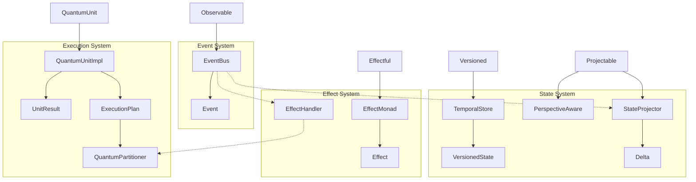

# NERV Type System Cheatsheet

This cheatsheet provides a quick reference for Atlas's NERV architecture type system, with concise definitions and usage guidance.

## Type Variables

| TypeVar | Purpose                  | Used For                                   |
| ------- | ------------------------ | ------------------------------------------ |
| `T`     | Generic data type        | General purpose type variable for any data |
| `S`     | Generic state type       | State representations in components        |
| `R`     | Generic result type      | Return values from operations              |
| `E`     | Generic event type       | Event data in the event system             |
| `V`     | Generic value type       | Values in effectful operations             |
| `P`     | Generic perspective type | Projected views of data                    |
| `K`     | Generic key type         | Keys in dictionaries/maps                  |
| `C`     | Generic context type     | Context passed between components          |
| `M`     | Generic message type     | Messages in communication                  |
| `T_in`  | Input boundary type      | Input data at system boundaries            |
| `T_out` | Output boundary type     | Output data at system boundaries           |

## Identity Types

| Type         | Definition | Purpose                                        |
| ------------ | ---------- | ---------------------------------------------- |
| `EntityId`   | `str`      | Unique identifier for any entity in the system |
| `VersionId`  | `str`      | Identifier for a versioned state               |
| `ResourceId` | `str`      | Identifier for a managed resource              |
| `EventId`    | `str`      | Identifier for an event occurrence             |

## Core Enums

| Enum             | Values                              | Purpose                         |
| ---------------- | ----------------------------------- | ------------------------------- |
| `EventType`      | SYSTEM_INIT, PROVIDER_CREATED, etc. | Categorize events in the system |
| `EffectType`     | FILE_READ, MODEL_CALL, etc.         | Categorize side effects         |
| `LifecycleState` | CREATED, READY, ACTIVE, etc.        | Track component lifecycle       |
| `StreamState`    | PENDING, ACTIVE, COMPLETED, etc.    | Control streaming operations    |
| `ResourceType`   | CONNECTION, FILE, THREAD, etc.      | Categorize managed resources    |
| `UnitState`      | PENDING, RUNNING, COMPLETED, etc.   | Track quantum unit execution    |

## Core Data Classes

| Class                 | Key Fields                          | Purpose                    |
| --------------------- | ----------------------------------- | -------------------------- |
| `Event[T]`            | id, type, data, timestamp, source   | Structured event data      |
| `Effect`              | type, payload, description          | Side effect representation |
| `Resource`            | id, type, state, metadata           | Managed system resource    |
| `VersionedState`      | version_id, data, parent_version_id | State with version info    |
| `UnitResult[R]`       | success, value, error               | Computation unit result    |
| `ValidationResult[T]` | is_valid, data, errors              | Validation outcome         |
| `DeltaMetadata`       | timestamp, source, description      | Change metadata            |

## Core Protocol Interfaces

| Protocol               | Key Methods                  | Purpose                      |
| ---------------------- | ---------------------------- | ---------------------------- |
| `Observable[E]`        | add_observer(), notify()     | Emit observable events       |
| `Versioned[S]`         | get_version(), commit()      | Version history management   |
| `Projectable[S,P]`     | add_projection(), project()  | Multiple views of data       |
| `Effectful[V]`         | with_effect(), map(), bind() | Track operation side effects |
| `QuantumUnit[S,R]`     | can_execute(), execute()     | Parallelizable computation   |
| `Boundary[T_in,T_out]` | validate(), process()        | System boundary handling     |

## Error Hierarchy

```
AtlasError
 └── BoundaryError
      ├── ValidationError
      └── NetworkError
```

## Implementation Classes

| Class                                                     | Implements Pattern                                         | Key Features                         |
| --------------------------------------------------------- | ---------------------------------------------------------- | ------------------------------------ |
| [EventBus](../components/event_bus.md)                     | [Reactive Event Mesh](../patterns/reactive_event_mesh.md)   | Manages pub/sub, middleware, history |
| [TemporalStore](../components/temporal_store.md)           | [Temporal Versioning](../patterns/temporal_versioning.md)   | Complete version history             |
| [PerspectiveAware](../components/perspective_aware.md)     | [Perspective Shifting](../patterns/perspective_shifting.md) | Context-specific data views          |
| [EffectMonad](../components/effect_monad.md)               | [Effect System](../patterns/effect_system.md)               | Monadic effect handling              |
| [StateProjector](../components/state_projector.md)         | [State Projection](../patterns/state_projection.md)         | Delta-based state projections        |
| QuantumUnitImpl                                           | [Quantum Partitioning](../patterns/quantum_partitioning.md) | Parallelizable computation unit      |
| ExecutionPlan                                             | [Quantum Partitioning](../patterns/quantum_partitioning.md) | Dependency-aware scheduling          |
| [QuantumPartitioner](../components/quantum_partitioner.md) | [Quantum Partitioning](../patterns/quantum_partitioning.md) | Maximizes parallel execution         |

## Primitive Design Patterns

| Pattern                                    | Implementers                  | Usage                      |
| ------------------------------------------ | ----------------------------- | -------------------------- |
| [**Observer**](../primitives/observer.md)   | Observable, EventBus          | Event notification system  |
| [**Command**](../primitives/command.md)     | Effect, EffectHandler         | Operation encapsulation    |
| [**Monad**](../primitives/monad.md)         | EffectMonad                   | Functional composition     |
| [**Strategy**](../primitives/strategy.md)   | Projectable, StateProjector   | Interchangeable algorithms |
| [**Builder**](../primitives/builder.md)     | QuantumPartitioner            | Step-by-step construction  |
| [**DAG**](../primitives/dag.md)             | ExecutionPlan                 | Dependency management      |
| [**Factory**](../primitives/factory.md)     | Delta, EffectMonad            | Delegated object creation  |
| [**Decorator**](../primitives/decorator.md) | EffectMonad, PerspectiveAware | Dynamic behavior addition  |

## Relationship Visualizer



## Pattern Integration

The following table shows how NERV's core patterns integrate to solve common problems:

| Pattern Combination                        | Use Case                        | Key Benefits                                       |
| ------------------------------------------ | ------------------------------- | -------------------------------------------------- |
| Temporal Versioning + State Projection     | Document versioning systems     | Command-level granularity with milestone snapshots |
| Reactive Event Mesh + Effect System        | Streaming response handling     | Decoupled side effects with observable events      |
| Perspective Shifting + Temporal Versioning | Multi-user content management   | Role-based views with full history tracking        |
| Quantum Partitioning + Event-Driven        | Parallel workflow orchestration | Optimized execution with decoupled messaging       |
| State Projection + Effect System           | Transactional operations        | Explicit effects with delta-based changes          |

## Integration with Atlas Core Systems

| NERV Component     | Atlas Integration                               | Purpose                          |
| ------------------ | ----------------------------------------------- | -------------------------------- |
| EventBus           | Integrates with Provider and Agent systems      | Central communication backbone   |
| TemporalStore      | Supports Provider configuration and Agent state | Versioned state preservation     |
| PerspectiveAware   | Provides role-based API views                   | Context-specific representations |
| EffectMonad        | Powers tool invocation and external calls       | Clean effect handling            |
| QuantumPartitioner | Optimizes multi-agent orchestration             | Parallel execution control       |

## Usage Examples

### Event System
```python
# Create and use EventBus
bus = EventBus()
unsubscribe = bus.subscribe(EventType.STREAM_STARTED, lambda e: print(f"Stream started: {e.data}"))
event_id = bus.publish(EventType.STREAM_STARTED, data="Stream 1")
```

### Versioned State
```python
# Create and use TemporalStore
store = TemporalStore()
v1 = store.commit({"count": 0}, "Initial state")
v2 = store.commit({"count": 1}, "Increment count")
history = store.get_history()  # Get all versions
```

### Perspective Shifting
```python
# Create and use PerspectiveAware
raw_data = {"users": [{"id": 1, "name": "Alice", "email": "alice@example.com", "role": "admin"}]}
multi_view = PerspectiveAware(raw_data)
multi_view.add_perspective("public", lambda d: {"users": [{"id": u["id"], "name": u["name"]} for u in d["users"]]})
public_view = multi_view.view("public")  # Filtered view
```

### Effect System
```python
# Create and use EffectMonad and EffectHandler
handler = EffectHandler()
handler.register_handler(EffectType.MODEL_CALL, lambda p: f"Called model with: {p}")

operation = EffectMonad.pure("Start") \
    .with_effect(Effect(EffectType.MODEL_CALL, "What's 2+2?")) \
    .map(lambda s: s + " -> Processing") \
    .with_effect(Effect(EffectType.STATE_MODIFY, "Update result"))

result = operation.run(handler.handle)  # "Start -> Processing"
executed = handler.get_executed_effects()  # List of all effects that were handled
```

### Quantum Partitioning
```python
# Create and use QuantumPartitioner
partitioner = QuantumPartitioner()
unit1 = partitioner.add_unit(lambda ctx: ctx["data"] * 2, name="Double")
unit2 = partitioner.add_unit(lambda ctx: ctx["data"] + 10, name="Add10")
unit3 = partitioner.add_unit(lambda ctx: f"Result: {ctx['data']}", dependencies=[unit1, unit2], name="Format")

results = partitioner.execute({"data": 5})  # Parallel execution with dependencies
```

## Integrated Examples

### Document-Based Blog Platform with Versioning
```python
# Combining Temporal Versioning and State Projection for a blogging platform
# This demonstrates the synergy between command-pattern changes and milestone versions

# Initialize the systems
bus = EventBus()
store = TemporalStore()  # For major version snapshots
projector = StateProjector({"posts": []})  # For granular changes

# Create perspectives for different user roles
blog_views = PerspectiveAware(projector.get_current_state())
blog_views.add_perspective("admin", lambda s: s)  # Full access
blog_views.add_perspective("public", lambda s: {
    "posts": [
        {k: v for k, v in post.items() if k != "draft_content"}
        for post in s["posts"] if post.get("published", False)
    ]
})

# Register event handlers
def on_content_change(event):
    # Apply delta to state projector for granular changes
    delta = event.data.get("delta")
    projector.apply_delta(delta,
                          description=event.data.get("description", ""),
                          source=event.source)

    # Update the view data
    blog_views.update_data(projector.get_current_state())

    # If this is a major change (e.g., publish), create a snapshot in temporal store
    if event.data.get("major_change", False):
        store.commit(projector.get_current_state(),
                    description=event.data.get("description", ""))

bus.subscribe(EventType.DOCUMENT_PROCESSED, on_content_change)

# Example: Create a new blog post (fine-grained change)
def add_post(title, content, author):
    post = {
        "id": str(uuid.uuid4()),
        "title": title,
        "content": content,
        "draft_content": content,
        "author": author,
        "created_at": time.time(),
        "updated_at": time.time(),
        "published": False
    }

    # Create a delta that adds this post to the posts array
    def add_post_delta(state):
        new_state = copy.deepcopy(state)
        new_state["posts"].append(post)
        return new_state

    # Publish the change event
    bus.publish(
        EventType.DOCUMENT_PROCESSED,
        data={
            "delta": add_post_delta,
            "description": f"Add post: {title}",
            "major_change": False
        },
        source="user_editor"
    )

    return post["id"]

# Example: Update a post (fine-grained change)
def update_post(post_id, new_content):
    # Create a delta that updates specific post content
    def update_post_delta(state):
        new_state = copy.deepcopy(state)
        for post in new_state["posts"]:
            if post["id"] == post_id:
                post["draft_content"] = new_content
                post["updated_at"] = time.time()
                break
        return new_state

    # Publish the change event
    bus.publish(
        EventType.DOCUMENT_PROCESSED,
        data={
            "delta": update_post_delta,
            "description": f"Update post draft: {post_id}",
            "major_change": False
        },
        source="user_editor"
    )

# Example: Publish a post (major change - create a snapshot)
def publish_post(post_id):
    # Create a delta that marks the post as published and updates content
    def publish_post_delta(state):
        new_state = copy.deepcopy(state)
        for post in new_state["posts"]:
            if post["id"] == post_id:
                post["published"] = True
                post["content"] = post["draft_content"]  # Promote draft content
                post["updated_at"] = time.time()
                break
        return new_state

    # Publish the change event
    bus.publish(
        EventType.DOCUMENT_PROCESSED,
        data={
            "delta": publish_post_delta,
            "description": f"Publish post: {post_id}",
            "major_change": True  # This will trigger a temporal store snapshot
        },
        source="user_editor"
    )

# Example usage
post_id = add_post("Getting Started with NERV", "Initial content...", "Alice")
update_post(post_id, "Updated draft content...")
update_post(post_id, "Final draft content ready for publishing...")
publish_post(post_id)

# Get current public view
public_view = blog_views.view("public")

# Get full history of major versions
version_history = store.get_history()

# Get fine-grained change history
change_history = projector.get_delta_history()
```

### Parallel Provider Management with Effect Tracking
```python
# This example shows how to combine QuantumPartitioning, Effect System, and Event Bus
# for robust provider operations with full effect tracking

# Initialize systems
bus = EventBus()
effect_handler = EffectHandler()
partitioner = QuantumPartitioner()

# Set up effect handler
effect_handler.register_handler(
    EffectType.MODEL_CALL,
    lambda payload: f"Called model: {payload['model']} with content: {payload['content'][:30]}..."
)
effect_handler.register_handler(
    EffectType.NETWORK_REQUEST,
    lambda payload: f"Network request to {payload['url']}"
)

# Notify event bus on effects
def effect_to_event(effect, result):
    bus.publish(
        EventType.PROVIDER_CONNECTED if effect.type == EffectType.NETWORK_REQUEST else EventType.MODEL_CALL,
        data={"effect": effect, "result": result},
        source="provider_manager"
    )

# Wrap effect handling
def handle_effect_with_events(effect):
    result = effect_handler.handle(effect)
    effect_to_event(effect, result)
    return result

# Create provider operation units
def create_provider_unit(provider_config):
    def provider_operation(context):
        # Create a chain of effects for this provider
        return EffectMonad.pure(provider_config) \
            .with_effect(Effect(
                EffectType.NETWORK_REQUEST,
                {"url": provider_config["endpoint"]}
            )) \
            .map(lambda config: {**config, "status": "connected"}) \
            .with_effect(Effect(
                EffectType.MODEL_CALL,
                {"model": provider_config["model"], "content": context["prompt"]}
            )) \
            .run(handle_effect_with_events)

    return partitioner.add_unit(
        provider_operation,
        name=f"Provider-{provider_config['name']}",
        timeout=provider_config.get("timeout", 10.0)
    )

# Define providers in priority order
providers = [
    {"name": "primary", "endpoint": "https://api.provider1.com", "model": "gpt-4", "priority": 1},
    {"name": "backup", "endpoint": "https://api.provider2.com", "model": "claude-3", "priority": 2},
    {"name": "fallback", "endpoint": "https://api.provider3.com", "model": "local-model", "priority": 3}
]

# Create units for each provider
provider_units = [create_provider_unit(p) for p in providers]

# Define collection unit that depends on all provider operations
def collect_results(context):
    # Get results from provider units that succeeded
    results = [r for r in context.get("provider_results", {}).values() if r]
    if not results:
        return {"status": "failed", "message": "All providers failed"}

    # Return the first successful result based on priority
    priority_order = {p["name"]: p["priority"] for p in providers}
    results.sort(key=lambda r: priority_order.get(r.get("name"), 999))
    return results[0]

result_collector = partitioner.add_unit(
    collect_results,
    dependencies=provider_units,
    name="ResultCollector"
)

# Execute the parallel provider operations with fallbacks
execution_context = {
    "prompt": "Tell me about the NERV architecture",
    "max_tokens": 1000
}

results = partitioner.execute(execution_context)
final_result = results.get(result_collector.id)

# Get history of effects that were executed
effect_history = effect_handler.get_executed_effects()

# Get events that were published
event_history = bus.get_history(limit=20)
```
