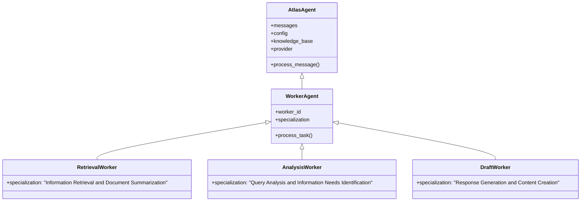

---

title: Workers

---


# Workers

This document describes the Worker Agents in Atlas, which are specialized agents that perform specific tasks as part of the multi-agent architecture.

## Overview

Worker Agents are specialized instances of the base Atlas agent, each focusing on a specific aspect of processing. They work under the coordination of a Controller Agent, receiving tasks, processing them with their specialized capabilities, and returning results.



## Key Capabilities

Worker Agents provide the following capabilities:

1. **Specialization**: Focus on specific aspects of a query or processing tasks
2. **Parallel Processing**: Can work concurrently with other workers
3. **Task-Oriented Design**: Optimized for specific types of tasks
4. **Enhanced System Prompts**: Specialized instructions tailored to their role
5. **Result Formatting**: Structured result formatting for integration by the controller

## Base Worker Implementation

The base `WorkerAgent` class is implemented in the `atlas.agents.worker` module, extending the base `AtlasAgent` class.

### Class Definition

```python
class WorkerAgent(AtlasAgent):
    """Worker agent that performs specialized tasks."""

    def __init__(
        self,
        worker_id: str,
        specialization: str,
        system_prompt_file: Optional[str] = None,
        collection_name: str = "atlas_knowledge_base",
        config: Optional[AtlasConfig] = None,
    ):
        """Initialize the worker agent."""
        # Initialize base agent
        super().__init__(system_prompt_file, collection_name, config)

        # Worker identity
        self.worker_id = worker_id
        self.specialization = specialization

        # Enhance system prompt with worker specialization
        specialization_addendum = f"""
## Worker Role

You are a specialized worker agent with ID: {worker_id}
Your specialization is: {specialization}

Focus your analysis and response on this specific aspect of the query.
"""
        self.system_prompt = self.system_prompt + specialization_addendum
```

### Key Methods

#### process_task

The `process_task` method processes a specific task assigned by the controller:

```python
def process_task(self, task: Dict[str, Any]) -> Dict[str, Any]:
    """Process a specific task assigned by the controller."""
    try:
        # Extract query from task
        query = task.get("query", "")
        if not query:
            return {
                "worker_id": self.worker_id,
                "task_id": task.get("task_id", "unknown"),
                "status": "error",
                "error": "No query provided in task",
                "result": "Could not process task: no query provided",
            }

        # Process query using basic RAG workflow
        result = self.process_message(query)

        # Return task result
        return {
            "worker_id": self.worker_id,
            "task_id": task.get("task_id", "unknown"),
            "status": "completed",
            "result": result,
        }

    except Exception as e:
        # Error handling
        return {
            "worker_id": self.worker_id,
            "task_id": task.get("task_id", "unknown"),
            "status": "error",
            "error": str(e),
            "result": "An error occurred while processing the task",
        }
```

## Specialized Worker Types

Atlas includes several predefined worker types, each specialized for a specific task.

### RetrievalWorker

The `RetrievalWorker` specializes in document retrieval and summarization.

```python
class RetrievalWorker(WorkerAgent):
    """Worker that specializes in document retrieval and summarization."""

    def __init__(
        self,
        worker_id: str = "retrieval_worker",
        system_prompt_file: Optional[str] = None,
        collection_name: str = "atlas_knowledge_base",
        config: Optional[AtlasConfig] = None,
    ):
        """Initialize a retrieval worker."""
        # Define specialization
        specialization = "Information Retrieval and Document Summarization"

        # Initialize worker
        super().__init__(
            worker_id, specialization, system_prompt_file, collection_name, config
        )
```

The RetrievalWorker focuses on:
- Finding the most relevant documents for a query
- Extracting key information from documents
- Summarizing document content
- Identifying connections between documents

### AnalysisWorker

The `AnalysisWorker` specializes in query analysis and information needs identification.

```python
class AnalysisWorker(WorkerAgent):
    """Worker that specializes in query analysis and information needs identification."""

    def __init__(
        self,
        worker_id: str = "analysis_worker",
        system_prompt_file: Optional[str] = None,
        collection_name: str = "atlas_knowledge_base",
        config: Optional[AtlasConfig] = None,
    ):
        """Initialize an analysis worker."""
        # Define specialization
        specialization = "Query Analysis and Information Needs Identification"

        # Initialize worker
        super().__init__(
            worker_id, specialization, system_prompt_file, collection_name, config
        )
```

The AnalysisWorker focuses on:
- Understanding the intent behind queries
- Identifying specific information needs
- Breaking down complex queries into simpler components
- Recognizing implicit questions in the query

### DraftWorker

The `DraftWorker` specializes in generating draft responses.

```python
class DraftWorker(WorkerAgent):
    """Worker that specializes in generating draft responses."""

    def __init__(
        self,
        worker_id: str = "draft_worker",
        system_prompt_file: Optional[str] = None,
        collection_name: str = "atlas_knowledge_base",
        config: Optional[AtlasConfig] = None,
    ):
        """Initialize a draft worker."""
        # Define specialization
        specialization = "Response Generation and Content Creation"

        # Initialize worker
        super().__init__(
            worker_id, specialization, system_prompt_file, collection_name, config
        )
```

The DraftWorker focuses on:
- Generating well-structured initial responses
- Incorporating relevant information from retrieved documents
- Following appropriate style and tone
- Creating coherent narratives that address the query

## Usage Examples

### Creating Worker Agents

```python
from atlas.agents.worker import RetrievalWorker, AnalysisWorker, DraftWorker

# Create specialized workers
retrieval_worker = RetrievalWorker()
analysis_worker = AnalysisWorker()
draft_worker = DraftWorker()
```

### Processing Tasks

```python
# Create a task for a worker
task = {
    "task_id": "task_001",
    "query": "What is the trimodal methodology in Atlas?",
    "context": {
        "documents": [
            {
                "content": "Trimodal methodology combines bottom-up implementation, top-down design, and holistic integration...",
                "metadata": {"source": "docs/architecture/overview.md"}
            }
        ]
    }
}

# Process the task with a worker
result = retrieval_worker.process_task(task)
print(result["result"])
```

## Creating Custom Workers

You can create custom worker types by extending the `WorkerAgent` class:

```python
from atlas.agents.worker import WorkerAgent

class FactCheckingWorker(WorkerAgent):
    """Worker that specializes in fact checking and verification."""

    def __init__(
        self,
        worker_id: str = "fact_checking_worker",
        system_prompt_file: Optional[str] = None,
        collection_name: str = "atlas_knowledge_base",
        config: Optional[AtlasConfig] = None,
    ):
        """Initialize a fact checking worker."""
        # Define specialization
        specialization = "Fact Checking and Information Verification"

        # Initialize worker
        super().__init__(
            worker_id, specialization, system_prompt_file, collection_name, config
        )

    def process_task(self, task: Dict[str, Any]) -> Dict[str, Any]:
        """Process a fact checking task with enhanced verification."""
        # Standard task processing
        result = super().process_task(task)

        # Add confidence score to the result
        if result["status"] == "completed":
            # Add a simple confidence score based on document count
            documents = task.get("context", {}).get("documents", [])
            confidence = min(0.5 + 0.1 * len(documents), 1.0)
            result["confidence"] = confidence

        return result
```

## Worker Agent Configuration

You can customize worker agents with different configurations to optimize for specific use cases.

### Custom System Prompts

You can provide custom system prompts to workers to further refine their behavior:

```python
from atlas.agents.worker import RetrievalWorker

# Create a retrieval worker with a custom system prompt
retrieval_worker = RetrievalWorker(
    system_prompt_file="prompts/retrieval_worker.md"
)
```

### Model Customization

Workers can use different models or providers based on their needs:

```python
from atlas.core.config import AtlasConfig
from atlas.agents.worker import AnalysisWorker, DraftWorker

# Analysis worker with lighter model for faster analysis
analysis_config = AtlasConfig(
    provider_name="anthropic",
    model_name="claude-3-haiku-20240307"
)
analysis_worker = AnalysisWorker(config=analysis_config)

# Draft worker with more powerful model for better generation
draft_config = AtlasConfig(
    provider_name="anthropic",
    model_name="claude-3-opus-20240229",
    max_tokens=4000
)
draft_worker = DraftWorker(config=draft_config)
```

## Integration with Controller

Worker agents are typically created and managed by a `ControllerAgent`:

```python
from atlas.agents.controller import ControllerAgent

# Create a controller with default worker configuration
controller = ControllerAgent(worker_count=3)

# Process a query using the controller-worker architecture
response = controller.process_message("What is the trimodal methodology?")
```

The controller creates worker instances, assigns tasks, collects results, and generates a final response.

## Advanced Topics

### Stateful Workers

You can implement stateful workers that maintain information across task processing:

```python
from atlas.agents.worker import WorkerAgent

class StatefulWorker(WorkerAgent):
    """Worker that maintains state across task processing."""

    def __init__(self, *args, **kwargs):
        super().__init__(*args, **kwargs)
        self.task_history = []
        self.entity_memory = {}

    def process_task(self, task: Dict[str, Any]) -> Dict[str, Any]:
        """Process a task with state awareness."""
        # Record task in history
        self.task_history.append(task)

        # Extract entities from the query
        query = task.get("query", "")
        entities = self._extract_entities(query)

        # Update entity memory
        for entity in entities:
            if entity not in self.entity_memory:
                self.entity_memory[entity] = 0
            self.entity_memory[entity] += 1

        # Process the task with enhanced context
        result = super().process_task(task)

        # Add state information to result
        result["known_entities"] = list(self.entity_memory.keys())

        return result

    def _extract_entities(self, text: str) -> List[str]:
        """Extract entities from text (simplified example)."""
        # In a real implementation, this would use NLP techniques
        words = text.split()
        # Simple heuristic: consider capitalized words as entities
        return [word for word in words if word[0].isupper()]
```

### Worker Specialization Through Prompting

You can create more specialized workers by providing detailed instructions in the system prompt:

```python
class CodeReviewWorker(WorkerAgent):
    """Worker that specializes in code review."""

    def __init__(self, *args, **kwargs):
        worker_id = kwargs.get("worker_id", "code_review_worker")
        specialization = "Code Review and Analysis"
        super().__init__(worker_id, specialization, **kwargs)

        # Add specialized instructions to system prompt
        code_review_addendum = """
## Code Review Guidelines

When reviewing code:
1. Focus on: security issues, performance bottlenecks, design patterns, and maintainability
2. Identify potential bugs or edge cases
3. Suggest improvements with concrete examples
4. Consider both immediate issues and long-term architecture implications
5. When making suggestions, explain both WHAT to change and WHY it's beneficial
        """
        self.system_prompt = self.system_prompt + code_review_addendum
```

## Related Documentation

- [Multi-Agent Workflow](../../workflows/multi_agent.md) - Detailed information about the multi-agent workflow
- [Controller Agent](./controller.md) - Documentation on the controller agent
- [🚧 Base Agent](#) - Documentation on the base agent implementation
