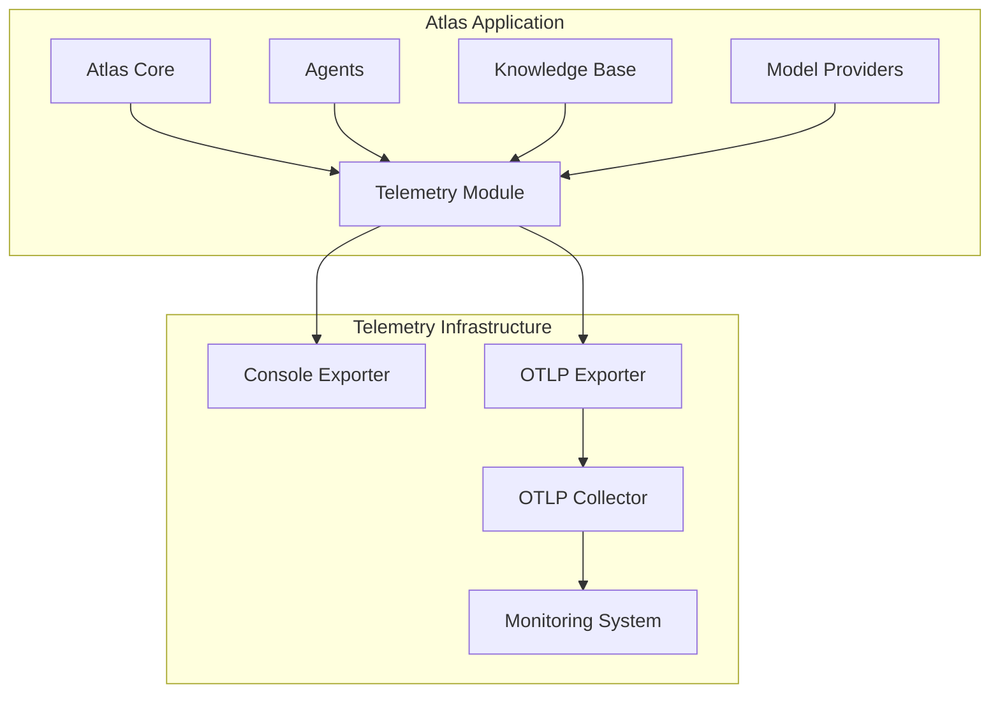

---

title: Telemetry System

---


# Telemetry System

This document describes the telemetry system used in Atlas for tracing, metrics, and logging.

## Overview

Atlas includes a comprehensive telemetry system built on [OpenTelemetry](https://opentelemetry.io/), providing:

1. **Distributed Tracing**: Track operations across the entire system
2. **Metrics Collection**: Measure performance and resource usage
3. **Structured Logging**: Consistent, context-aware logging
4. **Cost Tracking**: Monitor API usage costs
5. **Performance Analysis**: Identify bottlenecks and optimization opportunities

The telemetry system is optional and can be enabled or disabled through environment variables or programmatically.

## Architecture

The Atlas telemetry system follows a modular architecture:



Key components:

1. **Telemetry Module**: Central coordination point for all telemetry
2. **Tracers**: Capture spans and trace context across operations
3. **Meters**: Record metrics for performance and usage
4. **Exporters**: Send telemetry data to various destinations (console, OTLP, etc.)

## Configuration

### Environment Variables

Telemetry can be configured using these environment variables:

| Variable                         | Description                                           | Default |
| -------------------------------- | ----------------------------------------------------- | ------- |
| `ATLAS_ENABLE_TELEMETRY`         | Enable or disable telemetry                           | `true`  |
| `ATLAS_TELEMETRY_CONSOLE_EXPORT` | Enable console exporting for development              | `false` |
| `ATLAS_TELEMETRY_LOG_LEVEL`      | Log level for telemetry (DEBUG, INFO, WARNING, ERROR) | `INFO`  |

### Programmatic Configuration

Telemetry can also be configured programmatically:

```python
from atlas.core.telemetry import initialize_telemetry, enable_telemetry, disable_telemetry

# Initialize with custom settings
initialize_telemetry(
    service_name="atlas-custom",
    service_version="0.1.0",
    enable_console_exporter=True,
    enable_otlp_exporter=True,
    otlp_endpoint="http://localhost:4317",
    sampling_ratio=1.0,
    force_enable=True
)

# Enable or disable at runtime
enable_telemetry()
disable_telemetry()
```

## Core Features

### Tracing

Atlas uses distributed tracing to track the execution path through the system:

```python
from atlas.core.telemetry import traced

# Trace a function
@traced(name="process_document", attributes={"document_type": "markdown"})
def process_document(doc_id: str) -> str:
    # Function implementation
    return "processed"
```

Each span captures:
- Operation name
- Timing information (start time, duration)
- Attributes (key-value pairs)
- Events within the span
- Links to other spans
- Status (success/error)

### Metrics

Atlas collects various metrics for monitoring system health and performance:

1. **Counters**: Count occurrences of events
   ```python
   from atlas.core.telemetry import create_counter

   request_counter = create_counter(
       name="atlas.api.requests",
       description="Count of API requests",
       unit="1"
   )
   request_counter.add(1, {"api": "anthropic"})
   ```

2. **Histograms**: Track distributions of values
   ```python
   from atlas.core.telemetry import create_histogram

   latency_histogram = create_histogram(
       name="atlas.request.latency",
       description="Request latency",
       unit="ms"
   )
   latency_histogram.record(153, {"endpoint": "query"})
   ```

### Automatic Tracing

Atlas provides a `TracedClass` mixin for automatic tracing of all public methods:

```python
from atlas.core.telemetry import TracedClass

class MyAgent(TracedClass):
    def process_message(self, message: str) -> str:
        # This method will be automatically traced
        return "response"
```

### Predefined Metrics

The telemetry module includes predefined metrics for common operations, which are lazily initialized when accessed:

| Metric                        | Type      | Description                       | Accessor Function                    |
| ----------------------------- | --------- | --------------------------------- | ------------------------------------ |
| `atlas.api.requests`          | Counter   | Count of API requests made        | `get_api_request_counter()`          |
| `atlas.api.tokens`            | Counter   | Count of API tokens used          | `get_api_token_counter()`            |
| `atlas.api.cost`              | Counter   | Cost of API usage in USD          | `get_api_cost_counter()`             |
| `atlas.retrieval.duration`    | Histogram | Time taken for document retrieval | `get_document_retrieval_histogram()` |
| `atlas.agent.processing_time` | Histogram | Agent request processing time     | `get_agent_processing_histogram()`   |

These metrics are lazily initialized when first accessed, preventing initialization errors when telemetry is disabled.

## Integration with Model Providers

Atlas telemetry integrates with all model providers to track:

1. **API Calls**: Count and timing of all provider API calls
2. **Token Usage**: Input and output tokens consumed
3. **Costs**: Calculated API usage costs
4. **Errors**: API errors with detailed context

Example of provider telemetry:

```python
# In AnthropicProvider.generate method
with self._get_tracer().start_as_current_span(
    "anthropic_generate",
    attributes={"model": self.model_name}
) as span:
    # Record API call
    request_counter = get_api_request_counter()
    if request_counter:
        request_counter.add(1, {"provider": "anthropic", "model": self.model_name})

    # Call API and get response
    response = self.client.messages.create(...)

    # Record token usage and cost
    token_counter = get_api_token_counter()
    cost_counter = get_api_cost_counter()

    if token_counter and cost_counter:
        input_tokens = response.usage.input_tokens
        output_tokens = response.usage.output_tokens

        token_counter.add(input_tokens, {"type": "input", "provider": "anthropic"})
        token_counter.add(output_tokens, {"type": "output", "provider": "anthropic"})

        input_cost = input_tokens * self.get_input_token_cost()
        output_cost = output_tokens * self.get_output_token_cost()
        total_cost = input_cost + output_cost

        cost_counter.add(total_cost, {"provider": "anthropic", "model": self.model_name})

        # Log costs to span
        span.set_attribute("cost.total", total_cost)
        span.set_attribute("cost.input", input_cost)
        span.set_attribute("cost.output", output_cost)
```

## OTLP Integration

For production use, Atlas supports sending telemetry to OpenTelemetry Protocol (OTLP) endpoints:

```python
initialize_telemetry(
    enable_otlp_exporter=True,
    otlp_endpoint="https://otel-collector.example.com:4317"
)
```

This allows integration with monitoring systems like:

- Prometheus
- Jaeger
- Grafana
- New Relic
- Datadog
- Many others

## Local Development

For local development and debugging, console exporters can be enabled:

```python
initialize_telemetry(enable_console_exporter=True)
```

This will print spans and metrics to the console as they are recorded:

```
{
  "name": "process_document",
  "context": {
    "trace_id": "0x5b8aa5a2d2c872e8321cf37308d69df2",
    "span_id": "0x785b10b7a3d8f2ae"
  },
  "start_time": "2023-12-01T12:00:00.000000Z",
  "end_time": "2023-12-01T12:00:00.150000Z",
  "attributes": {
    "code.function": "process_document",
    "code.namespace": "atlas.knowledge",
    "document_type": "markdown"
  },
  "events": [],
  "status": {
    "status_code": "OK"
  }
}
```

## Performance Considerations

The telemetry system is designed to have minimal impact on performance:

1. **Lazy Initialization**: Components and metrics are created only when needed
2. **Lazy Metrics Access**: All predefined metrics use accessor functions that initialize metrics only on first use
3. **Batched Export**: Spans and metrics are exported in batches
4. **Sampling**: Configurable sampling rates to reduce volume
5. **Graceful Fallbacks**: Safe disabled mode when dependencies aren't available
6. **Error Handling**: Critical error handling prevents telemetry issues from impacting application code

When `ATLAS_ENABLE_TELEMETRY` is set to `false`, the performance overhead is negligible, and no resources are allocated for telemetry.

## Example Usage

### Basic Setup

```python
import os
from atlas import create_query_client
from atlas.core.telemetry import initialize_telemetry

# Enable telemetry through environment variables
os.environ["ATLAS_ENABLE_TELEMETRY"] = "true"
os.environ["ATLAS_TELEMETRY_CONSOLE_EXPORT"] = "true"

# Initialize with default settings
initialize_telemetry()

# Create client and use as normal
client = create_query_client()
response = client.query("What is the trimodal methodology?")
```

### Advanced Configuration

```python
from atlas import create_query_client
from atlas.core.telemetry import (
    initialize_telemetry,
    traced,
    create_counter,
    create_histogram,
    get_api_request_counter
)

# Initialize with custom settings
initialize_telemetry(
    service_name="my-atlas-app",
    service_version="1.0.0",
    enable_console_exporter=True,  # Default is now false
    enable_otlp_exporter=True,
    otlp_endpoint="http://localhost:4317",
    sampling_ratio=0.5  # Only trace 50% of operations
)

# Create custom metrics (these are lazily initialized)
app_requests = create_counter(
    name="app.requests",
    description="Application requests",
    unit="1"
)

request_duration = create_histogram(
    name="app.request.duration",
    description="Request duration",
    unit="ms"
)

# Use built-in metrics via accessor functions
api_request_counter = get_api_request_counter()

# Define traced function
@traced(name="process_query", attributes={"app": "my-atlas-app"})
def process_user_query(query: str) -> str:
    # Record request using custom metric
    app_requests.add(1, {"query_type": "user"})

    # Also record using built-in counter
    if api_request_counter:
        api_request_counter.add(1, {"source": "user_query"})

    # Create client and get response
    client = create_query_client()
    response = client.query(query)

    return response
```

### Complete Example

See the full example in the codebase: [`examples/02_query_streaming.py`](https://github.com/inherent-design/atlas/blob/main/examples/02_query_streaming.py)

## Recipes and Patterns

### Tracing HTTP Requests

```python
import requests
import time
from atlas.core.telemetry import get_tracer

def fetch_data(url: str) -> dict:
    tracer = get_tracer()
    with tracer.start_as_current_span("http_request", attributes={"url": url}) as span:
        start_time = time.time()
        try:
            response = requests.get(url)
            span.set_attribute("http.status_code", response.status_code)

            # Record response time
            duration_ms = (time.time() - start_time) * 1000
            span.set_attribute("http.duration_ms", duration_ms)

            if response.status_code >= 400:
                span.set_status(StatusCode.ERROR, f"HTTP error {response.status_code}")

            return response.json()
        except Exception as e:
            span.record_exception(e)
            span.set_status(StatusCode.ERROR, str(e))
            raise
```

### Tracing Async Operations

```python
import asyncio
from atlas.core.telemetry import get_tracer

async def process_batch(items):
    tracer = get_tracer()
    with tracer.start_as_current_span("process_batch", attributes={"items": len(items)}) as span:
        try:
            # Process items concurrently
            tasks = [process_item(item) for item in items]
            results = await asyncio.gather(*tasks)

            span.set_attribute("items.processed", len(results))
            return results
        except Exception as e:
            span.record_exception(e)
            span.set_status(StatusCode.ERROR, str(e))
            raise
```

## Troubleshooting

### Common Issues

1. **Missing OpenTelemetry Packages**:
   ```
   WARNING:atlas.core.telemetry:OpenTelemetry packages are not installed. Telemetry will be disabled.
   ```

   Solution: Install required packages:
   ```bash
   uv pip install opentelemetry-api opentelemetry-sdk opentelemetry-exporter-otlp
   ```

2. **Failed to Initialize Telemetry**:
   ```
   ERROR:atlas.core.telemetry:Failed to initialize telemetry: 'NoneType' object is not iterable
   ```

   Solution: This is typically related to metric reader initialization. The code has been fixed to handle empty readers lists properly. Update to the latest version or check for proper initialization.

3. **TracerProvider Overriding Error**:
   ```
   ERROR:atlas.core.telemetry:Failed to initialize telemetry: Overriding of current TracerProvider is not allowed
   ```

   Solution: This happens when multiple test cases initialize telemetry. The code now gracefully handles this case. If you still see this error, ensure you're using the latest version.

4. **Telemetry Disabled by Environment**:

   Solution: Set `ATLAS_ENABLE_TELEMETRY=true` or use `force_enable=True` in the initialization.

5. **OTLP Connection Issues**:

   Solution: Verify the endpoint URL, network connectivity, and collector configuration.

6. **Metrics Initialization Error**:
   ```
   ERROR: AttributeError: 'NoneType' object has no attribute 'add'
   ```

   Solution: Use the provided accessor functions like `get_api_request_counter()` and check if the result is None before using it.

### Debugging Telemetry

To debug telemetry issues:

1. Enable console exporting: `ATLAS_TELEMETRY_CONSOLE_EXPORT=true`
2. Set debug log level: `ATLAS_TELEMETRY_LOG_LEVEL=DEBUG`
3. Check for logs with the prefix `atlas.core.telemetry`

## Best Practices

1. **Be Selective**: Trace important operations but avoid excessive granularity
2. **Add Context**: Include relevant attributes for better analysis
3. **Handle Errors**: Always record exceptions and set error status
4. **Monitor Costs**: Track API usage to prevent unexpected expenses
5. **Use Sampling**: Adjust sampling ratio based on traffic volume
6. **Secure Endpoints**: Use secure connections for OTLP exporters in production

## Related Documentation

- [OpenTelemetry Documentation](https://opentelemetry.io/docs/)
- [Model Provider Integration](../providers/index.md)
