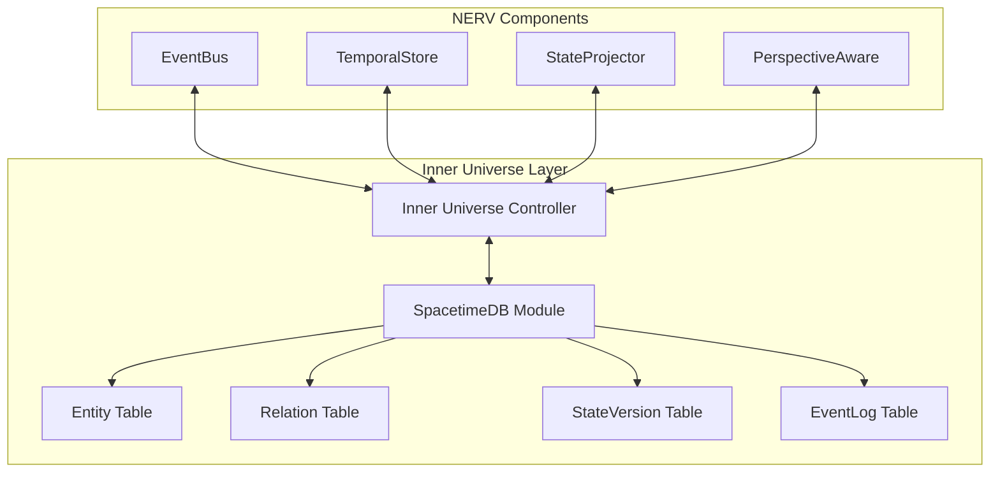

# NERV and Inner Universe Integration Guide

This guide provides a comprehensive overview of how the NERV architecture integrates with the Inner Universe persistence layer, focusing on key integration points, implementation patterns, and best practices.

## Overview

NERV (Neural Event-Reactive Virtualization) and Inner Universe work together to provide a complete system with:

1. **In-memory Reactive State**: NERV provides ephemeral, reactive state management
2. **Persistent Storage**: Inner Universe provides durable, versioned persistence
3. **Event Synchronization**: Events flow bidirectionally between systems
4. **Temporal Versioning**: State history is maintained across both systems



## Key Integration Points

### 1. Event System Integration

Events are the primary communication mechanism between NERV and Inner Universe:

::: info Event Synchronization
NERV's EventBus publishes events that are persisted in Inner Universe's EventLog table. Conversely, events in the EventLog trigger callbacks in the NERV EventBus subscribers.
:::

Implementation pattern:

```python
# NERV-side event publication with Inner Universe persistence
async def publish_event(event_type, event_data, source=None):
    # Create event in NERV's EventBus
    event_id = event_bus.publish(event_type, event_data, source)

    # Persist the event in Inner Universe
    await inner_universe_client.publish_event(event_type, source, event_data)

    return event_id

# Inner Universe event subscription tied to NERV's EventBus
def register_event_listeners():
    # Set up callback for events from Inner Universe
    inner_universe_client.subscribe_event_log_changes(on_event_change)

def on_event_change(change_type, event):
    if change_type == "INSERTED":
        # Convert Inner Universe event to NERV Message format
        message = Message(
            id=event.get("event_id", ""),
            type=event.get("event_type", ""),
            source=event.get("source"),
            timestamp=event.get("timestamp", 0),
            data=event.get("data", {})
        )

        # Publish to NERV's EventBus
        event_bus.notify_subscribers(message)
```

### 2. Temporal State Management

The TemporalStore component in NERV works with Inner Universe's state versioning:

::: tip Versioning Strategy
Use explicit version IDs across both systems to ensure consistent state tracking. The state version ID should be used as the correlation key between NERV and Inner Universe.
:::

Implementation pattern:

```python
# Committing a state version from NERV to Inner Universe
async def commit_version(state, description):
    # Generate a hash for data integrity verification
    state_json = json.dumps(state, sort_keys=True)
    data_hash = hashlib.sha256(state_json.encode()).hexdigest()

    # Get the current version ID (if any)
    parent_version_id = self.current_version_id

    # Commit to Inner Universe
    version_id = await inner_universe_client.commit_state_version(
        parent_version_id,
        description,
        data_hash
    )

    # Update NERV's TemporalStore with the new version ID
    self.current_version_id = version_id

    return version_id
```

### 3. Entity-Relation Graph

NERV's entity-relation model maps directly to Inner Universe's tables:

| NERV Concept     | Inner Universe Table | Description                         |
| ---------------- | -------------------- | ----------------------------------- |
| Entity           | `entity`             | Core objects in the knowledge graph |
| Relation         | `relation`           | Connections between entities        |
| EntityMetadata   | Entity properties    | Additional entity attributes        |
| RelationMetadata | Relation properties  | Additional relation attributes      |

::: warning Type Handling
Be careful with complex types and nested structures when mapping between NERV's Python objects and Inner Universe's Rust structs. Always verify that serialization and deserialization preserve all necessary information.
:::

## Type Mapping between Systems

Comprehensive type mapping ensures data consistency across the systems:

### Core Type Mappings

| NERV Python Type | Inner Universe Rust Type | Serialization Strategy   |
| ---------------- | ------------------------ | ------------------------ |
| `dict`           | `Map<String, Value>`     | JSON serialization       |
| `list`           | `Vec<T>`                 | JSON array serialization |
| `str`            | `String`                 | Direct mapping           |
| `int`            | `i64`                    | Direct mapping           |
| `float`          | `f64`                    | Direct mapping           |
| `bool`           | `bool`                   | Direct mapping           |
| `None`           | `Option<T>::None`        | JSON null value          |

### Entity Type Mappings

```python
# NERV Python Entity Metadata
@dataclass
class EntityMetadata:
    name: Optional[str] = None
    description: Optional[str] = None
    tags: List[str] = field(default_factory=list)
    properties: Dict[str, Any] = field(default_factory=dict)
```

```rust
// Inner Universe Rust Entity Metadata
#[spacetimedb_derive::spacetimedb_type]
pub struct EntityMetadata {
    pub name: Option<String>,
    pub description: Option<String>,
    pub tags: Vec<String>,
    pub properties: Map<String, Value>
}
```

### Event Data Mappings

```python
# NERV Python Event
@dataclass
class Event:
    id: str
    type: str
    data: Optional[Dict[str, Any]] = None
    timestamp: float = field(default_factory=lambda: time.time())
    source: Optional[str] = None
```

```rust
// Inner Universe Rust EventLog
#[table(name = event_log, public)]
pub struct EventLog {
    #[primary_key]
    event_id: String,
    event_type: String,
    source: Option<String>,
    timestamp: Timestamp,
    data: EventData
}
```

## Integration Implementation Patterns

### Controller Lifecycle Management

The integration between NERV and Inner Universe follows this lifecycle:

1. **Initialization**: NERV initializes the Inner Universe controller
2. **Connection**: Controller connects to SpacetimeDB
3. **Adapter Creation**: Create adapters for EventBus, TemporalStore
4. **Event Subscription**: Set up bidirectional event flow
5. **Operation**: Normal operation with synchronized state
6. **Shutdown**: Graceful shutdown of both systems

```python
async def initialize_persistence():
    # Create configuration
    config = InnerUniverseConfig()

    # Create controller
    controller = InnerUniverseController(config)

    # Start in server mode
    await controller.start_server_mode()

    # Create adapters
    event_bus_adapter = SpacetimeEventBus(controller.client)
    temporal_store_adapter = SpacetimeTemporalStore(controller.client)

    # Subscribe to events
    event_bus_adapter.subscribe_to_events()

    return controller, event_bus_adapter, temporal_store_adapter
```

### Error Handling and Recovery

::: warning Critical for Robust Integration
Error handling across system boundaries is crucial. Each layer should handle its own errors and provide clear propagation paths.
:::

Error propagation pattern:

```python
try:
    # Attempt an operation in Inner Universe
    result = await inner_universe_client.create_entity(...)
except ConnectionError as e:
    # Handle connection issues
    log.error(f"Connection to Inner Universe failed: {e}")
    # Attempt recovery or fallback to local operation
    result = await handle_connection_failure()
except EntityNotFoundError as e:
    # Handle missing entity
    log.warning(f"Entity not found: {e}")
    # Create the entity or use a default
    result = await handle_missing_entity()
except Exception as e:
    # General error handling
    log.error(f"Unexpected error during Inner Universe operation: {e}")
    # Fail safely
    raise NERVPersistenceError(f"Inner Universe operation failed: {e}")
```

## Testing and Validation

### Integration Test Approach

Effective testing of the NERV/Inner Universe integration requires:

1. **Mock SpacetimeDB**: Use a mock SpacetimeDB implementation for unit tests
2. **In-Memory Database**: Use an in-memory SpacetimeDB for integration tests
3. **End-to-End Tests**: Test complete flows across both systems

Example test utility:

```python
@pytest.fixture
async def mock_inner_universe():
    """Create a mock Inner Universe client for testing"""
    # Create mock client
    mock_client = MagicMock(spec=InnerUniverseClient)

    # Set up method responses
    mock_client.create_entity.return_value = "mock-entity-id"
    mock_client.commit_state_version.return_value = "mock-version-id"

    # Event subscription handlers
    event_handlers = []

    def subscribe_event_log_changes(handler):
        event_handlers.append(handler)

    mock_client.subscribe_event_log_changes = subscribe_event_log_changes

    # Function to simulate events from Inner Universe
    async def simulate_event(event_type, data, source=None):
        event = {
            "event_id": f"event-{uuid.uuid4()}",
            "event_type": event_type,
            "source": source,
            "timestamp": time.time() * 1000,
            "data": data
        }

        for handler in event_handlers:
            handler("INSERTED", event)

    mock_client.simulate_event = simulate_event

    return mock_client
```

### Performance Testing

Test both systems under load to ensure:

1. **Event Throughput**: Verify event processing capacity
2. **State Synchronization**: Check temporal consistency
3. **Recovery**: Test system recovery after failures

## Schema Evolution and Migration

::: info Schema Versioning
Both NERV and Inner Universe should maintain compatible schemas. Use explicit versioning to track schema changes.
:::

Migration strategy:

1. **Update Rust Module**: Modify the Inner Universe schema with new fields/tables
2. **Deploy New Module**: Deploy the updated module to SpacetimeDB
3. **Update Python Client**: Update NERV's type definitions to match
4. **Data Migration**: Run migration scripts if needed

For backward compatibility, both systems should:
- Support optional fields in types
- Provide default values for new fields
- Maintain compatibility interfaces for critical operations

## Security Considerations

When integrating NERV with Inner Universe, consider:

1. **Authentication**: Secure SpacetimeDB with identity verification
2. **Authorization**: Implement reducer-level permission checks
3. **Data Validation**: Validate all data crossing system boundaries
4. **Encryption**: Encrypt sensitive data both in transit and at rest

```rust
// Example of authorization check in a reducer
#[reducer]
fn create_entity(ctx: &ReducerContext, entity_type: String, metadata: EntityMetadata) -> Result<String, String> {
    // Verify authorization before proceeding
    if !has_permission(ctx.sender, "create_entity", &entity_type) {
        return Err("Unauthorized: Insufficient permissions to create this entity type".into());
    }

    // Continue with entity creation...
}
```

## Performance Optimization Strategies

To optimize the NERV and Inner Universe integration:

1. **Connection Pooling**: Maintain persistent connections to SpacetimeDB
2. **Event Batching**: Batch event publications for efficiency
3. **Caching Layer**: Cache frequently accessed entities and state
4. **Selective Persistence**: Only persist data that requires durability

Example caching implementation:

```python
# Implement a cache decorator for entity retrieval
def cache_entity(ttl_seconds=300):
    def decorator(func):
        cache = {}
        last_cleaned = time.time()

        @functools.wraps(func)
        async def wrapper(self, entity_id, *args, **kwargs):
            current_time = time.time()

            # Clean expired entries
            if current_time - last_cleaned > 60:  # Clean every minute
                for key, (value, expiry) in list(cache.items()):
                    if current_time > expiry:
                        del cache[key]
                last_cleaned = current_time

            # Check cache
            if entity_id in cache:
                value, expiry = cache[entity_id]
                if current_time <= expiry:
                    return value

            # Get fresh value
            result = await func(self, entity_id, *args, **kwargs)

            # Update cache
            cache[entity_id] = (result, current_time + ttl_seconds)

            return result

        return wrapper

    return decorator
```

## Monitoring and Observability

Implement comprehensive monitoring across the NERV and Inner Universe boundary:

1. **Event Flow Monitoring**: Track event publication and consumption rates
2. **State Synchronization Metrics**: Measure state version consistency
3. **Error Rates**: Monitor cross-system operation failures
4. **Connection Status**: Track SpacetimeDB connection health

Example monitoring integration:

```python
# Track event flow metrics
def monitor_event_publication(event_type, source, latency_ms):
    metrics.increment(
        "events.published",
        tags={"event_type": event_type, "source": source or "unknown"}
    )
    metrics.histogram(
        "events.publication_latency_ms",
        latency_ms,
        tags={"event_type": event_type}
    )

# Use with an aspect-oriented approach
async def publish_event_with_monitoring(event_type, data, source=None):
    start_time = time.time()

    try:
        event_id = await inner_universe_client.publish_event(event_type, source, data)

        # Monitor successful publication
        latency_ms = (time.time() - start_time) * 1000
        monitor_event_publication(event_type, source, latency_ms)

        return event_id
    except Exception as e:
        # Monitor failed publication
        metrics.increment(
            "events.publication_failures",
            tags={"event_type": event_type, "error": type(e).__name__}
        )
        raise
```

## Conclusion

The integration between NERV and Inner Universe creates a powerful combination of reactive in-memory processing with durable persistence. By following these patterns and best practices, you can ensure a robust, efficient, and maintainable integration between these systems.

Key takeaways:

1. **Event-Driven Communication**: Use events as the primary integration mechanism
2. **Consistent Typing**: Maintain clear type mappings between systems
3. **Error Boundary Design**: Implement robust error handling at system boundaries
4. **Testing Strategy**: Test both systems individually and their integration
5. **Performance Optimization**: Implement caching and connection pooling
6. **Monitoring Integration**: Track metrics across system boundaries

The next steps for your implementation should be:

1. Set up the initial Inner Universe controller
2. Implement the event synchronization adapters
3. Connect the TemporalStore with state versioning
4. Implement entity-relation persistence
5. Add comprehensive testing
