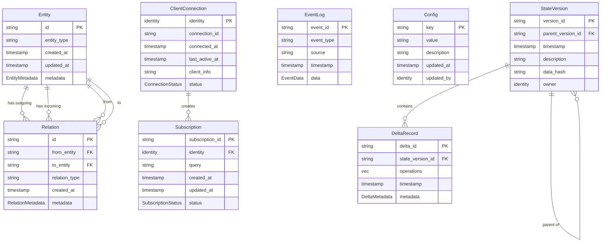

# Inner Universe Database Schema

This document defines the minimum database schema for the Inner Universe persistence layer. These schema definitions will be implemented in Rust for SpacetimeDB.

## Core Tables

### Entity Table

Stores fundamental entity information for the knowledge graph system.

```rust
#[table(name = entity, public)]
pub struct Entity {
    #[primary_key]
    id: String,
    entity_type: String,
    created_at: Timestamp,
    updated_at: Timestamp,
    metadata: EntityMetadata
}
```

**Indexes:**
- `entity_type_idx`: Index on `entity_type` for efficient filtering by type
- `entity_created_idx`: Index on `created_at` for temporal queries

### Relation Table

Represents relationships between entities in the graph.

```rust
#[table(name = relation, public)]
pub struct Relation {
    #[primary_key]
    id: String,
    from_entity: String,
    to_entity: String,
    relation_type: String,
    created_at: Timestamp,
    metadata: RelationMetadata
}
```

**Indexes:**
- `from_entity_idx`: Index on `from_entity` for efficient outgoing relationship queries
- `to_entity_idx`: Index on `to_entity` for efficient incoming relationship queries
- `relation_type_idx`: Index on `relation_type` for filtering by relationship type

### State Version Table

Tracks versions of system state for temporal versioning capabilities.

```rust
#[table(name = state_version, public)]
pub struct StateVersion {
    #[primary_key]
    version_id: String,
    parent_version_id: Option<String>,
    timestamp: Timestamp,
    description: String,
    data_hash: String,
    owner: Identity
}
```

**Indexes:**
- `parent_version_idx`: Index on `parent_version_id` for traversing version history
- `timestamp_idx`: Index on `timestamp` for temporal queries
- `owner_idx`: Index on `owner` for filtering by creator

### Event Log Table

Records all system events for audit and synchronization purposes.

```rust
#[table(name = event_log, public)]
pub struct EventLog {
    #[primary_key]
    event_id: String,
    event_type: String,
    source: Option<String>,
    timestamp: Timestamp,
    data: EventData
}
```

**Indexes:**
- `event_type_idx`: Index on `event_type` for filtering by event type
- `timestamp_idx`: Index on `timestamp` for temporal queries
- `source_idx`: Index on `source` for filtering by source

### Delta Record Table

Stores detailed change records for state transitions.

```rust
#[table(name = delta_record, public)]
pub struct DeltaRecord {
    #[primary_key]
    delta_id: String,
    state_version_id: String,
    operations: Vec<DeltaOperation>,
    timestamp: Timestamp,
    metadata: DeltaMetadata
}
```

**Indexes:**
- `state_version_idx`: Index on `state_version_id` for finding all deltas for a version
- `timestamp_idx`: Index on `timestamp` for temporal queries

## Supporting Tables

### Configuration Table

Stores system configuration parameters.

```rust
#[table(name = config, public)]
pub struct Config {
    #[primary_key]
    key: String,
    value: String,
    description: Option<String>,
    updated_at: Timestamp,
    updated_by: Identity
}
```

### Client Connection Table

Tracks active client connections for session management.

```rust
#[table(name = client_connection, public)]
pub struct ClientConnection {
    #[primary_key]
    identity: Identity,
    connection_id: String,
    connected_at: Timestamp,
    last_active_at: Timestamp,
    client_info: Option<String>,
    status: ConnectionStatus
}
```

```rust
#[spacetimedb_derive::spacetimedb_type]
pub enum ConnectionStatus {
    Connected,
    Idle,
    Disconnecting,
    Disconnected
}
```

### Subscription Table

Manages client subscriptions to data changes.

```rust
#[table(name = subscription, public)]
pub struct Subscription {
    #[primary_key]
    subscription_id: String,
    identity: Identity,
    query: String,
    created_at: Timestamp,
    updated_at: Timestamp,
    status: SubscriptionStatus
}
```

```rust
#[spacetimedb_derive::spacetimedb_type]
pub enum SubscriptionStatus {
    Active,
    Paused,
    Cancelled
}
```

## Query Patterns

### Entity Queries

**Get Entity by ID:**
```sql
SELECT * FROM entity WHERE id = ?
```

**Get Entities by Type:**
```sql
SELECT * FROM entity WHERE entity_type = ? LIMIT ? OFFSET ?
```

**Get Recently Created Entities:**
```sql
SELECT * FROM entity ORDER BY created_at DESC LIMIT ?
```

**Get Entities with Tag:**
```sql
SELECT e.* FROM entity e
WHERE ARRAY_CONTAINS(e.metadata.tags, ?) = TRUE
```

### Relation Queries

**Get Relations by Entity:**
```sql
SELECT * FROM relation WHERE from_entity = ? OR to_entity = ?
```

**Get Relations by Type:**
```sql
SELECT * FROM relation WHERE relation_type = ?
```

**Get Entities Connected to Entity:**
```sql
SELECT e.* FROM entity e
JOIN relation r ON e.id = r.to_entity
WHERE r.from_entity = ?
```

### Version History Queries

**Get Version History:**
```sql
WITH RECURSIVE version_history AS (
  SELECT * FROM state_version WHERE version_id = ?
  UNION ALL
  SELECT sv.* FROM state_version sv
  JOIN version_history vh ON sv.version_id = vh.parent_version_id
)
SELECT * FROM version_history
```

**Get Latest Version:**
```sql
SELECT * FROM state_version
ORDER BY timestamp DESC
LIMIT 1
```

### Event Queries

**Get Recent Events:**
```sql
SELECT * FROM event_log
ORDER BY timestamp DESC
LIMIT ?
```

**Get Events by Type and Time Range:**
```sql
SELECT * FROM event_log
WHERE event_type = ?
AND timestamp BETWEEN ? AND ?
ORDER BY timestamp DESC
```

## Migration Strategy

The Inner Universe schema supports versioned migrations through SpacetimeDB migrations:

```rust
#[spacetimedb::migration]
pub fn initial_migration(db: &mut spacetimedb::Database) {
    // Create initial tables
    db.execute("
        CREATE TABLE entity (
            id TEXT PRIMARY KEY,
            entity_type TEXT NOT NULL,
            created_at BIGINT NOT NULL,
            updated_at BIGINT NOT NULL,
            metadata BLOB NOT NULL
        );

        CREATE INDEX entity_type_idx ON entity(entity_type);
        CREATE INDEX entity_created_idx ON entity(created_at);
    ");

    // Additional table creations...
}

#[spacetimedb::migration]
pub fn add_subscription_table(db: &mut spacetimedb::Database) {
    // Add new table in a later migration
    db.execute("
        CREATE TABLE subscription (
            subscription_id TEXT PRIMARY KEY,
            identity BLOB NOT NULL,
            query TEXT NOT NULL,
            created_at BIGINT NOT NULL,
            updated_at BIGINT NOT NULL,
            status INTEGER NOT NULL
        );

        CREATE INDEX subscription_identity_idx ON subscription(identity);
    ");
}
```

## Table Relationships



## Query Performance Considerations

1. **Denormalized Metadata**: Metadata is stored directly with entities and relations for faster access at the cost of update complexity
2. **Strategic Indexing**: Indexes are created selectively on frequently queried fields
3. **Hierarchical Queries**: SpacetimeDB supports recursive CTEs for efficient tree/graph traversal
4. **Partial Updates**: Support for updating specific metadata fields without replacing the entire object
5. **Batch Operations**: Support for bulk inserts and updates for improved throughput

## Data Consistency Guarantees

1. **Transactional Integrity**: All reducer operations are atomic transactions
2. **Optimistic Concurrency**: Version-based concurrency control for state updates
3. **Referential Integrity**: Foreign key constraints for relations and entity references
4. **Validation Rules**: Schema-enforced data validation for all inserted/updated data
5. **Event Sourcing**: Complete audit trail of all state changes
