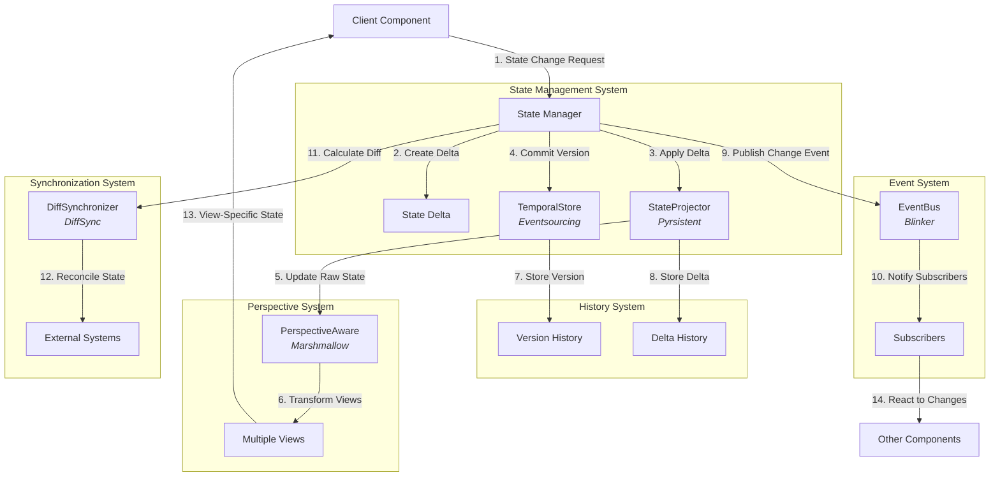

# Adaptive State Management

This document describes how NERV's architectural patterns combine to create an adaptive state management system for Atlas that provides versioning, context-aware views, and efficient state evolution.

## Overview

Adaptive State Management combines multiple core patterns to create a state management approach that adapts to different contexts, preserves history, and efficiently tracks changes over time. It leverages several specialized Python libraries to provide powerful state management capabilities with minimal code.

## Component Integration

### Core Components

| Component                                              | Implementation Library | Pattern                                                       | Role in State Management                     |
| ------------------------------------------------------ | ---------------------- | ------------------------------------------------------------- | -------------------------------------------- |
| [TemporalStore](../components/temporal_store.md)       | Eventsourcing          | [Temporal Versioning](../patterns/temporal_versioning.md)     | Manages state history with version tracking  |
| [PerspectiveAware](../components/perspective_aware.md) | Marshmallow            | [Perspective Shifting](../patterns/perspective_shifting.md)   | Provides context-appropriate views of state  |
| [StateProjector](../components/state_projector.md)     | Pyrsistent             | [State Projection](../patterns/state_projection.md)           | Efficiently tracks state changes as deltas   |
| [EventBus](../components/event_bus.md)                 | Blinker                | [Reactive Event Mesh](../patterns/reactive_event_mesh.md)     | Coordinates state changes and notifications  |
| [DiffSynchronizer](../components/diff_synchronizer.md) | DiffSync               | [State Synchronization](../patterns/state_synchronization.md) | Reconciles state differences between systems |

### Foundational Elements

The Adaptive State Management is built on these foundational elements:

- [Versioned Interface](../patterns/interfaces.md#versioneds): Defines versioned state behavior
- [Projectable Interface](../patterns/interfaces.md#projectablesp): Defines multiple view behavior
- [VersionedState Data Class](../patterns/types.md#core-data-classes): Represents versioned state with metadata
- [Delta Abstract Class](../patterns/types.md#abstract-base-classes): Defines state change operations

These elements leverage the [design primitives](../primitives/index.md) such as the Strategy pattern and Command pattern.

## Architecture Diagram



## Workflow Description

1. **Change Request**: Client requests a state change
2. **Delta Creation**: Change is represented as a delta operation
3. **Delta Application**: Delta is applied to the immutable current state using Pyrsistent
4. **Version Commitment**: New state version is committed with metadata using Eventsourcing
5. **Raw State Update**: Underlying state is updated
6. **View Transformation**: Different perspectives are updated with Marshmallow schemas
7. **Version Storage**: Complete state version is stored in history
8. **Delta Storage**: Delta is stored with metadata for efficiency
9. **Event Publication**: State change event is published via Blinker signals
10. **Change Notification**: Subscribers are notified of state change
11. **Diff Calculation**: State differences are calculated with DiffSync
12. **State Reconciliation**: External systems are updated with state changes
13. **Context-Specific Views**: Clients receive appropriate views of state
14. **Reactive Updates**: Components react to state changes

## Implementation Example

Here's a concrete implementation example showing how the libraries integrate to create the adaptive state management system:

```python
from typing import Dict, Any, Optional, List, Type, TypeVar, Generic, Set
import time
import uuid
from dataclasses import dataclass, field

# Pyrsistent for immutable data structures
from pyrsistent import PMap, freeze, thaw, pmap, m

# Marshmallow for schema-based data transformation
from marshmallow import Schema, fields, post_load

# Eventsourcing for event-based persistence
from eventsourcing.domain import Aggregate, event

# Blinker for event dispatch
from blinker import Signal

# DiffSync for state synchronization
from diffsync import DiffSync, DiffSyncModel

# Type variables
T = TypeVar('T')  # State type
P = TypeVar('P')  # Projection type

@dataclass
class StateMetadata:
    """Metadata for state versions."""
    version: int = 1
    created_at: float = field(default_factory=time.time)
    created_by: Optional[str] = None
    description: Optional[str] = None
    tags: Set[str] = field(default_factory=set)

@dataclass
class Delta:
    """Represents a change to state."""
    id: str = field(default_factory=lambda: str(uuid.uuid4()))
    operations: List[Dict[str, Any]] = field(default_factory=list)
    metadata: StateMetadata = field(default_factory=StateMetadata)

    def apply_to(self, state: Dict[str, Any]) -> Dict[str, Any]:
        """Apply this delta to a state dictionary."""
        result = dict(state)
        for op in self.operations:
            if op['type'] == 'set':
                path = op['path']
                value = op['value']
                # For simplicity, only handle top-level paths
                result[path] = value
            elif op['type'] == 'delete':
                path = op['path']
                if path in result:
                    del result[path]
        return result

class DocumentAggregate(Aggregate):
    """An event-sourced document entity using Eventsourcing."""

    @event
    def created(self, document_id: str, title: str, content: str, author: str):"        """Create a new document.""

        self.document_id = document_id
        self.title = title
        self.content = content
        self.author = author
        self.created_at = time.time()
        self.updated_at = self.created_at
        self.version = 1
        self.history = [{
            "type": "created",
            "timestamp": self.created_at,
            "data": {"title": title, "author": author}
        }]

    @event
    def updated(self, title: Optional[str] = None,
               content: Optional[str] = None, editor: Optional[str] = None):
        """Update document properties."""
        if title is not None:
            self.title = title
        if content is not None:
            self.content = content
        self.updated_at = time.time()
        self.last_editor = editor if editor else self.author
        self.version += 1
        self.history.append({
            "type": "updated",
            "timestamp": self.updated_at,
            "data": {
                "title": title,
                "editor": editor,
                "version": self.version
            }
        })

class DocumentSchema(Schema):
    """Schema for document data with multiple perspectives."""
    document_id = fields.String(required=True)
    title = fields.String(required=True)
    content = fields.String(required=True)
    author = fields.String(required=True)
    created_at = fields.Float(required=True)
    updated_at = fields.Float(required=True)
    version = fields.Integer(required=True)
    last_editor = fields.String()

    class Meta:
        # Fields to include by default
        fields = ("document_id", "title", "content", "author", "version")

    # Different perspectives
    public_fields = ("document_id", "title")
    detailed_fields = ("document_id", "title", "author", "created_at", "version")
    editor_fields = ("document_id", "title", "content", "author", "last_editor",
                    "created_at", "updated_at", "version")

    @classmethod
    def get_perspective(cls, perspective: str) -> Type['DocumentSchema']:
        """Get a schema configured for a specific perspective."""
        class CustomSchema(cls):
            pass

        if perspective == "public":
            CustomSchema.Meta.fields = cls.public_fields
        elif perspective == "detailed":
            CustomSchema.Meta.fields = cls.detailed_fields
        elif perspective == "editor":
            CustomSchema.Meta.fields = cls.editor_fields

        return CustomSchema

class DocumentModel(DiffSyncModel):
    """Document model for differential synchronization."""
    _identifiers = ("document_id",)
    _attributes = ("title", "content", "version")

    document_id: str
    title: str
    content: str
    version: int

    def __init__(self, document_id: str, title: str, content: str, version: int):
        super().__init__()
        self.document_id = document_id
        self.title = title
        self.content = content
        self.version = version

class DocumentStateManager:
    """Adaptive state management for documents."""

    def __init__(self):
        """Initialize the document state manager."""
        # TemporalStore component
        self.documents: Dict[str, DocumentAggregate] = {}

        # StateProjector component
        self._state_cache: Dict[str, PMap] = {}

        # PerspectiveAware component
        self.document_schema = DocumentSchema

        # EventBus component (simplified for demonstration)
        self.document_changed = Signal('document-changed')
        self.document_created = Signal('document-created')

        # DiffSync component
        self.document_models: Dict[str, DocumentModel] = {}

    def create_document(self, title: str, content: str, author: str) -> str:"        """Create a new document with event sourcing.""

        document_id = str(uuid.uuid4())

        # Using Eventsourcing for temporal versioning
        document = DocumentAggregate(id=document_id)
        document.created(document_id, title, content, author)
        self.documents[document_id] = document

        # Using Pyrsistent for immutable state
        doc_state = pmap({
            'document_id': document_id,
            'title': title,
            'content': content,
            'author': author,
            'created_at': document.created_at,
            'updated_at': document.updated_at,
            'version': document.version
        })
        self._state_cache[document_id] = doc_state

        # Using DiffSync for state synchronization
        self.document_models[document_id] = DocumentModel(
            document_id=document_id,
            title=title,
            content=content,
            version=1
        )

        # Using Blinker for event notification
        self.document_created.send(self, document_id=document_id)

        return document_id

    def update_document(self, document_id: str, title: Optional[str] = None,
                       content: Optional[str] = None, editor: Optional[str] = None) -> bool:
        """Update a document with delta tracking."""
        document = self.documents.get(document_id)
        if not document:
            return False

        # Using Eventsourcing for event-based updates
        document.updated(title, content, editor)

        # Get current immutable state
        current_state = self._state_cache.get(document_id, pmap({}))

        # Create a delta
        delta = Delta()
        if title is not None:
            delta.operations.append({'type': 'set', 'path': 'title', 'value': title})
        if content is not None:
            delta.operations.append({'type': 'set', 'path': 'content', 'value': content})

        # Create mutable copy of the state
        mutable_state = thaw(current_state)

        # Apply delta
        updated_state = delta.apply_to(mutable_state)

        # Update metadata
        updated_state['updated_at'] = document.updated_at
        updated_state['version'] = document.version
        if editor:
            updated_state['last_editor'] = editor

        # Freeze into immutable state
        self._state_cache[document_id] = freeze(updated_state)

        # Update DiffSync model
        model = self.document_models.get(document_id)
        if model:
            if title is not None:
                model.title = title
            if content is not None:
                model.content = content
            model.version = document.version

        # Notify subscribers
        self.document_changed.send(self, document_id=document_id, delta=delta)

        return True

    def get_document(self, document_id: str, perspective: str = "default") -> Optional[Dict[str, Any]]:
        """Get a document with a specific perspective view."""
        if document_id not in self._state_cache:
            return None

        # Get immutable state
        state = self._state_cache[document_id]

        # Convert to mutable for serialization
        mutable_state = thaw(state)

        # Using Marshmallow for perspective transformation
        schema_class = self.document_schema.get_perspective(perspective)
        schema = schema_class()

        # Return the transformed view
        return schema.dump(mutable_state)

    def sync_with_external(self, external_adapter: DiffSync) -> Dict[str, Any]:
        """Synchronize state with an external system."""
        # Create a DiffSync adapter for our documents
        local_adapter = DiffSync()

        # Add our models to the adapter
        for model in self.document_models.values():
            local_adapter.add(model)

        # Calculate differences
        diff = local_adapter.diff_to(external_adapter)

        # Apply changes
        diff.apply(external_adapter)

        # Return summary of changes
        return diff.summary()
```

## Integration with Atlas

The Adaptive State Management system integrates with Atlas in several key areas:

1. **Configuration Management**: Atlas uses Adaptive State Management to provide versioned configuration with different views for different components:
    ```python
    # Example of accessing configuration with context-specific view
    config = state_manager.get_document("config1", perspective="provider")
    provider_api_key = config.get("api_key")
    ```

2. **Session State**: User session state is managed with history tracking and context-aware views:
    ```python
    # Update session state
    state_manager.update_document(
        session_id,
        content={"last_query": query_text, "timestamp": time.time()}
    )

    # Get user view of session state
    user_session = state_manager.get_document(session_id, perspective="user")
    ```

3. **Document Processing**: Knowledge documents are managed with versioning and different access patterns:
    ```python
    # Store processed document
    doc_id = state_manager.create_document(
        title=doc_metadata["title"],
        content=processed_text,
        author="ingestion-pipeline"
    )

    # Get public view of document
    public_doc = state_manager.get_document(doc_id, perspective="public")
    ```

## Performance Considerations

To ensure optimal performance when implementing Adaptive State Management:

1. **Efficient Delta Tracking**:
   - Use Pyrsistent's structural sharing to minimize memory usage
   - Track changes at the appropriate granularity level
   - Consider delta compression for large state objects

   ```python
   # Optimize delta size by tracking only changed fields
   delta = Delta()
   if only_title_changed:
       delta.operations = [{'type': 'set', 'path': 'title', 'value': new_title}]
   ```

2. **Selective History Storage**:
   - Implement configurable history pruning strategies
   - Consider snapshot-based history for large state objects
   - Use lazy loading for historical versions

   ```python
   # Create periodic snapshots for efficient history access
   if document.version % 10 == 0:  # Every 10 versions
       create_snapshot(document_id, current_state)
   ```

3. **View Caching**:
   - Cache frequently used perspective views
   - Invalidate caches selectively on state changes
   - Use tiered caching for different perspectives

   ```python
   # Cache perspectives with a TTL
   cache.set(f"{document_id}:{perspective}", transformed_view, ttl=300)
   ```

4. **Parallel Processing**:
   - Parallelize perspective transformations for large batch operations
   - Use asynchronous event handling for non-critical updates
   - Implement background reconciliation for diff synchronization

   ```python
   # Process multiple document perspectives in parallel
   with concurrent.futures.ThreadPoolExecutor() as executor:
       futures = {executor.submit(process_perspective, doc_id, perspective):
                 doc_id for doc_id in document_ids}
   ```

## Advanced Patterns

The basic adaptive state management can be extended with additional patterns:

### Branch-Based State Management

Using branched temporal versioning for experimental changes:

```python
# Create a branched version for experimentation
branch_id = state_manager.create_branch(document_id, "experimental-feature")

# Make changes in the branch
state_manager.update_document(
    document_id,
    content="Experimental content",
    branch=branch_id
)

# Later merge changes if desired
state_manager.merge_branch(branch_id, document_id)
```

### Progressive Disclosure

Dynamic adaptation of state detail level:

```python
# Define progressive disclosure levels in schema
class ProgressiveSchema(Schema):
    # Level 1: Basic info
    basic_fields = ("id", "title")

    # Level 2: Standard details
    standard_fields = basic_fields + ("description", "created_at")

    # Level 3: Complete information
    complete_fields = standard_fields + ("metadata", "permissions", "history")

    @classmethod
    def get_disclosure_level(cls, level: int) -> Type['ProgressiveSchema']:
        class LevelSchema(cls):
            pass

        if level == 1:
            LevelSchema.Meta.fields = cls.basic_fields
        elif level == 2:
            LevelSchema.Meta.fields = cls.standard_fields
        elif level >= 3:
            LevelSchema.Meta.fields = cls.complete_fields

        return LevelSchema
```

### Tagged State Evolution

Tracking state evolution with semantic tags:

```python
# Add semantic tags to state versions
state_manager.update_document(
    document_id,
    title="New Title",
    metadata=StateMetadata(
        tags={"ui-change", "minor-edit"}
    )
)

# Retrieve history filtered by tags
ui_changes = state_manager.get_document_history(
    document_id,
    filter_tags={"ui-change"}
)
```

## Integration with Other Composite Systems

This pattern integrates with other composite patterns:

- [Event-Driven Architecture](event_driven_architecture.md): State changes emit and respond to events
- [Parallel Workflow Engine](parallel_workflow_engine.md): Workflow state managed adaptively

### Integration Example

```python
# Event-driven state updates
@event_bus.subscribe(EventType.DOCUMENT_UPDATED)
def on_document_updated(event):
    document_id = event.data["document_id"]
    # Update projections when document changes
    state_manager.refresh_projections(document_id)

# Parallel workflow integration
def document_processing_workflow(document_id):
    # Define tasks that operate on document state
    tasks = [
        {"id": "extract", "fn": extract_metadata, "dependencies": []},
        {"id": "process", "fn": process_content, "dependencies": ["extract"]},
        {"id": "index", "fn": index_document, "dependencies": ["process"]}
    ]

    # Create context with document state
    context = {"document_id": document_id,
              "state": state_manager.get_document(document_id, perspective="system")}

    # Execute workflow with quantum partitioner
    quantum_partitioner.execute_graph(tasks, context)
```

This comprehensive implementation demonstrates how the library stack (Eventsourcing, Marshmallow, Pyrsistent, Blinker, and DiffSync) integrates to create a powerful and flexible state management system.
