# NERV Type System Architecture

This document provides visual diagrams of the NERV architecture type system, showing relationships and organization.

## Type Hierarchy Overview

```mermaid
graph TD
    %% Core Type Categories
    CoreTypes["Core Types"] --> TypeVars["Type Variables"]
    CoreTypes --> Aliases["Type Aliases"]
    CoreTypes --> Enums["Enumerations"]
    CoreTypes --> DataClasses["Data Classes"]
    CoreTypes --> Protocols["Protocol Interfaces"]
    CoreTypes --> ErrorTypes["Error Types"]

    %% Implementation Categories
    Implementations["Implementations"] --> EventSystem["Event System"]
    Implementations --> StateSystem["State System"]
    Implementations --> PerspectiveSystem["Perspective System"]
    Implementations --> EffectSystem["Effect System"]
    Implementations --> ExecutionSystem["Execution System"]
    Implementations --> BoundarySystem["Boundary System"]

    %% Type Variables
    TypeVars --> T["T: Data"]
    TypeVars --> S["S: State"]
    TypeVars --> R["R: Result"]
    TypeVars --> E["E: Event"]
    TypeVars --> V["V: Value"]
    TypeVars --> P["P: Perspective"]
    TypeVars --> others["Other TypeVars..."]

    %% Aliases
    Aliases --> EntityId["EntityId = str"]
    Aliases --> VersionId["VersionId = str"]
    Aliases --> ResourceId["ResourceId = str"]
    Aliases --> EventId["EventId = str"]

    %% Protocols
    Protocols --> Observable["Observable[E]"]
    Protocols --> Versioned["Versioned[S]"]
    Protocols --> Projectable["Projectable[S,P]"]
    Protocols --> Effectful["Effectful[V]"]
    Protocols --> QuantumUnit["QuantumUnit[S,R]"]
    Protocols --> Boundary["Boundary[T_in,T_out]"]

    %% Error Types
    ErrorTypes --> AtlasError["AtlasError"]
    AtlasError --> BoundaryError["BoundaryError"]
    BoundaryError --> ValidationError["ValidationError"]
    BoundaryError --> NetworkError["NetworkError"]

    %% Implementation Relationships
    Observable --> EventSystem
    Versioned --> StateSystem
    Projectable --> PerspectiveSystem
    Effectful --> EffectSystem
    QuantumUnit --> ExecutionSystem
    Boundary --> BoundarySystem
```

## Core Protocols and Implementations

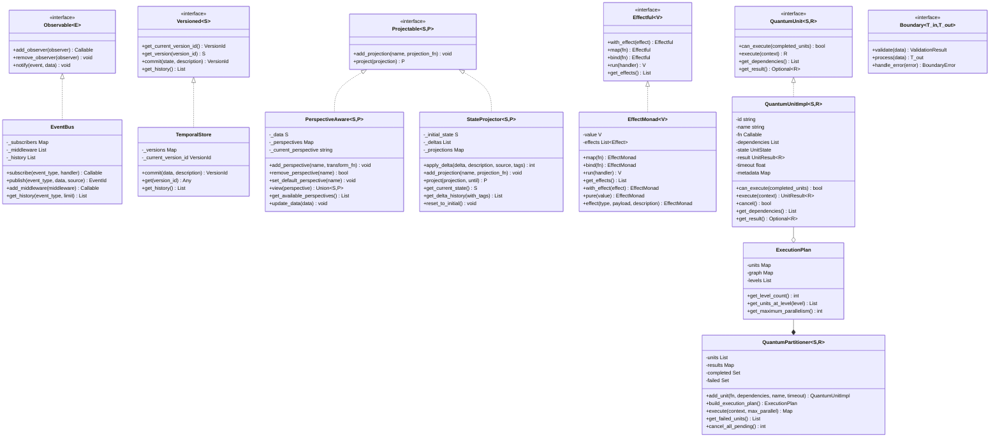

## Data Models

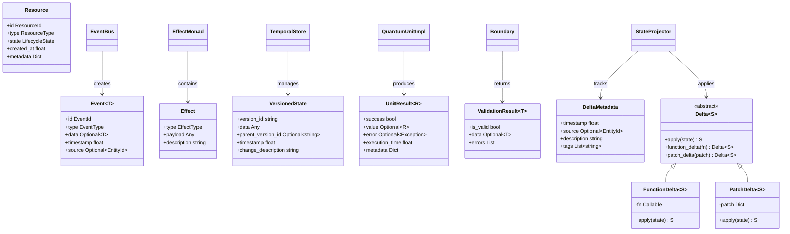

## Architectural Patterns and Implementations

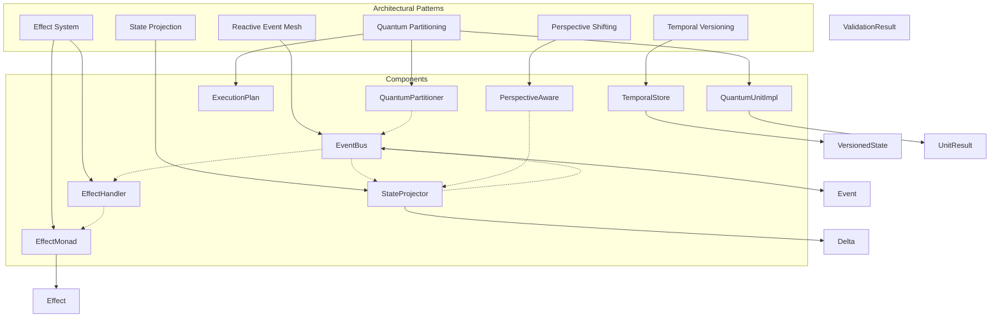

## Functional Systems

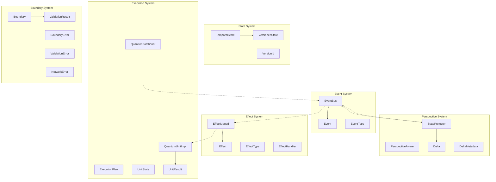

## Composite Systems

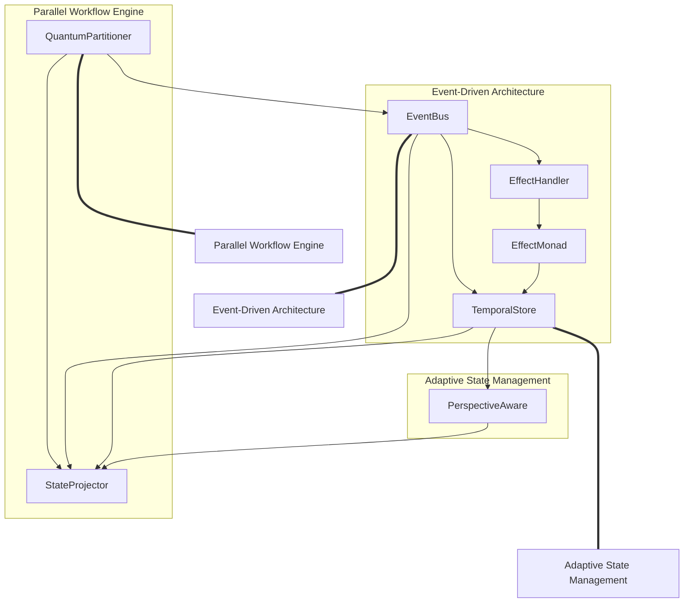

## Temporal Versioning + State Projection Integration

This diagram shows how Temporal Versioning and State Projection work together as complementary patterns:

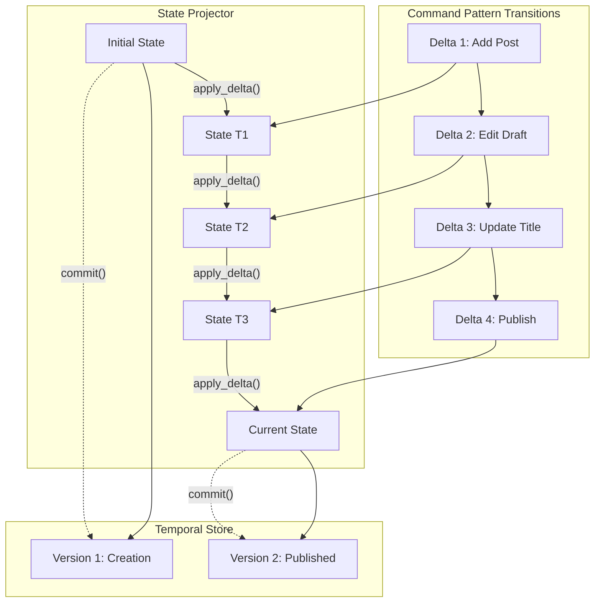

## NERV Integration with Atlas Architecture

This diagram shows how NERV components integrate with the existing Atlas architecture:

```mermaid
flowchart TD
    subgraph "Atlas Core Components"
        AtlasAgent["Atlas Agent"]
        ProviderSystem["Provider System"]
        KnowledgeSystem["Knowledge System"]
        AgentWorkers["Agent Workers"]
        Orchestrator["Orchestrator"]
    end

    subgraph "NERV Components"
        EventBus["Event Bus"]
        TemporalStore["Temporal Store"]
        EffectSystem["Effect System"]
        PerspectiveSystem["Perspective System"]
        StateProjector["State Projector"]
        QuantumPartitioner["Quantum Partitioner"]
    end

    %% Core integrations
    EventBus <--> |"Event Backbone"| AtlasAgent
    EventBus <--> |"Provider Events"| ProviderSystem
    EventBus <--> |"Knowledge Events"| KnowledgeSystem
    EventBus <--> |"Agent Events"| AgentWorkers
    EventBus <--> |"Workflow Events"| Orchestrator

    %% Feature-specific integrations
    TemporalStore <--> |"Versioned Config"| ProviderSystem
    TemporalStore <--> |"Session History"| AtlasAgent
    TemporalStore <--> |"Knowledge Versions"| KnowledgeSystem

    EffectSystem <--> |"Side Effect Tracking"| ProviderSystem
    EffectSystem <--> |"Tool Invocations"| AtlasAgent

    PerspectiveSystem <--> |"Role-Based Views"| KnowledgeSystem
    PerspectiveSystem <--> |"Context Adaptation"| AtlasAgent

    StateProjector <--> |"Incremental Changes"| KnowledgeSystem
    StateProjector <--> |"State Transitions"| Orchestrator

    QuantumPartitioner <--> |"Parallel Execution"| AgentWorkers
    QuantumPartitioner <--> |"Optimized Provider Dispatch"| ProviderSystem
```

## Document Publishing Workflow

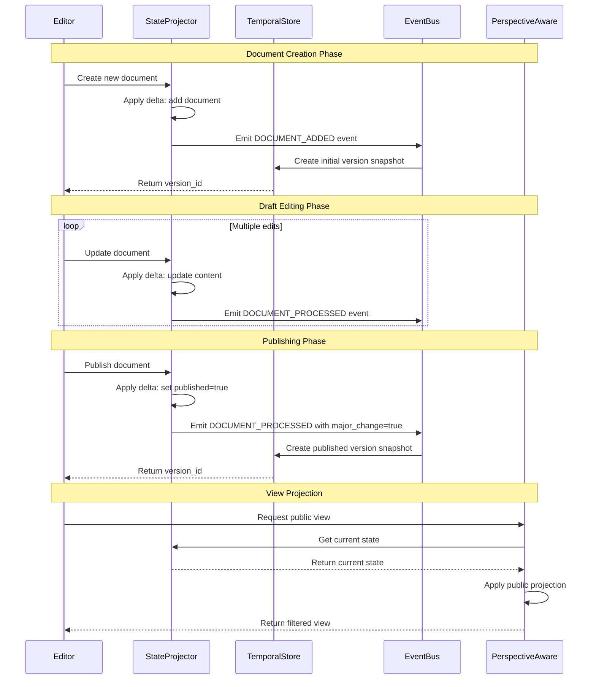

## Parallel Provider Execution

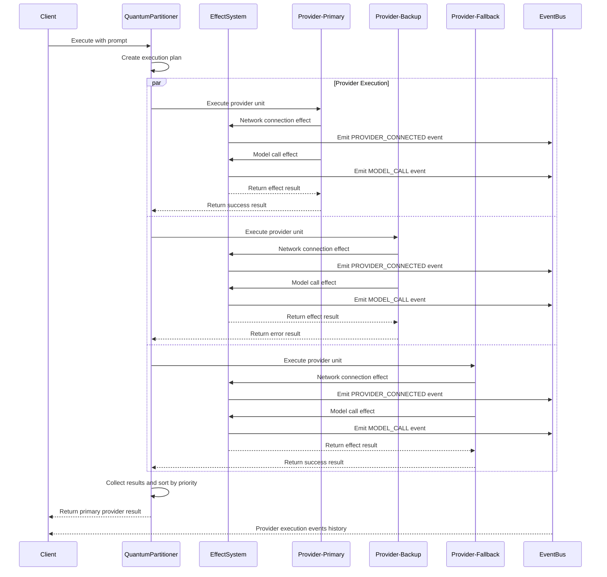

## Service Architecture (Runtime)

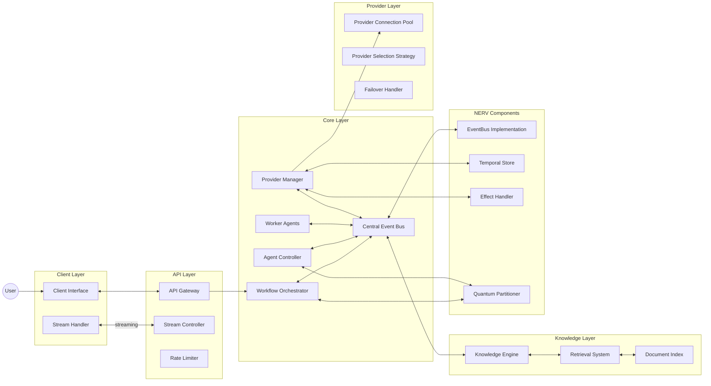
